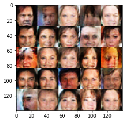

# Face Generation
In this project, you'll use generative adversarial networks to generate new images of faces.
### Get the Data
You'll be using two datasets in this project:
- MNIST
- CelebA

Since the celebA dataset is complex and you're doing GANs in a project for the first time, we want you to test your neural network on MNIST before CelebA.  Running the GANs on MNIST will allow you to see how well your model trains sooner.

If you're using [FloydHub](https://www.floydhub.com/), set `data_dir` to "/input" and use the [FloydHub data ID](http://docs.floydhub.com/home/using_datasets/) "R5KrjnANiKVhLWAkpXhNBe".


```python
data_dir = './data'

# FloydHub - Use with data ID "R5KrjnANiKVhLWAkpXhNBe"
#data_dir = '/input'


"""
DON'T MODIFY ANYTHING IN THIS CELL
"""
import helper

helper.download_extract('mnist', data_dir)
helper.download_extract('celeba', data_dir)
```

    Found mnist Data
    Found celeba Data


## Explore the Data
### MNIST
As you're aware, the [MNIST](http://yann.lecun.com/exdb/mnist/) dataset contains images of handwritten digits. You can view the first number of examples by changing `show_n_images`. 


```python
show_n_images = 25

"""
DON'T MODIFY ANYTHING IN THIS CELL
"""
%matplotlib inline
import os
from glob import glob
from matplotlib import pyplot

mnist_images = helper.get_batch(glob(os.path.join(data_dir, 'mnist/*.jpg'))[:show_n_images], 28, 28, 'L')
pyplot.imshow(helper.images_square_grid(mnist_images, 'L'), cmap='gray')
```


    <matplotlib.image.AxesImage at 0x7f6c360db748>


### CelebA
The [CelebFaces Attributes Dataset (CelebA)](http://mmlab.ie.cuhk.edu.hk/projects/CelebA.html) dataset contains over 200,000 celebrity images with annotations.  Since you're going to be generating faces, you won't need the annotations.  You can view the first number of examples by changing `show_n_images`.


```python
show_n_images = 25

"""
DON'T MODIFY ANYTHING IN THIS CELL
"""
mnist_images = helper.get_batch(glob(os.path.join(data_dir, 'img_align_celeba/*.jpg'))[:show_n_images], 28, 28, 'RGB')
pyplot.imshow(helper.images_square_grid(mnist_images, 'RGB'))
```


    <matplotlib.image.AxesImage at 0x7f6c34f5d128>


## Preprocess the Data
Since the project's main focus is on building the GANs, we'll preprocess the data for you.  The values of the MNIST and CelebA dataset will be in the range of -0.5 to 0.5 of 28x28 dimensional images.  The CelebA images will be cropped to remove parts of the image that don't include a face, then resized down to 28x28.

The MNIST images are black and white images with a single [color channel](https://en.wikipedia.org/wiki/Channel_(digital_image%29) while the CelebA images have [3 color channels (RGB color channel)](https://en.wikipedia.org/wiki/Channel_(digital_image%29#RGB_Images).
## Build the Neural Network
You'll build the components necessary to build a GANs by implementing the following functions below:
- `model_inputs`
- `discriminator`
- `generator`
- `model_loss`
- `model_opt`
- `train`

### Check the Version of TensorFlow and Access to GPU
This will check to make sure you have the correct version of TensorFlow and access to a GPU


```python
"""
DON'T MODIFY ANYTHING IN THIS CELL
"""
from distutils.version import LooseVersion
import warnings
import tensorflow as tf

# Check TensorFlow Version
assert LooseVersion(tf.__version__) >= LooseVersion('1.0'), 'Please use TensorFlow version 1.0 or newer.  You are using {}'.format(tf.__version__)
print('TensorFlow Version: {}'.format(tf.__version__))

# Check for a GPU
if not tf.test.gpu_device_name():
    warnings.warn('No GPU found. Please use a GPU to train your neural network.')
else:
    print('Default GPU Device: {}'.format(tf.test.gpu_device_name()))
```

    TensorFlow Version: 1.1.0
    Default GPU Device: /gpu:0


### Input
Implement the `model_inputs` function to create TF Placeholders for the Neural Network. It should create the following placeholders:
- Real input images placeholder with rank 4 using `image_width`, `image_height`, and `image_channels`.
- Z input placeholder with rank 2 using `z_dim`.
- Learning rate placeholder with rank 0.

Return the placeholders in the following the tuple (tensor of real input images, tensor of z data)


```python
import problem_unittests as tests

def model_inputs(image_width, image_height, image_channels, z_dim):
    """
    Create the model inputs
    :param image_width: The input image width
    :param image_height: The input image height
    :param image_channels: The number of image channels
    :param z_dim: The dimension of Z
    :return: Tuple of (tensor of real input images, tensor of z data, learning rate)
    """
    # TODO: Implement Function
    real_input = tf.placeholder(tf.float32, (None,image_width,image_height, image_channels),name='real_input') 
    z_input = tf.placeholder(tf.float32,(None,z_dim),name='z_input')
    learning_rate = tf.placeholder(tf.float32)
    return real_input, z_input, learning_rate


"""
DON'T MODIFY ANYTHING IN THIS CELL THAT IS BELOW THIS LINE
"""
tests.test_model_inputs(model_inputs)
```

    Tests Passed


### Discriminator
Implement `discriminator` to create a discriminator neural network that discriminates on `images`.  This function should be able to reuse the variables in the neural network.  Use [`tf.variable_scope`](https://www.tensorflow.org/api_docs/python/tf/variable_scope) with a scope name of "discriminator" to allow the variables to be reused.  The function should return a tuple of (tensor output of the discriminator, tensor logits of the discriminator).


```python
def discriminator(images, reuse=False):
    """
    Create the discriminator network
    :param images: Tensor of input image(s)
    :param reuse: Boolean if the weights should be reused
    :return: Tuple of (tensor output of the discriminator, tensor logits of the discriminator)
    """
    alpha = 0.2
    # TODO: Implement Function
    with tf.variable_scope('discriminator', reuse=reuse):
        # Input layer is 28x28x3
        x1 = tf.layers.conv2d(images, 64, 5, strides=2, padding='same')
        relu1 = tf.maximum(alpha * x1, x1)
        # 14x14x64
        
        x2 = tf.layers.conv2d(relu1, 128, 5, strides=2, padding='same')
        bn2 = tf.layers.batch_normalization(x2, training=True)
        relu2 = tf.maximum(alpha * bn2, bn2)
        # 7x7x128
        
        x3 = tf.layers.conv2d(relu2, 256, 5, strides=2, padding='same')
        bn3 = tf.layers.batch_normalization(x3, training=True)
        relu3 = tf.maximum(alpha * bn3, bn3)
        # 4x4x256

        # Flatten it
        flat = tf.reshape(relu3, (-1, 4*4*256))
        logits = tf.layers.dense(flat, 1)
        out = tf.sigmoid(logits)
    return out, logits


"""
DON'T MODIFY ANYTHING IN THIS CELL THAT IS BELOW THIS LINE
"""
tests.test_discriminator(discriminator, tf)
```

    Tests Passed


### Generator
Implement `generator` to generate an image using `z`. This function should be able to reuse the variables in the neural network.  Use [`tf.variable_scope`](https://www.tensorflow.org/api_docs/python/tf/variable_scope) with a scope name of "generator" to allow the variables to be reused. The function should return the generated 28 x 28 x `out_channel_dim` images.


```python
def generator(z, out_channel_dim, is_train=True):
    """
    Create the generator network
    :param z: Input z
    :param out_channel_dim: The number of channels in the output image
    :param is_train: Boolean if generator is being used for training
    :return: The tensor output of the generator
    """

    # TODO: Implement Function
    with tf.variable_scope('generator',reuse=not is_train):
        alpha = 0.2
        # First fully connected layer
        x1 = tf.layers.dense(z, 2*2*512)
        # Reshape it to start the convolutional stack
        x1 = tf.reshape(x1, (-1, 2, 2, 512))
        x1 = tf.layers.batch_normalization(x1, training=is_train)
        x1 = tf.maximum(alpha * x1, x1)
        # 7x7x256 now
        
        x2 = tf.layers.conv2d_transpose(x1, 256, 5, strides=2, padding='valid')
        x2 = tf.layers.batch_normalization(x2, training=is_train)
        x2 = tf.maximum(alpha * x2, x2)
        # 14x14x128 now
        
        x3 = tf.layers.conv2d_transpose(x2, 128, 5, strides=2, padding='same')
        x3 = tf.layers.batch_normalization(x3, training=is_train)
        x3 = tf.maximum(alpha * x3, x3)
        # 28x28x64 now
        
        # Output layer
        logits = tf.layers.conv2d_transpose(x3, out_channel_dim, 5, strides=2, padding='same')
        # 32x32x3 now
        
        out = tf.tanh(logits)
    return out


"""
DON'T MODIFY ANYTHING IN THIS CELL THAT IS BELOW THIS LINE
"""
tests.test_generator(generator, tf)
```

    Tests Passed


### Loss
Implement `model_loss` to build the GANs for training and calculate the loss.  The function should return a tuple of (discriminator loss, generator loss).  Use the following functions you implemented:
- `discriminator(images, reuse=False)`
- `generator(z, out_channel_dim, is_train=True)`


```python
def model_loss(input_real, input_z, out_channel_dim):
    """
    Get the loss for the discriminator and generator
    :param input_real: Images from the real dataset
    :param input_z: Z input
    :param out_channel_dim: The number of channels in the output image
    :return: A tuple of (discriminator loss, generator loss)
    """
    # TODO: Implement Function
    g_model = generator(input_z, out_channel_dim)
    d_model_real, d_real_logits = discriminator(input_real)
    d_model_fake, d_fake_logits = discriminator(g_model,reuse=True)
    
    d_loss_real = tf.reduce_mean(tf.nn.sigmoid_cross_entropy_with_logits(logits=d_real_logits,labels=tf.ones_like(d_model_real)))
    d_loss_fake = tf.reduce_mean(tf.nn.sigmoid_cross_entropy_with_logits(logits=d_fake_logits,labels=tf.zeros_like(d_model_fake)))
    g_loss = tf.reduce_mean(tf.nn.sigmoid_cross_entropy_with_logits(logits=d_fake_logits,labels=tf.ones_like(d_model_fake
                                                                                                            )))
    d_loss = d_loss_real + d_loss_fake
    return d_loss, g_loss


"""
DON'T MODIFY ANYTHING IN THIS CELL THAT IS BELOW THIS LINE
"""
tests.test_model_loss(model_loss)
```

    Tests Passed


### Optimization
Implement `model_opt` to create the optimization operations for the GANs. Use [`tf.trainable_variables`](https://www.tensorflow.org/api_docs/python/tf/trainable_variables) to get all the trainable variables.  Filter the variables with names that are in the discriminator and generator scope names.  The function should return a tuple of (discriminator training operation, generator training operation).


```python
def model_opt(d_loss, g_loss, learning_rate, beta1):
    """
    Get optimization operations
    :param d_loss: Discriminator loss Tensor
    :param g_loss: Generator loss Tensor
    :param learning_rate: Learning Rate Placeholder
    :param beta1: The exponential decay rate for the 1st moment in the optimizer
    :return: A tuple of (discriminator training operation, generator training operation)
    """
    # TODO: Implement Function
    tf_vars = tf.trainable_variables()
    g_vars = [var for var in tf_vars if var.name.startswith('generator')]
    d_vars = [var for var in tf_vars if var.name.startswith('discriminator')]
    
    
    d_train_opt = tf.train.AdamOptimizer(
        learning_rate, beta1=beta1).minimize(d_loss, var_list=d_vars)
    
    ops = tf.get_collection(tf.GraphKeys.UPDATE_OPS)
    g_updates = [opt for opt in ops if opt.name.startswith('generator')]
    with tf.control_dependencies(g_updates):
        g_train_opt = tf.train.AdamOptimizer(
            learning_rate, beta1).minimize(g_loss, var_list=g_vars)
    return d_train_opt, g_train_opt


"""
DON'T MODIFY ANYTHING IN THIS CELL THAT IS BELOW THIS LINE
"""
tests.test_model_opt(model_opt, tf)
```

    Tests Passed


## Neural Network Training
### Show Output
Use this function to show the current output of the generator during training. It will help you determine how well the GANs is training.


```python
"""
DON'T MODIFY ANYTHING IN THIS CELL
"""
import numpy as np

def show_generator_output(sess, n_images, input_z, out_channel_dim, image_mode):
    """
    Show example output for the generator
    :param sess: TensorFlow session
    :param n_images: Number of Images to display
    :param input_z: Input Z Tensor
    :param out_channel_dim: The number of channels in the output image
    :param image_mode: The mode to use for images ("RGB" or "L")
    """
    cmap = None if image_mode == 'RGB' else 'gray'
    z_dim = input_z.get_shape().as_list()[-1]
    example_z = np.random.uniform(-1, 1, size=[n_images, z_dim])

    samples = sess.run(
        generator(input_z, out_channel_dim, False),
        feed_dict={input_z: example_z})

    images_grid = helper.images_square_grid(samples, image_mode)
    pyplot.imshow(images_grid, cmap=cmap)
    pyplot.show()
```

### Train
Implement `train` to build and train the GANs.  Use the following functions you implemented:
- `model_inputs(image_width, image_height, image_channels, z_dim)`
- `model_loss(input_real, input_z, out_channel_dim)`
- `model_opt(d_loss, g_loss, learning_rate, beta1)`

Use the `show_generator_output` to show `generator` output while you train. Running `show_generator_output` for every batch will drastically increase training time and increase the size of the notebook.  It's recommended to print the `generator` output every 100 batches.


```python
def train(epoch_count, batch_size, z_dim, learning_rate, beta1, get_batches, data_shape, data_image_mode):
    """
    Train the GAN
    :param epoch_count: Number of epochs
    :param batch_size: Batch Size
    :param z_dim: Z dimension
    :param learning_rate: Learning Rate
    :param beta1: The exponential decay rate for the 1st moment in the optimizer
    :param get_batches: Function to get batches
    :param data_shape: Shape of the data
    :param data_image_mode: The image mode to use for images ("RGB" or "L")
    """
    # TODO: Build Model
    _, img_width, img_height, img_channels = data_shape
    
    real_input, z_input, lr = model_inputs(
        img_width, img_height, img_channels, z_dim)
    
    d_loss, g_loss = model_loss(real_input, z_input, img_channels)
    d_opt, g_opt = model_opt(d_loss, g_loss, learning_rate, beta1)
    
    steps = 0
    print_every = 10
    show_every = 100
    losses = []
    n_images = 25
    
    with tf.Session() as sess:
        sess.run(tf.global_variables_initializer())
        for epoch_i in range(epoch_count):
            for batch_images in get_batches(batch_size):
                # TODO: Train Model
                steps += 1
                batch_images *= 2.0
                z_sample = np.random.uniform(-1, 1, (batch_size, z_dim))
                
                _ = sess.run(d_opt, feed_dict={
                        real_input: batch_images, z_input: z_sample, lr: learning_rate})
                _ = sess.run(g_opt, feed_dict={
                        z_input: z_sample, lr: learning_rate})
                
                if steps % print_every == 0:
                    train_loss_d = d_loss.eval({z_input: z_sample, real_input: batch_images})
                    train_loss_g = g_loss.eval({z_input: z_sample})
                    
                    print("Epoch {}/{}...".format(epoch_i+1, epoch_count),
                          "Discriminator Loss: {:.4f}...".format(train_loss_d),
                          "Generator Loss: {:.4f}".format(train_loss_g))
                    losses.append((train_loss_d, train_loss_g))
                
                if steps % show_every == 0:
                    show_generator_output(sess, n_images, z_input, img_channels, data_image_mode)
```

### MNIST
Test your GANs architecture on MNIST.  After 2 epochs, the GANs should be able to generate images that look like handwritten digits.  Make sure the loss of the generator is lower than the loss of the discriminator or close to 0.


```python
# batch_size = 128
# z_dim = 100
# learning_rate = 0.001
# beta1 = 0.5
batch_size = 128
z_dim = 150
learning_rate = 0.001
beta1 = 0.5

"""
DON'T MODIFY ANYTHING IN THIS CELL THAT IS BELOW THIS LINE
"""
epochs = 10

mnist_dataset = helper.Dataset('mnist', glob(os.path.join(data_dir, 'mnist/*.jpg')))

print(mnist_dataset.shape[1])
with tf.Graph().as_default():
    train(epochs, batch_size, z_dim, learning_rate, beta1, mnist_dataset.get_batches,
          mnist_dataset.shape, mnist_dataset.image_mode)
```

    28
    Epoch 1/10... Discriminator Loss: 0.4143... Generator Loss: 15.5914
    Epoch 1/10... Discriminator Loss: 4.0972... Generator Loss: 0.2995
    Epoch 1/10... Discriminator Loss: 0.1448... Generator Loss: 2.8092
    Epoch 1/10... Discriminator Loss: 0.1890... Generator Loss: 8.9097
    Epoch 1/10... Discriminator Loss: 0.0777... Generator Loss: 14.6486
    Epoch 1/10... Discriminator Loss: 0.0478... Generator Loss: 7.2039
    Epoch 1/10... Discriminator Loss: 0.1329... Generator Loss: 6.6240
    Epoch 1/10... Discriminator Loss: 1.3455... Generator Loss: 4.2101
    Epoch 1/10... Discriminator Loss: 0.1737... Generator Loss: 4.3102
    Epoch 1/10... Discriminator Loss: 0.1874... Generator Loss: 4.3169


    Epoch 1/10... Discriminator Loss: 0.3377... Generator Loss: 2.9918
    Epoch 1/10... Discriminator Loss: 0.5711... Generator Loss: 1.5467
    Epoch 1/10... Discriminator Loss: 0.2779... Generator Loss: 1.9198
    Epoch 1/10... Discriminator Loss: 0.1219... Generator Loss: 6.9521
    Epoch 1/10... Discriminator Loss: 0.7082... Generator Loss: 1.0077
    Epoch 1/10... Discriminator Loss: 0.2364... Generator Loss: 2.2460
    Epoch 1/10... Discriminator Loss: 0.7875... Generator Loss: 5.0614
    Epoch 1/10... Discriminator Loss: 0.3448... Generator Loss: 2.7856
    Epoch 1/10... Discriminator Loss: 0.2563... Generator Loss: 2.3091
    Epoch 1/10... Discriminator Loss: 0.1982... Generator Loss: 4.1654


    Epoch 3/10... Discriminator Loss: 0.7247... Generator Loss: 1.0091
    Epoch 3/10... Discriminator Loss: 0.8488... Generator Loss: 1.3182
    Epoch 3/10... Discriminator Loss: 0.7325... Generator Loss: 1.2454
    Epoch 3/10... Discriminator Loss: 0.5843... Generator Loss: 2.0947
    Epoch 3/10... Discriminator Loss: 0.8320... Generator Loss: 1.2230
    Epoch 3/10... Discriminator Loss: 0.7624... Generator Loss: 1.1808
    Epoch 3/10... Discriminator Loss: 0.5981... Generator Loss: 1.7116
    Epoch 3/10... Discriminator Loss: 0.8205... Generator Loss: 0.8966
    Epoch 3/10... Discriminator Loss: 0.9055... Generator Loss: 0.8414
    Epoch 3/10... Discriminator Loss: 1.1286... Generator Loss: 1.7979


    Epoch 7/10... Discriminator Loss: 1.8229... Generator Loss: 0.3193
    Epoch 7/10... Discriminator Loss: 0.6880... Generator Loss: 1.5454
    Epoch 7/10... Discriminator Loss: 0.8493... Generator Loss: 0.8625
    Epoch 7/10... Discriminator Loss: 0.7777... Generator Loss: 1.9914
    Epoch 7/10... Discriminator Loss: 0.5711... Generator Loss: 2.4052
    Epoch 7/10... Discriminator Loss: 0.7062... Generator Loss: 1.1945
    Epoch 7/10... Discriminator Loss: 0.9825... Generator Loss: 2.3397
    Epoch 8/10... Discriminator Loss: 1.1313... Generator Loss: 0.7023
    Epoch 8/10... Discriminator Loss: 0.7032... Generator Loss: 0.9719
    Epoch 8/10... Discriminator Loss: 0.6852... Generator Loss: 1.0043


    Epoch 9/10... Discriminator Loss: 0.5109... Generator Loss: 1.2865
    Epoch 9/10... Discriminator Loss: 0.4838... Generator Loss: 1.3848
    Epoch 9/10... Discriminator Loss: 0.6038... Generator Loss: 1.1342
    Epoch 9/10... Discriminator Loss: 0.2981... Generator Loss: 1.9603
    Epoch 9/10... Discriminator Loss: 2.6351... Generator Loss: 5.3448
    Epoch 9/10... Discriminator Loss: 0.8099... Generator Loss: 1.8516
    Epoch 9/10... Discriminator Loss: 0.5993... Generator Loss: 1.9731
    Epoch 9/10... Discriminator Loss: 1.0548... Generator Loss: 2.8967
    Epoch 9/10... Discriminator Loss: 0.8650... Generator Loss: 1.4334
    Epoch 9/10... Discriminator Loss: 0.6608... Generator Loss: 1.2833


    Epoch 10/10... Discriminator Loss: 1.2031... Generator Loss: 4.3281
    Epoch 10/10... Discriminator Loss: 1.0804... Generator Loss: 0.7337
    Epoch 10/10... Discriminator Loss: 0.5983... Generator Loss: 1.1761
    Epoch 10/10... Discriminator Loss: 0.8926... Generator Loss: 0.8186
    Epoch 10/10... Discriminator Loss: 0.7393... Generator Loss: 0.9409
    Epoch 10/10... Discriminator Loss: 1.5410... Generator Loss: 0.6956
    Epoch 10/10... Discriminator Loss: 0.7775... Generator Loss: 0.9720
    Epoch 10/10... Discriminator Loss: 4.8464... Generator Loss: 0.0365


### CelebA
Run your GANs on CelebA.  It will take around 20 minutes on the average GPU to run one epoch.  You can run the whole epoch or stop when it starts to generate realistic faces.


```python
batch_size = 256
z_dim = 250
learning_rate = 0.001
beta1 = 0.5

"""
DON'T MODIFY ANYTHING IN THIS CELL THAT IS BELOW THIS LINE
"""
epochs = 10

celeba_dataset = helper.Dataset('celeba', glob(os.path.join(data_dir, 'img_align_celeba/*.jpg')))
with tf.Graph().as_default():
    train(epochs, batch_size, z_dim, learning_rate, beta1, celeba_dataset.get_batches,
          celeba_dataset.shape, celeba_dataset.image_mode)
```

    Epoch 1/10... Discriminator Loss: 0.8094... Generator Loss: 7.6747
    Epoch 1/10... Discriminator Loss: 0.1566... Generator Loss: 5.3145
    Epoch 1/10... Discriminator Loss: 0.5000... Generator Loss: 1.8677
    Epoch 1/10... Discriminator Loss: 1.5264... Generator Loss: 0.7504
    Epoch 1/10... Discriminator Loss: 1.0634... Generator Loss: 0.8708
    Epoch 1/10... Discriminator Loss: 1.3888... Generator Loss: 4.9941
    Epoch 1/10... Discriminator Loss: 0.5587... Generator Loss: 1.4300
    Epoch 1/10... Discriminator Loss: 1.9965... Generator Loss: 7.9802
    Epoch 1/10... Discriminator Loss: 0.3799... Generator Loss: 2.9336
    Epoch 1/10... Discriminator Loss: 0.5098... Generator Loss: 1.5290


 
    Epoch 5/10... Discriminator Loss: 1.2835... Generator Loss: 0.6490
    Epoch 5/10... Discriminator Loss: 1.2591... Generator Loss: 1.8241
    Epoch 5/10... Discriminator Loss: 1.0284... Generator Loss: 1.5940
    Epoch 5/10... Discriminator Loss: 1.0798... Generator Loss: 1.5756
    Epoch 5/10... Discriminator Loss: 1.3380... Generator Loss: 0.4841
    Epoch 5/10... Discriminator Loss: 1.1376... Generator Loss: 1.2950
    Epoch 5/10... Discriminator Loss: 1.1169... Generator Loss: 1.0165
    Epoch 5/10... Discriminator Loss: 1.0845... Generator Loss: 0.7568
    Epoch 5/10... Discriminator Loss: 1.0657... Generator Loss: 0.9017
    Epoch 5/10... Discriminator Loss: 1.1946... Generator Loss: 0.6104


    Epoch 8/10... Discriminator Loss: 1.1637... Generator Loss: 0.8303
    Epoch 8/10... Discriminator Loss: 1.2281... Generator Loss: 1.3074
    Epoch 8/10... Discriminator Loss: 1.2523... Generator Loss: 0.8033
    Epoch 8/10... Discriminator Loss: 1.1886... Generator Loss: 0.7397
    Epoch 8/10... Discriminator Loss: 1.2289... Generator Loss: 0.7027
    Epoch 8/10... Discriminator Loss: 1.1961... Generator Loss: 0.5927
    Epoch 8/10... Discriminator Loss: 1.2544... Generator Loss: 1.3071
    Epoch 8/10... Discriminator Loss: 1.1980... Generator Loss: 1.4974
    Epoch 8/10... Discriminator Loss: 1.3908... Generator Loss: 0.5240
    Epoch 8/10... Discriminator Loss: 1.0738... Generator Loss: 0.8481


    Epoch 9/10... Discriminator Loss: 0.9889... Generator Loss: 1.0211
    Epoch 9/10... Discriminator Loss: 1.2804... Generator Loss: 0.5420
    Epoch 9/10... Discriminator Loss: 0.9927... Generator Loss: 0.8740
    Epoch 9/10... Discriminator Loss: 0.7978... Generator Loss: 1.1786
    Epoch 9/10... Discriminator Loss: 1.0145... Generator Loss: 0.7677
    Epoch 9/10... Discriminator Loss: 0.6691... Generator Loss: 1.1328
    Epoch 9/10... Discriminator Loss: 2.2543... Generator Loss: 0.5979
    Epoch 9/10... Discriminator Loss: 1.3543... Generator Loss: 0.5003
    Epoch 9/10... Discriminator Loss: 1.2064... Generator Loss: 0.7073
    Epoch 9/10... Discriminator Loss: 1.1511... Generator Loss: 0.7280





    Epoch 10/10... Discriminator Loss: 1.1664... Generator Loss: 0.7682
    Epoch 10/10... Discriminator Loss: 0.6974... Generator Loss: 1.2773
    Epoch 10/10... Discriminator Loss: 0.5703... Generator Loss: 1.1921
    Epoch 10/10... Discriminator Loss: 1.2217... Generator Loss: 0.5256
    Epoch 10/10... Discriminator Loss: 1.7612... Generator Loss: 0.3599
    Epoch 10/10... Discriminator Loss: 1.0039... Generator Loss: 0.9318
    Epoch 10/10... Discriminator Loss: 1.1036... Generator Loss: 0.8939
    Epoch 10/10... Discriminator Loss: 1.1061... Generator Loss: 1.0300
    Epoch 10/10... Discriminator Loss: 1.0479... Generator Loss: 0.9177
    Epoch 10/10... Discriminator Loss: 1.1828... Generator Loss: 0.6272


    Epoch 10/10... Discriminator Loss: 1.1890... Generator Loss: 0.7304


### Submitting This Project
When submitting this project, make sure to run all the cells before saving the notebook. Save the notebook file as "dlnd_face_generation.ipynb" and save it as a HTML file under "File" -> "Download as". Include the "helper.py" and "problem_unittests.py" files in your submission.
