# Face Generation
In this project, you'll use generative adversarial networks to generate new images of faces.
### Get the Data
You'll be using two datasets in this project:
- MNIST
- CelebA

Since the celebA dataset is complex and you're doing GANs in a project for the first time, we want you to test your neural network on MNIST before CelebA.  Running the GANs on MNIST will allow you to see how well your model trains sooner.

If you're using [FloydHub](https://www.floydhub.com/), set `data_dir` to "/input" and use the [FloydHub data ID](http://docs.floydhub.com/home/using_datasets/) "R5KrjnANiKVhLWAkpXhNBe".


```python
data_dir = './data'

# FloydHub - Use with data ID "R5KrjnANiKVhLWAkpXhNBe"
#data_dir = '/input'


"""
DON'T MODIFY ANYTHING IN THIS CELL
"""
import helper

helper.download_extract('mnist', data_dir)
helper.download_extract('celeba', data_dir)
```

    Found mnist Data
    Found celeba Data


## Explore the Data
### MNIST
As you're aware, the [MNIST](http://yann.lecun.com/exdb/mnist/) dataset contains images of handwritten digits. You can view the first number of examples by changing `show_n_images`. 


```python
show_n_images = 25

"""
DON'T MODIFY ANYTHING IN THIS CELL
"""
%matplotlib inline
import os
from glob import glob
from matplotlib import pyplot

mnist_images = helper.get_batch(glob(os.path.join(data_dir, 'mnist/*.jpg'))[:show_n_images], 28, 28, 'L')
pyplot.imshow(helper.images_square_grid(mnist_images, 'L'), cmap='gray')
```


    <matplotlib.image.AxesImage at 0x7fef3509c748>


### CelebA
The [CelebFaces Attributes Dataset (CelebA)](http://mmlab.ie.cuhk.edu.hk/projects/CelebA.html) dataset contains over 200,000 celebrity images with annotations.  Since you're going to be generating faces, you won't need the annotations.  You can view the first number of examples by changing `show_n_images`.


```python
show_n_images = 25

"""
DON'T MODIFY ANYTHING IN THIS CELL
"""
mnist_images = helper.get_batch(glob(os.path.join(data_dir, 'img_align_celeba/*.jpg'))[:show_n_images], 28, 28, 'RGB')
pyplot.imshow(helper.images_square_grid(mnist_images, 'RGB'))
```


    <matplotlib.image.AxesImage at 0x7fef2c754198>


## Preprocess the Data
Since the project's main focus is on building the GANs, we'll preprocess the data for you.  The values of the MNIST and CelebA dataset will be in the range of -0.5 to 0.5 of 28x28 dimensional images.  The CelebA images will be cropped to remove parts of the image that don't include a face, then resized down to 28x28.

The MNIST images are black and white images with a single [color channel](https://en.wikipedia.org/wiki/Channel_(digital_image%29) while the CelebA images have [3 color channels (RGB color channel)](https://en.wikipedia.org/wiki/Channel_(digital_image%29#RGB_Images).
## Build the Neural Network
You'll build the components necessary to build a GANs by implementing the following functions below:
- `model_inputs`
- `discriminator`
- `generator`
- `model_loss`
- `model_opt`
- `train`

### Check the Version of TensorFlow and Access to GPU
This will check to make sure you have the correct version of TensorFlow and access to a GPU


```python
"""
DON'T MODIFY ANYTHING IN THIS CELL
"""
from distutils.version import LooseVersion
import warnings
import tensorflow as tf

# Check TensorFlow Version
assert LooseVersion(tf.__version__) >= LooseVersion('1.0'), 'Please use TensorFlow version 1.0 or newer.  You are using {}'.format(tf.__version__)
print('TensorFlow Version: {}'.format(tf.__version__))

# Check for a GPU
if not tf.test.gpu_device_name():
    warnings.warn('No GPU found. Please use a GPU to train your neural network.')
else:
    print('Default GPU Device: {}'.format(tf.test.gpu_device_name()))
```

    TensorFlow Version: 1.1.0
    Default GPU Device: /gpu:0


### Input
Implement the `model_inputs` function to create TF Placeholders for the Neural Network. It should create the following placeholders:
- Real input images placeholder with rank 4 using `image_width`, `image_height`, and `image_channels`.
- Z input placeholder with rank 2 using `z_dim`.
- Learning rate placeholder with rank 0.

Return the placeholders in the following the tuple (tensor of real input images, tensor of z data)


```python
import problem_unittests as tests

def model_inputs(image_width, image_height, image_channels, z_dim):
    """
    Create the model inputs
    :param image_width: The input image width
    :param image_height: The input image height
    :param image_channels: The number of image channels
    :param z_dim: The dimension of Z
    :return: Tuple of (tensor of real input images, tensor of z data, learning rate)
    """
    # TODO: Implement Function
    real_input = tf.placeholder(tf.float32, (None,image_width,image_height, image_channels),name='real_input') 
    z_input = tf.placeholder(tf.float32,(None,z_dim),name='z_input')
    learning_rate = tf.placeholder(tf.float32)
    return real_input, z_input, learning_rate


"""
DON'T MODIFY ANYTHING IN THIS CELL THAT IS BELOW THIS LINE
"""
tests.test_model_inputs(model_inputs)
```

    Tests Passed


### Discriminator
Implement `discriminator` to create a discriminator neural network that discriminates on `images`.  This function should be able to reuse the variables in the neural network.  Use [`tf.variable_scope`](https://www.tensorflow.org/api_docs/python/tf/variable_scope) with a scope name of "discriminator" to allow the variables to be reused.  The function should return a tuple of (tensor output of the discriminator, tensor logits of the discriminator).


```python
def discriminator(images, reuse=False):
    """
    Create the discriminator network
    :param images: Tensor of input image(s)
    :param reuse: Boolean if the weights should be reused
    :return: Tuple of (tensor output of the discriminator, tensor logits of the discriminator)
    """
    alpha = 0.2
    # TODO: Implement Function
    with tf.variable_scope('discriminator', reuse=reuse):
        # Input layer is 28x28x3
        x1 = tf.layers.conv2d(images, 64, 5, strides=2, padding='same')
        relu1 = tf.maximum(alpha * x1, x1)
        # 14x14x64
        
        x2 = tf.layers.conv2d(relu1, 128, 5, strides=2, padding='same')
        bn2 = tf.layers.batch_normalization(x2, training=True)
        relu2 = tf.maximum(alpha * bn2, bn2)
        # 7x7x128
        
        x3 = tf.layers.conv2d(relu2, 256, 5, strides=2, padding='same')
        bn3 = tf.layers.batch_normalization(x3, training=True)
        relu3 = tf.maximum(alpha * bn3, bn3)
        # 4x4x256

        # Flatten it
        flat = tf.reshape(relu3, (-1, 4*4*256))
        logits = tf.layers.dense(flat, 1)
        out = tf.sigmoid(logits)
    return out, logits


"""
DON'T MODIFY ANYTHING IN THIS CELL THAT IS BELOW THIS LINE
"""
tests.test_discriminator(discriminator, tf)
```

    Tests Passed


### Generator
Implement `generator` to generate an image using `z`. This function should be able to reuse the variables in the neural network.  Use [`tf.variable_scope`](https://www.tensorflow.org/api_docs/python/tf/variable_scope) with a scope name of "generator" to allow the variables to be reused. The function should return the generated 28 x 28 x `out_channel_dim` images.


```python
def generator(z, out_channel_dim, is_train=True):
    """
    Create the generator network
    :param z: Input z
    :param out_channel_dim: The number of channels in the output image
    :param is_train: Boolean if generator is being used for training
    :return: The tensor output of the generator
    """

    # TODO: Implement Function
    with tf.variable_scope('generator',reuse=not is_train):
        alpha = 0.3
        # First fully connected layer
        x1 = tf.layers.dense(z, 2*2*512)
        # Reshape it to start the convolutional stack
        x1 = tf.reshape(x1, (-1, 2, 2, 512))
        x1 = tf.layers.batch_normalization(x1, training=is_train)
        x1 = tf.maximum(alpha * x1, x1)
        # 7x7x256 now
        
        x2 = tf.layers.conv2d_transpose(x1, 256, 5, strides=2, padding='valid')
        x2 = tf.layers.batch_normalization(x2, training=is_train)
        x2 = tf.maximum(alpha * x2, x2)
        # 14x14x128 now
        
        x3 = tf.layers.conv2d_transpose(x2, 128, 5, strides=2, padding='same')
        x3 = tf.layers.batch_normalization(x3, training=is_train)
        x3 = tf.maximum(alpha * x3, x3)
        # 28x28x64 now
        
        # Output layer
        logits = tf.layers.conv2d_transpose(x3, out_channel_dim, 5, strides=2, padding='same')
        # 32x32x3 now
        
        out = tf.tanh(logits)
    return out


"""
DON'T MODIFY ANYTHING IN THIS CELL THAT IS BELOW THIS LINE
"""
tests.test_generator(generator, tf)
```

    Tests Passed


### Loss
Implement `model_loss` to build the GANs for training and calculate the loss.  The function should return a tuple of (discriminator loss, generator loss).  Use the following functions you implemented:
- `discriminator(images, reuse=False)`
- `generator(z, out_channel_dim, is_train=True)`


```python
def model_loss(input_real, input_z, out_channel_dim):
    """
    Get the loss for the discriminator and generator
    :param input_real: Images from the real dataset
    :param input_z: Z input
    :param out_channel_dim: The number of channels in the output image
    :return: A tuple of (discriminator loss, generator loss)
    """
    # TODO: Implement Function
    g_model = generator(input_z, out_channel_dim)
    d_model_real, d_real_logits = discriminator(input_real)
    d_model_fake, d_fake_logits = discriminator(g_model,reuse=True)
    
    d_loss_real = tf.reduce_mean(tf.nn.sigmoid_cross_entropy_with_logits(logits=d_real_logits,labels=tf.ones_like(d_model_real)))
    d_loss_fake = tf.reduce_mean(tf.nn.sigmoid_cross_entropy_with_logits(logits=d_fake_logits,labels=tf.zeros_like(d_model_fake)))
    g_loss = tf.reduce_mean(tf.nn.sigmoid_cross_entropy_with_logits(logits=d_fake_logits,labels=tf.ones_like(d_model_fake
                                                                                                            )))
    d_loss = d_loss_real + d_loss_fake
    return d_loss, g_loss


"""
DON'T MODIFY ANYTHING IN THIS CELL THAT IS BELOW THIS LINE
"""
tests.test_model_loss(model_loss)
```

    Tests Passed


### Optimization
Implement `model_opt` to create the optimization operations for the GANs. Use [`tf.trainable_variables`](https://www.tensorflow.org/api_docs/python/tf/trainable_variables) to get all the trainable variables.  Filter the variables with names that are in the discriminator and generator scope names.  The function should return a tuple of (discriminator training operation, generator training operation).


```python
def model_opt(d_loss, g_loss, learning_rate, beta1):
    """
    Get optimization operations
    :param d_loss: Discriminator loss Tensor
    :param g_loss: Generator loss Tensor
    :param learning_rate: Learning Rate Placeholder
    :param beta1: The exponential decay rate for the 1st moment in the optimizer
    :return: A tuple of (discriminator training operation, generator training operation)
    """
    # TODO: Implement Function
    tf_vars = tf.trainable_variables()
    g_vars = [var for var in tf_vars if var.name.startswith('generator')]
    d_vars = [var for var in tf_vars if var.name.startswith('discriminator')]
    
    
    d_train_opt = tf.train.AdamOptimizer(
        learning_rate, beta1=beta1).minimize(d_loss, var_list=d_vars)
    
    ops = tf.get_collection(tf.GraphKeys.UPDATE_OPS)
    g_updates = [opt for opt in ops if opt.name.startswith('generator')]
    with tf.control_dependencies(g_updates):
        g_train_opt = tf.train.AdamOptimizer(learning_rate=learning_rate,beta1=beta1).minimize(g_loss, var_list=g_vars)
    return d_train_opt, g_train_opt


"""
DON'T MODIFY ANYTHING IN THIS CELL THAT IS BELOW THIS LINE
"""
tests.test_model_opt(model_opt, tf)
```

    Tests Passed


## Neural Network Training
### Show Output
Use this function to show the current output of the generator during training. It will help you determine how well the GANs is training.


```python
"""
DON'T MODIFY ANYTHING IN THIS CELL
"""
import numpy as np

def show_generator_output(sess, n_images, input_z, out_channel_dim, image_mode):
    """
    Show example output for the generator
    :param sess: TensorFlow session
    :param n_images: Number of Images to display
    :param input_z: Input Z Tensor
    :param out_channel_dim: The number of channels in the output image
    :param image_mode: The mode to use for images ("RGB" or "L")
    """
    cmap = None if image_mode == 'RGB' else 'gray'
    z_dim = input_z.get_shape().as_list()[-1]
    example_z = np.random.uniform(-1, 1, size=[n_images, z_dim])

    samples = sess.run(
        generator(input_z, out_channel_dim, False),
        feed_dict={input_z: example_z})

    images_grid = helper.images_square_grid(samples, image_mode)
    pyplot.imshow(images_grid, cmap=cmap)
    pyplot.show()
```

### Train
Implement `train` to build and train the GANs.  Use the following functions you implemented:
- `model_inputs(image_width, image_height, image_channels, z_dim)`
- `model_loss(input_real, input_z, out_channel_dim)`
- `model_opt(d_loss, g_loss, learning_rate, beta1)`

Use the `show_generator_output` to show `generator` output while you train. Running `show_generator_output` for every batch will drastically increase training time and increase the size of the notebook.  It's recommended to print the `generator` output every 100 batches.


```python
def train(epoch_count, batch_size, z_dim, learning_rate, beta1, get_batches, data_shape, data_image_mode):
    """
    Train the GAN
    :param epoch_count: Number of epochs
    :param batch_size: Batch Size
    :param z_dim: Z dimension
    :param learning_rate: Learning Rate
    :param beta1: The exponential decay rate for the 1st moment in the optimizer
    :param get_batches: Function to get batches
    :param data_shape: Shape of the data
    :param data_image_mode: The image mode to use for images ("RGB" or "L")
    """
    # TODO: Build Model
    _, img_width, img_height, img_channels = data_shape
    
    real_input, z_input, lr = model_inputs(
        img_width, img_height, img_channels, z_dim)
    
    d_loss, g_loss = model_loss(real_input, z_input, img_channels)
    d_opt, g_opt = model_opt(d_loss, g_loss, learning_rate, beta1)
    
    steps = 0
    print_every = 10
    show_every = 100
    losses = []
    n_images = 25
    
    with tf.Session() as sess:
        sess.run(tf.global_variables_initializer())
        for epoch_i in range(epoch_count):
            for batch_images in get_batches(batch_size):
                # TODO: Train Model
                steps += 1
                batch_images *= 2.0
                z_sample = np.random.uniform(-1, 1, (batch_size, z_dim))
                
                _ = sess.run(d_opt, feed_dict={
                        real_input: batch_images, z_input: z_sample, lr: learning_rate})
                _ = sess.run(g_opt, feed_dict={
                        z_input: z_sample, lr: learning_rate})
                
                if steps % print_every == 0:
                    train_loss_d = d_loss.eval({z_input: z_sample, real_input: batch_images})
                    train_loss_g = g_loss.eval({z_input: z_sample})
                    
                    print("Epoch {}/{}...".format(epoch_i+1, epoch_count),
                          "Discriminator Loss: {:.4f}...".format(train_loss_d),
                          "Generator Loss: {:.4f}".format(train_loss_g))
                    losses.append((train_loss_d, train_loss_g))
                
                if steps % show_every == 0:
                    show_generator_output(sess, n_images, z_input, img_channels, data_image_mode)
```

### MNIST
Test your GANs architecture on MNIST.  After 2 epochs, the GANs should be able to generate images that look like handwritten digits.  Make sure the loss of the generator is lower than the loss of the discriminator or close to 0.


```python
batch_size = 32
z_dim = 100
learning_rate = 0.0007
beta1 = 0.6

"""
DON'T MODIFY ANYTHING IN THIS CELL THAT IS BELOW THIS LINE
"""
epochs = 10

mnist_dataset = helper.Dataset('mnist', glob(os.path.join(data_dir, 'mnist/*.jpg')))

print(mnist_dataset.shape[1])
with tf.Graph().as_default():
    train(epochs, batch_size, z_dim, learning_rate, beta1, mnist_dataset.get_batches,
          mnist_dataset.shape, mnist_dataset.image_mode)
```

    28
    Epoch 1/10... Discriminator Loss: 0.0540... Generator Loss: 13.0220
    Epoch 1/10... Discriminator Loss: 0.2505... Generator Loss: 1.8039
    Epoch 1/10... Discriminator Loss: 0.1502... Generator Loss: 2.2742
    Epoch 1/10... Discriminator Loss: 0.0011... Generator Loss: 11.6768
    Epoch 1/10... Discriminator Loss: 1.2058... Generator Loss: 0.8464
    Epoch 1/10... Discriminator Loss: 0.2796... Generator Loss: 5.0396
    Epoch 1/10... Discriminator Loss: 1.3791... Generator Loss: 4.7547
    Epoch 1/10... Discriminator Loss: 0.1970... Generator Loss: 3.1983
    Epoch 1/10... Discriminator Loss: 0.1765... Generator Loss: 2.5982
    Epoch 1/10... Discriminator Loss: 0.1110... Generator Loss: 3.1279


    Epoch 1/10... Discriminator Loss: 0.0162... Generator Loss: 8.7183
    Epoch 1/10... Discriminator Loss: 0.2579... Generator Loss: 3.6332
    Epoch 1/10... Discriminator Loss: 0.1505... Generator Loss: 5.2833
    Epoch 1/10... Discriminator Loss: 0.2066... Generator Loss: 2.1724
    Epoch 1/10... Discriminator Loss: 0.4052... Generator Loss: 1.3406
    Epoch 1/10... Discriminator Loss: 0.2190... Generator Loss: 2.1624
    Epoch 1/10... Discriminator Loss: 0.0784... Generator Loss: 5.9870
    Epoch 1/10... Discriminator Loss: 1.0074... Generator Loss: 1.6133
    Epoch 1/10... Discriminator Loss: 1.2439... Generator Loss: 0.8185
    Epoch 1/10... Discriminator Loss: 0.3434... Generator Loss: 7.6206


    Epoch 1/10... Discriminator Loss: 0.2985... Generator Loss: 2.1493
    Epoch 1/10... Discriminator Loss: 0.1419... Generator Loss: 2.6403
    Epoch 1/10... Discriminator Loss: 0.1148... Generator Loss: 3.1411
    Epoch 1/10... Discriminator Loss: 0.7603... Generator Loss: 2.3790
    Epoch 1/10... Discriminator Loss: 1.5479... Generator Loss: 10.4809
    Epoch 1/10... Discriminator Loss: 0.1107... Generator Loss: 4.5246
    Epoch 1/10... Discriminator Loss: 0.2295... Generator Loss: 2.2393
    Epoch 1/10... Discriminator Loss: 0.2195... Generator Loss: 2.6480
    Epoch 1/10... Discriminator Loss: 0.4103... Generator Loss: 2.0930
    Epoch 1/10... Discriminator Loss: 0.1109... Generator Loss: 3.2319


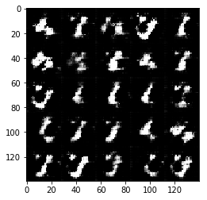


    Epoch 1/10... Discriminator Loss: 0.9298... Generator Loss: 5.6960
    Epoch 1/10... Discriminator Loss: 0.0402... Generator Loss: 4.4376
    Epoch 1/10... Discriminator Loss: 1.7197... Generator Loss: 10.4601
    Epoch 1/10... Discriminator Loss: 0.2725... Generator Loss: 4.8297
    Epoch 1/10... Discriminator Loss: 0.1884... Generator Loss: 2.9673
    Epoch 1/10... Discriminator Loss: 0.0687... Generator Loss: 4.0870
    Epoch 1/10... Discriminator Loss: 0.0750... Generator Loss: 5.4947
    Epoch 1/10... Discriminator Loss: 0.3130... Generator Loss: 2.4857
    Epoch 1/10... Discriminator Loss: 0.1061... Generator Loss: 4.5231
    Epoch 1/10... Discriminator Loss: 0.2120... Generator Loss: 2.6573


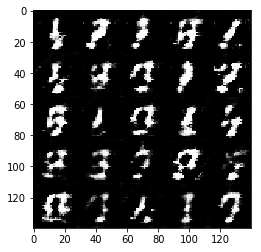


    Epoch 1/10... Discriminator Loss: 0.0765... Generator Loss: 4.1777
    Epoch 1/10... Discriminator Loss: 0.1699... Generator Loss: 2.6182
    Epoch 1/10... Discriminator Loss: 0.3160... Generator Loss: 1.8295
    Epoch 1/10... Discriminator Loss: 0.3171... Generator Loss: 5.2466
    Epoch 1/10... Discriminator Loss: 0.7993... Generator Loss: 1.5460
    Epoch 1/10... Discriminator Loss: 1.1132... Generator Loss: 1.8597
    Epoch 1/10... Discriminator Loss: 0.9108... Generator Loss: 1.4662
    Epoch 1/10... Discriminator Loss: 0.4997... Generator Loss: 2.7403
    Epoch 1/10... Discriminator Loss: 0.8892... Generator Loss: 4.9774
    Epoch 1/10... Discriminator Loss: 0.4890... Generator Loss: 2.4249


    Epoch 1/10... Discriminator Loss: 0.3784... Generator Loss: 4.4286
    Epoch 1/10... Discriminator Loss: 1.1459... Generator Loss: 4.9083
    Epoch 1/10... Discriminator Loss: 1.0871... Generator Loss: 0.6298
    Epoch 1/10... Discriminator Loss: 0.8773... Generator Loss: 1.1709
    Epoch 1/10... Discriminator Loss: 0.2960... Generator Loss: 2.3893
    Epoch 1/10... Discriminator Loss: 0.6434... Generator Loss: 1.1960
    Epoch 1/10... Discriminator Loss: 0.6278... Generator Loss: 1.8573
    Epoch 1/10... Discriminator Loss: 0.3722... Generator Loss: 2.6477
    Epoch 1/10... Discriminator Loss: 0.2739... Generator Loss: 3.0684
    Epoch 1/10... Discriminator Loss: 0.9672... Generator Loss: 1.7966


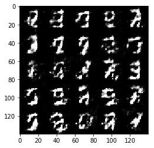


    Epoch 1/10... Discriminator Loss: 0.3643... Generator Loss: 2.5458
    Epoch 1/10... Discriminator Loss: 0.3630... Generator Loss: 1.9342
    Epoch 1/10... Discriminator Loss: 0.3956... Generator Loss: 1.7715
    Epoch 1/10... Discriminator Loss: 0.8926... Generator Loss: 0.9262
    Epoch 1/10... Discriminator Loss: 0.4732... Generator Loss: 2.0649
    Epoch 1/10... Discriminator Loss: 0.4544... Generator Loss: 3.1935
    Epoch 1/10... Discriminator Loss: 0.7911... Generator Loss: 0.9431
    Epoch 1/10... Discriminator Loss: 0.3426... Generator Loss: 2.1874
    Epoch 1/10... Discriminator Loss: 0.4741... Generator Loss: 1.7109
    Epoch 1/10... Discriminator Loss: 0.6511... Generator Loss: 3.4011


    Epoch 1/10... Discriminator Loss: 0.3598... Generator Loss: 2.4704
    Epoch 1/10... Discriminator Loss: 0.4478... Generator Loss: 1.4871
    Epoch 1/10... Discriminator Loss: 0.5730... Generator Loss: 2.1400
    Epoch 1/10... Discriminator Loss: 0.4510... Generator Loss: 3.2828
    Epoch 1/10... Discriminator Loss: 0.4325... Generator Loss: 1.8667
    Epoch 1/10... Discriminator Loss: 1.2534... Generator Loss: 4.7047
    Epoch 1/10... Discriminator Loss: 1.2014... Generator Loss: 0.6547
    Epoch 1/10... Discriminator Loss: 0.7610... Generator Loss: 1.4153
    Epoch 1/10... Discriminator Loss: 0.5975... Generator Loss: 1.2596
    Epoch 1/10... Discriminator Loss: 0.8390... Generator Loss: 1.4564


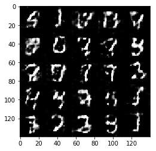


    Epoch 1/10... Discriminator Loss: 0.7057... Generator Loss: 0.9850
    Epoch 1/10... Discriminator Loss: 0.5026... Generator Loss: 1.7235
    Epoch 1/10... Discriminator Loss: 0.9897... Generator Loss: 2.3641
    Epoch 1/10... Discriminator Loss: 0.7884... Generator Loss: 1.1686
    Epoch 1/10... Discriminator Loss: 1.4833... Generator Loss: 0.3938
    Epoch 1/10... Discriminator Loss: 0.4702... Generator Loss: 1.9388
    Epoch 1/10... Discriminator Loss: 0.8401... Generator Loss: 1.7769
    Epoch 1/10... Discriminator Loss: 0.6927... Generator Loss: 1.0405
    Epoch 1/10... Discriminator Loss: 0.4168... Generator Loss: 1.8919
    Epoch 1/10... Discriminator Loss: 0.6091... Generator Loss: 3.2745


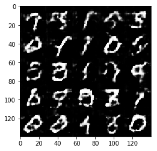


    Epoch 1/10... Discriminator Loss: 0.4415... Generator Loss: 2.6619
    Epoch 1/10... Discriminator Loss: 0.4770... Generator Loss: 2.2633
    Epoch 1/10... Discriminator Loss: 1.3639... Generator Loss: 0.4353
    Epoch 1/10... Discriminator Loss: 0.6831... Generator Loss: 1.1435
    Epoch 1/10... Discriminator Loss: 0.4448... Generator Loss: 1.4660
    Epoch 1/10... Discriminator Loss: 0.5996... Generator Loss: 3.2910
    Epoch 1/10... Discriminator Loss: 0.3194... Generator Loss: 2.2435
    Epoch 1/10... Discriminator Loss: 0.6231... Generator Loss: 1.5445
    Epoch 1/10... Discriminator Loss: 0.6079... Generator Loss: 1.2406
    Epoch 1/10... Discriminator Loss: 0.4261... Generator Loss: 1.7045


    Epoch 1/10... Discriminator Loss: 0.7719... Generator Loss: 2.4950
    Epoch 1/10... Discriminator Loss: 0.2947... Generator Loss: 2.5936
    Epoch 1/10... Discriminator Loss: 0.5840... Generator Loss: 2.8284
    Epoch 1/10... Discriminator Loss: 0.6102... Generator Loss: 1.2049
    Epoch 1/10... Discriminator Loss: 0.7864... Generator Loss: 0.9660
    Epoch 1/10... Discriminator Loss: 0.8948... Generator Loss: 1.2310
    Epoch 1/10... Discriminator Loss: 0.6978... Generator Loss: 3.4384
    Epoch 1/10... Discriminator Loss: 0.6902... Generator Loss: 1.2628
    Epoch 1/10... Discriminator Loss: 0.3444... Generator Loss: 1.7789
    Epoch 1/10... Discriminator Loss: 0.5896... Generator Loss: 1.7911


    Epoch 1/10... Discriminator Loss: 0.5714... Generator Loss: 1.6102
    Epoch 1/10... Discriminator Loss: 0.5579... Generator Loss: 1.4429
    Epoch 1/10... Discriminator Loss: 0.5509... Generator Loss: 1.3413
    Epoch 1/10... Discriminator Loss: 1.5811... Generator Loss: 0.3479
    Epoch 1/10... Discriminator Loss: 0.6963... Generator Loss: 2.6274
    Epoch 1/10... Discriminator Loss: 0.5830... Generator Loss: 1.2893
    Epoch 1/10... Discriminator Loss: 1.0494... Generator Loss: 0.6498
    Epoch 1/10... Discriminator Loss: 0.6504... Generator Loss: 1.3040
    Epoch 1/10... Discriminator Loss: 0.4817... Generator Loss: 1.6232
    Epoch 1/10... Discriminator Loss: 0.2914... Generator Loss: 2.3140


    Epoch 1/10... Discriminator Loss: 0.8295... Generator Loss: 1.0143
    Epoch 1/10... Discriminator Loss: 0.6955... Generator Loss: 1.0665
    Epoch 1/10... Discriminator Loss: 0.4517... Generator Loss: 2.1902
    Epoch 1/10... Discriminator Loss: 0.7170... Generator Loss: 1.2321
    Epoch 1/10... Discriminator Loss: 0.3854... Generator Loss: 1.8992
    Epoch 1/10... Discriminator Loss: 1.9767... Generator Loss: 0.2543
    Epoch 1/10... Discriminator Loss: 0.8511... Generator Loss: 1.8973
    Epoch 1/10... Discriminator Loss: 0.6567... Generator Loss: 1.3970
    Epoch 1/10... Discriminator Loss: 0.3442... Generator Loss: 1.8255
    Epoch 1/10... Discriminator Loss: 0.4433... Generator Loss: 1.6520


    Epoch 1/10... Discriminator Loss: 0.5724... Generator Loss: 1.4981
    Epoch 1/10... Discriminator Loss: 0.4765... Generator Loss: 2.7061
    Epoch 1/10... Discriminator Loss: 0.6816... Generator Loss: 1.1798
    Epoch 1/10... Discriminator Loss: 0.6626... Generator Loss: 1.0952
    Epoch 1/10... Discriminator Loss: 0.8282... Generator Loss: 0.8358
    Epoch 1/10... Discriminator Loss: 0.7360... Generator Loss: 1.2257
    Epoch 1/10... Discriminator Loss: 0.3220... Generator Loss: 2.9368
    Epoch 1/10... Discriminator Loss: 0.9638... Generator Loss: 0.6953
    Epoch 1/10... Discriminator Loss: 0.3115... Generator Loss: 2.2633
    Epoch 1/10... Discriminator Loss: 0.6249... Generator Loss: 3.8669


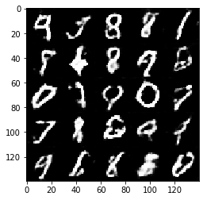


    Epoch 1/10... Discriminator Loss: 0.6619... Generator Loss: 1.5942
    Epoch 1/10... Discriminator Loss: 0.3612... Generator Loss: 1.8063
    Epoch 1/10... Discriminator Loss: 0.9524... Generator Loss: 0.6513
    Epoch 1/10... Discriminator Loss: 0.4732... Generator Loss: 1.4978
    Epoch 1/10... Discriminator Loss: 0.4539... Generator Loss: 2.7549
    Epoch 1/10... Discriminator Loss: 0.8726... Generator Loss: 0.9362
    Epoch 1/10... Discriminator Loss: 0.3938... Generator Loss: 2.0695
    Epoch 1/10... Discriminator Loss: 1.7533... Generator Loss: 0.2582
    Epoch 1/10... Discriminator Loss: 0.3806... Generator Loss: 2.2147
    Epoch 1/10... Discriminator Loss: 0.4206... Generator Loss: 1.8374


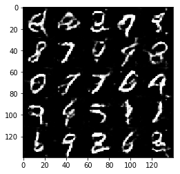


    Epoch 1/10... Discriminator Loss: 0.6798... Generator Loss: 1.0283
    Epoch 1/10... Discriminator Loss: 0.5377... Generator Loss: 1.2739
    Epoch 1/10... Discriminator Loss: 0.9833... Generator Loss: 0.7315
    Epoch 1/10... Discriminator Loss: 0.8983... Generator Loss: 1.5713
    Epoch 1/10... Discriminator Loss: 1.1471... Generator Loss: 0.5525
    Epoch 1/10... Discriminator Loss: 0.3624... Generator Loss: 1.8789
    Epoch 1/10... Discriminator Loss: 1.1193... Generator Loss: 0.5897
    Epoch 1/10... Discriminator Loss: 0.9488... Generator Loss: 3.3330
    Epoch 1/10... Discriminator Loss: 0.4109... Generator Loss: 1.4651
    Epoch 1/10... Discriminator Loss: 0.9261... Generator Loss: 0.6968


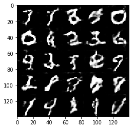


    Epoch 1/10... Discriminator Loss: 0.7994... Generator Loss: 1.0010
    Epoch 1/10... Discriminator Loss: 0.4766... Generator Loss: 2.1402
    Epoch 1/10... Discriminator Loss: 0.4621... Generator Loss: 1.4181
    Epoch 1/10... Discriminator Loss: 0.4641... Generator Loss: 1.4430
    Epoch 1/10... Discriminator Loss: 0.7062... Generator Loss: 1.0290
    Epoch 1/10... Discriminator Loss: 0.5040... Generator Loss: 1.4217
    Epoch 1/10... Discriminator Loss: 0.4125... Generator Loss: 1.5257
    Epoch 1/10... Discriminator Loss: 1.6233... Generator Loss: 0.3319
    Epoch 1/10... Discriminator Loss: 0.4572... Generator Loss: 2.8487
    Epoch 1/10... Discriminator Loss: 0.5484... Generator Loss: 1.8408


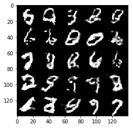


    Epoch 1/10... Discriminator Loss: 0.7771... Generator Loss: 3.6521
    Epoch 1/10... Discriminator Loss: 1.4731... Generator Loss: 0.4599
    Epoch 1/10... Discriminator Loss: 0.7940... Generator Loss: 0.9055
    Epoch 1/10... Discriminator Loss: 1.1811... Generator Loss: 0.6135
    Epoch 1/10... Discriminator Loss: 1.2293... Generator Loss: 0.4988
    Epoch 1/10... Discriminator Loss: 0.7862... Generator Loss: 1.0208
    Epoch 1/10... Discriminator Loss: 1.1260... Generator Loss: 0.6624
    Epoch 1/10... Discriminator Loss: 0.4858... Generator Loss: 1.4204
    Epoch 1/10... Discriminator Loss: 0.4236... Generator Loss: 1.6483
    Epoch 1/10... Discriminator Loss: 0.2408... Generator Loss: 2.6910


    Epoch 1/10... Discriminator Loss: 0.3601... Generator Loss: 1.6694
    Epoch 1/10... Discriminator Loss: 1.0277... Generator Loss: 0.6868
    Epoch 1/10... Discriminator Loss: 0.8948... Generator Loss: 0.7622
    Epoch 1/10... Discriminator Loss: 0.5379... Generator Loss: 2.9958
    Epoch 1/10... Discriminator Loss: 1.7261... Generator Loss: 0.3752
    Epoch 1/10... Discriminator Loss: 0.3503... Generator Loss: 2.0761
    Epoch 1/10... Discriminator Loss: 0.4451... Generator Loss: 1.4223
    Epoch 2/10... Discriminator Loss: 1.2705... Generator Loss: 0.4952
    Epoch 2/10... Discriminator Loss: 0.7080... Generator Loss: 0.9272
    Epoch 2/10... Discriminator Loss: 0.8647... Generator Loss: 0.7537


    Epoch 2/10... Discriminator Loss: 0.7787... Generator Loss: 0.8881
    Epoch 2/10... Discriminator Loss: 1.0617... Generator Loss: 0.6366
    Epoch 2/10... Discriminator Loss: 0.7504... Generator Loss: 0.9325
    Epoch 2/10... Discriminator Loss: 1.8363... Generator Loss: 6.5636
    Epoch 2/10... Discriminator Loss: 0.7676... Generator Loss: 0.9955
    Epoch 2/10... Discriminator Loss: 0.5211... Generator Loss: 1.5028
    Epoch 2/10... Discriminator Loss: 1.1557... Generator Loss: 0.6479
    Epoch 2/10... Discriminator Loss: 1.7900... Generator Loss: 0.3131
    Epoch 2/10... Discriminator Loss: 1.6969... Generator Loss: 0.3109
    Epoch 2/10... Discriminator Loss: 0.9132... Generator Loss: 0.7145


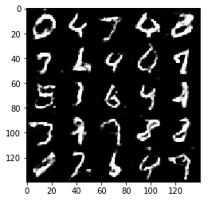


    Epoch 2/10... Discriminator Loss: 0.7575... Generator Loss: 0.9250
    Epoch 2/10... Discriminator Loss: 0.4005... Generator Loss: 1.9137
    Epoch 2/10... Discriminator Loss: 0.8713... Generator Loss: 0.7851
    Epoch 2/10... Discriminator Loss: 0.5616... Generator Loss: 1.1280
    Epoch 2/10... Discriminator Loss: 0.6536... Generator Loss: 1.1817
    Epoch 2/10... Discriminator Loss: 0.3051... Generator Loss: 2.0626
    Epoch 2/10... Discriminator Loss: 0.6110... Generator Loss: 1.1299
    Epoch 2/10... Discriminator Loss: 0.7422... Generator Loss: 1.0524
    Epoch 2/10... Discriminator Loss: 0.6561... Generator Loss: 1.9128
    Epoch 2/10... Discriminator Loss: 0.6970... Generator Loss: 2.1289


    Epoch 2/10... Discriminator Loss: 0.6683... Generator Loss: 1.4154
    Epoch 2/10... Discriminator Loss: 0.7783... Generator Loss: 1.0140
    Epoch 2/10... Discriminator Loss: 0.9835... Generator Loss: 0.7067
    Epoch 2/10... Discriminator Loss: 1.3056... Generator Loss: 0.5167
    Epoch 2/10... Discriminator Loss: 0.1945... Generator Loss: 2.7699
    Epoch 2/10... Discriminator Loss: 0.8205... Generator Loss: 0.8205
    Epoch 2/10... Discriminator Loss: 0.2671... Generator Loss: 2.0948
    Epoch 2/10... Discriminator Loss: 1.3033... Generator Loss: 0.5325
    Epoch 2/10... Discriminator Loss: 0.4444... Generator Loss: 1.5749
    Epoch 2/10... Discriminator Loss: 0.9531... Generator Loss: 0.6628


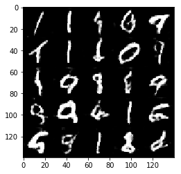


    Epoch 2/10... Discriminator Loss: 0.3781... Generator Loss: 1.6476
    Epoch 2/10... Discriminator Loss: 1.6549... Generator Loss: 0.3560
    Epoch 2/10... Discriminator Loss: 1.0179... Generator Loss: 0.7740
    Epoch 2/10... Discriminator Loss: 0.9261... Generator Loss: 0.7108
    Epoch 2/10... Discriminator Loss: 1.2871... Generator Loss: 0.5926
    Epoch 2/10... Discriminator Loss: 0.9555... Generator Loss: 0.6583
    Epoch 2/10... Discriminator Loss: 0.9886... Generator Loss: 0.9637
    Epoch 2/10... Discriminator Loss: 0.5297... Generator Loss: 1.4221
    Epoch 2/10... Discriminator Loss: 0.4185... Generator Loss: 2.2076
    Epoch 2/10... Discriminator Loss: 0.9592... Generator Loss: 1.0054


    Epoch 2/10... Discriminator Loss: 0.6325... Generator Loss: 3.7784
    Epoch 2/10... Discriminator Loss: 0.9205... Generator Loss: 0.9580
    Epoch 2/10... Discriminator Loss: 1.4267... Generator Loss: 0.6317
    Epoch 2/10... Discriminator Loss: 0.5262... Generator Loss: 1.6590
    Epoch 2/10... Discriminator Loss: 0.9939... Generator Loss: 0.7020
    Epoch 2/10... Discriminator Loss: 0.8872... Generator Loss: 0.8307
    Epoch 2/10... Discriminator Loss: 0.7987... Generator Loss: 0.9869
    Epoch 2/10... Discriminator Loss: 1.0476... Generator Loss: 0.6768
    Epoch 2/10... Discriminator Loss: 0.7557... Generator Loss: 1.0648
    Epoch 2/10... Discriminator Loss: 0.5978... Generator Loss: 1.2894


    Epoch 2/10... Discriminator Loss: 0.8205... Generator Loss: 0.9104
    Epoch 2/10... Discriminator Loss: 0.8234... Generator Loss: 0.8062
    Epoch 2/10... Discriminator Loss: 0.6059... Generator Loss: 1.2775
    Epoch 2/10... Discriminator Loss: 0.8802... Generator Loss: 0.7148
    Epoch 2/10... Discriminator Loss: 0.4716... Generator Loss: 1.4389
    Epoch 2/10... Discriminator Loss: 0.5279... Generator Loss: 1.2782
    Epoch 2/10... Discriminator Loss: 0.4736... Generator Loss: 1.4014
    Epoch 2/10... Discriminator Loss: 1.8996... Generator Loss: 0.2461
    Epoch 2/10... Discriminator Loss: 0.6610... Generator Loss: 0.9702
    Epoch 2/10... Discriminator Loss: 2.6974... Generator Loss: 0.1805


    Epoch 2/10... Discriminator Loss: 0.3951... Generator Loss: 2.3209
    Epoch 2/10... Discriminator Loss: 1.0113... Generator Loss: 0.7521
    Epoch 2/10... Discriminator Loss: 0.9874... Generator Loss: 0.6217
    Epoch 2/10... Discriminator Loss: 0.4224... Generator Loss: 1.5970
    Epoch 2/10... Discriminator Loss: 0.5645... Generator Loss: 1.1806
    Epoch 2/10... Discriminator Loss: 0.4449... Generator Loss: 1.3239
    Epoch 2/10... Discriminator Loss: 0.7441... Generator Loss: 0.9777
    Epoch 2/10... Discriminator Loss: 1.0241... Generator Loss: 0.8884
    Epoch 2/10... Discriminator Loss: 0.8562... Generator Loss: 1.3147
    Epoch 2/10... Discriminator Loss: 0.9263... Generator Loss: 0.9367


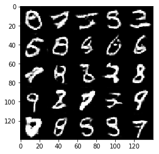


    Epoch 2/10... Discriminator Loss: 1.8026... Generator Loss: 6.5124
    Epoch 2/10... Discriminator Loss: 0.3034... Generator Loss: 2.8780
    Epoch 2/10... Discriminator Loss: 0.2983... Generator Loss: 2.9393
    Epoch 2/10... Discriminator Loss: 1.0242... Generator Loss: 0.8778
    Epoch 2/10... Discriminator Loss: 0.8437... Generator Loss: 0.9493
    Epoch 2/10... Discriminator Loss: 0.7733... Generator Loss: 1.0349
    Epoch 2/10... Discriminator Loss: 0.3304... Generator Loss: 2.8161
    Epoch 2/10... Discriminator Loss: 0.8461... Generator Loss: 0.9669
    Epoch 2/10... Discriminator Loss: 0.2964... Generator Loss: 2.6283
    Epoch 2/10... Discriminator Loss: 0.4711... Generator Loss: 1.5641


    Epoch 2/10... Discriminator Loss: 0.8417... Generator Loss: 0.8454
    Epoch 2/10... Discriminator Loss: 0.7761... Generator Loss: 0.8429
    Epoch 2/10... Discriminator Loss: 1.1284... Generator Loss: 0.6843
    Epoch 2/10... Discriminator Loss: 0.3661... Generator Loss: 1.6378
    Epoch 2/10... Discriminator Loss: 0.3130... Generator Loss: 3.5844
    Epoch 2/10... Discriminator Loss: 0.5804... Generator Loss: 1.1687
    Epoch 2/10... Discriminator Loss: 0.4401... Generator Loss: 2.2937
    Epoch 2/10... Discriminator Loss: 0.5608... Generator Loss: 1.3857
    Epoch 2/10... Discriminator Loss: 0.5802... Generator Loss: 1.3063
    Epoch 2/10... Discriminator Loss: 0.2725... Generator Loss: 2.7396


    Epoch 2/10... Discriminator Loss: 0.3839... Generator Loss: 1.6332
    Epoch 2/10... Discriminator Loss: 0.8417... Generator Loss: 1.0931
    Epoch 2/10... Discriminator Loss: 0.3803... Generator Loss: 1.9027
    Epoch 2/10... Discriminator Loss: 0.4620... Generator Loss: 1.5964
    Epoch 2/10... Discriminator Loss: 0.5577... Generator Loss: 1.4139
    Epoch 2/10... Discriminator Loss: 0.6741... Generator Loss: 1.0802
    Epoch 2/10... Discriminator Loss: 0.4520... Generator Loss: 1.4174
    Epoch 2/10... Discriminator Loss: 0.4737... Generator Loss: 1.4878
    Epoch 2/10... Discriminator Loss: 0.4322... Generator Loss: 1.7755
    Epoch 2/10... Discriminator Loss: 0.4212... Generator Loss: 1.7893


    Epoch 2/10... Discriminator Loss: 0.4543... Generator Loss: 1.5646
    Epoch 2/10... Discriminator Loss: 0.9043... Generator Loss: 1.1969
    Epoch 2/10... Discriminator Loss: 0.5368... Generator Loss: 1.7253
    Epoch 2/10... Discriminator Loss: 0.3655... Generator Loss: 2.6159
    Epoch 2/10... Discriminator Loss: 0.2781... Generator Loss: 2.0968
    Epoch 2/10... Discriminator Loss: 0.6789... Generator Loss: 1.1319
    Epoch 2/10... Discriminator Loss: 0.8094... Generator Loss: 0.8849
    Epoch 2/10... Discriminator Loss: 0.6951... Generator Loss: 1.1494
    Epoch 2/10... Discriminator Loss: 0.7758... Generator Loss: 0.9987
    Epoch 2/10... Discriminator Loss: 0.5531... Generator Loss: 2.8551


    Epoch 2/10... Discriminator Loss: 0.4008... Generator Loss: 2.8273
    Epoch 2/10... Discriminator Loss: 0.5313... Generator Loss: 1.2961
    Epoch 2/10... Discriminator Loss: 0.3004... Generator Loss: 3.4884
    Epoch 2/10... Discriminator Loss: 0.4837... Generator Loss: 2.5209
    Epoch 2/10... Discriminator Loss: 0.6121... Generator Loss: 4.7769
    Epoch 2/10... Discriminator Loss: 0.3985... Generator Loss: 1.5243
    Epoch 2/10... Discriminator Loss: 0.2840... Generator Loss: 2.2216
    Epoch 2/10... Discriminator Loss: 0.3964... Generator Loss: 1.6170
    Epoch 2/10... Discriminator Loss: 0.5451... Generator Loss: 1.2540
    Epoch 2/10... Discriminator Loss: 0.7315... Generator Loss: 1.0028


    Epoch 2/10... Discriminator Loss: 0.5686... Generator Loss: 1.3299
    Epoch 2/10... Discriminator Loss: 0.5911... Generator Loss: 1.0277
    Epoch 2/10... Discriminator Loss: 0.3120... Generator Loss: 1.9129
    Epoch 2/10... Discriminator Loss: 0.5484... Generator Loss: 1.5531
    Epoch 2/10... Discriminator Loss: 0.7629... Generator Loss: 0.9602
    Epoch 2/10... Discriminator Loss: 1.3501... Generator Loss: 0.6992
    Epoch 2/10... Discriminator Loss: 0.6169... Generator Loss: 1.2057
    Epoch 2/10... Discriminator Loss: 0.7239... Generator Loss: 0.8957
    Epoch 2/10... Discriminator Loss: 1.8309... Generator Loss: 0.3300
    Epoch 2/10... Discriminator Loss: 0.2876... Generator Loss: 1.8366


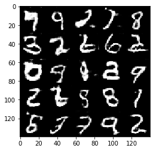


    Epoch 2/10... Discriminator Loss: 0.4405... Generator Loss: 1.5264
    Epoch 2/10... Discriminator Loss: 0.6963... Generator Loss: 1.1107
    Epoch 2/10... Discriminator Loss: 0.3609... Generator Loss: 2.6731
    Epoch 2/10... Discriminator Loss: 0.2692... Generator Loss: 1.9697
    Epoch 2/10... Discriminator Loss: 0.5952... Generator Loss: 1.2022
    Epoch 2/10... Discriminator Loss: 0.2940... Generator Loss: 1.9720
    Epoch 2/10... Discriminator Loss: 0.4350... Generator Loss: 1.5994
    Epoch 2/10... Discriminator Loss: 0.5497... Generator Loss: 1.3016
    Epoch 2/10... Discriminator Loss: 0.1899... Generator Loss: 2.6623
    Epoch 2/10... Discriminator Loss: 0.2636... Generator Loss: 2.2881


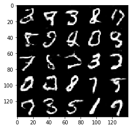


    Epoch 2/10... Discriminator Loss: 2.1212... Generator Loss: 8.7988
    Epoch 2/10... Discriminator Loss: 0.6501... Generator Loss: 1.5334
    Epoch 2/10... Discriminator Loss: 0.3570... Generator Loss: 1.9474
    Epoch 2/10... Discriminator Loss: 0.1844... Generator Loss: 3.2193
    Epoch 2/10... Discriminator Loss: 0.5656... Generator Loss: 1.3337
    Epoch 2/10... Discriminator Loss: 0.5073... Generator Loss: 1.5532
    Epoch 2/10... Discriminator Loss: 0.6624... Generator Loss: 1.1291
    Epoch 2/10... Discriminator Loss: 2.9384... Generator Loss: 8.5250
    Epoch 2/10... Discriminator Loss: 0.6848... Generator Loss: 2.7133
    Epoch 2/10... Discriminator Loss: 0.4822... Generator Loss: 3.4197


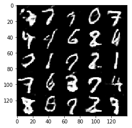


    Epoch 2/10... Discriminator Loss: 0.5301... Generator Loss: 2.8058
    Epoch 2/10... Discriminator Loss: 0.5119... Generator Loss: 1.6009
    Epoch 2/10... Discriminator Loss: 0.4625... Generator Loss: 1.4051
    Epoch 2/10... Discriminator Loss: 0.4140... Generator Loss: 1.5623
    Epoch 2/10... Discriminator Loss: 0.7138... Generator Loss: 1.1112
    Epoch 2/10... Discriminator Loss: 0.4387... Generator Loss: 1.5081
    Epoch 2/10... Discriminator Loss: 0.4402... Generator Loss: 1.4982
    Epoch 2/10... Discriminator Loss: 0.8949... Generator Loss: 0.8870
    Epoch 2/10... Discriminator Loss: 0.3992... Generator Loss: 1.4023
    Epoch 2/10... Discriminator Loss: 0.3070... Generator Loss: 2.1186


    Epoch 2/10... Discriminator Loss: 0.4919... Generator Loss: 1.3440
    Epoch 2/10... Discriminator Loss: 0.5320... Generator Loss: 1.2807
    Epoch 2/10... Discriminator Loss: 0.6824... Generator Loss: 1.0536
    Epoch 2/10... Discriminator Loss: 1.1715... Generator Loss: 0.5879
    Epoch 2/10... Discriminator Loss: 0.5625... Generator Loss: 1.2295
    Epoch 2/10... Discriminator Loss: 0.5037... Generator Loss: 2.6153
    Epoch 2/10... Discriminator Loss: 0.6537... Generator Loss: 1.2836
    Epoch 2/10... Discriminator Loss: 0.5858... Generator Loss: 1.6201
    Epoch 2/10... Discriminator Loss: 0.5729... Generator Loss: 1.1951
    Epoch 2/10... Discriminator Loss: 0.1804... Generator Loss: 2.8020


    Epoch 2/10... Discriminator Loss: 1.2738... Generator Loss: 0.5535
    Epoch 2/10... Discriminator Loss: 0.9918... Generator Loss: 0.8303
    Epoch 2/10... Discriminator Loss: 1.5282... Generator Loss: 4.6537
    Epoch 2/10... Discriminator Loss: 0.7647... Generator Loss: 1.2241
    Epoch 2/10... Discriminator Loss: 1.3586... Generator Loss: 0.9286
    Epoch 2/10... Discriminator Loss: 0.4803... Generator Loss: 1.6690
    Epoch 2/10... Discriminator Loss: 1.7019... Generator Loss: 0.4090
    Epoch 2/10... Discriminator Loss: 0.5163... Generator Loss: 4.2324
    Epoch 2/10... Discriminator Loss: 0.5629... Generator Loss: 1.3571
    Epoch 2/10... Discriminator Loss: 0.5808... Generator Loss: 1.6334


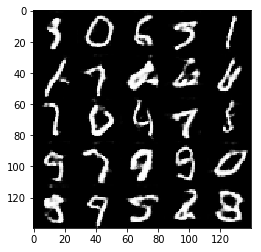


    Epoch 2/10... Discriminator Loss: 0.4381... Generator Loss: 1.3912
    Epoch 2/10... Discriminator Loss: 0.3676... Generator Loss: 2.2150
    Epoch 2/10... Discriminator Loss: 0.1861... Generator Loss: 2.8280
    Epoch 2/10... Discriminator Loss: 0.7687... Generator Loss: 0.8277
    Epoch 2/10... Discriminator Loss: 0.3205... Generator Loss: 1.8302
    Epoch 3/10... Discriminator Loss: 0.6608... Generator Loss: 1.1350
    Epoch 3/10... Discriminator Loss: 0.6119... Generator Loss: 1.2333
    Epoch 3/10... Discriminator Loss: 0.5995... Generator Loss: 1.3832
    Epoch 3/10... Discriminator Loss: 0.4649... Generator Loss: 1.6286
    Epoch 3/10... Discriminator Loss: 0.9153... Generator Loss: 0.8440


    Epoch 3/10... Discriminator Loss: 0.5530... Generator Loss: 1.3317
    Epoch 3/10... Discriminator Loss: 0.8607... Generator Loss: 0.8513
    Epoch 3/10... Discriminator Loss: 0.4884... Generator Loss: 1.4814
    Epoch 3/10... Discriminator Loss: 1.1686... Generator Loss: 0.7466
    Epoch 3/10... Discriminator Loss: 0.5970... Generator Loss: 1.3298
    Epoch 3/10... Discriminator Loss: 0.3212... Generator Loss: 1.9617
    Epoch 3/10... Discriminator Loss: 0.6861... Generator Loss: 1.2422
    Epoch 3/10... Discriminator Loss: 1.4256... Generator Loss: 0.4888
    Epoch 3/10... Discriminator Loss: 0.2508... Generator Loss: 2.0852
    Epoch 3/10... Discriminator Loss: 0.5165... Generator Loss: 1.5046


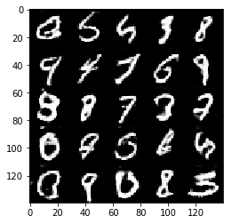


    Epoch 3/10... Discriminator Loss: 0.2428... Generator Loss: 2.3315
    Epoch 3/10... Discriminator Loss: 0.3454... Generator Loss: 2.1154
    Epoch 3/10... Discriminator Loss: 0.2503... Generator Loss: 3.0857
    Epoch 3/10... Discriminator Loss: 0.6092... Generator Loss: 1.5126
    Epoch 3/10... Discriminator Loss: 0.4765... Generator Loss: 1.6559
    Epoch 3/10... Discriminator Loss: 1.6237... Generator Loss: 0.4187
    Epoch 3/10... Discriminator Loss: 0.2826... Generator Loss: 2.2418
    Epoch 3/10... Discriminator Loss: 0.7234... Generator Loss: 1.1078
    Epoch 3/10... Discriminator Loss: 0.6189... Generator Loss: 1.3061
    Epoch 3/10... Discriminator Loss: 0.1948... Generator Loss: 2.3791


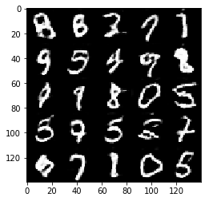


    Epoch 3/10... Discriminator Loss: 0.4901... Generator Loss: 1.5144
    Epoch 3/10... Discriminator Loss: 0.4612... Generator Loss: 1.5807
    Epoch 3/10... Discriminator Loss: 0.2009... Generator Loss: 2.4888
    Epoch 3/10... Discriminator Loss: 1.4115... Generator Loss: 0.4145
    Epoch 3/10... Discriminator Loss: 0.8014... Generator Loss: 0.8339
    Epoch 3/10... Discriminator Loss: 0.7473... Generator Loss: 0.9880
    Epoch 3/10... Discriminator Loss: 0.5779... Generator Loss: 1.1173
    Epoch 3/10... Discriminator Loss: 0.1923... Generator Loss: 2.5390
    Epoch 3/10... Discriminator Loss: 0.4966... Generator Loss: 3.1773
    Epoch 3/10... Discriminator Loss: 0.2387... Generator Loss: 3.3494


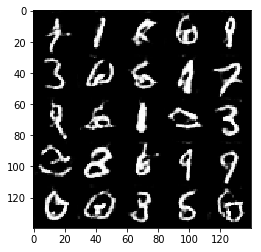


    Epoch 3/10... Discriminator Loss: 0.3777... Generator Loss: 3.1588
    Epoch 3/10... Discriminator Loss: 1.1970... Generator Loss: 0.6719
    Epoch 3/10... Discriminator Loss: 0.5064... Generator Loss: 1.3354
    Epoch 3/10... Discriminator Loss: 0.7947... Generator Loss: 0.9995
    Epoch 3/10... Discriminator Loss: 1.2225... Generator Loss: 0.6555
    Epoch 3/10... Discriminator Loss: 0.4992... Generator Loss: 1.5467
    Epoch 3/10... Discriminator Loss: 0.7686... Generator Loss: 0.9713
    Epoch 3/10... Discriminator Loss: 1.4220... Generator Loss: 0.5096
    Epoch 3/10... Discriminator Loss: 0.1805... Generator Loss: 2.6919
    Epoch 3/10... Discriminator Loss: 0.6548... Generator Loss: 1.1162


    Epoch 3/10... Discriminator Loss: 0.4777... Generator Loss: 1.2120
    Epoch 3/10... Discriminator Loss: 0.5815... Generator Loss: 1.4381
    Epoch 3/10... Discriminator Loss: 0.3114... Generator Loss: 4.2192
    Epoch 3/10... Discriminator Loss: 0.5278... Generator Loss: 1.4288
    Epoch 3/10... Discriminator Loss: 0.9588... Generator Loss: 0.8432
    Epoch 3/10... Discriminator Loss: 0.2829... Generator Loss: 1.9082
    Epoch 3/10... Discriminator Loss: 0.3454... Generator Loss: 1.7275
    Epoch 3/10... Discriminator Loss: 0.4009... Generator Loss: 1.6714
    Epoch 3/10... Discriminator Loss: 0.7781... Generator Loss: 1.1938
    Epoch 3/10... Discriminator Loss: 0.6857... Generator Loss: 1.4813


    Epoch 3/10... Discriminator Loss: 0.4259... Generator Loss: 1.8281
    Epoch 3/10... Discriminator Loss: 0.2380... Generator Loss: 2.4821
    Epoch 3/10... Discriminator Loss: 0.6861... Generator Loss: 1.3444
    Epoch 3/10... Discriminator Loss: 0.6807... Generator Loss: 1.4144
    Epoch 3/10... Discriminator Loss: 0.4073... Generator Loss: 1.7832
    Epoch 3/10... Discriminator Loss: 0.2832... Generator Loss: 2.2860
    Epoch 3/10... Discriminator Loss: 0.8128... Generator Loss: 0.8718
    Epoch 3/10... Discriminator Loss: 0.3627... Generator Loss: 1.7850
    Epoch 3/10... Discriminator Loss: 0.3622... Generator Loss: 1.8794
    Epoch 3/10... Discriminator Loss: 0.2009... Generator Loss: 2.4140


    Epoch 3/10... Discriminator Loss: 0.2693... Generator Loss: 2.1885
    Epoch 3/10... Discriminator Loss: 0.5322... Generator Loss: 1.3328
    Epoch 3/10... Discriminator Loss: 0.4344... Generator Loss: 2.1622
    Epoch 3/10... Discriminator Loss: 0.9628... Generator Loss: 3.4232
    Epoch 3/10... Discriminator Loss: 0.7232... Generator Loss: 1.2663
    Epoch 3/10... Discriminator Loss: 0.9658... Generator Loss: 0.9727
    Epoch 3/10... Discriminator Loss: 0.6320... Generator Loss: 1.1572
    Epoch 3/10... Discriminator Loss: 1.8107... Generator Loss: 0.2985
    Epoch 3/10... Discriminator Loss: 0.5356... Generator Loss: 1.4726
    Epoch 3/10... Discriminator Loss: 0.2087... Generator Loss: 2.2170


    Epoch 3/10... Discriminator Loss: 0.9644... Generator Loss: 0.6585
    Epoch 3/10... Discriminator Loss: 0.6253... Generator Loss: 1.0139
    Epoch 3/10... Discriminator Loss: 0.9839... Generator Loss: 0.7463
    Epoch 3/10... Discriminator Loss: 0.6940... Generator Loss: 0.9675
    Epoch 3/10... Discriminator Loss: 0.2941... Generator Loss: 1.8250
    Epoch 3/10... Discriminator Loss: 0.2781... Generator Loss: 2.1632
    Epoch 3/10... Discriminator Loss: 0.9411... Generator Loss: 0.8272
    Epoch 3/10... Discriminator Loss: 0.3687... Generator Loss: 2.2367
    Epoch 3/10... Discriminator Loss: 0.7327... Generator Loss: 1.0355
    Epoch 3/10... Discriminator Loss: 0.3369... Generator Loss: 1.8195


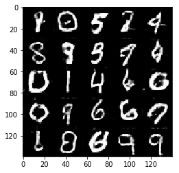


    Epoch 3/10... Discriminator Loss: 0.3934... Generator Loss: 1.7832
    Epoch 3/10... Discriminator Loss: 0.1960... Generator Loss: 2.4601
    Epoch 3/10... Discriminator Loss: 0.6275... Generator Loss: 1.0568
    Epoch 3/10... Discriminator Loss: 0.3267... Generator Loss: 1.8402
    Epoch 3/10... Discriminator Loss: 0.5128... Generator Loss: 1.3084
    Epoch 3/10... Discriminator Loss: 0.1766... Generator Loss: 2.7581
    Epoch 3/10... Discriminator Loss: 0.2450... Generator Loss: 2.0713
    Epoch 3/10... Discriminator Loss: 0.9630... Generator Loss: 0.8067
    Epoch 3/10... Discriminator Loss: 0.2798... Generator Loss: 1.9493
    Epoch 3/10... Discriminator Loss: 0.2248... Generator Loss: 2.5812


    Epoch 3/10... Discriminator Loss: 0.5274... Generator Loss: 1.3169
    Epoch 3/10... Discriminator Loss: 0.5127... Generator Loss: 1.2866
    Epoch 3/10... Discriminator Loss: 0.1391... Generator Loss: 2.5587
    Epoch 3/10... Discriminator Loss: 0.2502... Generator Loss: 2.0896
    Epoch 3/10... Discriminator Loss: 0.4464... Generator Loss: 1.5261
    Epoch 3/10... Discriminator Loss: 0.3066... Generator Loss: 1.9345
    Epoch 3/10... Discriminator Loss: 0.2357... Generator Loss: 2.0267
    Epoch 3/10... Discriminator Loss: 0.1791... Generator Loss: 2.6175
    Epoch 3/10... Discriminator Loss: 0.4450... Generator Loss: 4.1366
    Epoch 3/10... Discriminator Loss: 0.9047... Generator Loss: 1.0082


    Epoch 3/10... Discriminator Loss: 0.8119... Generator Loss: 1.3187
    Epoch 3/10... Discriminator Loss: 0.2838... Generator Loss: 3.3707
    Epoch 3/10... Discriminator Loss: 0.4682... Generator Loss: 1.6927
    Epoch 3/10... Discriminator Loss: 0.2894... Generator Loss: 1.7922
    Epoch 3/10... Discriminator Loss: 0.2343... Generator Loss: 4.7620
    Epoch 3/10... Discriminator Loss: 1.1457... Generator Loss: 5.2002
    Epoch 3/10... Discriminator Loss: 0.6053... Generator Loss: 3.4260
    Epoch 3/10... Discriminator Loss: 0.7922... Generator Loss: 1.0361
    Epoch 3/10... Discriminator Loss: 0.8983... Generator Loss: 0.9575
    Epoch 3/10... Discriminator Loss: 1.0515... Generator Loss: 0.8304


    Epoch 3/10... Discriminator Loss: 0.6804... Generator Loss: 1.2511
    Epoch 3/10... Discriminator Loss: 0.4352... Generator Loss: 2.5255
    Epoch 3/10... Discriminator Loss: 0.7165... Generator Loss: 1.1045
    Epoch 3/10... Discriminator Loss: 0.2641... Generator Loss: 2.3945
    Epoch 3/10... Discriminator Loss: 0.5818... Generator Loss: 1.1539
    Epoch 3/10... Discriminator Loss: 0.3949... Generator Loss: 1.5844
    Epoch 3/10... Discriminator Loss: 0.5213... Generator Loss: 1.5818
    Epoch 3/10... Discriminator Loss: 0.6144... Generator Loss: 1.2147
    Epoch 3/10... Discriminator Loss: 0.2554... Generator Loss: 2.5747
    Epoch 3/10... Discriminator Loss: 0.4755... Generator Loss: 2.1256


    Epoch 3/10... Discriminator Loss: 0.6337... Generator Loss: 1.0187
    Epoch 3/10... Discriminator Loss: 0.3848... Generator Loss: 1.5517
    Epoch 3/10... Discriminator Loss: 0.1750... Generator Loss: 2.3632
    Epoch 3/10... Discriminator Loss: 0.2830... Generator Loss: 1.9606
    Epoch 3/10... Discriminator Loss: 0.2947... Generator Loss: 1.8964
    Epoch 3/10... Discriminator Loss: 0.6235... Generator Loss: 1.0253
    Epoch 3/10... Discriminator Loss: 0.5139... Generator Loss: 1.4965
    Epoch 3/10... Discriminator Loss: 0.5669... Generator Loss: 1.2930
    Epoch 3/10... Discriminator Loss: 0.8653... Generator Loss: 1.1548
    Epoch 3/10... Discriminator Loss: 0.1022... Generator Loss: 3.4292


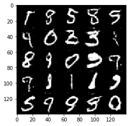


    Epoch 3/10... Discriminator Loss: 0.9080... Generator Loss: 0.9328
    Epoch 3/10... Discriminator Loss: 0.3100... Generator Loss: 1.7278
    Epoch 3/10... Discriminator Loss: 0.7390... Generator Loss: 1.1138
    Epoch 3/10... Discriminator Loss: 0.3151... Generator Loss: 2.1308
    Epoch 3/10... Discriminator Loss: 0.1122... Generator Loss: 3.7574
    Epoch 3/10... Discriminator Loss: 0.1085... Generator Loss: 3.3780
    Epoch 3/10... Discriminator Loss: 0.1281... Generator Loss: 3.4573
    Epoch 3/10... Discriminator Loss: 1.1052... Generator Loss: 0.7919
    Epoch 3/10... Discriminator Loss: 0.9964... Generator Loss: 0.7126
    Epoch 3/10... Discriminator Loss: 0.7023... Generator Loss: 5.3800


    Epoch 3/10... Discriminator Loss: 2.0301... Generator Loss: 0.6782
    Epoch 3/10... Discriminator Loss: 0.5099... Generator Loss: 4.3367
    Epoch 3/10... Discriminator Loss: 0.6701... Generator Loss: 1.1332
    Epoch 3/10... Discriminator Loss: 0.3832... Generator Loss: 1.7451
    Epoch 3/10... Discriminator Loss: 0.5620... Generator Loss: 1.2584
    Epoch 3/10... Discriminator Loss: 1.1699... Generator Loss: 0.6834
    Epoch 3/10... Discriminator Loss: 0.4018... Generator Loss: 1.5597
    Epoch 3/10... Discriminator Loss: 0.7536... Generator Loss: 1.0427
    Epoch 3/10... Discriminator Loss: 0.2419... Generator Loss: 2.0830
    Epoch 3/10... Discriminator Loss: 1.3759... Generator Loss: 0.6236


    Epoch 3/10... Discriminator Loss: 0.7032... Generator Loss: 1.0863
    Epoch 3/10... Discriminator Loss: 0.5568... Generator Loss: 1.4700
    Epoch 3/10... Discriminator Loss: 1.1038... Generator Loss: 0.5445
    Epoch 3/10... Discriminator Loss: 0.3719... Generator Loss: 1.8215
    Epoch 3/10... Discriminator Loss: 3.1599... Generator Loss: 0.1275
    Epoch 3/10... Discriminator Loss: 0.3791... Generator Loss: 2.9522
    Epoch 3/10... Discriminator Loss: 0.7968... Generator Loss: 4.2161
    Epoch 3/10... Discriminator Loss: 2.0474... Generator Loss: 6.0235
    Epoch 3/10... Discriminator Loss: 0.8138... Generator Loss: 1.1576
    Epoch 3/10... Discriminator Loss: 0.2617... Generator Loss: 3.0583


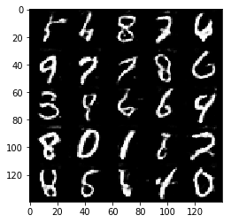


    Epoch 3/10... Discriminator Loss: 0.2164... Generator Loss: 2.3219
    Epoch 3/10... Discriminator Loss: 0.3458... Generator Loss: 3.5257
    Epoch 3/10... Discriminator Loss: 0.2981... Generator Loss: 2.2930
    Epoch 3/10... Discriminator Loss: 0.2763... Generator Loss: 1.9272
    Epoch 3/10... Discriminator Loss: 0.5977... Generator Loss: 1.4736
    Epoch 3/10... Discriminator Loss: 0.3514... Generator Loss: 1.7945
    Epoch 3/10... Discriminator Loss: 0.8339... Generator Loss: 1.0438
    Epoch 3/10... Discriminator Loss: 0.9491... Generator Loss: 0.9960
    Epoch 3/10... Discriminator Loss: 2.1364... Generator Loss: 0.3240
    Epoch 3/10... Discriminator Loss: 0.3474... Generator Loss: 1.8127


    Epoch 3/10... Discriminator Loss: 0.7449... Generator Loss: 0.9227
    Epoch 3/10... Discriminator Loss: 0.3697... Generator Loss: 1.8481
    Epoch 3/10... Discriminator Loss: 0.4082... Generator Loss: 1.6928
    Epoch 3/10... Discriminator Loss: 1.2427... Generator Loss: 0.5673
    Epoch 3/10... Discriminator Loss: 0.1509... Generator Loss: 2.8277
    Epoch 3/10... Discriminator Loss: 0.2219... Generator Loss: 2.2082
    Epoch 3/10... Discriminator Loss: 0.4456... Generator Loss: 1.3193
    Epoch 3/10... Discriminator Loss: 0.3213... Generator Loss: 1.9860
    Epoch 3/10... Discriminator Loss: 0.5101... Generator Loss: 1.4234
    Epoch 3/10... Discriminator Loss: 0.3388... Generator Loss: 3.5278


    Epoch 3/10... Discriminator Loss: 0.2068... Generator Loss: 2.7269
    Epoch 3/10... Discriminator Loss: 0.1221... Generator Loss: 4.1397
    Epoch 4/10... Discriminator Loss: 0.8420... Generator Loss: 1.2277
    Epoch 4/10... Discriminator Loss: 0.4092... Generator Loss: 2.3837
    Epoch 4/10... Discriminator Loss: 0.5975... Generator Loss: 1.3591
    Epoch 4/10... Discriminator Loss: 0.6173... Generator Loss: 1.1944
    Epoch 4/10... Discriminator Loss: 0.3773... Generator Loss: 1.5947
    Epoch 4/10... Discriminator Loss: 0.3688... Generator Loss: 2.0077
    Epoch 4/10... Discriminator Loss: 0.2153... Generator Loss: 2.3330
    Epoch 4/10... Discriminator Loss: 0.5613... Generator Loss: 1.2519


    Epoch 4/10... Discriminator Loss: 0.5088... Generator Loss: 1.3203
    Epoch 4/10... Discriminator Loss: 0.5286... Generator Loss: 1.4735
    Epoch 4/10... Discriminator Loss: 1.8585... Generator Loss: 0.3628
    Epoch 4/10... Discriminator Loss: 0.5857... Generator Loss: 1.1702
    Epoch 4/10... Discriminator Loss: 0.2107... Generator Loss: 2.7871
    Epoch 4/10... Discriminator Loss: 0.5368... Generator Loss: 1.2425
    Epoch 4/10... Discriminator Loss: 0.3677... Generator Loss: 1.8008
    Epoch 4/10... Discriminator Loss: 0.6723... Generator Loss: 1.1704
    Epoch 4/10... Discriminator Loss: 0.4970... Generator Loss: 1.4703
    Epoch 4/10... Discriminator Loss: 0.3241... Generator Loss: 2.1052


    Epoch 4/10... Discriminator Loss: 0.1417... Generator Loss: 2.7545
    Epoch 4/10... Discriminator Loss: 0.4831... Generator Loss: 1.2934
    Epoch 4/10... Discriminator Loss: 0.1449... Generator Loss: 3.4943
    Epoch 4/10... Discriminator Loss: 0.1986... Generator Loss: 2.7975
    Epoch 4/10... Discriminator Loss: 0.2018... Generator Loss: 2.6154
    Epoch 4/10... Discriminator Loss: 0.2106... Generator Loss: 2.1480
    Epoch 4/10... Discriminator Loss: 1.4536... Generator Loss: 0.4931
    Epoch 4/10... Discriminator Loss: 0.2191... Generator Loss: 3.5802
    Epoch 4/10... Discriminator Loss: 0.6582... Generator Loss: 1.1085
    Epoch 4/10... Discriminator Loss: 0.3863... Generator Loss: 1.6218


    Epoch 4/10... Discriminator Loss: 0.8987... Generator Loss: 1.0688
    Epoch 4/10... Discriminator Loss: 0.6661... Generator Loss: 1.2726
    Epoch 4/10... Discriminator Loss: 0.4309... Generator Loss: 5.8907
    Epoch 4/10... Discriminator Loss: 0.3249... Generator Loss: 2.1559
    Epoch 4/10... Discriminator Loss: 0.4411... Generator Loss: 1.8680
    Epoch 4/10... Discriminator Loss: 0.4355... Generator Loss: 1.9203
    Epoch 4/10... Discriminator Loss: 0.9625... Generator Loss: 0.8017
    Epoch 4/10... Discriminator Loss: 0.9555... Generator Loss: 0.7672
    Epoch 4/10... Discriminator Loss: 0.3451... Generator Loss: 1.9253
    Epoch 4/10... Discriminator Loss: 1.0397... Generator Loss: 0.7353


    Epoch 4/10... Discriminator Loss: 0.6657... Generator Loss: 1.6445
    Epoch 4/10... Discriminator Loss: 0.1657... Generator Loss: 4.4022
    Epoch 4/10... Discriminator Loss: 0.0507... Generator Loss: 3.9861
    Epoch 4/10... Discriminator Loss: 0.4214... Generator Loss: 1.6397
    Epoch 4/10... Discriminator Loss: 0.7296... Generator Loss: 3.7349
    Epoch 4/10... Discriminator Loss: 0.9389... Generator Loss: 1.0058
    Epoch 4/10... Discriminator Loss: 0.3430... Generator Loss: 2.2606
    Epoch 4/10... Discriminator Loss: 1.0329... Generator Loss: 0.9385
    Epoch 4/10... Discriminator Loss: 0.2298... Generator Loss: 2.3847
    Epoch 4/10... Discriminator Loss: 0.2436... Generator Loss: 2.8189


    Epoch 4/10... Discriminator Loss: 0.1842... Generator Loss: 2.9428
    Epoch 4/10... Discriminator Loss: 0.2771... Generator Loss: 1.9290
    Epoch 4/10... Discriminator Loss: 0.5988... Generator Loss: 1.1355
    Epoch 4/10... Discriminator Loss: 0.1682... Generator Loss: 3.4050
    Epoch 4/10... Discriminator Loss: 0.2912... Generator Loss: 2.9095
    Epoch 4/10... Discriminator Loss: 0.2419... Generator Loss: 2.5004
    Epoch 4/10... Discriminator Loss: 0.2495... Generator Loss: 2.2263
    Epoch 4/10... Discriminator Loss: 0.3973... Generator Loss: 1.6084
    Epoch 4/10... Discriminator Loss: 0.5633... Generator Loss: 1.2914
    Epoch 4/10... Discriminator Loss: 0.2721... Generator Loss: 1.9409


    Epoch 4/10... Discriminator Loss: 0.6338... Generator Loss: 1.2984
    Epoch 4/10... Discriminator Loss: 0.0331... Generator Loss: 5.0279
    Epoch 4/10... Discriminator Loss: 1.5365... Generator Loss: 0.4911
    Epoch 4/10... Discriminator Loss: 0.7375... Generator Loss: 1.0549
    Epoch 4/10... Discriminator Loss: 0.5212... Generator Loss: 1.1710
    Epoch 4/10... Discriminator Loss: 0.2087... Generator Loss: 2.3202
    Epoch 4/10... Discriminator Loss: 0.4824... Generator Loss: 1.7060
    Epoch 4/10... Discriminator Loss: 0.8749... Generator Loss: 0.9556
    Epoch 4/10... Discriminator Loss: 0.2908... Generator Loss: 2.2614
    Epoch 4/10... Discriminator Loss: 0.1523... Generator Loss: 3.2519


    Epoch 4/10... Discriminator Loss: 0.3473... Generator Loss: 1.5502
    Epoch 4/10... Discriminator Loss: 0.2533... Generator Loss: 5.7264
    Epoch 4/10... Discriminator Loss: 0.5356... Generator Loss: 1.8584
    Epoch 4/10... Discriminator Loss: 0.5288... Generator Loss: 1.9134
    Epoch 4/10... Discriminator Loss: 2.1266... Generator Loss: 0.2401
    Epoch 4/10... Discriminator Loss: 0.3994... Generator Loss: 2.1647
    Epoch 4/10... Discriminator Loss: 0.4124... Generator Loss: 3.9653
    Epoch 4/10... Discriminator Loss: 0.5872... Generator Loss: 1.2546
    Epoch 4/10... Discriminator Loss: 0.4750... Generator Loss: 1.5611
    Epoch 4/10... Discriminator Loss: 1.0558... Generator Loss: 0.8344


    Epoch 4/10... Discriminator Loss: 1.0031... Generator Loss: 0.7716
    Epoch 4/10... Discriminator Loss: 0.2442... Generator Loss: 1.9357
    Epoch 4/10... Discriminator Loss: 0.5973... Generator Loss: 1.2872
    Epoch 4/10... Discriminator Loss: 0.7598... Generator Loss: 0.8952
    Epoch 4/10... Discriminator Loss: 0.3862... Generator Loss: 1.6822
    Epoch 4/10... Discriminator Loss: 0.3308... Generator Loss: 1.4819
    Epoch 4/10... Discriminator Loss: 0.3564... Generator Loss: 1.6571
    Epoch 4/10... Discriminator Loss: 0.9170... Generator Loss: 0.6997
    Epoch 4/10... Discriminator Loss: 0.2872... Generator Loss: 2.2119
    Epoch 4/10... Discriminator Loss: 0.7473... Generator Loss: 1.8103


    Epoch 4/10... Discriminator Loss: 0.2426... Generator Loss: 4.6579
    Epoch 4/10... Discriminator Loss: 0.2975... Generator Loss: 2.8755
    Epoch 4/10... Discriminator Loss: 1.3091... Generator Loss: 0.5232
    Epoch 4/10... Discriminator Loss: 0.4613... Generator Loss: 1.5982
    Epoch 4/10... Discriminator Loss: 0.1982... Generator Loss: 2.3256
    Epoch 4/10... Discriminator Loss: 0.6272... Generator Loss: 1.4510
    Epoch 4/10... Discriminator Loss: 0.1222... Generator Loss: 3.7304
    Epoch 4/10... Discriminator Loss: 0.1642... Generator Loss: 3.3506
    Epoch 4/10... Discriminator Loss: 0.2833... Generator Loss: 2.2314
    Epoch 4/10... Discriminator Loss: 0.9181... Generator Loss: 0.8069


    Epoch 4/10... Discriminator Loss: 1.0467... Generator Loss: 0.6961
    Epoch 4/10... Discriminator Loss: 0.4429... Generator Loss: 1.5021
    Epoch 4/10... Discriminator Loss: 0.4948... Generator Loss: 1.5282
    Epoch 4/10... Discriminator Loss: 0.8706... Generator Loss: 0.8971
    Epoch 4/10... Discriminator Loss: 0.6778... Generator Loss: 1.1307
    Epoch 4/10... Discriminator Loss: 0.1760... Generator Loss: 2.9246
    Epoch 4/10... Discriminator Loss: 0.8733... Generator Loss: 5.6278
    Epoch 4/10... Discriminator Loss: 1.0689... Generator Loss: 6.6576
    Epoch 4/10... Discriminator Loss: 0.2990... Generator Loss: 1.8527
    Epoch 4/10... Discriminator Loss: 0.6984... Generator Loss: 1.1407


    Epoch 4/10... Discriminator Loss: 0.7360... Generator Loss: 0.9973
    Epoch 4/10... Discriminator Loss: 0.5879... Generator Loss: 1.3367
    Epoch 4/10... Discriminator Loss: 0.7301... Generator Loss: 1.0338
    Epoch 4/10... Discriminator Loss: 1.1508... Generator Loss: 0.6889
    Epoch 4/10... Discriminator Loss: 0.2946... Generator Loss: 3.0600
    Epoch 4/10... Discriminator Loss: 0.7104... Generator Loss: 1.0252
    Epoch 4/10... Discriminator Loss: 0.3156... Generator Loss: 3.6674
    Epoch 4/10... Discriminator Loss: 0.1633... Generator Loss: 4.5960
    Epoch 4/10... Discriminator Loss: 0.6492... Generator Loss: 1.2848
    Epoch 4/10... Discriminator Loss: 0.8030... Generator Loss: 1.1585


    Epoch 4/10... Discriminator Loss: 0.3202... Generator Loss: 2.1757
    Epoch 4/10... Discriminator Loss: 0.6214... Generator Loss: 1.1947
    Epoch 4/10... Discriminator Loss: 0.3539... Generator Loss: 1.7663
    Epoch 4/10... Discriminator Loss: 0.4182... Generator Loss: 1.4009
    Epoch 4/10... Discriminator Loss: 0.4942... Generator Loss: 1.5583
    Epoch 4/10... Discriminator Loss: 0.6089... Generator Loss: 1.1206
    Epoch 4/10... Discriminator Loss: 0.7134... Generator Loss: 1.0362
    Epoch 4/10... Discriminator Loss: 0.4086... Generator Loss: 1.6706
    Epoch 4/10... Discriminator Loss: 0.1183... Generator Loss: 2.7836
    Epoch 4/10... Discriminator Loss: 0.5427... Generator Loss: 1.3444


    Epoch 4/10... Discriminator Loss: 0.2303... Generator Loss: 2.0795
    Epoch 4/10... Discriminator Loss: 0.3750... Generator Loss: 1.7469
    Epoch 4/10... Discriminator Loss: 0.2945... Generator Loss: 1.8182
    Epoch 4/10... Discriminator Loss: 0.3637... Generator Loss: 1.6685
    Epoch 4/10... Discriminator Loss: 0.2724... Generator Loss: 2.1431
    Epoch 4/10... Discriminator Loss: 0.2212... Generator Loss: 2.3040
    Epoch 4/10... Discriminator Loss: 0.2441... Generator Loss: 2.1556
    Epoch 4/10... Discriminator Loss: 0.4575... Generator Loss: 1.4681
    Epoch 4/10... Discriminator Loss: 0.3734... Generator Loss: 1.5845
    Epoch 4/10... Discriminator Loss: 0.5967... Generator Loss: 1.1741


    Epoch 4/10... Discriminator Loss: 0.0947... Generator Loss: 2.7770
    Epoch 4/10... Discriminator Loss: 0.4855... Generator Loss: 1.2556
    Epoch 4/10... Discriminator Loss: 0.3603... Generator Loss: 1.6072
    Epoch 4/10... Discriminator Loss: 0.1459... Generator Loss: 2.9139
    Epoch 4/10... Discriminator Loss: 0.5515... Generator Loss: 1.1098
    Epoch 4/10... Discriminator Loss: 0.6422... Generator Loss: 1.2247
    Epoch 4/10... Discriminator Loss: 1.1326... Generator Loss: 0.5749
    Epoch 4/10... Discriminator Loss: 0.1060... Generator Loss: 4.1919
    Epoch 4/10... Discriminator Loss: 0.3805... Generator Loss: 1.5192
    Epoch 4/10... Discriminator Loss: 0.2384... Generator Loss: 2.4762


    Epoch 4/10... Discriminator Loss: 0.3590... Generator Loss: 3.1926
    Epoch 4/10... Discriminator Loss: 0.2968... Generator Loss: 2.2876
    Epoch 4/10... Discriminator Loss: 0.4534... Generator Loss: 1.4794
    Epoch 4/10... Discriminator Loss: 0.2868... Generator Loss: 1.9188
    Epoch 4/10... Discriminator Loss: 0.2595... Generator Loss: 2.0891
    Epoch 4/10... Discriminator Loss: 0.1424... Generator Loss: 2.5816
    Epoch 4/10... Discriminator Loss: 0.1339... Generator Loss: 3.4484
    Epoch 4/10... Discriminator Loss: 0.1381... Generator Loss: 2.6800
    Epoch 4/10... Discriminator Loss: 0.4418... Generator Loss: 1.5679
    Epoch 4/10... Discriminator Loss: 0.3611... Generator Loss: 1.7383


    Epoch 4/10... Discriminator Loss: 1.7978... Generator Loss: 0.5074
    Epoch 4/10... Discriminator Loss: 0.3418... Generator Loss: 1.7329
    Epoch 4/10... Discriminator Loss: 0.8784... Generator Loss: 0.8327
    Epoch 4/10... Discriminator Loss: 0.4071... Generator Loss: 1.7014
    Epoch 4/10... Discriminator Loss: 0.2711... Generator Loss: 1.9450
    Epoch 4/10... Discriminator Loss: 0.5844... Generator Loss: 1.2531
    Epoch 4/10... Discriminator Loss: 0.5901... Generator Loss: 1.3363
    Epoch 4/10... Discriminator Loss: 0.4042... Generator Loss: 1.5348
    Epoch 4/10... Discriminator Loss: 0.5756... Generator Loss: 1.2083
    Epoch 4/10... Discriminator Loss: 0.6143... Generator Loss: 1.2847


    Epoch 4/10... Discriminator Loss: 0.7016... Generator Loss: 6.6109
    Epoch 4/10... Discriminator Loss: 0.7495... Generator Loss: 1.3066
    Epoch 4/10... Discriminator Loss: 1.0060... Generator Loss: 6.1141
    Epoch 4/10... Discriminator Loss: 0.7990... Generator Loss: 0.9351
    Epoch 4/10... Discriminator Loss: 0.5780... Generator Loss: 1.5203
    Epoch 4/10... Discriminator Loss: 2.9699... Generator Loss: 9.5459
    Epoch 4/10... Discriminator Loss: 0.5324... Generator Loss: 2.1562
    Epoch 4/10... Discriminator Loss: 0.4145... Generator Loss: 3.8385
    Epoch 4/10... Discriminator Loss: 0.3779... Generator Loss: 2.0032
    Epoch 4/10... Discriminator Loss: 0.1716... Generator Loss: 2.4209


    Epoch 4/10... Discriminator Loss: 0.3190... Generator Loss: 1.7366
    Epoch 4/10... Discriminator Loss: 0.1156... Generator Loss: 3.1265
    Epoch 4/10... Discriminator Loss: 0.4665... Generator Loss: 1.1512
    Epoch 4/10... Discriminator Loss: 0.4431... Generator Loss: 1.7175
    Epoch 4/10... Discriminator Loss: 0.1982... Generator Loss: 5.5426
    Epoch 4/10... Discriminator Loss: 0.3301... Generator Loss: 1.7080
    Epoch 4/10... Discriminator Loss: 0.2598... Generator Loss: 2.3108
    Epoch 4/10... Discriminator Loss: 0.2845... Generator Loss: 1.9131
    Epoch 4/10... Discriminator Loss: 0.1914... Generator Loss: 2.2298
    Epoch 4/10... Discriminator Loss: 0.1332... Generator Loss: 2.9583


    Epoch 5/10... Discriminator Loss: 0.5988... Generator Loss: 1.1062
    Epoch 5/10... Discriminator Loss: 0.4963... Generator Loss: 1.5401
    Epoch 5/10... Discriminator Loss: 0.5673... Generator Loss: 1.2461
    Epoch 5/10... Discriminator Loss: 0.1244... Generator Loss: 2.9850
    Epoch 5/10... Discriminator Loss: 0.4231... Generator Loss: 1.6050
    Epoch 5/10... Discriminator Loss: 0.4077... Generator Loss: 1.5611
    Epoch 5/10... Discriminator Loss: 0.5807... Generator Loss: 1.1100
    Epoch 5/10... Discriminator Loss: 0.2007... Generator Loss: 2.4332
    Epoch 5/10... Discriminator Loss: 0.4869... Generator Loss: 1.6794
    Epoch 5/10... Discriminator Loss: 0.4284... Generator Loss: 1.4420


    Epoch 5/10... Discriminator Loss: 4.3640... Generator Loss: 0.0395
    Epoch 5/10... Discriminator Loss: 0.5167... Generator Loss: 2.6624
    Epoch 5/10... Discriminator Loss: 1.6098... Generator Loss: 0.4862
    Epoch 5/10... Discriminator Loss: 0.2886... Generator Loss: 3.2044
    Epoch 5/10... Discriminator Loss: 1.4607... Generator Loss: 0.4265
    Epoch 5/10... Discriminator Loss: 0.3183... Generator Loss: 1.8437
    Epoch 5/10... Discriminator Loss: 0.5640... Generator Loss: 1.3321
    Epoch 5/10... Discriminator Loss: 0.1915... Generator Loss: 2.3288
    Epoch 5/10... Discriminator Loss: 0.4203... Generator Loss: 1.4977
    Epoch 5/10... Discriminator Loss: 0.4053... Generator Loss: 1.4454


    Epoch 5/10... Discriminator Loss: 0.1469... Generator Loss: 2.8936
    Epoch 5/10... Discriminator Loss: 0.1331... Generator Loss: 3.0282
    Epoch 5/10... Discriminator Loss: 0.8046... Generator Loss: 0.8960
    Epoch 5/10... Discriminator Loss: 0.4744... Generator Loss: 1.2662
    Epoch 5/10... Discriminator Loss: 0.2156... Generator Loss: 2.3783
    Epoch 5/10... Discriminator Loss: 0.0753... Generator Loss: 3.2918
    Epoch 5/10... Discriminator Loss: 0.5367... Generator Loss: 1.4013
    Epoch 5/10... Discriminator Loss: 0.2898... Generator Loss: 2.2026
    Epoch 5/10... Discriminator Loss: 1.0206... Generator Loss: 0.7781
    Epoch 5/10... Discriminator Loss: 0.6004... Generator Loss: 1.1877


    Epoch 5/10... Discriminator Loss: 0.0552... Generator Loss: 3.5577
    Epoch 5/10... Discriminator Loss: 0.8297... Generator Loss: 1.0709
    Epoch 5/10... Discriminator Loss: 0.2954... Generator Loss: 1.9095
    Epoch 5/10... Discriminator Loss: 0.4487... Generator Loss: 1.3143
    Epoch 5/10... Discriminator Loss: 0.1372... Generator Loss: 2.5681
    Epoch 5/10... Discriminator Loss: 0.1132... Generator Loss: 4.1506
    Epoch 5/10... Discriminator Loss: 0.1387... Generator Loss: 2.9654
    Epoch 5/10... Discriminator Loss: 0.1510... Generator Loss: 2.8610
    Epoch 5/10... Discriminator Loss: 1.4080... Generator Loss: 0.5479
    Epoch 5/10... Discriminator Loss: 1.5070... Generator Loss: 0.8745


    Epoch 5/10... Discriminator Loss: 1.0725... Generator Loss: 6.0301
    Epoch 5/10... Discriminator Loss: 0.3715... Generator Loss: 3.6931
    Epoch 5/10... Discriminator Loss: 0.9846... Generator Loss: 0.9234
    Epoch 5/10... Discriminator Loss: 0.2317... Generator Loss: 2.6347
    Epoch 5/10... Discriminator Loss: 0.1262... Generator Loss: 2.9776
    Epoch 5/10... Discriminator Loss: 0.4717... Generator Loss: 2.3704
    Epoch 5/10... Discriminator Loss: 0.5316... Generator Loss: 1.4921
    Epoch 5/10... Discriminator Loss: 0.3864... Generator Loss: 1.7299
    Epoch 5/10... Discriminator Loss: 0.5139... Generator Loss: 1.2786
    Epoch 5/10... Discriminator Loss: 0.4660... Generator Loss: 1.3845


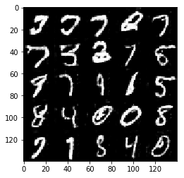


    Epoch 5/10... Discriminator Loss: 0.4171... Generator Loss: 1.4354
    Epoch 5/10... Discriminator Loss: 0.3754... Generator Loss: 1.4349
    Epoch 5/10... Discriminator Loss: 0.5533... Generator Loss: 1.2509
    Epoch 5/10... Discriminator Loss: 0.3407... Generator Loss: 1.6378
    Epoch 5/10... Discriminator Loss: 0.1744... Generator Loss: 2.3957
    Epoch 5/10... Discriminator Loss: 0.7874... Generator Loss: 1.0002
    Epoch 5/10... Discriminator Loss: 0.2679... Generator Loss: 1.9743
    Epoch 5/10... Discriminator Loss: 0.3089... Generator Loss: 1.7380
    Epoch 5/10... Discriminator Loss: 0.4800... Generator Loss: 1.5340
    Epoch 5/10... Discriminator Loss: 0.3594... Generator Loss: 1.8487


    Epoch 5/10... Discriminator Loss: 0.3158... Generator Loss: 1.7410
    Epoch 5/10... Discriminator Loss: 0.4712... Generator Loss: 1.5009
    Epoch 5/10... Discriminator Loss: 0.6930... Generator Loss: 0.9966
    Epoch 5/10... Discriminator Loss: 0.3391... Generator Loss: 1.6672
    Epoch 5/10... Discriminator Loss: 0.2418... Generator Loss: 2.3811
    Epoch 5/10... Discriminator Loss: 0.2314... Generator Loss: 2.3007
    Epoch 5/10... Discriminator Loss: 0.7356... Generator Loss: 0.9724
    Epoch 5/10... Discriminator Loss: 0.2301... Generator Loss: 2.0796
    Epoch 5/10... Discriminator Loss: 0.3328... Generator Loss: 1.7355
    Epoch 5/10... Discriminator Loss: 0.3632... Generator Loss: 1.8571


    Epoch 5/10... Discriminator Loss: 0.7630... Generator Loss: 0.9212
    Epoch 5/10... Discriminator Loss: 0.1955... Generator Loss: 2.6036
    Epoch 5/10... Discriminator Loss: 0.6750... Generator Loss: 1.1342
    Epoch 5/10... Discriminator Loss: 0.6585... Generator Loss: 1.1145
    Epoch 5/10... Discriminator Loss: 1.1876... Generator Loss: 0.8218
    Epoch 5/10... Discriminator Loss: 0.3044... Generator Loss: 1.9547
    Epoch 5/10... Discriminator Loss: 1.5446... Generator Loss: 0.5117
    Epoch 5/10... Discriminator Loss: 0.2516... Generator Loss: 3.2076
    Epoch 5/10... Discriminator Loss: 0.7312... Generator Loss: 1.2368
    Epoch 5/10... Discriminator Loss: 0.6331... Generator Loss: 1.3221


    Epoch 5/10... Discriminator Loss: 0.5811... Generator Loss: 1.4839
    Epoch 5/10... Discriminator Loss: 0.1723... Generator Loss: 2.4834
    Epoch 5/10... Discriminator Loss: 0.9000... Generator Loss: 1.0883
    Epoch 5/10... Discriminator Loss: 0.2073... Generator Loss: 2.3177
    Epoch 5/10... Discriminator Loss: 0.3700... Generator Loss: 4.5140
    Epoch 5/10... Discriminator Loss: 0.1482... Generator Loss: 2.7200
    Epoch 5/10... Discriminator Loss: 0.2206... Generator Loss: 2.3872
    Epoch 5/10... Discriminator Loss: 0.1327... Generator Loss: 3.4187
    Epoch 5/10... Discriminator Loss: 0.2952... Generator Loss: 1.8931
    Epoch 5/10... Discriminator Loss: 0.5348... Generator Loss: 1.7351


    Epoch 5/10... Discriminator Loss: 0.4363... Generator Loss: 1.4308
    Epoch 5/10... Discriminator Loss: 0.0707... Generator Loss: 4.4141
    Epoch 5/10... Discriminator Loss: 0.7470... Generator Loss: 1.0220
    Epoch 5/10... Discriminator Loss: 0.2307... Generator Loss: 2.2234
    Epoch 5/10... Discriminator Loss: 0.1211... Generator Loss: 3.0969
    Epoch 5/10... Discriminator Loss: 0.3534... Generator Loss: 1.7055
    Epoch 5/10... Discriminator Loss: 0.2229... Generator Loss: 2.0117
    Epoch 5/10... Discriminator Loss: 0.0493... Generator Loss: 3.6860
    Epoch 5/10... Discriminator Loss: 0.4673... Generator Loss: 1.2684
    Epoch 5/10... Discriminator Loss: 0.0828... Generator Loss: 3.3360


    Epoch 5/10... Discriminator Loss: 0.5449... Generator Loss: 1.2481
    Epoch 5/10... Discriminator Loss: 0.0441... Generator Loss: 3.9845
    Epoch 5/10... Discriminator Loss: 0.3491... Generator Loss: 1.9548
    Epoch 5/10... Discriminator Loss: 1.0847... Generator Loss: 7.1747
    Epoch 5/10... Discriminator Loss: 0.1490... Generator Loss: 3.8740
    Epoch 5/10... Discriminator Loss: 1.0917... Generator Loss: 5.9483
    Epoch 5/10... Discriminator Loss: 0.4934... Generator Loss: 1.4289
    Epoch 5/10... Discriminator Loss: 0.1070... Generator Loss: 3.8960
    Epoch 5/10... Discriminator Loss: 0.8560... Generator Loss: 1.1888
    Epoch 5/10... Discriminator Loss: 0.3297... Generator Loss: 1.9923


    Epoch 5/10... Discriminator Loss: 0.6885... Generator Loss: 0.9466
    Epoch 5/10... Discriminator Loss: 0.0675... Generator Loss: 3.6547
    Epoch 5/10... Discriminator Loss: 3.5801... Generator Loss: 0.0623
    Epoch 5/10... Discriminator Loss: 0.3704... Generator Loss: 2.0265
    Epoch 5/10... Discriminator Loss: 0.6190... Generator Loss: 2.0009
    Epoch 5/10... Discriminator Loss: 0.9395... Generator Loss: 0.7328
    Epoch 5/10... Discriminator Loss: 0.6000... Generator Loss: 1.2906
    Epoch 5/10... Discriminator Loss: 0.6116... Generator Loss: 1.1288
    Epoch 5/10... Discriminator Loss: 0.1530... Generator Loss: 2.7170
    Epoch 5/10... Discriminator Loss: 0.3423... Generator Loss: 1.6801


    Epoch 5/10... Discriminator Loss: 0.0824... Generator Loss: 4.1627
    Epoch 5/10... Discriminator Loss: 0.4746... Generator Loss: 1.3281
    Epoch 5/10... Discriminator Loss: 0.3301... Generator Loss: 1.6635
    Epoch 5/10... Discriminator Loss: 1.1603... Generator Loss: 0.5697
    Epoch 5/10... Discriminator Loss: 0.2258... Generator Loss: 2.0693
    Epoch 5/10... Discriminator Loss: 0.2475... Generator Loss: 2.3291
    Epoch 5/10... Discriminator Loss: 0.4374... Generator Loss: 1.4963
    Epoch 5/10... Discriminator Loss: 0.3315... Generator Loss: 1.5977
    Epoch 5/10... Discriminator Loss: 0.4470... Generator Loss: 1.3362
    Epoch 5/10... Discriminator Loss: 0.1467... Generator Loss: 2.6818


    Epoch 5/10... Discriminator Loss: 0.4401... Generator Loss: 1.3649
    Epoch 5/10... Discriminator Loss: 0.1417... Generator Loss: 2.6993
    Epoch 5/10... Discriminator Loss: 0.3481... Generator Loss: 1.5516
    Epoch 5/10... Discriminator Loss: 0.2787... Generator Loss: 1.7470
    Epoch 5/10... Discriminator Loss: 0.2643... Generator Loss: 1.9321
    Epoch 5/10... Discriminator Loss: 0.4877... Generator Loss: 1.3621
    Epoch 5/10... Discriminator Loss: 1.7666... Generator Loss: 7.7708
    Epoch 5/10... Discriminator Loss: 1.8320... Generator Loss: 8.2154
    Epoch 5/10... Discriminator Loss: 0.4709... Generator Loss: 1.3377
    Epoch 5/10... Discriminator Loss: 0.4505... Generator Loss: 2.0841


    Epoch 5/10... Discriminator Loss: 0.4030... Generator Loss: 1.6235
    Epoch 5/10... Discriminator Loss: 0.1219... Generator Loss: 4.3195
    Epoch 5/10... Discriminator Loss: 0.4624... Generator Loss: 1.6964
    Epoch 5/10... Discriminator Loss: 0.4133... Generator Loss: 1.6939
    Epoch 5/10... Discriminator Loss: 0.8032... Generator Loss: 0.9785
    Epoch 5/10... Discriminator Loss: 0.2611... Generator Loss: 2.3165
    Epoch 5/10... Discriminator Loss: 0.3249... Generator Loss: 2.3820
    Epoch 5/10... Discriminator Loss: 0.0313... Generator Loss: 5.4163
    Epoch 5/10... Discriminator Loss: 0.3263... Generator Loss: 2.0015
    Epoch 5/10... Discriminator Loss: 0.3761... Generator Loss: 1.8021


    Epoch 5/10... Discriminator Loss: 0.7056... Generator Loss: 0.9006
    Epoch 5/10... Discriminator Loss: 0.3281... Generator Loss: 1.9023
    Epoch 5/10... Discriminator Loss: 0.9551... Generator Loss: 0.7970
    Epoch 5/10... Discriminator Loss: 0.2243... Generator Loss: 2.2567
    Epoch 5/10... Discriminator Loss: 0.6022... Generator Loss: 1.2499
    Epoch 5/10... Discriminator Loss: 0.2991... Generator Loss: 1.9963
    Epoch 5/10... Discriminator Loss: 0.2559... Generator Loss: 1.9266
    Epoch 5/10... Discriminator Loss: 0.4179... Generator Loss: 1.4754
    Epoch 5/10... Discriminator Loss: 0.0820... Generator Loss: 3.2163
    Epoch 5/10... Discriminator Loss: 0.5826... Generator Loss: 1.1414


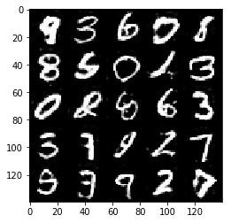


    Epoch 5/10... Discriminator Loss: 0.8050... Generator Loss: 0.9158
    Epoch 5/10... Discriminator Loss: 0.5137... Generator Loss: 1.2551
    Epoch 5/10... Discriminator Loss: 0.4233... Generator Loss: 1.5536
    Epoch 5/10... Discriminator Loss: 0.6716... Generator Loss: 1.0514
    Epoch 5/10... Discriminator Loss: 0.1905... Generator Loss: 2.2093
    Epoch 5/10... Discriminator Loss: 0.3565... Generator Loss: 1.7244
    Epoch 5/10... Discriminator Loss: 0.2393... Generator Loss: 2.1746
    Epoch 5/10... Discriminator Loss: 0.2443... Generator Loss: 2.1667
    Epoch 5/10... Discriminator Loss: 0.1694... Generator Loss: 2.3276
    Epoch 5/10... Discriminator Loss: 0.2025... Generator Loss: 2.7031


    Epoch 5/10... Discriminator Loss: 0.0526... Generator Loss: 3.8873
    Epoch 5/10... Discriminator Loss: 0.3618... Generator Loss: 1.8124
    Epoch 5/10... Discriminator Loss: 0.0985... Generator Loss: 3.1514
    Epoch 5/10... Discriminator Loss: 0.2395... Generator Loss: 2.5967
    Epoch 5/10... Discriminator Loss: 0.7247... Generator Loss: 0.9698
    Epoch 5/10... Discriminator Loss: 0.5217... Generator Loss: 1.6109
    Epoch 5/10... Discriminator Loss: 0.3035... Generator Loss: 1.9389
    Epoch 5/10... Discriminator Loss: 0.2344... Generator Loss: 2.2962
    Epoch 5/10... Discriminator Loss: 0.7511... Generator Loss: 0.9130
    Epoch 5/10... Discriminator Loss: 0.3494... Generator Loss: 1.8768


    Epoch 5/10... Discriminator Loss: 0.0607... Generator Loss: 3.8790
    Epoch 5/10... Discriminator Loss: 0.1914... Generator Loss: 2.4259
    Epoch 5/10... Discriminator Loss: 0.2214... Generator Loss: 2.3439
    Epoch 5/10... Discriminator Loss: 0.2576... Generator Loss: 2.2087
    Epoch 5/10... Discriminator Loss: 0.5498... Generator Loss: 1.7892
    Epoch 5/10... Discriminator Loss: 0.1857... Generator Loss: 3.4755
    Epoch 5/10... Discriminator Loss: 0.8039... Generator Loss: 2.0021
    Epoch 6/10... Discriminator Loss: 0.7950... Generator Loss: 1.3458
    Epoch 6/10... Discriminator Loss: 0.2909... Generator Loss: 3.9006
    Epoch 6/10... Discriminator Loss: 0.9430... Generator Loss: 1.1788


    Epoch 6/10... Discriminator Loss: 0.3532... Generator Loss: 1.8832
    Epoch 6/10... Discriminator Loss: 0.3946... Generator Loss: 1.4900
    Epoch 6/10... Discriminator Loss: 0.3271... Generator Loss: 1.6637
    Epoch 6/10... Discriminator Loss: 0.2176... Generator Loss: 2.5533
    Epoch 6/10... Discriminator Loss: 0.4976... Generator Loss: 1.6464
    Epoch 6/10... Discriminator Loss: 0.2611... Generator Loss: 1.8717
    Epoch 6/10... Discriminator Loss: 1.4932... Generator Loss: 0.7001
    Epoch 6/10... Discriminator Loss: 0.3358... Generator Loss: 2.0745
    Epoch 6/10... Discriminator Loss: 0.1884... Generator Loss: 3.7122
    Epoch 6/10... Discriminator Loss: 0.2223... Generator Loss: 4.0242


    Epoch 6/10... Discriminator Loss: 0.2709... Generator Loss: 2.3783
    Epoch 6/10... Discriminator Loss: 0.8289... Generator Loss: 1.0343
    Epoch 6/10... Discriminator Loss: 0.3023... Generator Loss: 2.3624
    Epoch 6/10... Discriminator Loss: 0.2425... Generator Loss: 3.5083
    Epoch 6/10... Discriminator Loss: 0.1637... Generator Loss: 2.9848
    Epoch 6/10... Discriminator Loss: 0.4696... Generator Loss: 1.2796
    Epoch 6/10... Discriminator Loss: 0.3505... Generator Loss: 1.8635
    Epoch 6/10... Discriminator Loss: 0.2324... Generator Loss: 2.6153
    Epoch 6/10... Discriminator Loss: 0.3752... Generator Loss: 1.5716
    Epoch 6/10... Discriminator Loss: 0.6653... Generator Loss: 1.0770


    Epoch 6/10... Discriminator Loss: 0.5664... Generator Loss: 1.2169
    Epoch 6/10... Discriminator Loss: 0.0586... Generator Loss: 4.4625
    Epoch 6/10... Discriminator Loss: 0.9279... Generator Loss: 0.7836
    Epoch 6/10... Discriminator Loss: 0.4431... Generator Loss: 1.6225
    Epoch 6/10... Discriminator Loss: 0.1313... Generator Loss: 2.7524
    Epoch 6/10... Discriminator Loss: 2.5294... Generator Loss: 6.5249
    Epoch 6/10... Discriminator Loss: 0.2277... Generator Loss: 4.7286
    Epoch 6/10... Discriminator Loss: 1.0179... Generator Loss: 0.6826
    Epoch 6/10... Discriminator Loss: 0.1327... Generator Loss: 2.7748
    Epoch 6/10... Discriminator Loss: 0.4998... Generator Loss: 1.3761


    Epoch 6/10... Discriminator Loss: 0.1000... Generator Loss: 3.7188
    Epoch 6/10... Discriminator Loss: 5.9838... Generator Loss: 13.6642
    Epoch 6/10... Discriminator Loss: 1.3222... Generator Loss: 1.0138
    Epoch 6/10... Discriminator Loss: 0.1498... Generator Loss: 3.5797
    Epoch 6/10... Discriminator Loss: 0.6628... Generator Loss: 0.9725
    Epoch 6/10... Discriminator Loss: 0.2741... Generator Loss: 2.2284
    Epoch 6/10... Discriminator Loss: 0.1892... Generator Loss: 2.5472
    Epoch 6/10... Discriminator Loss: 0.3303... Generator Loss: 1.8205
    Epoch 6/10... Discriminator Loss: 0.2708... Generator Loss: 2.2318
    Epoch 6/10... Discriminator Loss: 0.3009... Generator Loss: 2.0386


    Epoch 6/10... Discriminator Loss: 0.1707... Generator Loss: 2.7763
    Epoch 6/10... Discriminator Loss: 0.7048... Generator Loss: 1.2536
    Epoch 6/10... Discriminator Loss: 0.6026... Generator Loss: 1.2432
    Epoch 6/10... Discriminator Loss: 0.1751... Generator Loss: 2.2637
    Epoch 6/10... Discriminator Loss: 0.3390... Generator Loss: 1.8015
    Epoch 6/10... Discriminator Loss: 0.4155... Generator Loss: 1.5911
    Epoch 6/10... Discriminator Loss: 0.3465... Generator Loss: 1.9266
    Epoch 6/10... Discriminator Loss: 0.1479... Generator Loss: 3.0077
    Epoch 6/10... Discriminator Loss: 0.4588... Generator Loss: 1.8088
    Epoch 6/10... Discriminator Loss: 0.3636... Generator Loss: 2.0144


    Epoch 6/10... Discriminator Loss: 1.3577... Generator Loss: 0.4440
    Epoch 6/10... Discriminator Loss: 0.2026... Generator Loss: 2.4199
    Epoch 6/10... Discriminator Loss: 0.0790... Generator Loss: 3.6576
    Epoch 6/10... Discriminator Loss: 0.5620... Generator Loss: 1.2553
    Epoch 6/10... Discriminator Loss: 0.1582... Generator Loss: 2.7101
    Epoch 6/10... Discriminator Loss: 0.1114... Generator Loss: 3.2002
    Epoch 6/10... Discriminator Loss: 0.3813... Generator Loss: 1.9199
    Epoch 6/10... Discriminator Loss: 0.5138... Generator Loss: 1.5025
    Epoch 6/10... Discriminator Loss: 0.2538... Generator Loss: 2.2289
    Epoch 6/10... Discriminator Loss: 0.1535... Generator Loss: 2.8861


    Epoch 6/10... Discriminator Loss: 0.5741... Generator Loss: 1.4535
    Epoch 6/10... Discriminator Loss: 0.1899... Generator Loss: 2.5680
    Epoch 6/10... Discriminator Loss: 0.6614... Generator Loss: 1.1535
    Epoch 6/10... Discriminator Loss: 0.1286... Generator Loss: 2.8905
    Epoch 6/10... Discriminator Loss: 0.4148... Generator Loss: 1.6600
    Epoch 6/10... Discriminator Loss: 0.0739... Generator Loss: 3.2002
    Epoch 6/10... Discriminator Loss: 0.1071... Generator Loss: 3.3454
    Epoch 6/10... Discriminator Loss: 0.2532... Generator Loss: 2.2383
    Epoch 6/10... Discriminator Loss: 0.3939... Generator Loss: 1.3716
    Epoch 6/10... Discriminator Loss: 0.3093... Generator Loss: 1.8232


    Epoch 6/10... Discriminator Loss: 0.7059... Generator Loss: 1.0854
    Epoch 6/10... Discriminator Loss: 0.0873... Generator Loss: 4.6238
    Epoch 6/10... Discriminator Loss: 0.1749... Generator Loss: 3.0532
    Epoch 6/10... Discriminator Loss: 0.3182... Generator Loss: 2.0192
    Epoch 6/10... Discriminator Loss: 0.5954... Generator Loss: 1.4649
    Epoch 6/10... Discriminator Loss: 0.4556... Generator Loss: 1.7712
    Epoch 6/10... Discriminator Loss: 0.3322... Generator Loss: 1.8906
    Epoch 6/10... Discriminator Loss: 1.7322... Generator Loss: 0.5040
    Epoch 6/10... Discriminator Loss: 0.4144... Generator Loss: 1.6030
    Epoch 6/10... Discriminator Loss: 0.3342... Generator Loss: 2.0352


    Epoch 6/10... Discriminator Loss: 0.4452... Generator Loss: 1.6509
    Epoch 6/10... Discriminator Loss: 1.2580... Generator Loss: 0.6634
    Epoch 6/10... Discriminator Loss: 0.7829... Generator Loss: 1.0356
    Epoch 6/10... Discriminator Loss: 0.0702... Generator Loss: 3.2576
    Epoch 6/10... Discriminator Loss: 0.5376... Generator Loss: 1.2704
    Epoch 6/10... Discriminator Loss: 0.6149... Generator Loss: 1.2022
    Epoch 6/10... Discriminator Loss: 0.3966... Generator Loss: 1.6443
    Epoch 6/10... Discriminator Loss: 0.0798... Generator Loss: 3.7142
    Epoch 6/10... Discriminator Loss: 0.6693... Generator Loss: 0.9882
    Epoch 6/10... Discriminator Loss: 0.7191... Generator Loss: 1.0605


    Epoch 6/10... Discriminator Loss: 0.9085... Generator Loss: 0.8588
    Epoch 6/10... Discriminator Loss: 0.5232... Generator Loss: 1.5493
    Epoch 6/10... Discriminator Loss: 0.0437... Generator Loss: 3.7028
    Epoch 6/10... Discriminator Loss: 0.5156... Generator Loss: 2.0344
    Epoch 6/10... Discriminator Loss: 0.2975... Generator Loss: 1.8705
    Epoch 6/10... Discriminator Loss: 0.3508... Generator Loss: 3.5365
    Epoch 6/10... Discriminator Loss: 1.0136... Generator Loss: 4.8415
    Epoch 6/10... Discriminator Loss: 0.1575... Generator Loss: 3.9773
    Epoch 6/10... Discriminator Loss: 0.3560... Generator Loss: 3.6519
    Epoch 6/10... Discriminator Loss: 0.3793... Generator Loss: 1.9063


    Epoch 6/10... Discriminator Loss: 0.2150... Generator Loss: 2.3711
    Epoch 6/10... Discriminator Loss: 0.2809... Generator Loss: 1.8554
    Epoch 6/10... Discriminator Loss: 0.1614... Generator Loss: 5.3980
    Epoch 6/10... Discriminator Loss: 0.2900... Generator Loss: 2.1631
    Epoch 6/10... Discriminator Loss: 0.2106... Generator Loss: 2.2038
    Epoch 6/10... Discriminator Loss: 0.2642... Generator Loss: 2.1920
    Epoch 6/10... Discriminator Loss: 0.4718... Generator Loss: 1.4433
    Epoch 6/10... Discriminator Loss: 0.4188... Generator Loss: 1.3901
    Epoch 6/10... Discriminator Loss: 0.3984... Generator Loss: 1.8376
    Epoch 6/10... Discriminator Loss: 0.1575... Generator Loss: 2.5885


    Epoch 6/10... Discriminator Loss: 0.4536... Generator Loss: 1.3460
    Epoch 6/10... Discriminator Loss: 0.1795... Generator Loss: 2.7575
    Epoch 6/10... Discriminator Loss: 0.1338... Generator Loss: 2.5173
    Epoch 6/10... Discriminator Loss: 0.5986... Generator Loss: 1.1727
    Epoch 6/10... Discriminator Loss: 1.2729... Generator Loss: 0.4797
    Epoch 6/10... Discriminator Loss: 0.7643... Generator Loss: 1.1356
    Epoch 6/10... Discriminator Loss: 0.4604... Generator Loss: 1.3567
    Epoch 6/10... Discriminator Loss: 0.2651... Generator Loss: 2.2367
    Epoch 6/10... Discriminator Loss: 0.6094... Generator Loss: 1.3663
    Epoch 6/10... Discriminator Loss: 0.2889... Generator Loss: 2.1672


    Epoch 6/10... Discriminator Loss: 0.3759... Generator Loss: 1.6262
    Epoch 6/10... Discriminator Loss: 0.5257... Generator Loss: 4.5438
    Epoch 6/10... Discriminator Loss: 1.5429... Generator Loss: 8.6777
    Epoch 6/10... Discriminator Loss: 0.2717... Generator Loss: 1.9631
    Epoch 6/10... Discriminator Loss: 0.8066... Generator Loss: 0.9255
    Epoch 6/10... Discriminator Loss: 0.5741... Generator Loss: 1.6452
    Epoch 6/10... Discriminator Loss: 0.5042... Generator Loss: 1.8860
    Epoch 6/10... Discriminator Loss: 0.2111... Generator Loss: 2.7856
    Epoch 6/10... Discriminator Loss: 1.9741... Generator Loss: 0.4736
    Epoch 6/10... Discriminator Loss: 0.1105... Generator Loss: 3.3498


    Epoch 6/10... Discriminator Loss: 0.5048... Generator Loss: 1.4039
    Epoch 6/10... Discriminator Loss: 0.5645... Generator Loss: 1.5647
    Epoch 6/10... Discriminator Loss: 0.3622... Generator Loss: 1.8820
    Epoch 6/10... Discriminator Loss: 0.4996... Generator Loss: 1.4125
    Epoch 6/10... Discriminator Loss: 0.2271... Generator Loss: 2.2683
    Epoch 6/10... Discriminator Loss: 0.2490... Generator Loss: 1.9042
    Epoch 6/10... Discriminator Loss: 0.2974... Generator Loss: 1.9339
    Epoch 6/10... Discriminator Loss: 0.3949... Generator Loss: 1.5148
    Epoch 6/10... Discriminator Loss: 0.1468... Generator Loss: 2.5534
    Epoch 6/10... Discriminator Loss: 0.2622... Generator Loss: 2.1823


    Epoch 6/10... Discriminator Loss: 0.1546... Generator Loss: 2.6603
    Epoch 6/10... Discriminator Loss: 0.3057... Generator Loss: 1.8167
    Epoch 6/10... Discriminator Loss: 0.4058... Generator Loss: 1.4636
    Epoch 6/10... Discriminator Loss: 0.1579... Generator Loss: 2.4368
    Epoch 6/10... Discriminator Loss: 0.4158... Generator Loss: 1.6163
    Epoch 6/10... Discriminator Loss: 0.1902... Generator Loss: 2.3709
    Epoch 6/10... Discriminator Loss: 0.1237... Generator Loss: 2.8336
    Epoch 6/10... Discriminator Loss: 0.0987... Generator Loss: 3.0095
    Epoch 6/10... Discriminator Loss: 0.1901... Generator Loss: 2.4177
    Epoch 6/10... Discriminator Loss: 0.4768... Generator Loss: 1.4982


    Epoch 6/10... Discriminator Loss: 0.1011... Generator Loss: 3.2028
    Epoch 6/10... Discriminator Loss: 0.2781... Generator Loss: 2.0818
    Epoch 6/10... Discriminator Loss: 0.3277... Generator Loss: 1.6668
    Epoch 6/10... Discriminator Loss: 0.4400... Generator Loss: 1.9652
    Epoch 6/10... Discriminator Loss: 0.4703... Generator Loss: 1.3309
    Epoch 6/10... Discriminator Loss: 1.5864... Generator Loss: 7.8141
    Epoch 6/10... Discriminator Loss: 2.1827... Generator Loss: 8.1597
    Epoch 6/10... Discriminator Loss: 0.2055... Generator Loss: 3.1508
    Epoch 6/10... Discriminator Loss: 0.1874... Generator Loss: 3.8856
    Epoch 6/10... Discriminator Loss: 0.1325... Generator Loss: 4.5394


    Epoch 6/10... Discriminator Loss: 0.1352... Generator Loss: 3.3045
    Epoch 6/10... Discriminator Loss: 0.5065... Generator Loss: 1.3770
    Epoch 6/10... Discriminator Loss: 0.5861... Generator Loss: 1.4491
    Epoch 6/10... Discriminator Loss: 0.7884... Generator Loss: 1.0689
    Epoch 6/10... Discriminator Loss: 1.0987... Generator Loss: 0.5749
    Epoch 6/10... Discriminator Loss: 0.2537... Generator Loss: 2.1475
    Epoch 6/10... Discriminator Loss: 0.4514... Generator Loss: 1.6133
    Epoch 6/10... Discriminator Loss: 0.3146... Generator Loss: 1.7618
    Epoch 6/10... Discriminator Loss: 0.4841... Generator Loss: 1.3898
    Epoch 6/10... Discriminator Loss: 0.3111... Generator Loss: 1.7993


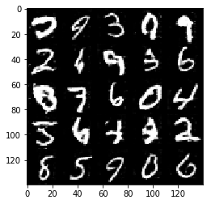


    Epoch 6/10... Discriminator Loss: 0.4840... Generator Loss: 1.4769
    Epoch 6/10... Discriminator Loss: 0.5525... Generator Loss: 1.3812
    Epoch 6/10... Discriminator Loss: 0.7297... Generator Loss: 0.9793
    Epoch 6/10... Discriminator Loss: 0.6238... Generator Loss: 1.2917
    Epoch 6/10... Discriminator Loss: 1.0044... Generator Loss: 0.6126
    Epoch 6/10... Discriminator Loss: 0.2225... Generator Loss: 2.4664
    Epoch 6/10... Discriminator Loss: 2.0376... Generator Loss: 0.4035
    Epoch 6/10... Discriminator Loss: 0.0869... Generator Loss: 4.6293
    Epoch 6/10... Discriminator Loss: 2.0694... Generator Loss: 0.7837
    Epoch 6/10... Discriminator Loss: 0.6864... Generator Loss: 1.2292


    Epoch 6/10... Discriminator Loss: 0.5988... Generator Loss: 5.5776
    Epoch 6/10... Discriminator Loss: 0.4585... Generator Loss: 1.5752
    Epoch 6/10... Discriminator Loss: 0.1281... Generator Loss: 3.2755
    Epoch 6/10... Discriminator Loss: 0.2648... Generator Loss: 1.8226
    Epoch 6/10... Discriminator Loss: 0.2117... Generator Loss: 2.4561
    Epoch 7/10... Discriminator Loss: 0.5659... Generator Loss: 1.2727
    Epoch 7/10... Discriminator Loss: 0.6317... Generator Loss: 1.1523
    Epoch 7/10... Discriminator Loss: 0.4702... Generator Loss: 1.4624
    Epoch 7/10... Discriminator Loss: 0.2742... Generator Loss: 2.0385
    Epoch 7/10... Discriminator Loss: 0.4699... Generator Loss: 1.3993


    Epoch 7/10... Discriminator Loss: 0.3036... Generator Loss: 1.8246
    Epoch 7/10... Discriminator Loss: 0.1042... Generator Loss: 3.0151
    Epoch 7/10... Discriminator Loss: 0.2952... Generator Loss: 1.9340
    Epoch 7/10... Discriminator Loss: 0.8215... Generator Loss: 1.1877
    Epoch 7/10... Discriminator Loss: 0.3085... Generator Loss: 1.6923
    Epoch 7/10... Discriminator Loss: 0.1347... Generator Loss: 2.7452
    Epoch 7/10... Discriminator Loss: 0.3711... Generator Loss: 1.8511
    Epoch 7/10... Discriminator Loss: 0.3386... Generator Loss: 1.9587
    Epoch 7/10... Discriminator Loss: 0.4513... Generator Loss: 1.6636
    Epoch 7/10... Discriminator Loss: 0.0711... Generator Loss: 3.2169


    Epoch 7/10... Discriminator Loss: 0.3225... Generator Loss: 1.8398
    Epoch 7/10... Discriminator Loss: 0.4845... Generator Loss: 1.2909
    Epoch 7/10... Discriminator Loss: 0.4588... Generator Loss: 1.7476
    Epoch 7/10... Discriminator Loss: 0.5033... Generator Loss: 1.5230
    Epoch 7/10... Discriminator Loss: 0.5124... Generator Loss: 1.4469
    Epoch 7/10... Discriminator Loss: 0.2151... Generator Loss: 2.2638
    Epoch 7/10... Discriminator Loss: 0.0702... Generator Loss: 3.5923
    Epoch 7/10... Discriminator Loss: 1.0051... Generator Loss: 0.7399
    Epoch 7/10... Discriminator Loss: 0.5257... Generator Loss: 1.2619
    Epoch 7/10... Discriminator Loss: 0.2820... Generator Loss: 2.1326


    Epoch 7/10... Discriminator Loss: 0.2609... Generator Loss: 2.1071
    Epoch 7/10... Discriminator Loss: 0.1145... Generator Loss: 3.0366
    Epoch 7/10... Discriminator Loss: 0.0885... Generator Loss: 3.3457
    Epoch 7/10... Discriminator Loss: 0.4660... Generator Loss: 1.5928
    Epoch 7/10... Discriminator Loss: 0.6420... Generator Loss: 1.2089
    Epoch 7/10... Discriminator Loss: 0.4915... Generator Loss: 1.3445
    Epoch 7/10... Discriminator Loss: 0.2320... Generator Loss: 2.2359
    Epoch 7/10... Discriminator Loss: 0.1574... Generator Loss: 2.4051
    Epoch 7/10... Discriminator Loss: 2.0044... Generator Loss: 8.0471
    Epoch 7/10... Discriminator Loss: 1.4283... Generator Loss: 0.7542


    Epoch 7/10... Discriminator Loss: 0.4477... Generator Loss: 1.6492
    Epoch 7/10... Discriminator Loss: 1.6658... Generator Loss: 0.3810
    Epoch 7/10... Discriminator Loss: 0.8518... Generator Loss: 0.9683
    Epoch 7/10... Discriminator Loss: 0.1160... Generator Loss: 2.6823
    Epoch 7/10... Discriminator Loss: 0.4762... Generator Loss: 1.4561
    Epoch 7/10... Discriminator Loss: 0.0356... Generator Loss: 5.3850
    Epoch 7/10... Discriminator Loss: 0.4666... Generator Loss: 1.6880
    Epoch 7/10... Discriminator Loss: 0.6231... Generator Loss: 4.1972
    Epoch 7/10... Discriminator Loss: 0.2191... Generator Loss: 2.5273
    Epoch 7/10... Discriminator Loss: 0.5370... Generator Loss: 1.9074


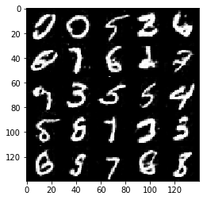


    Epoch 7/10... Discriminator Loss: 0.7736... Generator Loss: 1.3004
    Epoch 7/10... Discriminator Loss: 0.4222... Generator Loss: 2.0781
    Epoch 7/10... Discriminator Loss: 0.2748... Generator Loss: 1.9111
    Epoch 7/10... Discriminator Loss: 0.1754... Generator Loss: 2.3711
    Epoch 7/10... Discriminator Loss: 0.2134... Generator Loss: 2.2996
    Epoch 7/10... Discriminator Loss: 0.5075... Generator Loss: 1.1867
    Epoch 7/10... Discriminator Loss: 0.8785... Generator Loss: 0.9008
    Epoch 7/10... Discriminator Loss: 0.2420... Generator Loss: 2.5680
    Epoch 7/10... Discriminator Loss: 0.3899... Generator Loss: 1.8419
    Epoch 7/10... Discriminator Loss: 0.3733... Generator Loss: 1.6288


    Epoch 7/10... Discriminator Loss: 0.4160... Generator Loss: 1.7473
    Epoch 7/10... Discriminator Loss: 0.3177... Generator Loss: 1.7911
    Epoch 7/10... Discriminator Loss: 0.7221... Generator Loss: 0.9941
    Epoch 7/10... Discriminator Loss: 0.4810... Generator Loss: 1.5115
    Epoch 7/10... Discriminator Loss: 0.3031... Generator Loss: 1.6316
    Epoch 7/10... Discriminator Loss: 0.7241... Generator Loss: 1.0135
    Epoch 7/10... Discriminator Loss: 0.1828... Generator Loss: 2.5276
    Epoch 7/10... Discriminator Loss: 0.4288... Generator Loss: 1.6620
    Epoch 7/10... Discriminator Loss: 0.5349... Generator Loss: 1.1849
    Epoch 7/10... Discriminator Loss: 0.1003... Generator Loss: 3.1326


    Epoch 7/10... Discriminator Loss: 0.6973... Generator Loss: 0.9978
    Epoch 7/10... Discriminator Loss: 0.4965... Generator Loss: 1.4052
    Epoch 7/10... Discriminator Loss: 0.6264... Generator Loss: 1.0962
    Epoch 7/10... Discriminator Loss: 0.2219... Generator Loss: 2.2628
    Epoch 7/10... Discriminator Loss: 0.2535... Generator Loss: 2.1185
    Epoch 7/10... Discriminator Loss: 1.0094... Generator Loss: 0.7551
    Epoch 7/10... Discriminator Loss: 0.6933... Generator Loss: 4.2462
    Epoch 7/10... Discriminator Loss: 3.4437... Generator Loss: 0.1013
    Epoch 7/10... Discriminator Loss: 0.2514... Generator Loss: 2.8569
    Epoch 7/10... Discriminator Loss: 0.5341... Generator Loss: 1.4276


    Epoch 7/10... Discriminator Loss: 0.3197... Generator Loss: 2.0574
    Epoch 7/10... Discriminator Loss: 0.2143... Generator Loss: 4.3146
    Epoch 7/10... Discriminator Loss: 0.2637... Generator Loss: 2.0596
    Epoch 7/10... Discriminator Loss: 0.3705... Generator Loss: 1.6125
    Epoch 7/10... Discriminator Loss: 0.2175... Generator Loss: 2.2953
    Epoch 7/10... Discriminator Loss: 0.6163... Generator Loss: 1.2774
    Epoch 7/10... Discriminator Loss: 0.4048... Generator Loss: 1.5603
    Epoch 7/10... Discriminator Loss: 0.6087... Generator Loss: 1.4286
    Epoch 7/10... Discriminator Loss: 1.5214... Generator Loss: 0.4330
    Epoch 7/10... Discriminator Loss: 0.4638... Generator Loss: 1.9789


    Epoch 7/10... Discriminator Loss: 0.1368... Generator Loss: 2.8347
    Epoch 7/10... Discriminator Loss: 0.4299... Generator Loss: 1.7575
    Epoch 7/10... Discriminator Loss: 0.2886... Generator Loss: 1.9773
    Epoch 7/10... Discriminator Loss: 0.2318... Generator Loss: 2.2733
    Epoch 7/10... Discriminator Loss: 0.2551... Generator Loss: 1.9174
    Epoch 7/10... Discriminator Loss: 0.7019... Generator Loss: 1.1323
    Epoch 7/10... Discriminator Loss: 0.4526... Generator Loss: 5.7685
    Epoch 7/10... Discriminator Loss: 0.6670... Generator Loss: 1.6660
    Epoch 7/10... Discriminator Loss: 0.2414... Generator Loss: 5.6092
    Epoch 7/10... Discriminator Loss: 0.4890... Generator Loss: 1.7907


    Epoch 7/10... Discriminator Loss: 0.6218... Generator Loss: 1.0926
    Epoch 7/10... Discriminator Loss: 0.6014... Generator Loss: 1.0981
    Epoch 7/10... Discriminator Loss: 0.6417... Generator Loss: 0.9983
    Epoch 7/10... Discriminator Loss: 0.3775... Generator Loss: 1.6128
    Epoch 7/10... Discriminator Loss: 0.2970... Generator Loss: 1.7834
    Epoch 7/10... Discriminator Loss: 0.5059... Generator Loss: 1.2937
    Epoch 7/10... Discriminator Loss: 1.0038... Generator Loss: 0.7953
    Epoch 7/10... Discriminator Loss: 0.5908... Generator Loss: 1.2711
    Epoch 7/10... Discriminator Loss: 0.7267... Generator Loss: 1.0771
    Epoch 7/10... Discriminator Loss: 0.3274... Generator Loss: 1.7193


    Epoch 7/10... Discriminator Loss: 1.2064... Generator Loss: 0.5761
    Epoch 7/10... Discriminator Loss: 0.3051... Generator Loss: 1.7358
    Epoch 7/10... Discriminator Loss: 0.7540... Generator Loss: 0.9956
    Epoch 7/10... Discriminator Loss: 0.4198... Generator Loss: 1.5313
    Epoch 7/10... Discriminator Loss: 0.3104... Generator Loss: 1.8724
    Epoch 7/10... Discriminator Loss: 0.3509... Generator Loss: 1.5000
    Epoch 7/10... Discriminator Loss: 0.2060... Generator Loss: 2.4392
    Epoch 7/10... Discriminator Loss: 0.4891... Generator Loss: 1.4632
    Epoch 7/10... Discriminator Loss: 0.3409... Generator Loss: 1.6767
    Epoch 7/10... Discriminator Loss: 0.1019... Generator Loss: 3.0514


    Epoch 7/10... Discriminator Loss: 0.3929... Generator Loss: 1.6630
    Epoch 7/10... Discriminator Loss: 0.5150... Generator Loss: 1.2807
    Epoch 7/10... Discriminator Loss: 0.6866... Generator Loss: 1.7391
    Epoch 7/10... Discriminator Loss: 0.3248... Generator Loss: 4.5559
    Epoch 7/10... Discriminator Loss: 0.1892... Generator Loss: 5.5101
    Epoch 7/10... Discriminator Loss: 0.1259... Generator Loss: 4.0786
    Epoch 7/10... Discriminator Loss: 0.8311... Generator Loss: 1.0683
    Epoch 7/10... Discriminator Loss: 0.5515... Generator Loss: 1.5773
    Epoch 7/10... Discriminator Loss: 0.5559... Generator Loss: 1.1442
    Epoch 7/10... Discriminator Loss: 0.2568... Generator Loss: 2.2670


    Epoch 7/10... Discriminator Loss: 0.2933... Generator Loss: 4.4271
    Epoch 7/10... Discriminator Loss: 0.7502... Generator Loss: 0.9631
    Epoch 7/10... Discriminator Loss: 0.9123... Generator Loss: 0.8043
    Epoch 7/10... Discriminator Loss: 0.1995... Generator Loss: 4.8202
    Epoch 7/10... Discriminator Loss: 0.5713... Generator Loss: 1.3949
    Epoch 7/10... Discriminator Loss: 0.1463... Generator Loss: 5.1327
    Epoch 7/10... Discriminator Loss: 0.2412... Generator Loss: 2.6625
    Epoch 7/10... Discriminator Loss: 0.4257... Generator Loss: 1.6323
    Epoch 7/10... Discriminator Loss: 0.2296... Generator Loss: 2.4004
    Epoch 7/10... Discriminator Loss: 0.1213... Generator Loss: 2.8040


    Epoch 7/10... Discriminator Loss: 0.7715... Generator Loss: 1.0508
    Epoch 7/10... Discriminator Loss: 0.8397... Generator Loss: 0.8931
    Epoch 7/10... Discriminator Loss: 0.1996... Generator Loss: 2.5373
    Epoch 7/10... Discriminator Loss: 0.1007... Generator Loss: 2.9639
    Epoch 7/10... Discriminator Loss: 0.4696... Generator Loss: 1.2804
    Epoch 7/10... Discriminator Loss: 0.5026... Generator Loss: 1.3832
    Epoch 7/10... Discriminator Loss: 0.2780... Generator Loss: 1.9825
    Epoch 7/10... Discriminator Loss: 0.2538... Generator Loss: 1.9400
    Epoch 7/10... Discriminator Loss: 0.0872... Generator Loss: 3.4960
    Epoch 7/10... Discriminator Loss: 0.4679... Generator Loss: 1.3246


    Epoch 7/10... Discriminator Loss: 0.0734... Generator Loss: 3.8134
    Epoch 7/10... Discriminator Loss: 0.3628... Generator Loss: 1.6249
    Epoch 7/10... Discriminator Loss: 0.0301... Generator Loss: 4.4909
    Epoch 7/10... Discriminator Loss: 0.5294... Generator Loss: 1.2212
    Epoch 7/10... Discriminator Loss: 0.9026... Generator Loss: 0.9258
    Epoch 7/10... Discriminator Loss: 0.6143... Generator Loss: 1.2118
    Epoch 7/10... Discriminator Loss: 0.3986... Generator Loss: 1.6557
    Epoch 7/10... Discriminator Loss: 0.4647... Generator Loss: 1.4197
    Epoch 7/10... Discriminator Loss: 0.0779... Generator Loss: 3.4336
    Epoch 7/10... Discriminator Loss: 0.4817... Generator Loss: 1.4222


    Epoch 7/10... Discriminator Loss: 0.4137... Generator Loss: 1.4513
    Epoch 7/10... Discriminator Loss: 0.1912... Generator Loss: 2.4087
    Epoch 7/10... Discriminator Loss: 1.5012... Generator Loss: 0.4636
    Epoch 7/10... Discriminator Loss: 0.0912... Generator Loss: 4.2713
    Epoch 7/10... Discriminator Loss: 0.1017... Generator Loss: 3.0285
    Epoch 7/10... Discriminator Loss: 0.3063... Generator Loss: 3.0585
    Epoch 7/10... Discriminator Loss: 0.2782... Generator Loss: 2.6665
    Epoch 7/10... Discriminator Loss: 0.2044... Generator Loss: 2.6033
    Epoch 7/10... Discriminator Loss: 0.7524... Generator Loss: 0.9836
    Epoch 7/10... Discriminator Loss: 0.5361... Generator Loss: 1.5072


    Epoch 7/10... Discriminator Loss: 0.4458... Generator Loss: 1.5083
    Epoch 7/10... Discriminator Loss: 0.2965... Generator Loss: 1.8966
    Epoch 7/10... Discriminator Loss: 0.2243... Generator Loss: 2.3464
    Epoch 7/10... Discriminator Loss: 0.3131... Generator Loss: 2.0007
    Epoch 7/10... Discriminator Loss: 0.5070... Generator Loss: 1.7167
    Epoch 7/10... Discriminator Loss: 0.0386... Generator Loss: 4.4267
    Epoch 7/10... Discriminator Loss: 0.3993... Generator Loss: 1.6078
    Epoch 7/10... Discriminator Loss: 0.1146... Generator Loss: 2.6182
    Epoch 7/10... Discriminator Loss: 1.1120... Generator Loss: 0.7809
    Epoch 7/10... Discriminator Loss: 0.1092... Generator Loss: 3.3195


    Epoch 7/10... Discriminator Loss: 0.4265... Generator Loss: 1.5257
    Epoch 7/10... Discriminator Loss: 0.2545... Generator Loss: 2.0998
    Epoch 7/10... Discriminator Loss: 0.3166... Generator Loss: 1.7857
    Epoch 7/10... Discriminator Loss: 0.8472... Generator Loss: 0.9312
    Epoch 7/10... Discriminator Loss: 0.3806... Generator Loss: 1.6134
    Epoch 7/10... Discriminator Loss: 0.0886... Generator Loss: 3.1766
    Epoch 7/10... Discriminator Loss: 0.6343... Generator Loss: 1.3950
    Epoch 7/10... Discriminator Loss: 0.4461... Generator Loss: 1.3143
    Epoch 7/10... Discriminator Loss: 0.4041... Generator Loss: 1.8648
    Epoch 7/10... Discriminator Loss: 0.3725... Generator Loss: 1.9226


    Epoch 7/10... Discriminator Loss: 0.5734... Generator Loss: 1.9472
    Epoch 7/10... Discriminator Loss: 0.2715... Generator Loss: 2.4981
    Epoch 8/10... Discriminator Loss: 0.8637... Generator Loss: 1.0258
    Epoch 8/10... Discriminator Loss: 0.4491... Generator Loss: 5.1306
    Epoch 8/10... Discriminator Loss: 5.4533... Generator Loss: 0.0279
    Epoch 8/10... Discriminator Loss: 0.1723... Generator Loss: 4.1025
    Epoch 8/10... Discriminator Loss: 1.1784... Generator Loss: 5.6907
    Epoch 8/10... Discriminator Loss: 0.6270... Generator Loss: 1.3954
    Epoch 8/10... Discriminator Loss: 0.3202... Generator Loss: 2.0509
    Epoch 8/10... Discriminator Loss: 1.2256... Generator Loss: 0.6542


    Epoch 8/10... Discriminator Loss: 1.5351... Generator Loss: 0.5066
    Epoch 8/10... Discriminator Loss: 0.3687... Generator Loss: 1.8460
    Epoch 8/10... Discriminator Loss: 0.3221... Generator Loss: 1.9112
    Epoch 8/10... Discriminator Loss: 0.9266... Generator Loss: 0.9174
    Epoch 8/10... Discriminator Loss: 0.3780... Generator Loss: 1.6636
    Epoch 8/10... Discriminator Loss: 0.3299... Generator Loss: 1.9003
    Epoch 8/10... Discriminator Loss: 0.0798... Generator Loss: 4.3432
    Epoch 8/10... Discriminator Loss: 0.2201... Generator Loss: 2.7083
    Epoch 8/10... Discriminator Loss: 0.3178... Generator Loss: 1.8327
    Epoch 8/10... Discriminator Loss: 0.0743... Generator Loss: 3.5089


    Epoch 8/10... Discriminator Loss: 0.6003... Generator Loss: 1.2751
    Epoch 8/10... Discriminator Loss: 0.2314... Generator Loss: 2.4868
    Epoch 8/10... Discriminator Loss: 0.7670... Generator Loss: 0.9801
    Epoch 8/10... Discriminator Loss: 0.5275... Generator Loss: 1.4337
    Epoch 8/10... Discriminator Loss: 0.5557... Generator Loss: 1.1589
    Epoch 8/10... Discriminator Loss: 0.1480... Generator Loss: 2.5702
    Epoch 8/10... Discriminator Loss: 0.2182... Generator Loss: 3.8106
    Epoch 8/10... Discriminator Loss: 1.7800... Generator Loss: 0.4775
    Epoch 8/10... Discriminator Loss: 0.8729... Generator Loss: 0.8310
    Epoch 8/10... Discriminator Loss: 0.2265... Generator Loss: 2.6866


    Epoch 8/10... Discriminator Loss: 0.6943... Generator Loss: 1.3154
    Epoch 8/10... Discriminator Loss: 0.0880... Generator Loss: 3.8325
    Epoch 8/10... Discriminator Loss: 0.1507... Generator Loss: 2.6843
    Epoch 8/10... Discriminator Loss: 0.2469... Generator Loss: 2.0450
    Epoch 8/10... Discriminator Loss: 0.2690... Generator Loss: 2.3002
    Epoch 8/10... Discriminator Loss: 0.0478... Generator Loss: 6.0993
    Epoch 8/10... Discriminator Loss: 1.7829... Generator Loss: 0.3533
    Epoch 8/10... Discriminator Loss: 0.5409... Generator Loss: 1.4245
    Epoch 8/10... Discriminator Loss: 0.0872... Generator Loss: 4.8116
    Epoch 8/10... Discriminator Loss: 1.8886... Generator Loss: 0.4484


    Epoch 8/10... Discriminator Loss: 0.4767... Generator Loss: 1.3209
    Epoch 8/10... Discriminator Loss: 0.3469... Generator Loss: 1.8215
    Epoch 8/10... Discriminator Loss: 0.7390... Generator Loss: 1.0866
    Epoch 8/10... Discriminator Loss: 0.7409... Generator Loss: 1.0100
    Epoch 8/10... Discriminator Loss: 0.9258... Generator Loss: 1.0280
    Epoch 8/10... Discriminator Loss: 0.4701... Generator Loss: 1.3822
    Epoch 8/10... Discriminator Loss: 0.9633... Generator Loss: 0.7802
    Epoch 8/10... Discriminator Loss: 0.3253... Generator Loss: 2.1030
    Epoch 8/10... Discriminator Loss: 0.0260... Generator Loss: 5.1271
    Epoch 8/10... Discriminator Loss: 0.0751... Generator Loss: 4.4077


    Epoch 8/10... Discriminator Loss: 0.2828... Generator Loss: 2.1563
    Epoch 8/10... Discriminator Loss: 0.1044... Generator Loss: 3.3210
    Epoch 8/10... Discriminator Loss: 0.5501... Generator Loss: 1.3881
    Epoch 8/10... Discriminator Loss: 0.1576... Generator Loss: 2.7023
    Epoch 8/10... Discriminator Loss: 0.3698... Generator Loss: 1.5710
    Epoch 8/10... Discriminator Loss: 0.0377... Generator Loss: 6.5307
    Epoch 8/10... Discriminator Loss: 0.1030... Generator Loss: 2.9768
    Epoch 8/10... Discriminator Loss: 0.1975... Generator Loss: 2.6490
    Epoch 8/10... Discriminator Loss: 0.2593... Generator Loss: 1.9821
    Epoch 8/10... Discriminator Loss: 0.1206... Generator Loss: 2.7314


    Epoch 8/10... Discriminator Loss: 0.5209... Generator Loss: 1.2148
    Epoch 8/10... Discriminator Loss: 0.6554... Generator Loss: 1.1518
    Epoch 8/10... Discriminator Loss: 0.0885... Generator Loss: 3.2698
    Epoch 8/10... Discriminator Loss: 0.5796... Generator Loss: 1.1724
    Epoch 8/10... Discriminator Loss: 0.3169... Generator Loss: 1.8937
    Epoch 8/10... Discriminator Loss: 0.3856... Generator Loss: 1.8705
    Epoch 8/10... Discriminator Loss: 0.3867... Generator Loss: 1.8767
    Epoch 8/10... Discriminator Loss: 0.6132... Generator Loss: 1.2044
    Epoch 8/10... Discriminator Loss: 0.7670... Generator Loss: 0.9323
    Epoch 8/10... Discriminator Loss: 0.2566... Generator Loss: 3.1072


    Epoch 8/10... Discriminator Loss: 2.8755... Generator Loss: 9.9924
    Epoch 8/10... Discriminator Loss: 0.3699... Generator Loss: 1.9763
    Epoch 8/10... Discriminator Loss: 0.6289... Generator Loss: 1.7373
    Epoch 8/10... Discriminator Loss: 0.2767... Generator Loss: 2.3227
    Epoch 8/10... Discriminator Loss: 2.0908... Generator Loss: 0.4081
    Epoch 8/10... Discriminator Loss: 0.5026... Generator Loss: 1.5333
    Epoch 8/10... Discriminator Loss: 0.2525... Generator Loss: 5.4501
    Epoch 8/10... Discriminator Loss: 0.1777... Generator Loss: 4.4041
    Epoch 8/10... Discriminator Loss: 0.1888... Generator Loss: 3.2908
    Epoch 8/10... Discriminator Loss: 0.3597... Generator Loss: 1.5908


    Epoch 8/10... Discriminator Loss: 0.1254... Generator Loss: 3.2055
    Epoch 8/10... Discriminator Loss: 0.2623... Generator Loss: 1.8698
    Epoch 8/10... Discriminator Loss: 0.1592... Generator Loss: 2.8487
    Epoch 8/10... Discriminator Loss: 0.3534... Generator Loss: 1.7405
    Epoch 8/10... Discriminator Loss: 0.6517... Generator Loss: 1.1160
    Epoch 8/10... Discriminator Loss: 0.6010... Generator Loss: 1.1467
    Epoch 8/10... Discriminator Loss: 0.4155... Generator Loss: 1.6760
    Epoch 8/10... Discriminator Loss: 0.8645... Generator Loss: 0.7590
    Epoch 8/10... Discriminator Loss: 0.0807... Generator Loss: 3.6933
    Epoch 8/10... Discriminator Loss: 0.5917... Generator Loss: 1.2243


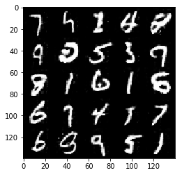


    Epoch 8/10... Discriminator Loss: 0.3850... Generator Loss: 1.5840
    Epoch 8/10... Discriminator Loss: 0.6575... Generator Loss: 1.1161
    Epoch 8/10... Discriminator Loss: 0.5547... Generator Loss: 1.2988
    Epoch 8/10... Discriminator Loss: 0.5460... Generator Loss: 1.4353
    Epoch 8/10... Discriminator Loss: 0.2741... Generator Loss: 2.1078
    Epoch 8/10... Discriminator Loss: 0.4895... Generator Loss: 1.3940
    Epoch 8/10... Discriminator Loss: 0.0793... Generator Loss: 3.1306
    Epoch 8/10... Discriminator Loss: 0.5515... Generator Loss: 1.1350
    Epoch 8/10... Discriminator Loss: 0.1086... Generator Loss: 2.9146
    Epoch 8/10... Discriminator Loss: 2.7065... Generator Loss: 0.2603


    Epoch 8/10... Discriminator Loss: 0.7585... Generator Loss: 1.0494
    Epoch 8/10... Discriminator Loss: 1.9745... Generator Loss: 8.6774
    Epoch 8/10... Discriminator Loss: 0.1203... Generator Loss: 3.9197
    Epoch 8/10... Discriminator Loss: 0.7544... Generator Loss: 1.1730
    Epoch 8/10... Discriminator Loss: 0.3928... Generator Loss: 1.7112
    Epoch 8/10... Discriminator Loss: 0.3871... Generator Loss: 1.6478
    Epoch 8/10... Discriminator Loss: 0.3439... Generator Loss: 1.6516
    Epoch 8/10... Discriminator Loss: 0.7087... Generator Loss: 1.0935
    Epoch 8/10... Discriminator Loss: 0.2656... Generator Loss: 2.2107
    Epoch 8/10... Discriminator Loss: 0.2103... Generator Loss: 2.2544


    Epoch 8/10... Discriminator Loss: 0.6307... Generator Loss: 1.2146
    Epoch 8/10... Discriminator Loss: 0.1593... Generator Loss: 2.6064
    Epoch 8/10... Discriminator Loss: 0.6176... Generator Loss: 1.2229
    Epoch 8/10... Discriminator Loss: 0.3931... Generator Loss: 1.8841
    Epoch 8/10... Discriminator Loss: 0.6376... Generator Loss: 1.1009
    Epoch 8/10... Discriminator Loss: 0.1424... Generator Loss: 3.6107
    Epoch 8/10... Discriminator Loss: 0.2829... Generator Loss: 1.9106
    Epoch 8/10... Discriminator Loss: 0.4320... Generator Loss: 1.6697
    Epoch 8/10... Discriminator Loss: 0.5809... Generator Loss: 1.2278
    Epoch 8/10... Discriminator Loss: 0.5478... Generator Loss: 1.2820


    Epoch 8/10... Discriminator Loss: 0.7351... Generator Loss: 1.2130
    Epoch 8/10... Discriminator Loss: 0.2075... Generator Loss: 2.3332
    Epoch 8/10... Discriminator Loss: 0.1463... Generator Loss: 2.3866
    Epoch 8/10... Discriminator Loss: 0.4546... Generator Loss: 1.5255
    Epoch 8/10... Discriminator Loss: 0.3423... Generator Loss: 1.6914
    Epoch 8/10... Discriminator Loss: 0.3301... Generator Loss: 1.6743
    Epoch 8/10... Discriminator Loss: 1.7118... Generator Loss: 0.5086
    Epoch 8/10... Discriminator Loss: 0.9713... Generator Loss: 0.8854
    Epoch 8/10... Discriminator Loss: 0.0821... Generator Loss: 3.3062
    Epoch 8/10... Discriminator Loss: 0.4004... Generator Loss: 2.0343


    Epoch 8/10... Discriminator Loss: 0.6194... Generator Loss: 1.3128
    Epoch 8/10... Discriminator Loss: 0.2532... Generator Loss: 1.8838
    Epoch 8/10... Discriminator Loss: 0.6412... Generator Loss: 1.1657
    Epoch 8/10... Discriminator Loss: 1.0062... Generator Loss: 0.6312
    Epoch 8/10... Discriminator Loss: 0.1497... Generator Loss: 2.7839
    Epoch 8/10... Discriminator Loss: 0.7856... Generator Loss: 1.1826
    Epoch 8/10... Discriminator Loss: 0.2221... Generator Loss: 4.2150
    Epoch 8/10... Discriminator Loss: 1.8024... Generator Loss: 0.3639
    Epoch 8/10... Discriminator Loss: 0.2199... Generator Loss: 3.9757
    Epoch 8/10... Discriminator Loss: 0.2277... Generator Loss: 2.9591


    Epoch 8/10... Discriminator Loss: 0.6275... Generator Loss: 1.4371
    Epoch 8/10... Discriminator Loss: 0.3168... Generator Loss: 2.3232
    Epoch 8/10... Discriminator Loss: 0.4469... Generator Loss: 1.7143
    Epoch 8/10... Discriminator Loss: 0.5717... Generator Loss: 1.4475
    Epoch 8/10... Discriminator Loss: 0.1729... Generator Loss: 3.1219
    Epoch 8/10... Discriminator Loss: 0.5478... Generator Loss: 1.4183
    Epoch 8/10... Discriminator Loss: 0.5892... Generator Loss: 1.1245
    Epoch 8/10... Discriminator Loss: 0.2969... Generator Loss: 2.0827
    Epoch 8/10... Discriminator Loss: 0.2311... Generator Loss: 2.7369
    Epoch 8/10... Discriminator Loss: 0.2785... Generator Loss: 1.9023


    Epoch 8/10... Discriminator Loss: 0.1859... Generator Loss: 2.3246
    Epoch 8/10... Discriminator Loss: 0.2269... Generator Loss: 2.3516
    Epoch 8/10... Discriminator Loss: 0.3683... Generator Loss: 1.8632
    Epoch 8/10... Discriminator Loss: 0.2694... Generator Loss: 1.9125
    Epoch 8/10... Discriminator Loss: 0.8950... Generator Loss: 0.9362
    Epoch 8/10... Discriminator Loss: 1.1760... Generator Loss: 0.5544
    Epoch 8/10... Discriminator Loss: 0.6215... Generator Loss: 1.1543
    Epoch 8/10... Discriminator Loss: 0.7235... Generator Loss: 1.1637
    Epoch 8/10... Discriminator Loss: 0.8237... Generator Loss: 0.9733
    Epoch 8/10... Discriminator Loss: 0.4331... Generator Loss: 1.8366


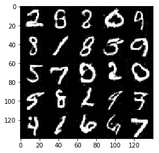


    Epoch 8/10... Discriminator Loss: 0.1361... Generator Loss: 2.7664
    Epoch 8/10... Discriminator Loss: 0.1091... Generator Loss: 2.9746
    Epoch 8/10... Discriminator Loss: 0.2112... Generator Loss: 2.8824
    Epoch 8/10... Discriminator Loss: 0.1216... Generator Loss: 3.1998
    Epoch 8/10... Discriminator Loss: 0.2746... Generator Loss: 3.3278
    Epoch 8/10... Discriminator Loss: 0.5202... Generator Loss: 1.3153
    Epoch 8/10... Discriminator Loss: 0.2328... Generator Loss: 2.4941
    Epoch 8/10... Discriminator Loss: 1.1192... Generator Loss: 0.6741
    Epoch 8/10... Discriminator Loss: 0.5861... Generator Loss: 1.3611
    Epoch 8/10... Discriminator Loss: 0.1305... Generator Loss: 2.7515


    Epoch 8/10... Discriminator Loss: 0.8117... Generator Loss: 0.9734
    Epoch 8/10... Discriminator Loss: 0.6385... Generator Loss: 1.2456
    Epoch 8/10... Discriminator Loss: 1.2067... Generator Loss: 0.6621
    Epoch 8/10... Discriminator Loss: 0.2868... Generator Loss: 1.8438
    Epoch 8/10... Discriminator Loss: 0.7862... Generator Loss: 0.9375
    Epoch 8/10... Discriminator Loss: 0.4414... Generator Loss: 1.4098
    Epoch 8/10... Discriminator Loss: 0.7469... Generator Loss: 1.1093
    Epoch 8/10... Discriminator Loss: 0.2920... Generator Loss: 2.2293
    Epoch 8/10... Discriminator Loss: 0.0538... Generator Loss: 4.1004
    Epoch 8/10... Discriminator Loss: 1.0800... Generator Loss: 0.7925


    Epoch 8/10... Discriminator Loss: 0.1147... Generator Loss: 3.7609
    Epoch 8/10... Discriminator Loss: 0.3395... Generator Loss: 1.7846
    Epoch 8/10... Discriminator Loss: 0.8050... Generator Loss: 0.9575
    Epoch 8/10... Discriminator Loss: 0.4546... Generator Loss: 1.9531
    Epoch 8/10... Discriminator Loss: 0.5322... Generator Loss: 1.1717
    Epoch 8/10... Discriminator Loss: 0.8839... Generator Loss: 0.9364
    Epoch 8/10... Discriminator Loss: 0.4776... Generator Loss: 1.9185
    Epoch 8/10... Discriminator Loss: 0.8766... Generator Loss: 0.8713
    Epoch 8/10... Discriminator Loss: 0.4882... Generator Loss: 1.5091
    Epoch 8/10... Discriminator Loss: 0.1245... Generator Loss: 2.7331


    Epoch 9/10... Discriminator Loss: 0.0779... Generator Loss: 3.6737
    Epoch 9/10... Discriminator Loss: 0.0954... Generator Loss: 3.1719
    Epoch 9/10... Discriminator Loss: 0.7627... Generator Loss: 0.9085
    Epoch 9/10... Discriminator Loss: 0.5575... Generator Loss: 1.3569
    Epoch 9/10... Discriminator Loss: 0.1877... Generator Loss: 2.5232
    Epoch 9/10... Discriminator Loss: 0.0284... Generator Loss: 4.8500
    Epoch 9/10... Discriminator Loss: 0.4482... Generator Loss: 1.7308
    Epoch 9/10... Discriminator Loss: 0.2986... Generator Loss: 2.4226
    Epoch 9/10... Discriminator Loss: 0.0921... Generator Loss: 3.1071
    Epoch 9/10... Discriminator Loss: 0.2543... Generator Loss: 2.3056


    Epoch 9/10... Discriminator Loss: 0.0870... Generator Loss: 2.8922
    Epoch 9/10... Discriminator Loss: 0.3205... Generator Loss: 2.0271
    Epoch 9/10... Discriminator Loss: 0.4792... Generator Loss: 1.4303
    Epoch 9/10... Discriminator Loss: 0.3832... Generator Loss: 1.5213
    Epoch 9/10... Discriminator Loss: 0.0829... Generator Loss: 3.3912
    Epoch 9/10... Discriminator Loss: 0.1713... Generator Loss: 2.4584
    Epoch 9/10... Discriminator Loss: 0.2385... Generator Loss: 2.2068
    Epoch 9/10... Discriminator Loss: 0.0663... Generator Loss: 3.5362
    Epoch 9/10... Discriminator Loss: 0.0447... Generator Loss: 3.9112
    Epoch 9/10... Discriminator Loss: 0.7004... Generator Loss: 1.1568


    Epoch 9/10... Discriminator Loss: 0.1679... Generator Loss: 2.4061
    Epoch 9/10... Discriminator Loss: 0.5860... Generator Loss: 1.3756
    Epoch 9/10... Discriminator Loss: 0.1476... Generator Loss: 2.7967
    Epoch 9/10... Discriminator Loss: 0.7419... Generator Loss: 0.8800
    Epoch 9/10... Discriminator Loss: 0.3913... Generator Loss: 1.6550
    Epoch 9/10... Discriminator Loss: 0.5124... Generator Loss: 1.2254
    Epoch 9/10... Discriminator Loss: 0.7253... Generator Loss: 1.3630
    Epoch 9/10... Discriminator Loss: 0.7070... Generator Loss: 6.5192
    Epoch 9/10... Discriminator Loss: 0.6149... Generator Loss: 5.0582
    Epoch 9/10... Discriminator Loss: 0.6996... Generator Loss: 3.7694


    Epoch 9/10... Discriminator Loss: 0.4089... Generator Loss: 3.2898
    Epoch 9/10... Discriminator Loss: 1.0246... Generator Loss: 0.7989
    Epoch 9/10... Discriminator Loss: 0.2387... Generator Loss: 2.1456
    Epoch 9/10... Discriminator Loss: 0.4293... Generator Loss: 4.3013
    Epoch 9/10... Discriminator Loss: 0.1239... Generator Loss: 6.9093
    Epoch 9/10... Discriminator Loss: 2.7869... Generator Loss: 0.1559
    Epoch 9/10... Discriminator Loss: 0.0722... Generator Loss: 3.9881
    Epoch 9/10... Discriminator Loss: 0.9521... Generator Loss: 0.8413
    Epoch 9/10... Discriminator Loss: 0.5609... Generator Loss: 1.5001
    Epoch 9/10... Discriminator Loss: 0.1379... Generator Loss: 3.0385


    Epoch 9/10... Discriminator Loss: 0.0600... Generator Loss: 4.5228
    Epoch 9/10... Discriminator Loss: 0.0662... Generator Loss: 3.9437
    Epoch 9/10... Discriminator Loss: 0.2655... Generator Loss: 2.1589
    Epoch 9/10... Discriminator Loss: 0.2145... Generator Loss: 2.7497
    Epoch 9/10... Discriminator Loss: 0.3107... Generator Loss: 1.7731
    Epoch 9/10... Discriminator Loss: 0.7885... Generator Loss: 0.9883
    Epoch 9/10... Discriminator Loss: 0.5734... Generator Loss: 1.5156
    Epoch 9/10... Discriminator Loss: 0.0898... Generator Loss: 3.6089
    Epoch 9/10... Discriminator Loss: 0.3129... Generator Loss: 2.7091
    Epoch 9/10... Discriminator Loss: 0.4640... Generator Loss: 2.5203


    Epoch 9/10... Discriminator Loss: 0.1911... Generator Loss: 2.9663
    Epoch 9/10... Discriminator Loss: 0.4510... Generator Loss: 1.3494
    Epoch 9/10... Discriminator Loss: 0.5419... Generator Loss: 1.4412
    Epoch 9/10... Discriminator Loss: 0.1433... Generator Loss: 2.9967
    Epoch 9/10... Discriminator Loss: 0.9581... Generator Loss: 0.8204
    Epoch 9/10... Discriminator Loss: 0.5157... Generator Loss: 1.6044
    Epoch 9/10... Discriminator Loss: 0.3803... Generator Loss: 1.6076
    Epoch 9/10... Discriminator Loss: 0.4731... Generator Loss: 1.5478
    Epoch 9/10... Discriminator Loss: 1.0462... Generator Loss: 0.7520
    Epoch 9/10... Discriminator Loss: 0.3314... Generator Loss: 1.8490


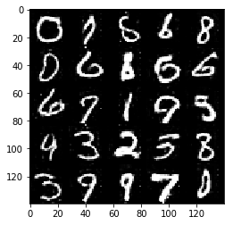


    Epoch 9/10... Discriminator Loss: 0.3819... Generator Loss: 1.7410
    Epoch 9/10... Discriminator Loss: 0.2981... Generator Loss: 2.4659
    Epoch 9/10... Discriminator Loss: 0.9543... Generator Loss: 0.8183
    Epoch 9/10... Discriminator Loss: 0.4160... Generator Loss: 1.5044
    Epoch 9/10... Discriminator Loss: 0.5194... Generator Loss: 1.5492
    Epoch 9/10... Discriminator Loss: 0.0942... Generator Loss: 3.1180
    Epoch 9/10... Discriminator Loss: 0.4723... Generator Loss: 1.5975
    Epoch 9/10... Discriminator Loss: 0.2267... Generator Loss: 2.3808
    Epoch 9/10... Discriminator Loss: 0.4011... Generator Loss: 1.7895
    Epoch 9/10... Discriminator Loss: 0.1539... Generator Loss: 2.4112


    Epoch 9/10... Discriminator Loss: 2.4120... Generator Loss: 0.2165
    Epoch 9/10... Discriminator Loss: 1.5982... Generator Loss: 6.6001
    Epoch 9/10... Discriminator Loss: 3.4844... Generator Loss: 0.1053
    Epoch 9/10... Discriminator Loss: 0.2745... Generator Loss: 5.3555
    Epoch 9/10... Discriminator Loss: 0.1759... Generator Loss: 3.4069
    Epoch 9/10... Discriminator Loss: 0.4477... Generator Loss: 2.6855
    Epoch 9/10... Discriminator Loss: 0.3993... Generator Loss: 3.2306
    Epoch 9/10... Discriminator Loss: 0.1227... Generator Loss: 3.3466
    Epoch 9/10... Discriminator Loss: 1.3527... Generator Loss: 0.6254
    Epoch 9/10... Discriminator Loss: 0.1620... Generator Loss: 2.9866


    Epoch 9/10... Discriminator Loss: 0.4302... Generator Loss: 2.0028
    Epoch 9/10... Discriminator Loss: 0.3367... Generator Loss: 1.9075
    Epoch 9/10... Discriminator Loss: 0.8414... Generator Loss: 0.9812
    Epoch 9/10... Discriminator Loss: 2.1368... Generator Loss: 0.2894
    Epoch 9/10... Discriminator Loss: 0.1307... Generator Loss: 3.6528
    Epoch 9/10... Discriminator Loss: 1.0353... Generator Loss: 0.8028
    Epoch 9/10... Discriminator Loss: 0.6298... Generator Loss: 1.4134
    Epoch 9/10... Discriminator Loss: 0.9244... Generator Loss: 0.8173
    Epoch 9/10... Discriminator Loss: 0.3369... Generator Loss: 1.9286
    Epoch 9/10... Discriminator Loss: 0.9624... Generator Loss: 0.7348


    Epoch 9/10... Discriminator Loss: 0.5865... Generator Loss: 1.9555
    Epoch 9/10... Discriminator Loss: 0.5431... Generator Loss: 1.2831
    Epoch 9/10... Discriminator Loss: 0.5322... Generator Loss: 1.5668
    Epoch 9/10... Discriminator Loss: 0.3155... Generator Loss: 1.8438
    Epoch 9/10... Discriminator Loss: 0.6150... Generator Loss: 1.5078
    Epoch 9/10... Discriminator Loss: 0.5180... Generator Loss: 1.3502
    Epoch 9/10... Discriminator Loss: 0.1981... Generator Loss: 2.0760
    Epoch 9/10... Discriminator Loss: 0.2808... Generator Loss: 1.9333
    Epoch 9/10... Discriminator Loss: 0.4372... Generator Loss: 1.6772
    Epoch 9/10... Discriminator Loss: 0.5600... Generator Loss: 1.1127


    Epoch 9/10... Discriminator Loss: 0.1781... Generator Loss: 2.7536
    Epoch 9/10... Discriminator Loss: 0.3339... Generator Loss: 1.6675
    Epoch 9/10... Discriminator Loss: 0.5071... Generator Loss: 1.3567
    Epoch 9/10... Discriminator Loss: 1.0313... Generator Loss: 0.7403
    Epoch 9/10... Discriminator Loss: 0.2893... Generator Loss: 1.6680
    Epoch 9/10... Discriminator Loss: 0.5581... Generator Loss: 1.1167
    Epoch 9/10... Discriminator Loss: 0.8007... Generator Loss: 1.0304
    Epoch 9/10... Discriminator Loss: 0.8067... Generator Loss: 0.8195
    Epoch 9/10... Discriminator Loss: 0.1651... Generator Loss: 2.3086
    Epoch 9/10... Discriminator Loss: 0.4248... Generator Loss: 1.3848


    Epoch 9/10... Discriminator Loss: 0.5530... Generator Loss: 1.2225
    Epoch 9/10... Discriminator Loss: 0.2297... Generator Loss: 2.5321
    Epoch 9/10... Discriminator Loss: 0.6382... Generator Loss: 1.1355
    Epoch 9/10... Discriminator Loss: 0.0554... Generator Loss: 3.7969
    Epoch 9/10... Discriminator Loss: 0.3493... Generator Loss: 1.6632
    Epoch 9/10... Discriminator Loss: 0.3063... Generator Loss: 2.2401
    Epoch 9/10... Discriminator Loss: 0.0658... Generator Loss: 3.6650
    Epoch 9/10... Discriminator Loss: 1.0136... Generator Loss: 0.9176
    Epoch 9/10... Discriminator Loss: 0.6250... Generator Loss: 1.2042
    Epoch 9/10... Discriminator Loss: 1.3966... Generator Loss: 0.5671


    Epoch 9/10... Discriminator Loss: 0.7411... Generator Loss: 0.9357
    Epoch 9/10... Discriminator Loss: 0.9843... Generator Loss: 0.7055
    Epoch 9/10... Discriminator Loss: 0.7701... Generator Loss: 0.9924
    Epoch 9/10... Discriminator Loss: 1.6141... Generator Loss: 6.6257
    Epoch 9/10... Discriminator Loss: 0.3689... Generator Loss: 2.2012
    Epoch 9/10... Discriminator Loss: 0.6443... Generator Loss: 1.3587
    Epoch 9/10... Discriminator Loss: 0.2339... Generator Loss: 2.2582
    Epoch 9/10... Discriminator Loss: 0.2411... Generator Loss: 4.1274
    Epoch 9/10... Discriminator Loss: 0.3096... Generator Loss: 2.2340
    Epoch 9/10... Discriminator Loss: 0.1913... Generator Loss: 2.9286


    Epoch 9/10... Discriminator Loss: 0.5174... Generator Loss: 1.3489
    Epoch 9/10... Discriminator Loss: 0.1805... Generator Loss: 2.5561
    Epoch 9/10... Discriminator Loss: 0.1907... Generator Loss: 2.6451
    Epoch 9/10... Discriminator Loss: 0.4203... Generator Loss: 1.9870
    Epoch 9/10... Discriminator Loss: 0.5399... Generator Loss: 1.8673
    Epoch 9/10... Discriminator Loss: 1.5902... Generator Loss: 0.4659
    Epoch 9/10... Discriminator Loss: 0.5095... Generator Loss: 1.7240
    Epoch 9/10... Discriminator Loss: 0.8713... Generator Loss: 1.0539
    Epoch 9/10... Discriminator Loss: 0.2878... Generator Loss: 2.2871
    Epoch 9/10... Discriminator Loss: 0.0834... Generator Loss: 3.8975


    Epoch 9/10... Discriminator Loss: 0.3523... Generator Loss: 1.6863
    Epoch 9/10... Discriminator Loss: 0.0847... Generator Loss: 3.1998
    Epoch 9/10... Discriminator Loss: 0.4602... Generator Loss: 1.5408
    Epoch 9/10... Discriminator Loss: 0.1733... Generator Loss: 2.6178
    Epoch 9/10... Discriminator Loss: 0.5605... Generator Loss: 1.3002
    Epoch 9/10... Discriminator Loss: 0.5407... Generator Loss: 1.4327
    Epoch 9/10... Discriminator Loss: 0.3380... Generator Loss: 1.7546
    Epoch 9/10... Discriminator Loss: 0.3444... Generator Loss: 1.8936
    Epoch 9/10... Discriminator Loss: 0.3124... Generator Loss: 1.9328
    Epoch 9/10... Discriminator Loss: 0.3087... Generator Loss: 1.6608


    Epoch 9/10... Discriminator Loss: 1.0101... Generator Loss: 0.8031
    Epoch 9/10... Discriminator Loss: 0.1155... Generator Loss: 3.0476
    Epoch 9/10... Discriminator Loss: 0.2662... Generator Loss: 2.1232
    Epoch 9/10... Discriminator Loss: 2.0993... Generator Loss: 0.3925
    Epoch 9/10... Discriminator Loss: 0.8427... Generator Loss: 1.0711
    Epoch 9/10... Discriminator Loss: 0.2399... Generator Loss: 3.6886
    Epoch 9/10... Discriminator Loss: 0.6452... Generator Loss: 1.7122
    Epoch 9/10... Discriminator Loss: 0.7736... Generator Loss: 1.1655
    Epoch 9/10... Discriminator Loss: 0.5600... Generator Loss: 1.3275
    Epoch 9/10... Discriminator Loss: 0.6696... Generator Loss: 1.2046


    Epoch 9/10... Discriminator Loss: 0.4637... Generator Loss: 1.5815
    Epoch 9/10... Discriminator Loss: 1.0421... Generator Loss: 0.6314
    Epoch 9/10... Discriminator Loss: 0.2564... Generator Loss: 2.3655
    Epoch 9/10... Discriminator Loss: 0.8336... Generator Loss: 1.0634
    Epoch 9/10... Discriminator Loss: 0.3910... Generator Loss: 1.5813
    Epoch 9/10... Discriminator Loss: 0.4828... Generator Loss: 1.4758
    Epoch 9/10... Discriminator Loss: 0.1729... Generator Loss: 2.5031
    Epoch 9/10... Discriminator Loss: 0.7466... Generator Loss: 1.1245
    Epoch 9/10... Discriminator Loss: 0.1981... Generator Loss: 2.5681
    Epoch 9/10... Discriminator Loss: 0.5048... Generator Loss: 1.4352


    Epoch 9/10... Discriminator Loss: 0.1297... Generator Loss: 2.8982
    Epoch 9/10... Discriminator Loss: 0.7593... Generator Loss: 1.2182
    Epoch 9/10... Discriminator Loss: 0.1307... Generator Loss: 3.2268
    Epoch 9/10... Discriminator Loss: 0.7369... Generator Loss: 0.9093
    Epoch 9/10... Discriminator Loss: 0.9691... Generator Loss: 0.6933
    Epoch 9/10... Discriminator Loss: 0.7133... Generator Loss: 0.9084
    Epoch 9/10... Discriminator Loss: 0.9913... Generator Loss: 0.7364
    Epoch 9/10... Discriminator Loss: 0.1720... Generator Loss: 2.5463
    Epoch 9/10... Discriminator Loss: 0.9834... Generator Loss: 0.9620
    Epoch 9/10... Discriminator Loss: 0.0924... Generator Loss: 4.9892


    Epoch 9/10... Discriminator Loss: 0.2202... Generator Loss: 2.0625
    Epoch 9/10... Discriminator Loss: 0.2657... Generator Loss: 2.1262
    Epoch 9/10... Discriminator Loss: 0.0796... Generator Loss: 3.8054
    Epoch 9/10... Discriminator Loss: 0.3139... Generator Loss: 2.0261
    Epoch 9/10... Discriminator Loss: 0.3997... Generator Loss: 1.5643
    Epoch 9/10... Discriminator Loss: 0.1822... Generator Loss: 2.8665
    Epoch 9/10... Discriminator Loss: 0.6099... Generator Loss: 1.2682
    Epoch 10/10... Discriminator Loss: 0.8207... Generator Loss: 0.9213
    Epoch 10/10... Discriminator Loss: 0.0733... Generator Loss: 3.3998
    Epoch 10/10... Discriminator Loss: 0.3398... Generator Loss: 1.8646


    Epoch 10/10... Discriminator Loss: 0.4844... Generator Loss: 1.5731
    Epoch 10/10... Discriminator Loss: 0.4986... Generator Loss: 1.4199
    Epoch 10/10... Discriminator Loss: 0.1849... Generator Loss: 2.5677
    Epoch 10/10... Discriminator Loss: 0.6905... Generator Loss: 0.9750
    Epoch 10/10... Discriminator Loss: 0.6606... Generator Loss: 1.0767
    Epoch 10/10... Discriminator Loss: 0.1971... Generator Loss: 2.5684
    Epoch 10/10... Discriminator Loss: 0.4318... Generator Loss: 1.6423
    Epoch 10/10... Discriminator Loss: 0.0774... Generator Loss: 3.4296
    Epoch 10/10... Discriminator Loss: 0.0949... Generator Loss: 3.4316
    Epoch 10/10... Discriminator Loss: 0.9013... Generator Loss: 0.8245


    Epoch 10/10... Discriminator Loss: 0.1489... Generator Loss: 3.0569
    Epoch 10/10... Discriminator Loss: 0.3674... Generator Loss: 4.0986
    Epoch 10/10... Discriminator Loss: 0.5630... Generator Loss: 4.2555
    Epoch 10/10... Discriminator Loss: 0.8069... Generator Loss: 1.2333
    Epoch 10/10... Discriminator Loss: 0.5490... Generator Loss: 1.7080
    Epoch 10/10... Discriminator Loss: 0.2156... Generator Loss: 3.3933
    Epoch 10/10... Discriminator Loss: 0.1470... Generator Loss: 2.9646
    Epoch 10/10... Discriminator Loss: 0.9568... Generator Loss: 0.9076
    Epoch 10/10... Discriminator Loss: 0.5815... Generator Loss: 1.3936
    Epoch 10/10... Discriminator Loss: 0.3399... Generator Loss: 2.7366


    Epoch 10/10... Discriminator Loss: 0.4699... Generator Loss: 1.6153
    Epoch 10/10... Discriminator Loss: 0.6139... Generator Loss: 1.0776
    Epoch 10/10... Discriminator Loss: 1.0435... Generator Loss: 0.8183
    Epoch 10/10... Discriminator Loss: 0.8321... Generator Loss: 1.1241
    Epoch 10/10... Discriminator Loss: 0.2041... Generator Loss: 2.7346
    Epoch 10/10... Discriminator Loss: 0.2724... Generator Loss: 2.0582
    Epoch 10/10... Discriminator Loss: 0.4597... Generator Loss: 1.5455
    Epoch 10/10... Discriminator Loss: 1.5201... Generator Loss: 0.3639
    Epoch 10/10... Discriminator Loss: 0.5017... Generator Loss: 1.1747
    Epoch 10/10... Discriminator Loss: 0.4078... Generator Loss: 1.8427


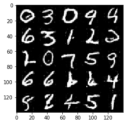


    Epoch 10/10... Discriminator Loss: 0.3291... Generator Loss: 2.0035
    Epoch 10/10... Discriminator Loss: 0.3957... Generator Loss: 1.5977
    Epoch 10/10... Discriminator Loss: 0.1609... Generator Loss: 2.5415
    Epoch 10/10... Discriminator Loss: 0.1299... Generator Loss: 4.6514
    Epoch 10/10... Discriminator Loss: 0.6074... Generator Loss: 1.2223
    Epoch 10/10... Discriminator Loss: 0.4676... Generator Loss: 1.7339
    Epoch 10/10... Discriminator Loss: 0.3230... Generator Loss: 1.8058
    Epoch 10/10... Discriminator Loss: 0.3785... Generator Loss: 1.8027
    Epoch 10/10... Discriminator Loss: 0.5459... Generator Loss: 1.5129
    Epoch 10/10... Discriminator Loss: 0.9251... Generator Loss: 0.8457


    Epoch 10/10... Discriminator Loss: 0.0842... Generator Loss: 3.7560
    Epoch 10/10... Discriminator Loss: 0.5446... Generator Loss: 1.2775
    Epoch 10/10... Discriminator Loss: 0.5694... Generator Loss: 1.2275
    Epoch 10/10... Discriminator Loss: 0.2142... Generator Loss: 2.2208
    Epoch 10/10... Discriminator Loss: 0.2591... Generator Loss: 2.2151
    Epoch 10/10... Discriminator Loss: 0.3812... Generator Loss: 1.8827
    Epoch 10/10... Discriminator Loss: 0.3281... Generator Loss: 1.9730
    Epoch 10/10... Discriminator Loss: 0.1601... Generator Loss: 2.7782
    Epoch 10/10... Discriminator Loss: 0.3599... Generator Loss: 1.6406
    Epoch 10/10... Discriminator Loss: 0.1752... Generator Loss: 2.8327


    Epoch 10/10... Discriminator Loss: 0.8958... Generator Loss: 0.9355
    Epoch 10/10... Discriminator Loss: 0.6125... Generator Loss: 1.6491
    Epoch 10/10... Discriminator Loss: 0.3258... Generator Loss: 2.1031
    Epoch 10/10... Discriminator Loss: 0.5831... Generator Loss: 1.5202
    Epoch 10/10... Discriminator Loss: 0.4198... Generator Loss: 1.7167
    Epoch 10/10... Discriminator Loss: 0.2616... Generator Loss: 2.2293
    Epoch 10/10... Discriminator Loss: 0.0264... Generator Loss: 5.3009
    Epoch 10/10... Discriminator Loss: 0.7093... Generator Loss: 1.0676
    Epoch 10/10... Discriminator Loss: 0.6387... Generator Loss: 1.1899
    Epoch 10/10... Discriminator Loss: 0.3026... Generator Loss: 1.9285


    Epoch 10/10... Discriminator Loss: 0.0887... Generator Loss: 3.4016
    Epoch 10/10... Discriminator Loss: 0.0986... Generator Loss: 3.4483
    Epoch 10/10... Discriminator Loss: 0.2045... Generator Loss: 2.5630
    Epoch 10/10... Discriminator Loss: 0.5863... Generator Loss: 1.1770
    Epoch 10/10... Discriminator Loss: 0.2607... Generator Loss: 2.2903
    Epoch 10/10... Discriminator Loss: 0.4986... Generator Loss: 1.2973
    Epoch 10/10... Discriminator Loss: 0.5640... Generator Loss: 1.4004
    Epoch 10/10... Discriminator Loss: 0.6754... Generator Loss: 1.2444
    Epoch 10/10... Discriminator Loss: 0.4166... Generator Loss: 3.9138
    Epoch 10/10... Discriminator Loss: 1.5461... Generator Loss: 0.7532


    Epoch 10/10... Discriminator Loss: 0.2102... Generator Loss: 2.9357
    Epoch 10/10... Discriminator Loss: 0.1761... Generator Loss: 4.6467
    Epoch 10/10... Discriminator Loss: 0.3060... Generator Loss: 2.1875
    Epoch 10/10... Discriminator Loss: 0.3809... Generator Loss: 3.9089
    Epoch 10/10... Discriminator Loss: 0.4574... Generator Loss: 1.4894
    Epoch 10/10... Discriminator Loss: 0.3168... Generator Loss: 1.7057
    Epoch 10/10... Discriminator Loss: 0.4747... Generator Loss: 1.5990
    Epoch 10/10... Discriminator Loss: 0.6749... Generator Loss: 1.2030
    Epoch 10/10... Discriminator Loss: 1.1162... Generator Loss: 0.8227
    Epoch 10/10... Discriminator Loss: 0.5070... Generator Loss: 1.4228


    Epoch 10/10... Discriminator Loss: 0.4961... Generator Loss: 1.4370
    Epoch 10/10... Discriminator Loss: 0.7580... Generator Loss: 1.0018
    Epoch 10/10... Discriminator Loss: 0.3659... Generator Loss: 2.1235
    Epoch 10/10... Discriminator Loss: 0.0810... Generator Loss: 3.2370
    Epoch 10/10... Discriminator Loss: 0.3935... Generator Loss: 1.6433
    Epoch 10/10... Discriminator Loss: 0.2122... Generator Loss: 2.3530
    Epoch 10/10... Discriminator Loss: 0.5638... Generator Loss: 1.3351
    Epoch 10/10... Discriminator Loss: 0.5188... Generator Loss: 1.5024
    Epoch 10/10... Discriminator Loss: 0.6409... Generator Loss: 1.3900
    Epoch 10/10... Discriminator Loss: 0.5214... Generator Loss: 1.4931


    Epoch 10/10... Discriminator Loss: 0.3747... Generator Loss: 1.7754
    Epoch 10/10... Discriminator Loss: 0.5261... Generator Loss: 1.1677
    Epoch 10/10... Discriminator Loss: 0.2704... Generator Loss: 2.2786
    Epoch 10/10... Discriminator Loss: 0.5379... Generator Loss: 1.4424
    Epoch 10/10... Discriminator Loss: 1.0490... Generator Loss: 0.8248
    Epoch 10/10... Discriminator Loss: 0.1895... Generator Loss: 2.4153
    Epoch 10/10... Discriminator Loss: 0.7555... Generator Loss: 1.0673
    Epoch 10/10... Discriminator Loss: 0.7201... Generator Loss: 1.0291
    Epoch 10/10... Discriminator Loss: 0.4180... Generator Loss: 1.8621
    Epoch 10/10... Discriminator Loss: 0.3806... Generator Loss: 7.1975


    Epoch 10/10... Discriminator Loss: 0.7050... Generator Loss: 1.2405
    Epoch 10/10... Discriminator Loss: 0.1587... Generator Loss: 3.8450
    Epoch 10/10... Discriminator Loss: 0.1469... Generator Loss: 3.7264
    Epoch 10/10... Discriminator Loss: 0.1640... Generator Loss: 3.2502
    Epoch 10/10... Discriminator Loss: 0.7389... Generator Loss: 0.9786
    Epoch 10/10... Discriminator Loss: 0.0718... Generator Loss: 4.5323
    Epoch 10/10... Discriminator Loss: 0.1268... Generator Loss: 2.9116
    Epoch 10/10... Discriminator Loss: 1.7636... Generator Loss: 0.4052
    Epoch 10/10... Discriminator Loss: 0.3183... Generator Loss: 2.0665
    Epoch 10/10... Discriminator Loss: 0.2180... Generator Loss: 2.4156


    Epoch 10/10... Discriminator Loss: 0.4214... Generator Loss: 1.7477
    Epoch 10/10... Discriminator Loss: 0.2737... Generator Loss: 1.9645
    Epoch 10/10... Discriminator Loss: 0.4836... Generator Loss: 1.3406
    Epoch 10/10... Discriminator Loss: 0.6724... Generator Loss: 1.5019
    Epoch 10/10... Discriminator Loss: 1.7191... Generator Loss: 0.4142
    Epoch 10/10... Discriminator Loss: 0.4493... Generator Loss: 1.9550
    Epoch 10/10... Discriminator Loss: 0.3724... Generator Loss: 1.6575
    Epoch 10/10... Discriminator Loss: 0.1335... Generator Loss: 2.8767
    Epoch 10/10... Discriminator Loss: 0.5468... Generator Loss: 1.3924
    Epoch 10/10... Discriminator Loss: 0.8163... Generator Loss: 0.8296


    Epoch 10/10... Discriminator Loss: 0.2411... Generator Loss: 2.3140
    Epoch 10/10... Discriminator Loss: 0.6883... Generator Loss: 1.0903
    Epoch 10/10... Discriminator Loss: 0.5170... Generator Loss: 1.5222
    Epoch 10/10... Discriminator Loss: 0.1063... Generator Loss: 3.8245
    Epoch 10/10... Discriminator Loss: 0.2058... Generator Loss: 2.3211
    Epoch 10/10... Discriminator Loss: 0.4593... Generator Loss: 1.5684
    Epoch 10/10... Discriminator Loss: 0.9822... Generator Loss: 0.7995
    Epoch 10/10... Discriminator Loss: 1.4182... Generator Loss: 0.5343
    Epoch 10/10... Discriminator Loss: 1.5243... Generator Loss: 0.4359
    Epoch 10/10... Discriminator Loss: 0.0828... Generator Loss: 3.3854


    Epoch 10/10... Discriminator Loss: 0.1145... Generator Loss: 3.1209
    Epoch 10/10... Discriminator Loss: 0.1965... Generator Loss: 2.6336
    Epoch 10/10... Discriminator Loss: 0.6120... Generator Loss: 1.4181
    Epoch 10/10... Discriminator Loss: 0.2327... Generator Loss: 2.3919
    Epoch 10/10... Discriminator Loss: 0.4293... Generator Loss: 1.5708
    Epoch 10/10... Discriminator Loss: 0.4196... Generator Loss: 1.8568
    Epoch 10/10... Discriminator Loss: 0.1063... Generator Loss: 3.3231
    Epoch 10/10... Discriminator Loss: 0.5086... Generator Loss: 1.3560
    Epoch 10/10... Discriminator Loss: 0.7863... Generator Loss: 0.8437
    Epoch 10/10... Discriminator Loss: 0.2968... Generator Loss: 1.7956


    Epoch 10/10... Discriminator Loss: 0.6704... Generator Loss: 0.9948
    Epoch 10/10... Discriminator Loss: 0.1066... Generator Loss: 3.1576
    Epoch 10/10... Discriminator Loss: 1.5073... Generator Loss: 0.4329
    Epoch 10/10... Discriminator Loss: 0.1608... Generator Loss: 3.8074
    Epoch 10/10... Discriminator Loss: 0.2251... Generator Loss: 2.4569
    Epoch 10/10... Discriminator Loss: 0.1624... Generator Loss: 2.7738
    Epoch 10/10... Discriminator Loss: 0.2827... Generator Loss: 2.2402
    Epoch 10/10... Discriminator Loss: 0.2135... Generator Loss: 2.1947
    Epoch 10/10... Discriminator Loss: 0.1223... Generator Loss: 2.9910
    Epoch 10/10... Discriminator Loss: 0.7218... Generator Loss: 0.9493


    Epoch 10/10... Discriminator Loss: 0.1818... Generator Loss: 2.5241
    Epoch 10/10... Discriminator Loss: 0.6401... Generator Loss: 1.1014
    Epoch 10/10... Discriminator Loss: 0.0621... Generator Loss: 3.6851
    Epoch 10/10... Discriminator Loss: 0.9503... Generator Loss: 0.9210
    Epoch 10/10... Discriminator Loss: 0.2079... Generator Loss: 2.2946
    Epoch 10/10... Discriminator Loss: 1.2280... Generator Loss: 0.9826
    Epoch 10/10... Discriminator Loss: 0.1763... Generator Loss: 3.0438
    Epoch 10/10... Discriminator Loss: 0.2547... Generator Loss: 2.7416
    Epoch 10/10... Discriminator Loss: 0.1788... Generator Loss: 6.3967
    Epoch 10/10... Discriminator Loss: 0.2164... Generator Loss: 4.0463


    Epoch 10/10... Discriminator Loss: 0.3146... Generator Loss: 1.8871
    Epoch 10/10... Discriminator Loss: 0.5718... Generator Loss: 1.5992
    Epoch 10/10... Discriminator Loss: 0.2599... Generator Loss: 2.0711
    Epoch 10/10... Discriminator Loss: 0.1755... Generator Loss: 3.2290
    Epoch 10/10... Discriminator Loss: 0.4918... Generator Loss: 1.4598
    Epoch 10/10... Discriminator Loss: 0.3987... Generator Loss: 4.4855
    Epoch 10/10... Discriminator Loss: 1.0526... Generator Loss: 0.8939
    Epoch 10/10... Discriminator Loss: 0.2496... Generator Loss: 2.3767
    Epoch 10/10... Discriminator Loss: 0.4757... Generator Loss: 1.4332
    Epoch 10/10... Discriminator Loss: 0.7808... Generator Loss: 0.8828


    Epoch 10/10... Discriminator Loss: 0.4176... Generator Loss: 1.6422
    Epoch 10/10... Discriminator Loss: 0.3804... Generator Loss: 1.6833
    Epoch 10/10... Discriminator Loss: 0.1646... Generator Loss: 2.5321
    Epoch 10/10... Discriminator Loss: 0.7010... Generator Loss: 1.4360
    Epoch 10/10... Discriminator Loss: 1.0396... Generator Loss: 0.7940
    Epoch 10/10... Discriminator Loss: 0.0385... Generator Loss: 4.0558
    Epoch 10/10... Discriminator Loss: 0.1610... Generator Loss: 2.7477
    Epoch 10/10... Discriminator Loss: 0.1504... Generator Loss: 2.9256
    Epoch 10/10... Discriminator Loss: 0.2864... Generator Loss: 2.2077
    Epoch 10/10... Discriminator Loss: 0.0837... Generator Loss: 3.2659


    Epoch 10/10... Discriminator Loss: 0.2731... Generator Loss: 2.4678
    Epoch 10/10... Discriminator Loss: 0.0898... Generator Loss: 3.3287
    Epoch 10/10... Discriminator Loss: 0.0955... Generator Loss: 4.0980
    Epoch 10/10... Discriminator Loss: 0.4226... Generator Loss: 7.6653
    Epoch 10/10... Discriminator Loss: 0.5415... Generator Loss: 1.8166


### CelebA
Run your GANs on CelebA.  It will take around 20 minutes on the average GPU to run one epoch.  You can run the whole epoch or stop when it starts to generate realistic faces.


```python
batch_size = 32
z_dim = 100
learning_rate = 0.0007
beta1 = 0.5

"""
DON'T MODIFY ANYTHING IN THIS CELL THAT IS BELOW THIS LINE
"""
epochs = 10

celeba_dataset = helper.Dataset('celeba', glob(os.path.join(data_dir, 'img_align_celeba/*.jpg')))
with tf.Graph().as_default():
    train(epochs, batch_size, z_dim, learning_rate, beta1, celeba_dataset.get_batches,
          celeba_dataset.shape, celeba_dataset.image_mode)
```

    Epoch 1/10... Discriminator Loss: 1.1807... Generator Loss: 10.8893
    Epoch 1/10... Discriminator Loss: 0.0949... Generator Loss: 12.7780
    Epoch 1/10... Discriminator Loss: 0.2806... Generator Loss: 11.1297
    Epoch 1/10... Discriminator Loss: 0.3735... Generator Loss: 3.3185
    Epoch 1/10... Discriminator Loss: 0.3791... Generator Loss: 3.2633
    Epoch 1/10... Discriminator Loss: 0.7423... Generator Loss: 5.0238
    Epoch 1/10... Discriminator Loss: 0.1167... Generator Loss: 3.8150
    Epoch 1/10... Discriminator Loss: 1.0132... Generator Loss: 6.9919
    Epoch 1/10... Discriminator Loss: 0.2961... Generator Loss: 1.6563
    Epoch 1/10... Discriminator Loss: 0.8498... Generator Loss: 7.4649


    Epoch 1/10... Discriminator Loss: 0.2597... Generator Loss: 7.5691
    Epoch 1/10... Discriminator Loss: 1.3351... Generator Loss: 0.8800
    Epoch 1/10... Discriminator Loss: 0.3538... Generator Loss: 1.9862
    Epoch 1/10... Discriminator Loss: 0.3403... Generator Loss: 4.6646
    Epoch 1/10... Discriminator Loss: 0.4496... Generator Loss: 1.8403
    Epoch 1/10... Discriminator Loss: 0.4628... Generator Loss: 1.2826
    Epoch 1/10... Discriminator Loss: 0.2741... Generator Loss: 2.1787
    Epoch 1/10... Discriminator Loss: 0.4631... Generator Loss: 2.5451
    Epoch 1/10... Discriminator Loss: 1.7535... Generator Loss: 0.7443
    Epoch 1/10... Discriminator Loss: 0.9881... Generator Loss: 1.2966


    Epoch 1/10... Discriminator Loss: 2.0243... Generator Loss: 0.3413
    Epoch 1/10... Discriminator Loss: 0.6506... Generator Loss: 1.5516
    Epoch 1/10... Discriminator Loss: 1.5301... Generator Loss: 0.6168
    Epoch 1/10... Discriminator Loss: 1.5654... Generator Loss: 0.8149
    Epoch 1/10... Discriminator Loss: 0.9942... Generator Loss: 1.2078
    Epoch 1/10... Discriminator Loss: 1.6541... Generator Loss: 2.5053
    Epoch 1/10... Discriminator Loss: 1.4469... Generator Loss: 1.7529
    Epoch 1/10... Discriminator Loss: 1.2389... Generator Loss: 0.9817
    Epoch 1/10... Discriminator Loss: 1.1583... Generator Loss: 1.6370
    Epoch 1/10... Discriminator Loss: 1.0880... Generator Loss: 1.3744


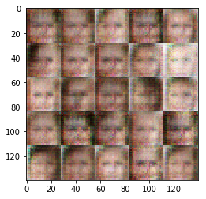


    Epoch 1/10... Discriminator Loss: 0.8349... Generator Loss: 1.1005
    Epoch 1/10... Discriminator Loss: 2.1198... Generator Loss: 0.2327
    Epoch 1/10... Discriminator Loss: 1.3780... Generator Loss: 1.1048
    Epoch 1/10... Discriminator Loss: 1.5026... Generator Loss: 0.5256
    Epoch 1/10... Discriminator Loss: 2.6776... Generator Loss: 4.0735
    Epoch 1/10... Discriminator Loss: 1.4045... Generator Loss: 0.5882
    Epoch 1/10... Discriminator Loss: 1.1521... Generator Loss: 0.9921
    Epoch 1/10... Discriminator Loss: 1.3566... Generator Loss: 1.0128
    Epoch 1/10... Discriminator Loss: 1.0862... Generator Loss: 0.6655
    Epoch 1/10... Discriminator Loss: 0.8075... Generator Loss: 1.6106


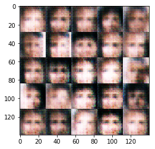


    Epoch 1/10... Discriminator Loss: 0.8641... Generator Loss: 2.1719
    Epoch 1/10... Discriminator Loss: 0.7387... Generator Loss: 1.2500
    Epoch 1/10... Discriminator Loss: 1.9467... Generator Loss: 1.5424
    Epoch 1/10... Discriminator Loss: 1.0869... Generator Loss: 1.2330
    Epoch 1/10... Discriminator Loss: 1.0872... Generator Loss: 0.6423
    Epoch 1/10... Discriminator Loss: 0.9986... Generator Loss: 2.1100
    Epoch 1/10... Discriminator Loss: 0.8209... Generator Loss: 1.1273
    Epoch 1/10... Discriminator Loss: 1.0821... Generator Loss: 0.6789
    Epoch 1/10... Discriminator Loss: 0.7901... Generator Loss: 1.1078
    Epoch 1/10... Discriminator Loss: 1.3827... Generator Loss: 0.5244


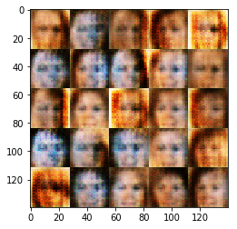


    Epoch 1/10... Discriminator Loss: 1.1034... Generator Loss: 0.8317
    Epoch 1/10... Discriminator Loss: 1.9525... Generator Loss: 0.5205
    Epoch 1/10... Discriminator Loss: 1.4191... Generator Loss: 0.4697
    Epoch 1/10... Discriminator Loss: 1.5802... Generator Loss: 2.6180
    Epoch 1/10... Discriminator Loss: 0.9770... Generator Loss: 0.9938
    Epoch 1/10... Discriminator Loss: 1.1542... Generator Loss: 0.8641
    Epoch 1/10... Discriminator Loss: 0.7969... Generator Loss: 1.4325
    Epoch 1/10... Discriminator Loss: 0.7809... Generator Loss: 1.4090
    Epoch 1/10... Discriminator Loss: 1.4156... Generator Loss: 0.7363
    Epoch 1/10... Discriminator Loss: 0.8450... Generator Loss: 1.0830


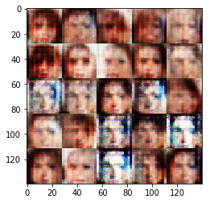


    Epoch 1/10... Discriminator Loss: 1.5376... Generator Loss: 0.3442
    Epoch 1/10... Discriminator Loss: 1.4098... Generator Loss: 1.8038
    Epoch 1/10... Discriminator Loss: 0.9758... Generator Loss: 1.5358
    Epoch 1/10... Discriminator Loss: 1.1012... Generator Loss: 0.7107
    Epoch 1/10... Discriminator Loss: 1.1421... Generator Loss: 0.6862
    Epoch 1/10... Discriminator Loss: 1.1191... Generator Loss: 0.7340
    Epoch 1/10... Discriminator Loss: 0.7594... Generator Loss: 1.1390
    Epoch 1/10... Discriminator Loss: 1.1442... Generator Loss: 0.8105
    Epoch 1/10... Discriminator Loss: 1.4022... Generator Loss: 0.7735
    Epoch 1/10... Discriminator Loss: 0.9758... Generator Loss: 0.9127


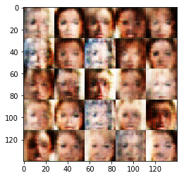


    Epoch 1/10... Discriminator Loss: 1.5145... Generator Loss: 0.3407
    Epoch 1/10... Discriminator Loss: 1.1267... Generator Loss: 0.8685
    Epoch 1/10... Discriminator Loss: 1.1072... Generator Loss: 0.6749
    Epoch 1/10... Discriminator Loss: 0.8981... Generator Loss: 0.9219
    Epoch 1/10... Discriminator Loss: 1.6543... Generator Loss: 0.7573
    Epoch 1/10... Discriminator Loss: 1.1726... Generator Loss: 0.6450
    Epoch 1/10... Discriminator Loss: 0.8927... Generator Loss: 0.8788
    Epoch 1/10... Discriminator Loss: 1.1999... Generator Loss: 0.6915
    Epoch 1/10... Discriminator Loss: 1.0412... Generator Loss: 1.0594
    Epoch 1/10... Discriminator Loss: 1.3525... Generator Loss: 0.6733


    Epoch 1/10... Discriminator Loss: 1.2520... Generator Loss: 0.7408
    Epoch 1/10... Discriminator Loss: 1.2386... Generator Loss: 0.6373
    Epoch 1/10... Discriminator Loss: 0.7455... Generator Loss: 0.9350
    Epoch 1/10... Discriminator Loss: 1.1706... Generator Loss: 0.8712
    Epoch 1/10... Discriminator Loss: 0.8763... Generator Loss: 1.2965
    Epoch 1/10... Discriminator Loss: 0.8157... Generator Loss: 1.3433
    Epoch 1/10... Discriminator Loss: 0.9790... Generator Loss: 0.9765
    Epoch 1/10... Discriminator Loss: 0.9068... Generator Loss: 1.2059
    Epoch 1/10... Discriminator Loss: 0.8832... Generator Loss: 1.0624
    Epoch 1/10... Discriminator Loss: 0.8151... Generator Loss: 1.6868


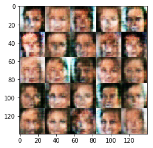


    Epoch 1/10... Discriminator Loss: 0.8457... Generator Loss: 0.9140
    Epoch 1/10... Discriminator Loss: 0.8864... Generator Loss: 1.3997
    Epoch 1/10... Discriminator Loss: 1.4841... Generator Loss: 0.4413
    Epoch 1/10... Discriminator Loss: 0.8470... Generator Loss: 0.9363
    Epoch 1/10... Discriminator Loss: 0.9908... Generator Loss: 1.8393
    Epoch 1/10... Discriminator Loss: 0.9541... Generator Loss: 1.4181
    Epoch 1/10... Discriminator Loss: 1.1788... Generator Loss: 0.6336
    Epoch 1/10... Discriminator Loss: 1.2718... Generator Loss: 0.6552
    Epoch 1/10... Discriminator Loss: 0.8570... Generator Loss: 1.5934
    Epoch 1/10... Discriminator Loss: 0.7788... Generator Loss: 1.0332


    Epoch 1/10... Discriminator Loss: 0.7736... Generator Loss: 1.5186
    Epoch 1/10... Discriminator Loss: 0.9502... Generator Loss: 1.2704
    Epoch 1/10... Discriminator Loss: 1.0658... Generator Loss: 0.7936
    Epoch 1/10... Discriminator Loss: 0.9178... Generator Loss: 1.1202
    Epoch 1/10... Discriminator Loss: 1.4694... Generator Loss: 2.5793
    Epoch 1/10... Discriminator Loss: 0.8264... Generator Loss: 1.1084
    Epoch 1/10... Discriminator Loss: 0.9795... Generator Loss: 1.9298
    Epoch 1/10... Discriminator Loss: 1.0426... Generator Loss: 1.0551
    Epoch 1/10... Discriminator Loss: 1.3404... Generator Loss: 0.4194
    Epoch 1/10... Discriminator Loss: 0.5837... Generator Loss: 1.7663


    Epoch 1/10... Discriminator Loss: 0.9433... Generator Loss: 1.2991
    Epoch 1/10... Discriminator Loss: 0.8656... Generator Loss: 1.0977
    Epoch 1/10... Discriminator Loss: 0.9600... Generator Loss: 2.4291
    Epoch 1/10... Discriminator Loss: 0.9259... Generator Loss: 1.2070
    Epoch 1/10... Discriminator Loss: 0.8957... Generator Loss: 1.2257
    Epoch 1/10... Discriminator Loss: 0.9692... Generator Loss: 0.8059
    Epoch 1/10... Discriminator Loss: 1.1447... Generator Loss: 0.5710
    Epoch 1/10... Discriminator Loss: 1.5876... Generator Loss: 0.3556
    Epoch 1/10... Discriminator Loss: 0.9815... Generator Loss: 1.3750
    Epoch 1/10... Discriminator Loss: 1.1123... Generator Loss: 0.7304


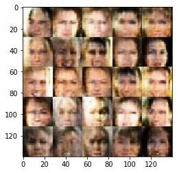


    Epoch 1/10... Discriminator Loss: 1.1544... Generator Loss: 0.6396
    Epoch 1/10... Discriminator Loss: 0.8442... Generator Loss: 1.0133
    Epoch 1/10... Discriminator Loss: 1.1085... Generator Loss: 0.7817
    Epoch 1/10... Discriminator Loss: 0.9426... Generator Loss: 1.5691
    Epoch 1/10... Discriminator Loss: 0.9242... Generator Loss: 1.2951
    Epoch 1/10... Discriminator Loss: 0.8889... Generator Loss: 1.0829
    Epoch 1/10... Discriminator Loss: 1.1759... Generator Loss: 0.6210
    Epoch 1/10... Discriminator Loss: 0.8026... Generator Loss: 1.3277
    Epoch 1/10... Discriminator Loss: 1.3068... Generator Loss: 0.4497
    Epoch 1/10... Discriminator Loss: 1.1284... Generator Loss: 1.5840


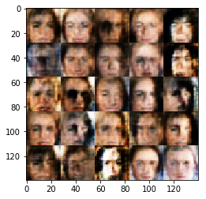


    Epoch 1/10... Discriminator Loss: 1.3463... Generator Loss: 0.5645
    Epoch 1/10... Discriminator Loss: 0.8108... Generator Loss: 1.6722
    Epoch 1/10... Discriminator Loss: 0.8955... Generator Loss: 0.9115
    Epoch 1/10... Discriminator Loss: 1.1220... Generator Loss: 0.6038
    Epoch 1/10... Discriminator Loss: 0.8755... Generator Loss: 0.9984
    Epoch 1/10... Discriminator Loss: 0.9118... Generator Loss: 1.3550
    Epoch 1/10... Discriminator Loss: 1.3147... Generator Loss: 1.0750
    Epoch 1/10... Discriminator Loss: 1.2046... Generator Loss: 1.5316
    Epoch 1/10... Discriminator Loss: 1.3202... Generator Loss: 0.4285
    Epoch 1/10... Discriminator Loss: 0.8554... Generator Loss: 1.2151


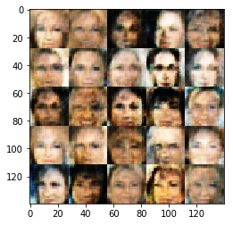


    Epoch 1/10... Discriminator Loss: 0.8924... Generator Loss: 1.0077
    Epoch 1/10... Discriminator Loss: 0.9607... Generator Loss: 1.2691
    Epoch 1/10... Discriminator Loss: 1.2059... Generator Loss: 0.5651
    Epoch 1/10... Discriminator Loss: 0.9912... Generator Loss: 0.8994
    Epoch 1/10... Discriminator Loss: 1.5164... Generator Loss: 0.3704
    Epoch 1/10... Discriminator Loss: 0.8940... Generator Loss: 1.3806
    Epoch 1/10... Discriminator Loss: 1.4512... Generator Loss: 0.4235
    Epoch 1/10... Discriminator Loss: 1.1340... Generator Loss: 0.6430
    Epoch 1/10... Discriminator Loss: 1.1535... Generator Loss: 1.7008
    Epoch 1/10... Discriminator Loss: 0.9955... Generator Loss: 0.8737


    Epoch 1/10... Discriminator Loss: 1.0887... Generator Loss: 0.9281
    Epoch 1/10... Discriminator Loss: 1.0769... Generator Loss: 2.0086
    Epoch 1/10... Discriminator Loss: 1.0490... Generator Loss: 0.7381
    Epoch 1/10... Discriminator Loss: 1.3827... Generator Loss: 0.4987
    Epoch 1/10... Discriminator Loss: 1.0040... Generator Loss: 1.0099
    Epoch 1/10... Discriminator Loss: 1.2547... Generator Loss: 1.1347
    Epoch 1/10... Discriminator Loss: 1.0885... Generator Loss: 0.6508
    Epoch 1/10... Discriminator Loss: 1.1747... Generator Loss: 0.5454
    Epoch 1/10... Discriminator Loss: 0.9939... Generator Loss: 1.1360
    Epoch 1/10... Discriminator Loss: 1.1166... Generator Loss: 0.9848


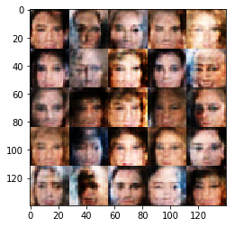


    Epoch 1/10... Discriminator Loss: 1.1101... Generator Loss: 0.6051
    Epoch 1/10... Discriminator Loss: 0.9927... Generator Loss: 1.2363
    Epoch 1/10... Discriminator Loss: 0.9365... Generator Loss: 1.7958
    Epoch 1/10... Discriminator Loss: 1.0901... Generator Loss: 0.8110
    Epoch 1/10... Discriminator Loss: 0.9088... Generator Loss: 1.0212
    Epoch 1/10... Discriminator Loss: 0.9882... Generator Loss: 0.7512
    Epoch 1/10... Discriminator Loss: 1.2902... Generator Loss: 0.4524
    Epoch 1/10... Discriminator Loss: 0.8531... Generator Loss: 1.0159
    Epoch 1/10... Discriminator Loss: 1.0341... Generator Loss: 1.4076
    Epoch 1/10... Discriminator Loss: 1.3782... Generator Loss: 0.4842


    Epoch 1/10... Discriminator Loss: 1.2344... Generator Loss: 2.2405
    Epoch 1/10... Discriminator Loss: 0.9069... Generator Loss: 0.8940
    Epoch 1/10... Discriminator Loss: 1.5408... Generator Loss: 0.3346
    Epoch 1/10... Discriminator Loss: 1.1632... Generator Loss: 1.0902
    Epoch 1/10... Discriminator Loss: 1.1313... Generator Loss: 0.7645
    Epoch 1/10... Discriminator Loss: 0.9521... Generator Loss: 0.7856
    Epoch 1/10... Discriminator Loss: 0.8041... Generator Loss: 1.3560
    Epoch 1/10... Discriminator Loss: 1.0259... Generator Loss: 1.2852
    Epoch 1/10... Discriminator Loss: 1.1098... Generator Loss: 0.6892
    Epoch 1/10... Discriminator Loss: 0.9799... Generator Loss: 0.8581


    Epoch 1/10... Discriminator Loss: 0.9001... Generator Loss: 1.0921
    Epoch 1/10... Discriminator Loss: 0.9174... Generator Loss: 1.0515
    Epoch 1/10... Discriminator Loss: 0.9574... Generator Loss: 1.1072
    Epoch 1/10... Discriminator Loss: 0.9840... Generator Loss: 0.8244
    Epoch 1/10... Discriminator Loss: 1.4462... Generator Loss: 0.4420
    Epoch 1/10... Discriminator Loss: 0.8632... Generator Loss: 1.4122
    Epoch 1/10... Discriminator Loss: 0.8629... Generator Loss: 0.8324
    Epoch 1/10... Discriminator Loss: 0.7911... Generator Loss: 1.2700
    Epoch 1/10... Discriminator Loss: 0.8408... Generator Loss: 1.5254
    Epoch 1/10... Discriminator Loss: 0.7632... Generator Loss: 1.6514


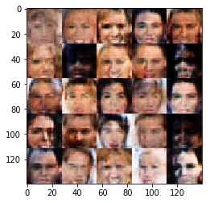


    Epoch 1/10... Discriminator Loss: 0.7886... Generator Loss: 1.5333
    Epoch 1/10... Discriminator Loss: 1.2116... Generator Loss: 1.9483
    Epoch 1/10... Discriminator Loss: 1.1932... Generator Loss: 1.2432
    Epoch 1/10... Discriminator Loss: 1.1082... Generator Loss: 0.7197
    Epoch 1/10... Discriminator Loss: 1.1409... Generator Loss: 0.5844
    Epoch 1/10... Discriminator Loss: 0.8348... Generator Loss: 1.4948
    Epoch 1/10... Discriminator Loss: 1.1327... Generator Loss: 0.7635
    Epoch 1/10... Discriminator Loss: 0.8578... Generator Loss: 1.3302
    Epoch 1/10... Discriminator Loss: 0.8968... Generator Loss: 0.8934
    Epoch 1/10... Discriminator Loss: 1.3081... Generator Loss: 1.3023


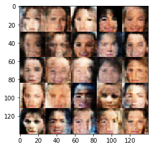


    Epoch 1/10... Discriminator Loss: 1.1418... Generator Loss: 0.6278
    Epoch 1/10... Discriminator Loss: 0.9802... Generator Loss: 0.8348
    Epoch 1/10... Discriminator Loss: 0.9339... Generator Loss: 0.9798
    Epoch 1/10... Discriminator Loss: 0.8993... Generator Loss: 0.8772
    Epoch 1/10... Discriminator Loss: 1.0608... Generator Loss: 0.7783
    Epoch 1/10... Discriminator Loss: 1.0796... Generator Loss: 0.7474
    Epoch 1/10... Discriminator Loss: 0.8682... Generator Loss: 2.2815
    Epoch 1/10... Discriminator Loss: 1.0791... Generator Loss: 0.8420
    Epoch 1/10... Discriminator Loss: 1.1303... Generator Loss: 0.5579
    Epoch 1/10... Discriminator Loss: 1.1748... Generator Loss: 1.9574


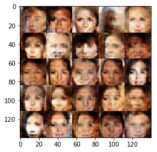


    Epoch 1/10... Discriminator Loss: 1.1804... Generator Loss: 0.5722
    Epoch 1/10... Discriminator Loss: 1.2604... Generator Loss: 0.6111
    Epoch 1/10... Discriminator Loss: 1.2631... Generator Loss: 0.5511
    Epoch 1/10... Discriminator Loss: 1.0446... Generator Loss: 1.5868
    Epoch 1/10... Discriminator Loss: 0.8606... Generator Loss: 0.8559
    Epoch 1/10... Discriminator Loss: 0.7670... Generator Loss: 1.3040
    Epoch 1/10... Discriminator Loss: 1.2086... Generator Loss: 0.5539
    Epoch 1/10... Discriminator Loss: 1.0859... Generator Loss: 0.7374
    Epoch 1/10... Discriminator Loss: 0.7373... Generator Loss: 1.2693
    Epoch 1/10... Discriminator Loss: 0.9747... Generator Loss: 1.9047


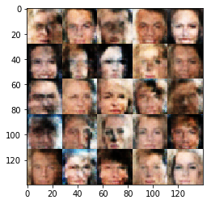


    Epoch 1/10... Discriminator Loss: 1.0974... Generator Loss: 1.2111
    Epoch 1/10... Discriminator Loss: 1.0245... Generator Loss: 0.9133
    Epoch 1/10... Discriminator Loss: 1.0004... Generator Loss: 0.9394
    Epoch 1/10... Discriminator Loss: 0.7773... Generator Loss: 1.9028
    Epoch 1/10... Discriminator Loss: 0.9009... Generator Loss: 1.5609
    Epoch 1/10... Discriminator Loss: 0.8955... Generator Loss: 1.1403
    Epoch 1/10... Discriminator Loss: 0.9500... Generator Loss: 1.0280
    Epoch 1/10... Discriminator Loss: 1.1072... Generator Loss: 0.6953
    Epoch 1/10... Discriminator Loss: 0.9010... Generator Loss: 0.8889
    Epoch 1/10... Discriminator Loss: 0.8843... Generator Loss: 0.7122


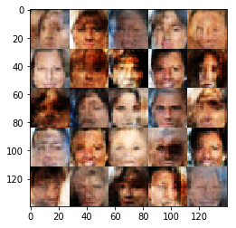


    Epoch 1/10... Discriminator Loss: 0.9235... Generator Loss: 0.9341
    Epoch 1/10... Discriminator Loss: 0.8677... Generator Loss: 1.3201
    Epoch 1/10... Discriminator Loss: 0.7580... Generator Loss: 1.0693
    Epoch 1/10... Discriminator Loss: 1.3809... Generator Loss: 0.4417
    Epoch 1/10... Discriminator Loss: 1.0558... Generator Loss: 0.7070
    Epoch 1/10... Discriminator Loss: 0.6878... Generator Loss: 1.0253
    Epoch 1/10... Discriminator Loss: 1.1582... Generator Loss: 0.5324
    Epoch 1/10... Discriminator Loss: 0.9834... Generator Loss: 2.0839
    Epoch 1/10... Discriminator Loss: 0.8012... Generator Loss: 1.0199
    Epoch 1/10... Discriminator Loss: 1.2279... Generator Loss: 0.5292


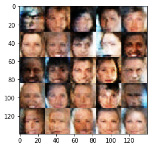


    Epoch 1/10... Discriminator Loss: 0.8291... Generator Loss: 1.1267
    Epoch 1/10... Discriminator Loss: 0.9392... Generator Loss: 0.7170
    Epoch 1/10... Discriminator Loss: 0.8575... Generator Loss: 0.9380
    Epoch 1/10... Discriminator Loss: 1.1043... Generator Loss: 0.5677
    Epoch 1/10... Discriminator Loss: 0.7654... Generator Loss: 1.6794
    Epoch 1/10... Discriminator Loss: 1.0975... Generator Loss: 0.6280
    Epoch 1/10... Discriminator Loss: 0.7873... Generator Loss: 1.9785
    Epoch 1/10... Discriminator Loss: 1.2757... Generator Loss: 0.4303
    Epoch 1/10... Discriminator Loss: 0.8515... Generator Loss: 1.3334
    Epoch 1/10... Discriminator Loss: 0.7967... Generator Loss: 1.0733


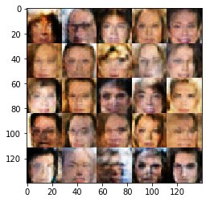


    Epoch 1/10... Discriminator Loss: 1.0328... Generator Loss: 1.0422
    Epoch 1/10... Discriminator Loss: 0.9254... Generator Loss: 2.0752
    Epoch 1/10... Discriminator Loss: 1.0567... Generator Loss: 1.2107
    Epoch 1/10... Discriminator Loss: 0.7906... Generator Loss: 1.0949
    Epoch 1/10... Discriminator Loss: 1.3057... Generator Loss: 0.4218
    Epoch 1/10... Discriminator Loss: 0.6884... Generator Loss: 1.1966
    Epoch 1/10... Discriminator Loss: 1.5424... Generator Loss: 0.3617
    Epoch 1/10... Discriminator Loss: 0.8750... Generator Loss: 0.8137
    Epoch 1/10... Discriminator Loss: 0.8277... Generator Loss: 0.8307
    Epoch 1/10... Discriminator Loss: 0.9373... Generator Loss: 0.9847


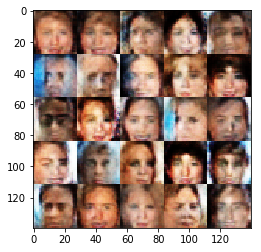


    Epoch 1/10... Discriminator Loss: 1.2877... Generator Loss: 2.1644
    Epoch 1/10... Discriminator Loss: 0.9649... Generator Loss: 1.0034
    Epoch 1/10... Discriminator Loss: 0.9742... Generator Loss: 0.8757
    Epoch 1/10... Discriminator Loss: 0.8198... Generator Loss: 1.6258
    Epoch 1/10... Discriminator Loss: 1.3901... Generator Loss: 0.3865
    Epoch 1/10... Discriminator Loss: 0.8510... Generator Loss: 1.1157
    Epoch 1/10... Discriminator Loss: 1.1278... Generator Loss: 0.5659
    Epoch 1/10... Discriminator Loss: 1.2590... Generator Loss: 0.4808
    Epoch 1/10... Discriminator Loss: 0.9735... Generator Loss: 1.0257
    Epoch 1/10... Discriminator Loss: 0.8343... Generator Loss: 0.9026


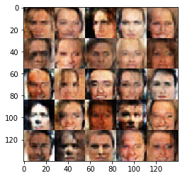


    Epoch 1/10... Discriminator Loss: 0.9436... Generator Loss: 2.1830
    Epoch 1/10... Discriminator Loss: 1.0222... Generator Loss: 1.0487
    Epoch 1/10... Discriminator Loss: 1.5994... Generator Loss: 0.3174
    Epoch 1/10... Discriminator Loss: 0.8968... Generator Loss: 1.5614
    Epoch 1/10... Discriminator Loss: 0.8208... Generator Loss: 0.8278
    Epoch 1/10... Discriminator Loss: 0.4257... Generator Loss: 1.6629
    Epoch 1/10... Discriminator Loss: 1.5009... Generator Loss: 3.7360
    Epoch 1/10... Discriminator Loss: 0.9551... Generator Loss: 1.3161
    Epoch 1/10... Discriminator Loss: 0.6646... Generator Loss: 1.4027
    Epoch 1/10... Discriminator Loss: 1.0113... Generator Loss: 0.7583


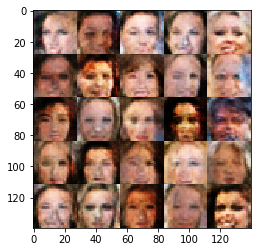


    Epoch 1/10... Discriminator Loss: 1.1021... Generator Loss: 0.9566
    Epoch 1/10... Discriminator Loss: 0.9449... Generator Loss: 0.8874
    Epoch 1/10... Discriminator Loss: 1.5664... Generator Loss: 0.3299
    Epoch 1/10... Discriminator Loss: 0.9895... Generator Loss: 2.6004
    Epoch 1/10... Discriminator Loss: 0.9617... Generator Loss: 0.7419
    Epoch 1/10... Discriminator Loss: 0.7613... Generator Loss: 1.2311
    Epoch 1/10... Discriminator Loss: 0.7400... Generator Loss: 1.0126
    Epoch 1/10... Discriminator Loss: 0.9400... Generator Loss: 1.3014
    Epoch 1/10... Discriminator Loss: 1.1618... Generator Loss: 1.6059
    Epoch 1/10... Discriminator Loss: 0.8613... Generator Loss: 1.3441


    Epoch 1/10... Discriminator Loss: 1.0376... Generator Loss: 1.6232
    Epoch 1/10... Discriminator Loss: 1.0908... Generator Loss: 0.5404
    Epoch 1/10... Discriminator Loss: 0.9869... Generator Loss: 1.1778
    Epoch 1/10... Discriminator Loss: 1.1669... Generator Loss: 0.6906
    Epoch 1/10... Discriminator Loss: 0.9329... Generator Loss: 0.6910
    Epoch 1/10... Discriminator Loss: 0.8524... Generator Loss: 0.8030
    Epoch 1/10... Discriminator Loss: 0.8596... Generator Loss: 0.9809
    Epoch 1/10... Discriminator Loss: 1.1031... Generator Loss: 0.6045
    Epoch 1/10... Discriminator Loss: 0.9952... Generator Loss: 0.8781
    Epoch 1/10... Discriminator Loss: 0.9301... Generator Loss: 0.7381


    Epoch 1/10... Discriminator Loss: 0.9819... Generator Loss: 1.0742
    Epoch 1/10... Discriminator Loss: 0.7600... Generator Loss: 1.1961
    Epoch 1/10... Discriminator Loss: 1.2442... Generator Loss: 0.4723
    Epoch 1/10... Discriminator Loss: 1.0191... Generator Loss: 0.6006
    Epoch 1/10... Discriminator Loss: 0.9757... Generator Loss: 0.9215
    Epoch 1/10... Discriminator Loss: 1.2121... Generator Loss: 0.9293
    Epoch 1/10... Discriminator Loss: 0.9911... Generator Loss: 0.6897
    Epoch 1/10... Discriminator Loss: 0.6592... Generator Loss: 1.8547
    Epoch 1/10... Discriminator Loss: 0.9641... Generator Loss: 0.8975
    Epoch 1/10... Discriminator Loss: 0.6042... Generator Loss: 1.3126


    Epoch 1/10... Discriminator Loss: 1.0946... Generator Loss: 1.2225
    Epoch 1/10... Discriminator Loss: 1.4821... Generator Loss: 0.3660
    Epoch 1/10... Discriminator Loss: 0.7089... Generator Loss: 2.2800
    Epoch 1/10... Discriminator Loss: 1.3470... Generator Loss: 0.3978
    Epoch 1/10... Discriminator Loss: 1.7436... Generator Loss: 0.2988
    Epoch 1/10... Discriminator Loss: 0.8733... Generator Loss: 1.0744
    Epoch 1/10... Discriminator Loss: 1.2435... Generator Loss: 0.6048
    Epoch 1/10... Discriminator Loss: 0.7649... Generator Loss: 1.3900
    Epoch 1/10... Discriminator Loss: 0.9914... Generator Loss: 1.1609
    Epoch 1/10... Discriminator Loss: 0.9609... Generator Loss: 1.5372


    Epoch 1/10... Discriminator Loss: 0.9466... Generator Loss: 1.3526
    Epoch 1/10... Discriminator Loss: 1.0281... Generator Loss: 0.5956
    Epoch 1/10... Discriminator Loss: 0.5049... Generator Loss: 1.6719
    Epoch 1/10... Discriminator Loss: 1.0281... Generator Loss: 1.4662
    Epoch 1/10... Discriminator Loss: 1.3154... Generator Loss: 0.7302
    Epoch 1/10... Discriminator Loss: 0.8063... Generator Loss: 1.0124
    Epoch 1/10... Discriminator Loss: 1.0111... Generator Loss: 1.4107
    Epoch 1/10... Discriminator Loss: 0.8749... Generator Loss: 1.0810
    Epoch 1/10... Discriminator Loss: 1.3419... Generator Loss: 0.4102
    Epoch 1/10... Discriminator Loss: 1.4587... Generator Loss: 0.3624


    Epoch 1/10... Discriminator Loss: 1.3915... Generator Loss: 0.3993
    Epoch 1/10... Discriminator Loss: 0.9547... Generator Loss: 0.7853
    Epoch 1/10... Discriminator Loss: 0.9834... Generator Loss: 0.6748
    Epoch 1/10... Discriminator Loss: 1.1689... Generator Loss: 1.9361
    Epoch 1/10... Discriminator Loss: 0.9472... Generator Loss: 0.7051
    Epoch 1/10... Discriminator Loss: 0.7490... Generator Loss: 1.7354
    Epoch 1/10... Discriminator Loss: 1.4660... Generator Loss: 0.9093
    Epoch 1/10... Discriminator Loss: 0.9318... Generator Loss: 0.8269
    Epoch 1/10... Discriminator Loss: 1.4405... Generator Loss: 2.0101
    Epoch 1/10... Discriminator Loss: 0.7656... Generator Loss: 1.4417


    Epoch 1/10... Discriminator Loss: 0.9531... Generator Loss: 0.9358
    Epoch 1/10... Discriminator Loss: 0.9439... Generator Loss: 0.8680
    Epoch 1/10... Discriminator Loss: 1.2586... Generator Loss: 0.4629
    Epoch 1/10... Discriminator Loss: 1.1448... Generator Loss: 0.6550
    Epoch 1/10... Discriminator Loss: 1.4532... Generator Loss: 0.4651
    Epoch 1/10... Discriminator Loss: 0.7757... Generator Loss: 0.8144
    Epoch 1/10... Discriminator Loss: 1.0746... Generator Loss: 2.6241
    Epoch 1/10... Discriminator Loss: 1.0942... Generator Loss: 0.6411
    Epoch 1/10... Discriminator Loss: 1.4898... Generator Loss: 0.3161
    Epoch 1/10... Discriminator Loss: 1.0763... Generator Loss: 0.7181


    Epoch 1/10... Discriminator Loss: 1.8915... Generator Loss: 1.8251
    Epoch 1/10... Discriminator Loss: 0.7237... Generator Loss: 1.3039
    Epoch 1/10... Discriminator Loss: 1.3408... Generator Loss: 0.5926
    Epoch 1/10... Discriminator Loss: 0.9192... Generator Loss: 0.7430
    Epoch 1/10... Discriminator Loss: 1.3266... Generator Loss: 0.4565
    Epoch 1/10... Discriminator Loss: 0.6576... Generator Loss: 1.2871
    Epoch 1/10... Discriminator Loss: 0.7132... Generator Loss: 1.1730
    Epoch 1/10... Discriminator Loss: 1.2574... Generator Loss: 1.7359
    Epoch 1/10... Discriminator Loss: 1.2722... Generator Loss: 0.5153
    Epoch 1/10... Discriminator Loss: 1.2629... Generator Loss: 0.5014


    Epoch 1/10... Discriminator Loss: 0.6593... Generator Loss: 1.0893
    Epoch 1/10... Discriminator Loss: 0.9559... Generator Loss: 0.7008
    Epoch 1/10... Discriminator Loss: 0.5794... Generator Loss: 1.1391
    Epoch 1/10... Discriminator Loss: 1.0535... Generator Loss: 1.0775
    Epoch 1/10... Discriminator Loss: 1.2298... Generator Loss: 0.5218
    Epoch 1/10... Discriminator Loss: 1.7830... Generator Loss: 0.2456
    Epoch 1/10... Discriminator Loss: 1.6709... Generator Loss: 2.1213
    Epoch 1/10... Discriminator Loss: 1.2531... Generator Loss: 0.6557
    Epoch 1/10... Discriminator Loss: 1.2111... Generator Loss: 1.1149
    Epoch 1/10... Discriminator Loss: 1.3230... Generator Loss: 0.4394


    Epoch 1/10... Discriminator Loss: 0.7349... Generator Loss: 2.8350
    Epoch 1/10... Discriminator Loss: 1.4375... Generator Loss: 0.3988
    Epoch 1/10... Discriminator Loss: 0.7378... Generator Loss: 1.8097
    Epoch 1/10... Discriminator Loss: 2.0570... Generator Loss: 0.1858
    Epoch 1/10... Discriminator Loss: 0.8229... Generator Loss: 1.1208
    Epoch 1/10... Discriminator Loss: 1.2994... Generator Loss: 0.6900
    Epoch 1/10... Discriminator Loss: 1.2939... Generator Loss: 0.3938
    Epoch 1/10... Discriminator Loss: 0.6846... Generator Loss: 0.8973
    Epoch 1/10... Discriminator Loss: 0.5356... Generator Loss: 1.8541
    Epoch 1/10... Discriminator Loss: 1.2870... Generator Loss: 0.5090


    Epoch 1/10... Discriminator Loss: 0.8242... Generator Loss: 1.7957
    Epoch 1/10... Discriminator Loss: 0.8107... Generator Loss: 1.4355
    Epoch 1/10... Discriminator Loss: 1.2527... Generator Loss: 0.4053
    Epoch 1/10... Discriminator Loss: 0.6343... Generator Loss: 1.5362
    Epoch 1/10... Discriminator Loss: 1.4006... Generator Loss: 0.5265
    Epoch 1/10... Discriminator Loss: 1.1110... Generator Loss: 1.8645
    Epoch 1/10... Discriminator Loss: 0.4130... Generator Loss: 1.4921
    Epoch 1/10... Discriminator Loss: 0.9273... Generator Loss: 1.0028
    Epoch 1/10... Discriminator Loss: 0.9375... Generator Loss: 0.9987
    Epoch 1/10... Discriminator Loss: 1.1911... Generator Loss: 0.5045


    Epoch 1/10... Discriminator Loss: 0.9890... Generator Loss: 0.7937
    Epoch 1/10... Discriminator Loss: 0.9649... Generator Loss: 0.8884
    Epoch 1/10... Discriminator Loss: 1.2215... Generator Loss: 0.5371
    Epoch 1/10... Discriminator Loss: 1.0988... Generator Loss: 0.8113
    Epoch 1/10... Discriminator Loss: 2.0098... Generator Loss: 0.2703
    Epoch 1/10... Discriminator Loss: 0.6683... Generator Loss: 1.2299
    Epoch 1/10... Discriminator Loss: 0.7560... Generator Loss: 1.0332
    Epoch 1/10... Discriminator Loss: 0.9201... Generator Loss: 0.6343
    Epoch 1/10... Discriminator Loss: 0.9473... Generator Loss: 0.5720
    Epoch 1/10... Discriminator Loss: 0.8684... Generator Loss: 0.7801


    Epoch 1/10... Discriminator Loss: 0.6923... Generator Loss: 1.2558
    Epoch 1/10... Discriminator Loss: 1.1199... Generator Loss: 0.7166
    Epoch 1/10... Discriminator Loss: 0.8366... Generator Loss: 1.3060
    Epoch 1/10... Discriminator Loss: 0.6175... Generator Loss: 1.1359
    Epoch 1/10... Discriminator Loss: 0.3139... Generator Loss: 2.0936
    Epoch 1/10... Discriminator Loss: 2.0488... Generator Loss: 2.2649
    Epoch 1/10... Discriminator Loss: 1.4121... Generator Loss: 0.4292
    Epoch 1/10... Discriminator Loss: 1.2081... Generator Loss: 0.5509
    Epoch 1/10... Discriminator Loss: 0.8782... Generator Loss: 0.8153
    Epoch 1/10... Discriminator Loss: 0.6234... Generator Loss: 1.3542


    Epoch 1/10... Discriminator Loss: 0.7800... Generator Loss: 0.9687
    Epoch 1/10... Discriminator Loss: 0.9394... Generator Loss: 1.0115
    Epoch 1/10... Discriminator Loss: 0.9476... Generator Loss: 0.8891
    Epoch 1/10... Discriminator Loss: 1.1853... Generator Loss: 0.5451
    Epoch 1/10... Discriminator Loss: 1.2834... Generator Loss: 0.5380
    Epoch 1/10... Discriminator Loss: 1.2548... Generator Loss: 0.5513
    Epoch 1/10... Discriminator Loss: 1.0037... Generator Loss: 0.8896
    Epoch 1/10... Discriminator Loss: 0.5545... Generator Loss: 1.2789
    Epoch 1/10... Discriminator Loss: 0.9007... Generator Loss: 0.6579
    Epoch 1/10... Discriminator Loss: 1.0211... Generator Loss: 0.5637


    Epoch 1/10... Discriminator Loss: 0.9962... Generator Loss: 1.6408
    Epoch 1/10... Discriminator Loss: 0.7978... Generator Loss: 1.9714
    Epoch 1/10... Discriminator Loss: 0.5281... Generator Loss: 1.2800
    Epoch 1/10... Discriminator Loss: 1.2955... Generator Loss: 0.5072
    Epoch 1/10... Discriminator Loss: 1.2966... Generator Loss: 0.5265
    Epoch 1/10... Discriminator Loss: 1.2352... Generator Loss: 0.8648
    Epoch 1/10... Discriminator Loss: 1.0649... Generator Loss: 1.1780
    Epoch 1/10... Discriminator Loss: 0.8432... Generator Loss: 1.1712
    Epoch 1/10... Discriminator Loss: 0.9588... Generator Loss: 1.6270
    Epoch 1/10... Discriminator Loss: 0.9798... Generator Loss: 0.9820


    Epoch 1/10... Discriminator Loss: 0.9596... Generator Loss: 0.7914
    Epoch 1/10... Discriminator Loss: 1.1317... Generator Loss: 0.5962
    Epoch 1/10... Discriminator Loss: 1.0596... Generator Loss: 0.6729
    Epoch 1/10... Discriminator Loss: 1.0922... Generator Loss: 0.9452
    Epoch 1/10... Discriminator Loss: 1.3150... Generator Loss: 0.4246
    Epoch 1/10... Discriminator Loss: 1.2151... Generator Loss: 0.6286
    Epoch 1/10... Discriminator Loss: 1.3961... Generator Loss: 0.3601
    Epoch 1/10... Discriminator Loss: 0.9743... Generator Loss: 1.5144
    Epoch 1/10... Discriminator Loss: 1.0688... Generator Loss: 0.6345
    Epoch 1/10... Discriminator Loss: 1.5408... Generator Loss: 0.3707


    Epoch 1/10... Discriminator Loss: 1.4383... Generator Loss: 0.5183
    Epoch 1/10... Discriminator Loss: 0.7150... Generator Loss: 1.0192
    Epoch 1/10... Discriminator Loss: 1.3318... Generator Loss: 0.4213
    Epoch 1/10... Discriminator Loss: 0.6568... Generator Loss: 1.9805
    Epoch 1/10... Discriminator Loss: 1.1262... Generator Loss: 0.6433
    Epoch 1/10... Discriminator Loss: 1.1404... Generator Loss: 0.7211
    Epoch 1/10... Discriminator Loss: 0.8771... Generator Loss: 1.1329
    Epoch 1/10... Discriminator Loss: 0.7191... Generator Loss: 1.4625
    Epoch 1/10... Discriminator Loss: 0.8948... Generator Loss: 0.7795
    Epoch 1/10... Discriminator Loss: 0.7784... Generator Loss: 1.8645


    Epoch 1/10... Discriminator Loss: 2.0346... Generator Loss: 0.1894
    Epoch 1/10... Discriminator Loss: 0.5827... Generator Loss: 1.4790
    Epoch 1/10... Discriminator Loss: 1.1168... Generator Loss: 0.5564
    Epoch 1/10... Discriminator Loss: 0.6903... Generator Loss: 1.0002
    Epoch 1/10... Discriminator Loss: 0.5098... Generator Loss: 1.1976
    Epoch 1/10... Discriminator Loss: 0.7095... Generator Loss: 1.3502
    Epoch 1/10... Discriminator Loss: 0.7592... Generator Loss: 3.0633
    Epoch 1/10... Discriminator Loss: 0.8919... Generator Loss: 1.8211
    Epoch 1/10... Discriminator Loss: 1.4312... Generator Loss: 0.4189
    Epoch 1/10... Discriminator Loss: 0.8996... Generator Loss: 0.7505


    Epoch 1/10... Discriminator Loss: 0.8670... Generator Loss: 1.0982
    Epoch 1/10... Discriminator Loss: 1.1177... Generator Loss: 2.1219
    Epoch 1/10... Discriminator Loss: 1.2067... Generator Loss: 0.6115
    Epoch 1/10... Discriminator Loss: 0.9339... Generator Loss: 1.6985
    Epoch 1/10... Discriminator Loss: 0.6169... Generator Loss: 1.6904
    Epoch 1/10... Discriminator Loss: 1.1596... Generator Loss: 0.5362
    Epoch 1/10... Discriminator Loss: 1.1564... Generator Loss: 0.7024
    Epoch 1/10... Discriminator Loss: 1.6281... Generator Loss: 0.2912
    Epoch 1/10... Discriminator Loss: 0.9706... Generator Loss: 0.7696
    Epoch 1/10... Discriminator Loss: 1.3092... Generator Loss: 0.6387


    Epoch 1/10... Discriminator Loss: 0.7545... Generator Loss: 0.9826
    Epoch 1/10... Discriminator Loss: 0.7173... Generator Loss: 1.0247
    Epoch 1/10... Discriminator Loss: 0.7525... Generator Loss: 0.9890
    Epoch 1/10... Discriminator Loss: 1.1087... Generator Loss: 0.5819
    Epoch 1/10... Discriminator Loss: 1.0053... Generator Loss: 0.6615
    Epoch 1/10... Discriminator Loss: 0.5561... Generator Loss: 1.7098
    Epoch 1/10... Discriminator Loss: 0.7572... Generator Loss: 0.9090
    Epoch 1/10... Discriminator Loss: 0.8955... Generator Loss: 0.8187
    Epoch 1/10... Discriminator Loss: 1.2806... Generator Loss: 0.5161
    Epoch 1/10... Discriminator Loss: 1.0183... Generator Loss: 0.6745


    Epoch 1/10... Discriminator Loss: 1.0901... Generator Loss: 0.6816
    Epoch 1/10... Discriminator Loss: 1.3755... Generator Loss: 1.7853
    Epoch 1/10... Discriminator Loss: 1.6630... Generator Loss: 0.4272
    Epoch 1/10... Discriminator Loss: 1.7683... Generator Loss: 1.3704
    Epoch 1/10... Discriminator Loss: 0.9196... Generator Loss: 1.0787
    Epoch 1/10... Discriminator Loss: 1.0504... Generator Loss: 0.7230
    Epoch 1/10... Discriminator Loss: 0.9533... Generator Loss: 1.1584
    Epoch 1/10... Discriminator Loss: 1.0623... Generator Loss: 1.7946
    Epoch 1/10... Discriminator Loss: 1.1045... Generator Loss: 0.9692
    Epoch 1/10... Discriminator Loss: 0.7790... Generator Loss: 0.9488


    Epoch 1/10... Discriminator Loss: 0.8251... Generator Loss: 1.2383
    Epoch 1/10... Discriminator Loss: 0.8473... Generator Loss: 1.8823
    Epoch 1/10... Discriminator Loss: 1.0038... Generator Loss: 0.7701
    Epoch 1/10... Discriminator Loss: 1.1676... Generator Loss: 0.7277
    Epoch 1/10... Discriminator Loss: 0.9876... Generator Loss: 0.6058
    Epoch 1/10... Discriminator Loss: 1.3624... Generator Loss: 0.4581
    Epoch 1/10... Discriminator Loss: 0.8811... Generator Loss: 0.8140
    Epoch 1/10... Discriminator Loss: 0.7093... Generator Loss: 1.0681
    Epoch 1/10... Discriminator Loss: 0.6401... Generator Loss: 1.3593
    Epoch 1/10... Discriminator Loss: 0.8264... Generator Loss: 0.7572


    Epoch 1/10... Discriminator Loss: 1.0041... Generator Loss: 0.9754
    Epoch 1/10... Discriminator Loss: 1.2102... Generator Loss: 0.6048
    Epoch 1/10... Discriminator Loss: 1.2245... Generator Loss: 0.5344
    Epoch 1/10... Discriminator Loss: 1.0931... Generator Loss: 0.6679
    Epoch 1/10... Discriminator Loss: 0.8927... Generator Loss: 0.9289
    Epoch 1/10... Discriminator Loss: 0.9962... Generator Loss: 1.2674
    Epoch 1/10... Discriminator Loss: 0.8018... Generator Loss: 0.8384
    Epoch 1/10... Discriminator Loss: 0.7925... Generator Loss: 0.9183
    Epoch 1/10... Discriminator Loss: 0.9411... Generator Loss: 0.8346
    Epoch 1/10... Discriminator Loss: 0.8286... Generator Loss: 1.3701


    Epoch 1/10... Discriminator Loss: 1.0393... Generator Loss: 1.3723
    Epoch 1/10... Discriminator Loss: 0.7737... Generator Loss: 1.4456
    Epoch 1/10... Discriminator Loss: 0.7394... Generator Loss: 1.1742
    Epoch 1/10... Discriminator Loss: 1.0767... Generator Loss: 0.6803
    Epoch 1/10... Discriminator Loss: 0.5859... Generator Loss: 1.2442
    Epoch 1/10... Discriminator Loss: 1.5866... Generator Loss: 0.6179
    Epoch 1/10... Discriminator Loss: 0.6404... Generator Loss: 1.3948
    Epoch 1/10... Discriminator Loss: 1.1500... Generator Loss: 0.4896
    Epoch 1/10... Discriminator Loss: 0.8497... Generator Loss: 1.1955
    Epoch 1/10... Discriminator Loss: 1.1757... Generator Loss: 0.5337


    Epoch 1/10... Discriminator Loss: 0.5820... Generator Loss: 1.6062
    Epoch 1/10... Discriminator Loss: 1.0380... Generator Loss: 1.1892
    Epoch 1/10... Discriminator Loss: 0.4215... Generator Loss: 1.5480
    Epoch 1/10... Discriminator Loss: 1.3178... Generator Loss: 0.6515
    Epoch 1/10... Discriminator Loss: 0.7387... Generator Loss: 1.1934
    Epoch 1/10... Discriminator Loss: 1.0527... Generator Loss: 0.7193
    Epoch 1/10... Discriminator Loss: 0.9351... Generator Loss: 0.7166
    Epoch 1/10... Discriminator Loss: 1.0313... Generator Loss: 3.3894
    Epoch 1/10... Discriminator Loss: 0.9095... Generator Loss: 1.2709
    Epoch 1/10... Discriminator Loss: 0.8703... Generator Loss: 0.7420


    Epoch 1/10... Discriminator Loss: 1.1152... Generator Loss: 0.6770
    Epoch 1/10... Discriminator Loss: 0.8080... Generator Loss: 1.1508
    Epoch 1/10... Discriminator Loss: 0.8582... Generator Loss: 1.3343
    Epoch 1/10... Discriminator Loss: 1.2464... Generator Loss: 0.4652
    Epoch 1/10... Discriminator Loss: 1.1687... Generator Loss: 0.6066
    Epoch 1/10... Discriminator Loss: 0.6982... Generator Loss: 1.4058
    Epoch 1/10... Discriminator Loss: 1.0590... Generator Loss: 0.5952
    Epoch 1/10... Discriminator Loss: 0.8240... Generator Loss: 1.0581
    Epoch 1/10... Discriminator Loss: 0.8262... Generator Loss: 1.6095
    Epoch 1/10... Discriminator Loss: 0.9030... Generator Loss: 0.7772


    Epoch 1/10... Discriminator Loss: 0.3286... Generator Loss: 1.9736
    Epoch 1/10... Discriminator Loss: 0.6546... Generator Loss: 1.8551
    Epoch 1/10... Discriminator Loss: 0.7216... Generator Loss: 1.4389
    Epoch 1/10... Discriminator Loss: 0.9041... Generator Loss: 1.1037
    Epoch 1/10... Discriminator Loss: 1.2137... Generator Loss: 1.0103
    Epoch 1/10... Discriminator Loss: 0.7432... Generator Loss: 1.0971
    Epoch 1/10... Discriminator Loss: 0.9723... Generator Loss: 1.0187
    Epoch 1/10... Discriminator Loss: 1.1455... Generator Loss: 0.4967
    Epoch 1/10... Discriminator Loss: 0.6064... Generator Loss: 0.9915
    Epoch 1/10... Discriminator Loss: 0.8426... Generator Loss: 1.0041


    Epoch 1/10... Discriminator Loss: 0.9421... Generator Loss: 0.7103
    Epoch 1/10... Discriminator Loss: 1.0139... Generator Loss: 0.6706
    Epoch 1/10... Discriminator Loss: 0.9386... Generator Loss: 0.9678
    Epoch 1/10... Discriminator Loss: 0.9897... Generator Loss: 0.9211
    Epoch 1/10... Discriminator Loss: 1.0306... Generator Loss: 0.7397
    Epoch 1/10... Discriminator Loss: 0.6909... Generator Loss: 1.2204
    Epoch 1/10... Discriminator Loss: 0.9195... Generator Loss: 0.8930
    Epoch 1/10... Discriminator Loss: 1.1076... Generator Loss: 0.7199
    Epoch 1/10... Discriminator Loss: 0.8609... Generator Loss: 0.8408
    Epoch 1/10... Discriminator Loss: 0.7691... Generator Loss: 1.1323


    Epoch 1/10... Discriminator Loss: 0.7676... Generator Loss: 1.3391
    Epoch 1/10... Discriminator Loss: 0.6581... Generator Loss: 1.0803
    Epoch 1/10... Discriminator Loss: 1.0300... Generator Loss: 0.7024
    Epoch 1/10... Discriminator Loss: 1.0451... Generator Loss: 1.0331
    Epoch 1/10... Discriminator Loss: 1.1265... Generator Loss: 0.6941
    Epoch 1/10... Discriminator Loss: 0.9180... Generator Loss: 0.9100
    Epoch 1/10... Discriminator Loss: 1.0311... Generator Loss: 0.6568
    Epoch 1/10... Discriminator Loss: 0.8213... Generator Loss: 1.2373
    Epoch 1/10... Discriminator Loss: 0.8217... Generator Loss: 0.8046
    Epoch 1/10... Discriminator Loss: 1.2009... Generator Loss: 0.5313


    Epoch 1/10... Discriminator Loss: 0.9514... Generator Loss: 0.7675
    Epoch 1/10... Discriminator Loss: 0.5013... Generator Loss: 1.6529
    Epoch 1/10... Discriminator Loss: 1.1066... Generator Loss: 0.6022
    Epoch 1/10... Discriminator Loss: 0.7937... Generator Loss: 0.9791
    Epoch 1/10... Discriminator Loss: 0.6253... Generator Loss: 2.2676
    Epoch 1/10... Discriminator Loss: 1.9254... Generator Loss: 5.1806
    Epoch 1/10... Discriminator Loss: 1.0353... Generator Loss: 2.4345
    Epoch 1/10... Discriminator Loss: 1.3785... Generator Loss: 1.0320
    Epoch 1/10... Discriminator Loss: 0.5962... Generator Loss: 1.1787
    Epoch 1/10... Discriminator Loss: 0.4856... Generator Loss: 3.0582


    Epoch 1/10... Discriminator Loss: 1.9848... Generator Loss: 0.2048
    Epoch 1/10... Discriminator Loss: 0.6417... Generator Loss: 2.8498
    Epoch 1/10... Discriminator Loss: 1.0867... Generator Loss: 0.6640
    Epoch 1/10... Discriminator Loss: 0.3439... Generator Loss: 4.0495
    Epoch 1/10... Discriminator Loss: 0.1382... Generator Loss: 2.9686
    Epoch 1/10... Discriminator Loss: 1.8829... Generator Loss: 0.2708
    Epoch 1/10... Discriminator Loss: 0.6679... Generator Loss: 1.0393
    Epoch 1/10... Discriminator Loss: 1.8006... Generator Loss: 0.2379
    Epoch 1/10... Discriminator Loss: 1.0026... Generator Loss: 0.6972
    Epoch 1/10... Discriminator Loss: 0.6982... Generator Loss: 1.2374


    Epoch 1/10... Discriminator Loss: 1.4870... Generator Loss: 0.3291
    Epoch 1/10... Discriminator Loss: 2.4422... Generator Loss: 3.8864
    Epoch 1/10... Discriminator Loss: 0.5243... Generator Loss: 1.5653
    Epoch 1/10... Discriminator Loss: 0.7140... Generator Loss: 1.1428
    Epoch 1/10... Discriminator Loss: 1.2684... Generator Loss: 2.6377
    Epoch 1/10... Discriminator Loss: 0.8397... Generator Loss: 0.7770
    Epoch 1/10... Discriminator Loss: 1.0828... Generator Loss: 0.8387
    Epoch 1/10... Discriminator Loss: 0.6894... Generator Loss: 3.2790
    Epoch 1/10... Discriminator Loss: 0.8102... Generator Loss: 0.9052
    Epoch 1/10... Discriminator Loss: 0.6139... Generator Loss: 1.9237


    Epoch 1/10... Discriminator Loss: 1.0297... Generator Loss: 0.6827
    Epoch 1/10... Discriminator Loss: 0.7787... Generator Loss: 1.0528
    Epoch 1/10... Discriminator Loss: 0.9678... Generator Loss: 0.8910
    Epoch 1/10... Discriminator Loss: 0.3578... Generator Loss: 1.7066
    Epoch 1/10... Discriminator Loss: 0.8146... Generator Loss: 0.9853
    Epoch 1/10... Discriminator Loss: 0.6976... Generator Loss: 1.6949
    Epoch 1/10... Discriminator Loss: 0.5438... Generator Loss: 2.3361
    Epoch 1/10... Discriminator Loss: 0.6582... Generator Loss: 1.0615
    Epoch 1/10... Discriminator Loss: 1.2849... Generator Loss: 0.4600
    Epoch 1/10... Discriminator Loss: 1.0422... Generator Loss: 1.0177


    Epoch 1/10... Discriminator Loss: 0.7158... Generator Loss: 1.2739
    Epoch 1/10... Discriminator Loss: 0.8072... Generator Loss: 1.0290
    Epoch 1/10... Discriminator Loss: 1.1254... Generator Loss: 0.5655
    Epoch 1/10... Discriminator Loss: 0.5772... Generator Loss: 1.2405
    Epoch 1/10... Discriminator Loss: 0.5603... Generator Loss: 1.1273
    Epoch 1/10... Discriminator Loss: 0.9548... Generator Loss: 1.7011
    Epoch 1/10... Discriminator Loss: 0.7279... Generator Loss: 2.0456
    Epoch 1/10... Discriminator Loss: 0.8748... Generator Loss: 0.9448
    Epoch 1/10... Discriminator Loss: 0.9737... Generator Loss: 0.7607
    Epoch 1/10... Discriminator Loss: 1.4618... Generator Loss: 0.3601


    Epoch 1/10... Discriminator Loss: 0.8443... Generator Loss: 1.2844
    Epoch 1/10... Discriminator Loss: 0.6345... Generator Loss: 1.4243
    Epoch 1/10... Discriminator Loss: 0.9456... Generator Loss: 0.7656
    Epoch 1/10... Discriminator Loss: 1.4097... Generator Loss: 3.1660
    Epoch 1/10... Discriminator Loss: 1.0598... Generator Loss: 0.7994
    Epoch 1/10... Discriminator Loss: 0.6267... Generator Loss: 1.6874
    Epoch 1/10... Discriminator Loss: 1.0667... Generator Loss: 0.5774
    Epoch 1/10... Discriminator Loss: 0.6878... Generator Loss: 1.3147
    Epoch 1/10... Discriminator Loss: 0.8088... Generator Loss: 1.0376
    Epoch 1/10... Discriminator Loss: 0.8547... Generator Loss: 1.1565


    Epoch 1/10... Discriminator Loss: 0.9382... Generator Loss: 1.5787
    Epoch 1/10... Discriminator Loss: 0.9974... Generator Loss: 0.7067
    Epoch 1/10... Discriminator Loss: 0.8486... Generator Loss: 1.2151
    Epoch 2/10... Discriminator Loss: 0.9296... Generator Loss: 1.6317
    Epoch 2/10... Discriminator Loss: 0.7467... Generator Loss: 1.6375
    Epoch 2/10... Discriminator Loss: 0.8687... Generator Loss: 1.0600
    Epoch 2/10... Discriminator Loss: 1.0660... Generator Loss: 0.6313
    Epoch 2/10... Discriminator Loss: 0.7139... Generator Loss: 1.4037
    Epoch 2/10... Discriminator Loss: 0.9898... Generator Loss: 1.2045
    Epoch 2/10... Discriminator Loss: 0.6542... Generator Loss: 2.1112


    Epoch 2/10... Discriminator Loss: 0.6234... Generator Loss: 1.4149
    Epoch 2/10... Discriminator Loss: 1.0399... Generator Loss: 0.8202
    Epoch 2/10... Discriminator Loss: 0.9511... Generator Loss: 0.7123
    Epoch 2/10... Discriminator Loss: 0.6554... Generator Loss: 2.6925
    Epoch 2/10... Discriminator Loss: 0.6744... Generator Loss: 0.9152
    Epoch 2/10... Discriminator Loss: 1.1414... Generator Loss: 0.6012
    Epoch 2/10... Discriminator Loss: 0.9174... Generator Loss: 1.6011
    Epoch 2/10... Discriminator Loss: 0.8596... Generator Loss: 0.9657
    Epoch 2/10... Discriminator Loss: 1.2756... Generator Loss: 0.4754
    Epoch 2/10... Discriminator Loss: 0.8545... Generator Loss: 0.9539


    Epoch 2/10... Discriminator Loss: 1.0298... Generator Loss: 0.7658
    Epoch 2/10... Discriminator Loss: 0.9240... Generator Loss: 0.6896
    Epoch 2/10... Discriminator Loss: 1.2708... Generator Loss: 0.6715
    Epoch 2/10... Discriminator Loss: 0.7268... Generator Loss: 1.1648
    Epoch 2/10... Discriminator Loss: 0.6785... Generator Loss: 1.2737
    Epoch 2/10... Discriminator Loss: 0.5239... Generator Loss: 1.8435
    Epoch 2/10... Discriminator Loss: 2.3256... Generator Loss: 0.2046
    Epoch 2/10... Discriminator Loss: 1.1236... Generator Loss: 0.5281
    Epoch 2/10... Discriminator Loss: 0.6345... Generator Loss: 1.1826
    Epoch 2/10... Discriminator Loss: 1.0533... Generator Loss: 0.6783


    Epoch 2/10... Discriminator Loss: 0.8947... Generator Loss: 0.7156
    Epoch 2/10... Discriminator Loss: 1.4316... Generator Loss: 0.3951
    Epoch 2/10... Discriminator Loss: 0.9776... Generator Loss: 0.7837
    Epoch 2/10... Discriminator Loss: 1.1793... Generator Loss: 0.6123
    Epoch 2/10... Discriminator Loss: 0.7640... Generator Loss: 1.1455
    Epoch 2/10... Discriminator Loss: 1.1366... Generator Loss: 0.6300
    Epoch 2/10... Discriminator Loss: 1.0339... Generator Loss: 1.9874
    Epoch 2/10... Discriminator Loss: 1.3026... Generator Loss: 1.0752
    Epoch 2/10... Discriminator Loss: 1.0970... Generator Loss: 1.3215
    Epoch 2/10... Discriminator Loss: 0.9247... Generator Loss: 1.4294


    Epoch 2/10... Discriminator Loss: 1.0716... Generator Loss: 0.5435
    Epoch 2/10... Discriminator Loss: 1.5637... Generator Loss: 0.3138
    Epoch 2/10... Discriminator Loss: 1.1306... Generator Loss: 0.5967
    Epoch 2/10... Discriminator Loss: 0.8648... Generator Loss: 0.8406
    Epoch 2/10... Discriminator Loss: 1.0062... Generator Loss: 0.7246
    Epoch 2/10... Discriminator Loss: 0.4533... Generator Loss: 1.8485
    Epoch 2/10... Discriminator Loss: 1.0845... Generator Loss: 0.5571
    Epoch 2/10... Discriminator Loss: 0.5811... Generator Loss: 1.3300
    Epoch 2/10... Discriminator Loss: 1.7219... Generator Loss: 0.2384
    Epoch 2/10... Discriminator Loss: 0.5988... Generator Loss: 1.0754


    Epoch 2/10... Discriminator Loss: 0.9312... Generator Loss: 0.8398
    Epoch 2/10... Discriminator Loss: 0.8744... Generator Loss: 1.1782
    Epoch 2/10... Discriminator Loss: 1.0618... Generator Loss: 0.5810
    Epoch 2/10... Discriminator Loss: 0.3857... Generator Loss: 1.8838
    Epoch 2/10... Discriminator Loss: 1.2619... Generator Loss: 1.6234
    Epoch 2/10... Discriminator Loss: 0.7334... Generator Loss: 0.9436
    Epoch 2/10... Discriminator Loss: 0.7018... Generator Loss: 3.0296
    Epoch 2/10... Discriminator Loss: 0.8451... Generator Loss: 0.7782
    Epoch 2/10... Discriminator Loss: 0.8898... Generator Loss: 1.0813
    Epoch 2/10... Discriminator Loss: 1.0174... Generator Loss: 0.8076


    Epoch 2/10... Discriminator Loss: 1.0225... Generator Loss: 0.9179
    Epoch 2/10... Discriminator Loss: 0.7351... Generator Loss: 1.4631
    Epoch 2/10... Discriminator Loss: 0.9875... Generator Loss: 0.7826
    Epoch 2/10... Discriminator Loss: 0.9878... Generator Loss: 0.5916
    Epoch 2/10... Discriminator Loss: 0.8767... Generator Loss: 1.2012
    Epoch 2/10... Discriminator Loss: 0.8901... Generator Loss: 0.8735
    Epoch 2/10... Discriminator Loss: 0.7955... Generator Loss: 1.0964
    Epoch 2/10... Discriminator Loss: 0.9286... Generator Loss: 0.9075
    Epoch 2/10... Discriminator Loss: 1.1588... Generator Loss: 1.0601
    Epoch 2/10... Discriminator Loss: 1.3393... Generator Loss: 0.4451


    Epoch 2/10... Discriminator Loss: 0.6552... Generator Loss: 1.4001
    Epoch 2/10... Discriminator Loss: 1.2306... Generator Loss: 0.6673
    Epoch 2/10... Discriminator Loss: 1.3414... Generator Loss: 0.6249
    Epoch 2/10... Discriminator Loss: 0.9010... Generator Loss: 5.9963
    Epoch 2/10... Discriminator Loss: 0.4682... Generator Loss: 1.5958
    Epoch 2/10... Discriminator Loss: 0.6349... Generator Loss: 2.0990
    Epoch 2/10... Discriminator Loss: 1.2814... Generator Loss: 0.6088
    Epoch 2/10... Discriminator Loss: 0.8718... Generator Loss: 0.8923
    Epoch 2/10... Discriminator Loss: 0.9901... Generator Loss: 0.8782
    Epoch 2/10... Discriminator Loss: 0.9859... Generator Loss: 0.7511


    Epoch 2/10... Discriminator Loss: 0.9594... Generator Loss: 1.7052
    Epoch 2/10... Discriminator Loss: 1.0818... Generator Loss: 1.1705
    Epoch 2/10... Discriminator Loss: 0.8031... Generator Loss: 2.0917
    Epoch 2/10... Discriminator Loss: 1.4807... Generator Loss: 0.3531
    Epoch 2/10... Discriminator Loss: 0.8644... Generator Loss: 1.1045
    Epoch 2/10... Discriminator Loss: 1.1692... Generator Loss: 0.4946
    Epoch 2/10... Discriminator Loss: 1.1192... Generator Loss: 0.5991
    Epoch 2/10... Discriminator Loss: 1.0015... Generator Loss: 0.7630
    Epoch 2/10... Discriminator Loss: 1.0615... Generator Loss: 0.5565
    Epoch 2/10... Discriminator Loss: 0.7070... Generator Loss: 0.7989


    Epoch 2/10... Discriminator Loss: 0.2569... Generator Loss: 1.8336
    Epoch 2/10... Discriminator Loss: 0.3570... Generator Loss: 1.4921
    Epoch 2/10... Discriminator Loss: 1.0137... Generator Loss: 0.8217
    Epoch 2/10... Discriminator Loss: 1.3555... Generator Loss: 0.4443
    Epoch 2/10... Discriminator Loss: 1.0018... Generator Loss: 0.8246
    Epoch 2/10... Discriminator Loss: 0.4202... Generator Loss: 1.8789
    Epoch 2/10... Discriminator Loss: 0.7376... Generator Loss: 1.0060
    Epoch 2/10... Discriminator Loss: 0.7645... Generator Loss: 0.9550
    Epoch 2/10... Discriminator Loss: 0.9665... Generator Loss: 0.8015
    Epoch 2/10... Discriminator Loss: 0.5618... Generator Loss: 1.3229


    Epoch 2/10... Discriminator Loss: 2.6271... Generator Loss: 3.1386
    Epoch 2/10... Discriminator Loss: 0.5781... Generator Loss: 1.9521
    Epoch 2/10... Discriminator Loss: 1.2456... Generator Loss: 0.4744
    Epoch 2/10... Discriminator Loss: 0.5517... Generator Loss: 1.5908
    Epoch 2/10... Discriminator Loss: 1.0054... Generator Loss: 2.0998
    Epoch 2/10... Discriminator Loss: 0.7570... Generator Loss: 0.9044
    Epoch 2/10... Discriminator Loss: 0.9185... Generator Loss: 1.5975
    Epoch 2/10... Discriminator Loss: 0.9272... Generator Loss: 0.7601
    Epoch 2/10... Discriminator Loss: 1.1126... Generator Loss: 0.6073
    Epoch 2/10... Discriminator Loss: 1.0984... Generator Loss: 0.5983


    Epoch 2/10... Discriminator Loss: 1.1452... Generator Loss: 0.5642
    Epoch 2/10... Discriminator Loss: 0.8868... Generator Loss: 2.2002
    Epoch 2/10... Discriminator Loss: 1.3025... Generator Loss: 1.8029
    Epoch 2/10... Discriminator Loss: 0.3592... Generator Loss: 2.0856
    Epoch 2/10... Discriminator Loss: 0.8339... Generator Loss: 0.8388
    Epoch 2/10... Discriminator Loss: 0.4993... Generator Loss: 1.1919
    Epoch 2/10... Discriminator Loss: 1.1923... Generator Loss: 5.3763
    Epoch 2/10... Discriminator Loss: 0.5371... Generator Loss: 1.2782
    Epoch 2/10... Discriminator Loss: 0.6272... Generator Loss: 2.4851
    Epoch 2/10... Discriminator Loss: 0.4834... Generator Loss: 3.7260


    Epoch 2/10... Discriminator Loss: 0.9266... Generator Loss: 0.8749
    Epoch 2/10... Discriminator Loss: 0.3355... Generator Loss: 1.7700
    Epoch 2/10... Discriminator Loss: 0.3725... Generator Loss: 2.6094
    Epoch 2/10... Discriminator Loss: 0.6695... Generator Loss: 1.3629
    Epoch 2/10... Discriminator Loss: 1.3337... Generator Loss: 2.4506
    Epoch 2/10... Discriminator Loss: 0.7110... Generator Loss: 1.0573
    Epoch 2/10... Discriminator Loss: 0.9643... Generator Loss: 1.0317
    Epoch 2/10... Discriminator Loss: 0.8550... Generator Loss: 0.7950
    Epoch 2/10... Discriminator Loss: 1.0655... Generator Loss: 0.5480
    Epoch 2/10... Discriminator Loss: 0.6801... Generator Loss: 1.5349


    Epoch 2/10... Discriminator Loss: 0.6598... Generator Loss: 1.3915
    Epoch 2/10... Discriminator Loss: 0.8967... Generator Loss: 0.7108
    Epoch 2/10... Discriminator Loss: 1.0508... Generator Loss: 0.6891
    Epoch 2/10... Discriminator Loss: 0.8045... Generator Loss: 1.0220
    Epoch 2/10... Discriminator Loss: 0.9781... Generator Loss: 1.0956
    Epoch 2/10... Discriminator Loss: 0.8402... Generator Loss: 0.9938
    Epoch 2/10... Discriminator Loss: 0.8064... Generator Loss: 1.0476
    Epoch 2/10... Discriminator Loss: 1.0060... Generator Loss: 0.6835
    Epoch 2/10... Discriminator Loss: 1.3999... Generator Loss: 0.3973
    Epoch 2/10... Discriminator Loss: 1.1233... Generator Loss: 0.6386


    Epoch 2/10... Discriminator Loss: 0.8405... Generator Loss: 0.8311
    Epoch 2/10... Discriminator Loss: 1.0903... Generator Loss: 0.6109
    Epoch 2/10... Discriminator Loss: 0.9477... Generator Loss: 0.7863
    Epoch 2/10... Discriminator Loss: 1.2115... Generator Loss: 0.4987
    Epoch 2/10... Discriminator Loss: 0.8235... Generator Loss: 2.4799
    Epoch 2/10... Discriminator Loss: 1.1203... Generator Loss: 0.5744
    Epoch 2/10... Discriminator Loss: 0.5378... Generator Loss: 1.6386
    Epoch 2/10... Discriminator Loss: 0.3006... Generator Loss: 4.0210
    Epoch 2/10... Discriminator Loss: 0.5413... Generator Loss: 4.0649
    Epoch 2/10... Discriminator Loss: 0.7292... Generator Loss: 1.0859


    Epoch 2/10... Discriminator Loss: 0.9322... Generator Loss: 1.0785
    Epoch 2/10... Discriminator Loss: 0.3268... Generator Loss: 2.1090
    Epoch 2/10... Discriminator Loss: 3.1592... Generator Loss: 0.0666
    Epoch 2/10... Discriminator Loss: 0.9877... Generator Loss: 3.2584
    Epoch 2/10... Discriminator Loss: 0.4310... Generator Loss: 1.5580
    Epoch 2/10... Discriminator Loss: 0.7908... Generator Loss: 0.8863
    Epoch 2/10... Discriminator Loss: 0.4632... Generator Loss: 1.4234
    Epoch 2/10... Discriminator Loss: 1.0023... Generator Loss: 0.6006
    Epoch 2/10... Discriminator Loss: 0.6109... Generator Loss: 1.4756
    Epoch 2/10... Discriminator Loss: 0.2251... Generator Loss: 3.2492


    Epoch 2/10... Discriminator Loss: 0.9354... Generator Loss: 1.7603
    Epoch 2/10... Discriminator Loss: 0.5637... Generator Loss: 1.3080
    Epoch 2/10... Discriminator Loss: 0.6385... Generator Loss: 1.7176
    Epoch 2/10... Discriminator Loss: 0.1010... Generator Loss: 3.5179
    Epoch 2/10... Discriminator Loss: 0.7912... Generator Loss: 2.2661
    Epoch 2/10... Discriminator Loss: 0.9288... Generator Loss: 1.1183
    Epoch 2/10... Discriminator Loss: 0.7106... Generator Loss: 1.1782
    Epoch 2/10... Discriminator Loss: 0.6825... Generator Loss: 1.4764
    Epoch 2/10... Discriminator Loss: 1.0024... Generator Loss: 0.8854
    Epoch 2/10... Discriminator Loss: 0.9337... Generator Loss: 0.6543


    Epoch 2/10... Discriminator Loss: 0.9925... Generator Loss: 0.6639
    Epoch 2/10... Discriminator Loss: 1.0301... Generator Loss: 0.6585
    Epoch 2/10... Discriminator Loss: 0.7260... Generator Loss: 1.6920
    Epoch 2/10... Discriminator Loss: 1.1296... Generator Loss: 0.5200
    Epoch 2/10... Discriminator Loss: 0.7590... Generator Loss: 1.4651
    Epoch 2/10... Discriminator Loss: 0.9013... Generator Loss: 1.1141
    Epoch 2/10... Discriminator Loss: 0.4363... Generator Loss: 1.4404
    Epoch 2/10... Discriminator Loss: 1.4114... Generator Loss: 0.4090
    Epoch 2/10... Discriminator Loss: 1.4613... Generator Loss: 0.6016
    Epoch 2/10... Discriminator Loss: 0.8027... Generator Loss: 0.9728


    Epoch 2/10... Discriminator Loss: 0.2160... Generator Loss: 3.9472
    Epoch 2/10... Discriminator Loss: 1.3417... Generator Loss: 0.4738
    Epoch 2/10... Discriminator Loss: 0.8228... Generator Loss: 1.3952
    Epoch 2/10... Discriminator Loss: 0.8742... Generator Loss: 0.8978
    Epoch 2/10... Discriminator Loss: 0.7932... Generator Loss: 0.8416
    Epoch 2/10... Discriminator Loss: 0.7656... Generator Loss: 0.9458
    Epoch 2/10... Discriminator Loss: 1.0447... Generator Loss: 0.6939
    Epoch 2/10... Discriminator Loss: 0.8305... Generator Loss: 0.7508
    Epoch 2/10... Discriminator Loss: 1.2226... Generator Loss: 0.4782
    Epoch 2/10... Discriminator Loss: 0.8536... Generator Loss: 1.2872


    Epoch 2/10... Discriminator Loss: 1.6626... Generator Loss: 3.3566
    Epoch 2/10... Discriminator Loss: 0.5615... Generator Loss: 4.1613
    Epoch 2/10... Discriminator Loss: 1.4565... Generator Loss: 0.3637
    Epoch 2/10... Discriminator Loss: 0.5882... Generator Loss: 1.5171
    Epoch 2/10... Discriminator Loss: 0.8796... Generator Loss: 0.9015
    Epoch 2/10... Discriminator Loss: 0.8352... Generator Loss: 1.0900
    Epoch 2/10... Discriminator Loss: 1.1246... Generator Loss: 0.5205
    Epoch 2/10... Discriminator Loss: 1.0063... Generator Loss: 1.4378
    Epoch 2/10... Discriminator Loss: 1.6343... Generator Loss: 0.3261
    Epoch 2/10... Discriminator Loss: 0.2791... Generator Loss: 2.0738


    Epoch 2/10... Discriminator Loss: 0.5163... Generator Loss: 1.6583
    Epoch 2/10... Discriminator Loss: 0.6121... Generator Loss: 0.9628
    Epoch 2/10... Discriminator Loss: 0.8191... Generator Loss: 0.8977
    Epoch 2/10... Discriminator Loss: 1.1222... Generator Loss: 0.5872
    Epoch 2/10... Discriminator Loss: 0.8446... Generator Loss: 1.0500
    Epoch 2/10... Discriminator Loss: 0.4019... Generator Loss: 1.5208
    Epoch 2/10... Discriminator Loss: 0.4439... Generator Loss: 1.4314
    Epoch 2/10... Discriminator Loss: 0.2166... Generator Loss: 2.3933
    Epoch 2/10... Discriminator Loss: 1.5147... Generator Loss: 0.3571
    Epoch 2/10... Discriminator Loss: 1.0261... Generator Loss: 0.6479


    Epoch 2/10... Discriminator Loss: 0.9493... Generator Loss: 0.6375
    Epoch 2/10... Discriminator Loss: 0.8313... Generator Loss: 0.8889
    Epoch 2/10... Discriminator Loss: 0.6841... Generator Loss: 1.3824
    Epoch 2/10... Discriminator Loss: 0.5512... Generator Loss: 1.1370
    Epoch 2/10... Discriminator Loss: 2.4889... Generator Loss: 2.9319
    Epoch 2/10... Discriminator Loss: 0.3140... Generator Loss: 1.8482
    Epoch 2/10... Discriminator Loss: 0.4706... Generator Loss: 1.2118
    Epoch 2/10... Discriminator Loss: 0.3142... Generator Loss: 1.9317
    Epoch 2/10... Discriminator Loss: 1.1231... Generator Loss: 0.5465
    Epoch 2/10... Discriminator Loss: 0.5254... Generator Loss: 1.4218


    Epoch 2/10... Discriminator Loss: 0.7509... Generator Loss: 1.0277
    Epoch 2/10... Discriminator Loss: 0.9443... Generator Loss: 0.7412
    Epoch 2/10... Discriminator Loss: 1.0669... Generator Loss: 0.7869
    Epoch 2/10... Discriminator Loss: 0.7109... Generator Loss: 1.1990
    Epoch 2/10... Discriminator Loss: 0.8832... Generator Loss: 0.7971
    Epoch 2/10... Discriminator Loss: 0.6852... Generator Loss: 1.0367
    Epoch 2/10... Discriminator Loss: 0.8849... Generator Loss: 1.3937
    Epoch 2/10... Discriminator Loss: 0.8697... Generator Loss: 0.8226
    Epoch 2/10... Discriminator Loss: 0.6754... Generator Loss: 1.5487
    Epoch 2/10... Discriminator Loss: 0.7688... Generator Loss: 1.2971


    Epoch 2/10... Discriminator Loss: 0.5260... Generator Loss: 1.3698
    Epoch 2/10... Discriminator Loss: 0.9356... Generator Loss: 0.6079
    Epoch 2/10... Discriminator Loss: 0.3663... Generator Loss: 4.8231
    Epoch 2/10... Discriminator Loss: 1.5204... Generator Loss: 1.8094
    Epoch 2/10... Discriminator Loss: 1.2768... Generator Loss: 0.5904
    Epoch 2/10... Discriminator Loss: 0.2831... Generator Loss: 3.9190
    Epoch 2/10... Discriminator Loss: 0.7336... Generator Loss: 3.8617
    Epoch 2/10... Discriminator Loss: 0.3275... Generator Loss: 2.2673
    Epoch 2/10... Discriminator Loss: 0.2915... Generator Loss: 1.8207
    Epoch 2/10... Discriminator Loss: 0.5996... Generator Loss: 1.2021


    Epoch 2/10... Discriminator Loss: 1.8298... Generator Loss: 0.2535
    Epoch 2/10... Discriminator Loss: 0.2425... Generator Loss: 3.6324
    Epoch 2/10... Discriminator Loss: 0.9282... Generator Loss: 0.7236
    Epoch 2/10... Discriminator Loss: 0.4835... Generator Loss: 1.3739
    Epoch 2/10... Discriminator Loss: 0.6801... Generator Loss: 0.9016
    Epoch 2/10... Discriminator Loss: 1.1425... Generator Loss: 1.2294
    Epoch 2/10... Discriminator Loss: 0.5004... Generator Loss: 1.3101
    Epoch 2/10... Discriminator Loss: 0.7523... Generator Loss: 0.9065
    Epoch 2/10... Discriminator Loss: 0.8017... Generator Loss: 0.8389
    Epoch 2/10... Discriminator Loss: 0.6958... Generator Loss: 1.3777


    Epoch 2/10... Discriminator Loss: 0.5427... Generator Loss: 1.7998
    Epoch 2/10... Discriminator Loss: 0.8765... Generator Loss: 0.7054
    Epoch 2/10... Discriminator Loss: 0.6411... Generator Loss: 1.3937
    Epoch 2/10... Discriminator Loss: 0.7222... Generator Loss: 0.9272
    Epoch 2/10... Discriminator Loss: 0.1419... Generator Loss: 3.6023
    Epoch 2/10... Discriminator Loss: 0.9297... Generator Loss: 2.3412
    Epoch 2/10... Discriminator Loss: 0.6157... Generator Loss: 1.0069
    Epoch 2/10... Discriminator Loss: 0.7873... Generator Loss: 0.9774
    Epoch 2/10... Discriminator Loss: 0.7337... Generator Loss: 1.1250
    Epoch 2/10... Discriminator Loss: 1.0375... Generator Loss: 0.6437


    Epoch 2/10... Discriminator Loss: 0.4564... Generator Loss: 1.6168
    Epoch 2/10... Discriminator Loss: 0.3073... Generator Loss: 4.3410
    Epoch 2/10... Discriminator Loss: 0.2639... Generator Loss: 4.8019
    Epoch 2/10... Discriminator Loss: 0.6631... Generator Loss: 1.0351
    Epoch 2/10... Discriminator Loss: 0.2179... Generator Loss: 2.3924
    Epoch 2/10... Discriminator Loss: 0.9985... Generator Loss: 0.8111
    Epoch 2/10... Discriminator Loss: 0.6209... Generator Loss: 1.2609
    Epoch 2/10... Discriminator Loss: 0.6352... Generator Loss: 1.2448
    Epoch 2/10... Discriminator Loss: 0.7601... Generator Loss: 1.0569
    Epoch 2/10... Discriminator Loss: 0.7793... Generator Loss: 1.3209


    Epoch 2/10... Discriminator Loss: 0.5724... Generator Loss: 1.3265
    Epoch 2/10... Discriminator Loss: 0.6271... Generator Loss: 1.3255
    Epoch 2/10... Discriminator Loss: 0.6205... Generator Loss: 1.6915
    Epoch 2/10... Discriminator Loss: 0.7389... Generator Loss: 1.0498
    Epoch 2/10... Discriminator Loss: 0.8869... Generator Loss: 0.7002
    Epoch 2/10... Discriminator Loss: 0.6092... Generator Loss: 1.3075
    Epoch 2/10... Discriminator Loss: 0.1657... Generator Loss: 2.7766
    Epoch 2/10... Discriminator Loss: 1.6281... Generator Loss: 3.3332
    Epoch 2/10... Discriminator Loss: 1.0541... Generator Loss: 0.6715
    Epoch 2/10... Discriminator Loss: 0.4871... Generator Loss: 1.6708


    Epoch 2/10... Discriminator Loss: 0.5434... Generator Loss: 1.1914
    Epoch 2/10... Discriminator Loss: 1.5719... Generator Loss: 0.2948
    Epoch 2/10... Discriminator Loss: 0.2371... Generator Loss: 2.0369
    Epoch 2/10... Discriminator Loss: 0.1837... Generator Loss: 2.2597
    Epoch 2/10... Discriminator Loss: 1.2439... Generator Loss: 0.5819
    Epoch 2/10... Discriminator Loss: 1.1489... Generator Loss: 0.6053
    Epoch 2/10... Discriminator Loss: 1.4698... Generator Loss: 0.3670
    Epoch 2/10... Discriminator Loss: 0.2795... Generator Loss: 1.9705
    Epoch 2/10... Discriminator Loss: 2.5952... Generator Loss: 0.1084
    Epoch 2/10... Discriminator Loss: 0.3527... Generator Loss: 3.0505


    Epoch 2/10... Discriminator Loss: 0.5197... Generator Loss: 2.1910
    Epoch 2/10... Discriminator Loss: 0.8862... Generator Loss: 0.7559
    Epoch 2/10... Discriminator Loss: 0.7050... Generator Loss: 1.4992
    Epoch 2/10... Discriminator Loss: 0.8297... Generator Loss: 1.1470
    Epoch 2/10... Discriminator Loss: 0.7155... Generator Loss: 1.2146
    Epoch 2/10... Discriminator Loss: 0.4529... Generator Loss: 1.6423
    Epoch 2/10... Discriminator Loss: 1.0518... Generator Loss: 0.6022
    Epoch 2/10... Discriminator Loss: 1.1464... Generator Loss: 0.5659
    Epoch 2/10... Discriminator Loss: 0.8812... Generator Loss: 0.7605
    Epoch 2/10... Discriminator Loss: 0.7834... Generator Loss: 1.1121


    Epoch 2/10... Discriminator Loss: 0.8468... Generator Loss: 0.8034
    Epoch 2/10... Discriminator Loss: 0.1907... Generator Loss: 2.3030
    Epoch 2/10... Discriminator Loss: 0.4060... Generator Loss: 3.7501
    Epoch 2/10... Discriminator Loss: 0.8474... Generator Loss: 1.3527
    Epoch 2/10... Discriminator Loss: 0.4151... Generator Loss: 2.6674
    Epoch 2/10... Discriminator Loss: 0.7433... Generator Loss: 1.1637
    Epoch 2/10... Discriminator Loss: 1.1086... Generator Loss: 0.5759
    Epoch 2/10... Discriminator Loss: 0.4223... Generator Loss: 4.4476
    Epoch 2/10... Discriminator Loss: 0.5958... Generator Loss: 1.0321
    Epoch 2/10... Discriminator Loss: 0.6329... Generator Loss: 1.2419


    Epoch 2/10... Discriminator Loss: 0.8572... Generator Loss: 0.9972
    Epoch 2/10... Discriminator Loss: 1.3405... Generator Loss: 0.4616
    Epoch 2/10... Discriminator Loss: 0.4786... Generator Loss: 1.5232
    Epoch 2/10... Discriminator Loss: 0.5374... Generator Loss: 1.5044
    Epoch 2/10... Discriminator Loss: 1.1188... Generator Loss: 0.5208
    Epoch 2/10... Discriminator Loss: 0.4367... Generator Loss: 1.4966
    Epoch 2/10... Discriminator Loss: 0.5696... Generator Loss: 1.1744
    Epoch 2/10... Discriminator Loss: 0.5721... Generator Loss: 1.1115
    Epoch 2/10... Discriminator Loss: 1.1508... Generator Loss: 0.5605
    Epoch 2/10... Discriminator Loss: 0.9314... Generator Loss: 0.7098


    Epoch 2/10... Discriminator Loss: 0.5177... Generator Loss: 1.3417
    Epoch 2/10... Discriminator Loss: 1.4403... Generator Loss: 0.4459
    Epoch 2/10... Discriminator Loss: 1.4419... Generator Loss: 0.3507
    Epoch 2/10... Discriminator Loss: 0.3449... Generator Loss: 2.5150
    Epoch 2/10... Discriminator Loss: 0.4554... Generator Loss: 2.0975
    Epoch 2/10... Discriminator Loss: 0.5390... Generator Loss: 1.5475
    Epoch 2/10... Discriminator Loss: 0.1345... Generator Loss: 4.1845
    Epoch 2/10... Discriminator Loss: 0.3911... Generator Loss: 1.5050
    Epoch 2/10... Discriminator Loss: 0.3235... Generator Loss: 1.6096
    Epoch 2/10... Discriminator Loss: 0.5357... Generator Loss: 1.3548


    Epoch 2/10... Discriminator Loss: 0.6451... Generator Loss: 1.0689
    Epoch 2/10... Discriminator Loss: 0.3484... Generator Loss: 2.0385
    Epoch 2/10... Discriminator Loss: 0.7775... Generator Loss: 0.7813
    Epoch 2/10... Discriminator Loss: 0.1321... Generator Loss: 3.4645
    Epoch 2/10... Discriminator Loss: 1.1927... Generator Loss: 0.5696
    Epoch 2/10... Discriminator Loss: 0.5983... Generator Loss: 1.1889
    Epoch 2/10... Discriminator Loss: 1.3826... Generator Loss: 0.3558
    Epoch 2/10... Discriminator Loss: 0.9601... Generator Loss: 0.7444
    Epoch 2/10... Discriminator Loss: 0.5857... Generator Loss: 1.5165
    Epoch 2/10... Discriminator Loss: 0.8405... Generator Loss: 0.7837


    Epoch 2/10... Discriminator Loss: 1.1402... Generator Loss: 0.5250
    Epoch 2/10... Discriminator Loss: 0.6043... Generator Loss: 1.1717
    Epoch 2/10... Discriminator Loss: 0.5210... Generator Loss: 1.2956
    Epoch 2/10... Discriminator Loss: 0.7848... Generator Loss: 0.7953
    Epoch 2/10... Discriminator Loss: 0.5092... Generator Loss: 1.5656
    Epoch 2/10... Discriminator Loss: 0.5977... Generator Loss: 1.2322
    Epoch 2/10... Discriminator Loss: 0.9731... Generator Loss: 0.7410
    Epoch 2/10... Discriminator Loss: 0.4495... Generator Loss: 1.3075
    Epoch 2/10... Discriminator Loss: 0.4872... Generator Loss: 2.3067
    Epoch 2/10... Discriminator Loss: 1.2411... Generator Loss: 0.7192


    Epoch 2/10... Discriminator Loss: 1.0154... Generator Loss: 0.6450
    Epoch 2/10... Discriminator Loss: 0.7931... Generator Loss: 1.0684
    Epoch 2/10... Discriminator Loss: 0.8787... Generator Loss: 0.7420
    Epoch 2/10... Discriminator Loss: 0.9230... Generator Loss: 0.7126
    Epoch 2/10... Discriminator Loss: 0.3913... Generator Loss: 3.2971
    Epoch 2/10... Discriminator Loss: 1.1217... Generator Loss: 0.8588
    Epoch 2/10... Discriminator Loss: 0.7106... Generator Loss: 1.0411
    Epoch 2/10... Discriminator Loss: 0.6941... Generator Loss: 1.7519
    Epoch 2/10... Discriminator Loss: 0.7427... Generator Loss: 1.0174
    Epoch 2/10... Discriminator Loss: 0.8352... Generator Loss: 1.7573


    Epoch 2/10... Discriminator Loss: 1.3107... Generator Loss: 0.4097
    Epoch 2/10... Discriminator Loss: 1.3858... Generator Loss: 0.4109
    Epoch 2/10... Discriminator Loss: 0.7451... Generator Loss: 0.9648
    Epoch 2/10... Discriminator Loss: 1.4034... Generator Loss: 0.3261
    Epoch 2/10... Discriminator Loss: 0.7468... Generator Loss: 1.2883
    Epoch 2/10... Discriminator Loss: 1.4066... Generator Loss: 0.4318
    Epoch 2/10... Discriminator Loss: 0.8973... Generator Loss: 0.6984
    Epoch 2/10... Discriminator Loss: 0.7187... Generator Loss: 4.3867
    Epoch 2/10... Discriminator Loss: 0.5984... Generator Loss: 1.0076
    Epoch 2/10... Discriminator Loss: 0.4113... Generator Loss: 1.3682


    Epoch 2/10... Discriminator Loss: 1.5834... Generator Loss: 0.3774
    Epoch 2/10... Discriminator Loss: 1.4827... Generator Loss: 0.4044
    Epoch 2/10... Discriminator Loss: 0.7644... Generator Loss: 0.9274
    Epoch 2/10... Discriminator Loss: 0.7435... Generator Loss: 1.0966
    Epoch 2/10... Discriminator Loss: 1.5725... Generator Loss: 0.3356
    Epoch 2/10... Discriminator Loss: 0.7660... Generator Loss: 1.5702
    Epoch 2/10... Discriminator Loss: 0.4638... Generator Loss: 1.8273
    Epoch 2/10... Discriminator Loss: 0.6998... Generator Loss: 1.5252
    Epoch 2/10... Discriminator Loss: 0.6975... Generator Loss: 0.9029
    Epoch 2/10... Discriminator Loss: 0.2671... Generator Loss: 2.4573


    Epoch 2/10... Discriminator Loss: 1.3019... Generator Loss: 0.3909
    Epoch 2/10... Discriminator Loss: 0.5539... Generator Loss: 2.6034
    Epoch 2/10... Discriminator Loss: 0.6393... Generator Loss: 1.0345
    Epoch 2/10... Discriminator Loss: 1.5180... Generator Loss: 0.4792
    Epoch 2/10... Discriminator Loss: 0.2428... Generator Loss: 2.5466
    Epoch 2/10... Discriminator Loss: 0.2181... Generator Loss: 3.8296
    Epoch 2/10... Discriminator Loss: 0.4338... Generator Loss: 1.3660
    Epoch 2/10... Discriminator Loss: 1.6163... Generator Loss: 0.3215
    Epoch 2/10... Discriminator Loss: 0.9587... Generator Loss: 0.7461
    Epoch 2/10... Discriminator Loss: 1.0761... Generator Loss: 0.5467


    Epoch 2/10... Discriminator Loss: 0.5914... Generator Loss: 1.2045
    Epoch 2/10... Discriminator Loss: 0.7902... Generator Loss: 1.1115
    Epoch 2/10... Discriminator Loss: 1.2075... Generator Loss: 0.5839
    Epoch 2/10... Discriminator Loss: 1.0878... Generator Loss: 0.6720
    Epoch 2/10... Discriminator Loss: 0.7581... Generator Loss: 1.6321
    Epoch 2/10... Discriminator Loss: 0.8445... Generator Loss: 0.8934
    Epoch 2/10... Discriminator Loss: 0.7410... Generator Loss: 1.7375
    Epoch 2/10... Discriminator Loss: 0.7960... Generator Loss: 0.9429
    Epoch 2/10... Discriminator Loss: 0.6253... Generator Loss: 1.4102
    Epoch 2/10... Discriminator Loss: 0.8137... Generator Loss: 0.9914


    Epoch 2/10... Discriminator Loss: 0.4953... Generator Loss: 1.7478
    Epoch 2/10... Discriminator Loss: 1.2279... Generator Loss: 0.5214
    Epoch 2/10... Discriminator Loss: 0.3193... Generator Loss: 3.5496
    Epoch 2/10... Discriminator Loss: 0.2310... Generator Loss: 4.6558
    Epoch 2/10... Discriminator Loss: 0.2119... Generator Loss: 2.2584
    Epoch 2/10... Discriminator Loss: 0.0778... Generator Loss: 4.3478
    Epoch 2/10... Discriminator Loss: 0.6172... Generator Loss: 1.6567
    Epoch 2/10... Discriminator Loss: 0.4132... Generator Loss: 1.5282
    Epoch 2/10... Discriminator Loss: 1.2348... Generator Loss: 0.4776
    Epoch 2/10... Discriminator Loss: 0.4315... Generator Loss: 1.5808


    Epoch 2/10... Discriminator Loss: 1.0620... Generator Loss: 0.8825
    Epoch 2/10... Discriminator Loss: 0.3782... Generator Loss: 3.8769
    Epoch 2/10... Discriminator Loss: 0.3412... Generator Loss: 1.8172
    Epoch 2/10... Discriminator Loss: 0.0790... Generator Loss: 4.0215
    Epoch 2/10... Discriminator Loss: 0.2140... Generator Loss: 2.2763
    Epoch 2/10... Discriminator Loss: 0.8657... Generator Loss: 0.6743
    Epoch 2/10... Discriminator Loss: 0.5770... Generator Loss: 1.6858
    Epoch 2/10... Discriminator Loss: 0.1437... Generator Loss: 3.1561
    Epoch 2/10... Discriminator Loss: 1.2765... Generator Loss: 0.5458
    Epoch 2/10... Discriminator Loss: 0.5942... Generator Loss: 1.8439


    Epoch 2/10... Discriminator Loss: 0.6305... Generator Loss: 1.2746
    Epoch 2/10... Discriminator Loss: 1.2854... Generator Loss: 0.4851
    Epoch 2/10... Discriminator Loss: 0.8352... Generator Loss: 0.7235
    Epoch 2/10... Discriminator Loss: 1.0217... Generator Loss: 0.7067
    Epoch 2/10... Discriminator Loss: 0.5675... Generator Loss: 1.1332
    Epoch 2/10... Discriminator Loss: 0.9809... Generator Loss: 0.6632
    Epoch 2/10... Discriminator Loss: 0.8109... Generator Loss: 0.8941
    Epoch 2/10... Discriminator Loss: 0.7301... Generator Loss: 1.3757
    Epoch 2/10... Discriminator Loss: 0.8077... Generator Loss: 0.7982
    Epoch 2/10... Discriminator Loss: 0.2406... Generator Loss: 2.5000


    Epoch 2/10... Discriminator Loss: 1.5168... Generator Loss: 0.4277
    Epoch 2/10... Discriminator Loss: 0.8432... Generator Loss: 1.3182
    Epoch 2/10... Discriminator Loss: 1.1195... Generator Loss: 0.6017
    Epoch 2/10... Discriminator Loss: 0.8891... Generator Loss: 1.0704
    Epoch 2/10... Discriminator Loss: 1.2599... Generator Loss: 0.4533
    Epoch 2/10... Discriminator Loss: 0.9676... Generator Loss: 0.6959
    Epoch 2/10... Discriminator Loss: 0.7381... Generator Loss: 0.9696
    Epoch 2/10... Discriminator Loss: 1.0485... Generator Loss: 1.8542
    Epoch 2/10... Discriminator Loss: 0.5605... Generator Loss: 1.3706
    Epoch 2/10... Discriminator Loss: 0.4950... Generator Loss: 1.4688


    Epoch 2/10... Discriminator Loss: 1.0780... Generator Loss: 0.6796
    Epoch 2/10... Discriminator Loss: 1.1111... Generator Loss: 0.6619
    Epoch 2/10... Discriminator Loss: 0.6049... Generator Loss: 1.6935
    Epoch 2/10... Discriminator Loss: 0.9020... Generator Loss: 0.7763
    Epoch 2/10... Discriminator Loss: 0.5254... Generator Loss: 1.3459
    Epoch 2/10... Discriminator Loss: 0.7712... Generator Loss: 1.0551
    Epoch 2/10... Discriminator Loss: 1.1793... Generator Loss: 0.4850
    Epoch 2/10... Discriminator Loss: 0.8422... Generator Loss: 0.7698
    Epoch 2/10... Discriminator Loss: 0.9017... Generator Loss: 0.8096
    Epoch 2/10... Discriminator Loss: 1.0297... Generator Loss: 0.7556


    Epoch 2/10... Discriminator Loss: 0.9510... Generator Loss: 0.7701
    Epoch 2/10... Discriminator Loss: 0.8113... Generator Loss: 0.8622
    Epoch 2/10... Discriminator Loss: 0.8014... Generator Loss: 1.3076
    Epoch 2/10... Discriminator Loss: 0.7640... Generator Loss: 1.1026
    Epoch 2/10... Discriminator Loss: 1.0264... Generator Loss: 0.7643
    Epoch 2/10... Discriminator Loss: 1.1725... Generator Loss: 0.5374
    Epoch 2/10... Discriminator Loss: 1.1959... Generator Loss: 0.4580
    Epoch 2/10... Discriminator Loss: 0.8255... Generator Loss: 0.8490
    Epoch 2/10... Discriminator Loss: 0.6809... Generator Loss: 1.1106
    Epoch 2/10... Discriminator Loss: 0.8177... Generator Loss: 0.8433


    Epoch 2/10... Discriminator Loss: 1.0379... Generator Loss: 0.6567
    Epoch 2/10... Discriminator Loss: 1.1880... Generator Loss: 0.5689
    Epoch 2/10... Discriminator Loss: 0.9850... Generator Loss: 1.5958
    Epoch 2/10... Discriminator Loss: 0.6702... Generator Loss: 2.0960
    Epoch 2/10... Discriminator Loss: 1.1924... Generator Loss: 0.7265
    Epoch 2/10... Discriminator Loss: 0.9004... Generator Loss: 1.3868
    Epoch 2/10... Discriminator Loss: 1.0236... Generator Loss: 0.7232
    Epoch 2/10... Discriminator Loss: 1.0688... Generator Loss: 0.6771
    Epoch 2/10... Discriminator Loss: 0.9279... Generator Loss: 0.8319
    Epoch 2/10... Discriminator Loss: 0.7443... Generator Loss: 1.0465


    Epoch 2/10... Discriminator Loss: 0.8799... Generator Loss: 0.9220
    Epoch 2/10... Discriminator Loss: 0.8721... Generator Loss: 1.0919
    Epoch 2/10... Discriminator Loss: 1.0247... Generator Loss: 0.8199
    Epoch 2/10... Discriminator Loss: 1.2321... Generator Loss: 0.5147
    Epoch 2/10... Discriminator Loss: 0.6197... Generator Loss: 1.1399
    Epoch 2/10... Discriminator Loss: 0.7010... Generator Loss: 1.4915
    Epoch 2/10... Discriminator Loss: 1.1361... Generator Loss: 0.6120
    Epoch 2/10... Discriminator Loss: 0.6418... Generator Loss: 1.5513
    Epoch 2/10... Discriminator Loss: 1.4408... Generator Loss: 0.4226
    Epoch 2/10... Discriminator Loss: 1.1593... Generator Loss: 0.4754


    Epoch 2/10... Discriminator Loss: 0.8379... Generator Loss: 0.9908
    Epoch 2/10... Discriminator Loss: 0.9182... Generator Loss: 1.1911
    Epoch 2/10... Discriminator Loss: 0.8582... Generator Loss: 1.0876
    Epoch 2/10... Discriminator Loss: 0.6397... Generator Loss: 1.5831
    Epoch 2/10... Discriminator Loss: 0.9705... Generator Loss: 0.7754
    Epoch 2/10... Discriminator Loss: 1.0980... Generator Loss: 0.6164
    Epoch 2/10... Discriminator Loss: 0.7525... Generator Loss: 1.2484
    Epoch 2/10... Discriminator Loss: 0.8245... Generator Loss: 0.9676
    Epoch 2/10... Discriminator Loss: 0.7598... Generator Loss: 1.3133
    Epoch 2/10... Discriminator Loss: 0.7966... Generator Loss: 0.9377


    Epoch 2/10... Discriminator Loss: 1.2710... Generator Loss: 0.4754
    Epoch 2/10... Discriminator Loss: 0.9756... Generator Loss: 0.6634
    Epoch 2/10... Discriminator Loss: 0.8527... Generator Loss: 0.7403
    Epoch 2/10... Discriminator Loss: 0.8503... Generator Loss: 0.9838
    Epoch 2/10... Discriminator Loss: 1.0227... Generator Loss: 0.6857
    Epoch 2/10... Discriminator Loss: 0.7922... Generator Loss: 1.0016
    Epoch 2/10... Discriminator Loss: 1.1250... Generator Loss: 0.7292
    Epoch 2/10... Discriminator Loss: 1.0221... Generator Loss: 0.6823
    Epoch 2/10... Discriminator Loss: 0.7179... Generator Loss: 1.3610
    Epoch 2/10... Discriminator Loss: 0.9482... Generator Loss: 1.8014


    Epoch 2/10... Discriminator Loss: 0.8984... Generator Loss: 0.6845
    Epoch 2/10... Discriminator Loss: 0.8216... Generator Loss: 0.9825
    Epoch 2/10... Discriminator Loss: 1.1980... Generator Loss: 0.5200
    Epoch 2/10... Discriminator Loss: 0.8281... Generator Loss: 0.9238
    Epoch 2/10... Discriminator Loss: 1.1333... Generator Loss: 0.5879
    Epoch 2/10... Discriminator Loss: 0.9057... Generator Loss: 0.7724
    Epoch 2/10... Discriminator Loss: 1.3416... Generator Loss: 3.9046
    Epoch 2/10... Discriminator Loss: 0.8635... Generator Loss: 1.2675
    Epoch 2/10... Discriminator Loss: 0.7814... Generator Loss: 0.9363
    Epoch 2/10... Discriminator Loss: 0.1053... Generator Loss: 3.9121


    Epoch 2/10... Discriminator Loss: 0.6382... Generator Loss: 1.2987
    Epoch 2/10... Discriminator Loss: 1.1837... Generator Loss: 0.9932
    Epoch 2/10... Discriminator Loss: 1.0747... Generator Loss: 0.5334
    Epoch 2/10... Discriminator Loss: 1.3529... Generator Loss: 0.4839
    Epoch 2/10... Discriminator Loss: 1.1014... Generator Loss: 0.5691
    Epoch 2/10... Discriminator Loss: 1.0575... Generator Loss: 0.5772
    Epoch 2/10... Discriminator Loss: 1.0986... Generator Loss: 0.5124
    Epoch 2/10... Discriminator Loss: 0.7331... Generator Loss: 0.9880
    Epoch 2/10... Discriminator Loss: 1.0979... Generator Loss: 1.4109
    Epoch 2/10... Discriminator Loss: 0.9120... Generator Loss: 0.7813


    Epoch 2/10... Discriminator Loss: 0.9914... Generator Loss: 0.7564
    Epoch 2/10... Discriminator Loss: 1.2934... Generator Loss: 0.4223
    Epoch 2/10... Discriminator Loss: 0.5965... Generator Loss: 1.6433
    Epoch 2/10... Discriminator Loss: 0.9661... Generator Loss: 0.8275
    Epoch 2/10... Discriminator Loss: 1.0367... Generator Loss: 1.1052
    Epoch 2/10... Discriminator Loss: 1.3664... Generator Loss: 0.3738
    Epoch 2/10... Discriminator Loss: 1.0040... Generator Loss: 0.7059
    Epoch 2/10... Discriminator Loss: 0.9804... Generator Loss: 0.6517
    Epoch 2/10... Discriminator Loss: 1.9075... Generator Loss: 0.2470
    Epoch 2/10... Discriminator Loss: 1.1516... Generator Loss: 0.9859


    Epoch 2/10... Discriminator Loss: 0.7488... Generator Loss: 1.1072
    Epoch 2/10... Discriminator Loss: 1.9307... Generator Loss: 0.2169
    Epoch 2/10... Discriminator Loss: 0.7952... Generator Loss: 0.8806
    Epoch 2/10... Discriminator Loss: 0.8660... Generator Loss: 1.1249
    Epoch 2/10... Discriminator Loss: 0.7465... Generator Loss: 1.2366
    Epoch 2/10... Discriminator Loss: 0.9941... Generator Loss: 0.7297
    Epoch 2/10... Discriminator Loss: 0.5618... Generator Loss: 1.7982
    Epoch 2/10... Discriminator Loss: 0.9764... Generator Loss: 0.9450
    Epoch 2/10... Discriminator Loss: 0.9489... Generator Loss: 0.7356
    Epoch 2/10... Discriminator Loss: 0.9388... Generator Loss: 1.2770


    Epoch 2/10... Discriminator Loss: 1.0288... Generator Loss: 0.7152
    Epoch 2/10... Discriminator Loss: 0.1605... Generator Loss: 2.5187
    Epoch 2/10... Discriminator Loss: 2.1319... Generator Loss: 0.2357
    Epoch 2/10... Discriminator Loss: 0.2727... Generator Loss: 1.8745
    Epoch 2/10... Discriminator Loss: 0.7356... Generator Loss: 1.0341
    Epoch 2/10... Discriminator Loss: 0.9383... Generator Loss: 0.6457
    Epoch 2/10... Discriminator Loss: 0.7136... Generator Loss: 1.3734
    Epoch 2/10... Discriminator Loss: 1.3173... Generator Loss: 0.4353
    Epoch 2/10... Discriminator Loss: 0.7770... Generator Loss: 1.2560
    Epoch 2/10... Discriminator Loss: 0.5631... Generator Loss: 1.3656


    Epoch 2/10... Discriminator Loss: 0.7693... Generator Loss: 2.5496
    Epoch 2/10... Discriminator Loss: 1.0884... Generator Loss: 0.5471
    Epoch 2/10... Discriminator Loss: 0.6527... Generator Loss: 1.6714
    Epoch 2/10... Discriminator Loss: 1.1957... Generator Loss: 0.6178
    Epoch 2/10... Discriminator Loss: 0.1654... Generator Loss: 2.4755
    Epoch 2/10... Discriminator Loss: 1.0779... Generator Loss: 0.6762
    Epoch 2/10... Discriminator Loss: 1.2527... Generator Loss: 0.4661
    Epoch 2/10... Discriminator Loss: 1.0828... Generator Loss: 0.6065
    Epoch 2/10... Discriminator Loss: 0.8993... Generator Loss: 1.2678
    Epoch 2/10... Discriminator Loss: 0.6710... Generator Loss: 1.2208


    Epoch 2/10... Discriminator Loss: 1.0450... Generator Loss: 0.7680
    Epoch 2/10... Discriminator Loss: 1.0111... Generator Loss: 0.7357
    Epoch 2/10... Discriminator Loss: 0.9849... Generator Loss: 0.7307
    Epoch 2/10... Discriminator Loss: 0.8238... Generator Loss: 0.7523
    Epoch 2/10... Discriminator Loss: 0.7143... Generator Loss: 0.9888
    Epoch 2/10... Discriminator Loss: 1.0607... Generator Loss: 0.6010
    Epoch 2/10... Discriminator Loss: 1.4731... Generator Loss: 0.4342
    Epoch 2/10... Discriminator Loss: 0.9689... Generator Loss: 0.7400
    Epoch 2/10... Discriminator Loss: 0.9773... Generator Loss: 2.2872
    Epoch 2/10... Discriminator Loss: 0.9509... Generator Loss: 0.7232


    Epoch 2/10... Discriminator Loss: 1.4724... Generator Loss: 0.3451
    Epoch 2/10... Discriminator Loss: 0.3790... Generator Loss: 1.6684
    Epoch 2/10... Discriminator Loss: 0.7370... Generator Loss: 1.0645
    Epoch 2/10... Discriminator Loss: 0.8983... Generator Loss: 1.1926
    Epoch 2/10... Discriminator Loss: 0.5848... Generator Loss: 1.4673
    Epoch 2/10... Discriminator Loss: 0.7703... Generator Loss: 0.9718
    Epoch 2/10... Discriminator Loss: 0.4920... Generator Loss: 1.2935
    Epoch 2/10... Discriminator Loss: 0.8781... Generator Loss: 0.7806
    Epoch 2/10... Discriminator Loss: 0.2169... Generator Loss: 2.4797
    Epoch 2/10... Discriminator Loss: 0.4205... Generator Loss: 1.2461


    Epoch 2/10... Discriminator Loss: 0.5545... Generator Loss: 1.7652
    Epoch 2/10... Discriminator Loss: 0.9524... Generator Loss: 0.8492
    Epoch 2/10... Discriminator Loss: 0.1888... Generator Loss: 2.5517
    Epoch 2/10... Discriminator Loss: 1.4481... Generator Loss: 0.3882
    Epoch 2/10... Discriminator Loss: 0.9401... Generator Loss: 0.6527
    Epoch 2/10... Discriminator Loss: 0.7453... Generator Loss: 1.0643
    Epoch 2/10... Discriminator Loss: 0.6427... Generator Loss: 1.3261
    Epoch 2/10... Discriminator Loss: 0.6300... Generator Loss: 1.6456
    Epoch 2/10... Discriminator Loss: 1.3369... Generator Loss: 0.3804
    Epoch 2/10... Discriminator Loss: 1.5882... Generator Loss: 0.2994


    Epoch 2/10... Discriminator Loss: 0.7539... Generator Loss: 1.4069
    Epoch 2/10... Discriminator Loss: 1.5406... Generator Loss: 3.2490
    Epoch 2/10... Discriminator Loss: 0.9048... Generator Loss: 0.7969
    Epoch 2/10... Discriminator Loss: 0.8892... Generator Loss: 0.7326
    Epoch 2/10... Discriminator Loss: 0.5030... Generator Loss: 1.5316
    Epoch 2/10... Discriminator Loss: 0.5024... Generator Loss: 1.3925
    Epoch 2/10... Discriminator Loss: 0.3420... Generator Loss: 2.0008
    Epoch 2/10... Discriminator Loss: 0.2685... Generator Loss: 1.9384
    Epoch 2/10... Discriminator Loss: 1.3823... Generator Loss: 0.3646
    Epoch 2/10... Discriminator Loss: 0.1340... Generator Loss: 2.7137


    Epoch 2/10... Discriminator Loss: 0.9406... Generator Loss: 0.6236
    Epoch 2/10... Discriminator Loss: 0.3633... Generator Loss: 1.8432
    Epoch 2/10... Discriminator Loss: 0.2021... Generator Loss: 2.1910
    Epoch 2/10... Discriminator Loss: 0.1389... Generator Loss: 2.8377
    Epoch 2/10... Discriminator Loss: 0.6425... Generator Loss: 1.2618
    Epoch 2/10... Discriminator Loss: 0.4784... Generator Loss: 1.5108
    Epoch 2/10... Discriminator Loss: 0.7132... Generator Loss: 1.0334
    Epoch 2/10... Discriminator Loss: 0.8527... Generator Loss: 0.7444
    Epoch 2/10... Discriminator Loss: 0.0408... Generator Loss: 5.4747
    Epoch 2/10... Discriminator Loss: 0.3554... Generator Loss: 1.5726


    Epoch 2/10... Discriminator Loss: 0.4194... Generator Loss: 2.4680
    Epoch 2/10... Discriminator Loss: 0.4180... Generator Loss: 1.6879
    Epoch 2/10... Discriminator Loss: 1.1997... Generator Loss: 0.5357
    Epoch 2/10... Discriminator Loss: 0.1361... Generator Loss: 3.4968
    Epoch 2/10... Discriminator Loss: 1.0349... Generator Loss: 0.6474
    Epoch 2/10... Discriminator Loss: 0.8119... Generator Loss: 1.0992
    Epoch 2/10... Discriminator Loss: 0.7722... Generator Loss: 0.9891
    Epoch 2/10... Discriminator Loss: 0.2697... Generator Loss: 2.3186
    Epoch 2/10... Discriminator Loss: 1.0824... Generator Loss: 0.8787
    Epoch 2/10... Discriminator Loss: 0.6216... Generator Loss: 1.2761


    Epoch 2/10... Discriminator Loss: 0.3916... Generator Loss: 1.9560
    Epoch 2/10... Discriminator Loss: 0.9940... Generator Loss: 0.6896
    Epoch 2/10... Discriminator Loss: 1.0208... Generator Loss: 0.5790
    Epoch 2/10... Discriminator Loss: 0.7880... Generator Loss: 0.9912
    Epoch 2/10... Discriminator Loss: 0.7618... Generator Loss: 0.8421
    Epoch 2/10... Discriminator Loss: 0.3357... Generator Loss: 2.3074
    Epoch 2/10... Discriminator Loss: 0.2227... Generator Loss: 3.5187
    Epoch 2/10... Discriminator Loss: 0.3995... Generator Loss: 2.7443
    Epoch 2/10... Discriminator Loss: 1.1154... Generator Loss: 2.7014
    Epoch 2/10... Discriminator Loss: 0.7203... Generator Loss: 0.9942


    Epoch 2/10... Discriminator Loss: 1.4430... Generator Loss: 0.3925
    Epoch 2/10... Discriminator Loss: 0.9498... Generator Loss: 0.6958
    Epoch 2/10... Discriminator Loss: 0.7889... Generator Loss: 0.9350
    Epoch 2/10... Discriminator Loss: 1.4778... Generator Loss: 3.0133
    Epoch 2/10... Discriminator Loss: 0.9102... Generator Loss: 0.7024
    Epoch 2/10... Discriminator Loss: 2.2704... Generator Loss: 0.1631
    Epoch 3/10... Discriminator Loss: 0.0976... Generator Loss: 3.2157
    Epoch 3/10... Discriminator Loss: 1.0694... Generator Loss: 0.7958
    Epoch 3/10... Discriminator Loss: 0.8398... Generator Loss: 0.7731
    Epoch 3/10... Discriminator Loss: 0.6840... Generator Loss: 1.2930


    Epoch 3/10... Discriminator Loss: 0.6958... Generator Loss: 1.2660
    Epoch 3/10... Discriminator Loss: 1.4104... Generator Loss: 0.4117
    Epoch 3/10... Discriminator Loss: 0.3454... Generator Loss: 4.5086
    Epoch 3/10... Discriminator Loss: 0.8687... Generator Loss: 0.7726
    Epoch 3/10... Discriminator Loss: 0.1346... Generator Loss: 3.3047
    Epoch 3/10... Discriminator Loss: 0.1471... Generator Loss: 2.8180
    Epoch 3/10... Discriminator Loss: 0.5523... Generator Loss: 1.6697
    Epoch 3/10... Discriminator Loss: 0.4158... Generator Loss: 1.8070
    Epoch 3/10... Discriminator Loss: 0.3668... Generator Loss: 1.6865
    Epoch 3/10... Discriminator Loss: 0.3716... Generator Loss: 1.9554


    Epoch 3/10... Discriminator Loss: 0.6772... Generator Loss: 1.6781
    Epoch 3/10... Discriminator Loss: 0.3555... Generator Loss: 3.6292
    Epoch 3/10... Discriminator Loss: 0.4983... Generator Loss: 1.5830
    Epoch 3/10... Discriminator Loss: 0.6089... Generator Loss: 0.9723
    Epoch 3/10... Discriminator Loss: 0.7143... Generator Loss: 1.5566
    Epoch 3/10... Discriminator Loss: 0.8893... Generator Loss: 0.7222
    Epoch 3/10... Discriminator Loss: 0.4339... Generator Loss: 1.6177
    Epoch 3/10... Discriminator Loss: 1.2813... Generator Loss: 1.9077
    Epoch 3/10... Discriminator Loss: 0.3074... Generator Loss: 2.9722
    Epoch 3/10... Discriminator Loss: 0.3815... Generator Loss: 1.8416


    Epoch 3/10... Discriminator Loss: 0.4160... Generator Loss: 1.8791
    Epoch 3/10... Discriminator Loss: 0.4919... Generator Loss: 1.5699
    Epoch 3/10... Discriminator Loss: 0.5244... Generator Loss: 3.7561
    Epoch 3/10... Discriminator Loss: 1.3879... Generator Loss: 0.4162
    Epoch 3/10... Discriminator Loss: 0.4333... Generator Loss: 1.9084
    Epoch 3/10... Discriminator Loss: 0.6043... Generator Loss: 1.3734
    Epoch 3/10... Discriminator Loss: 0.5549... Generator Loss: 1.3191
    Epoch 3/10... Discriminator Loss: 0.6727... Generator Loss: 2.1910
    Epoch 3/10... Discriminator Loss: 1.3264... Generator Loss: 0.4867
    Epoch 3/10... Discriminator Loss: 0.5808... Generator Loss: 1.3346


    Epoch 3/10... Discriminator Loss: 0.7865... Generator Loss: 1.0629
    Epoch 3/10... Discriminator Loss: 0.8151... Generator Loss: 0.8404
    Epoch 3/10... Discriminator Loss: 0.8678... Generator Loss: 0.9368
    Epoch 3/10... Discriminator Loss: 0.6418... Generator Loss: 1.0826
    Epoch 3/10... Discriminator Loss: 0.7710... Generator Loss: 0.9661
    Epoch 3/10... Discriminator Loss: 0.7189... Generator Loss: 2.2873
    Epoch 3/10... Discriminator Loss: 0.4918... Generator Loss: 1.9887
    Epoch 3/10... Discriminator Loss: 0.6527... Generator Loss: 1.7880
    Epoch 3/10... Discriminator Loss: 0.8016... Generator Loss: 1.1108
    Epoch 3/10... Discriminator Loss: 0.8663... Generator Loss: 1.0303


    Epoch 3/10... Discriminator Loss: 1.2160... Generator Loss: 0.4656
    Epoch 3/10... Discriminator Loss: 0.8051... Generator Loss: 0.9001
    Epoch 3/10... Discriminator Loss: 0.8833... Generator Loss: 0.9409
    Epoch 3/10... Discriminator Loss: 0.7007... Generator Loss: 0.9938
    Epoch 3/10... Discriminator Loss: 0.9953... Generator Loss: 0.7268
    Epoch 3/10... Discriminator Loss: 0.9132... Generator Loss: 0.8088
    Epoch 3/10... Discriminator Loss: 0.6919... Generator Loss: 1.7530
    Epoch 3/10... Discriminator Loss: 0.8510... Generator Loss: 0.7639
    Epoch 3/10... Discriminator Loss: 0.9428... Generator Loss: 0.6767
    Epoch 3/10... Discriminator Loss: 0.6742... Generator Loss: 1.0922


    Epoch 3/10... Discriminator Loss: 1.1047... Generator Loss: 0.5620
    Epoch 3/10... Discriminator Loss: 1.3296... Generator Loss: 0.4412
    Epoch 3/10... Discriminator Loss: 1.2551... Generator Loss: 0.4212
    Epoch 3/10... Discriminator Loss: 0.6332... Generator Loss: 1.4008
    Epoch 3/10... Discriminator Loss: 0.8804... Generator Loss: 0.7622
    Epoch 3/10... Discriminator Loss: 0.6051... Generator Loss: 1.3984
    Epoch 3/10... Discriminator Loss: 0.7629... Generator Loss: 0.8571
    Epoch 3/10... Discriminator Loss: 0.9932... Generator Loss: 0.9389
    Epoch 3/10... Discriminator Loss: 0.6675... Generator Loss: 1.0619
    Epoch 3/10... Discriminator Loss: 1.2635... Generator Loss: 0.4714


    Epoch 3/10... Discriminator Loss: 1.2220... Generator Loss: 0.5155
    Epoch 3/10... Discriminator Loss: 0.7471... Generator Loss: 1.0034
    Epoch 3/10... Discriminator Loss: 0.8250... Generator Loss: 0.9196
    Epoch 3/10... Discriminator Loss: 1.0064... Generator Loss: 0.6462
    Epoch 3/10... Discriminator Loss: 0.9838... Generator Loss: 0.5919
    Epoch 3/10... Discriminator Loss: 0.7069... Generator Loss: 1.0344
    Epoch 3/10... Discriminator Loss: 1.2296... Generator Loss: 0.6283
    Epoch 3/10... Discriminator Loss: 0.9917... Generator Loss: 0.7067
    Epoch 3/10... Discriminator Loss: 0.4820... Generator Loss: 1.8355
    Epoch 3/10... Discriminator Loss: 1.2743... Generator Loss: 0.4966


    Epoch 3/10... Discriminator Loss: 0.1983... Generator Loss: 4.1977
    Epoch 3/10... Discriminator Loss: 0.3389... Generator Loss: 2.0840
    Epoch 3/10... Discriminator Loss: 0.6399... Generator Loss: 1.1566
    Epoch 3/10... Discriminator Loss: 1.2551... Generator Loss: 0.5447
    Epoch 3/10... Discriminator Loss: 0.8200... Generator Loss: 0.7748
    Epoch 3/10... Discriminator Loss: 0.9450... Generator Loss: 1.0966
    Epoch 3/10... Discriminator Loss: 0.7084... Generator Loss: 1.1069
    Epoch 3/10... Discriminator Loss: 1.3778... Generator Loss: 0.4554
    Epoch 3/10... Discriminator Loss: 0.6838... Generator Loss: 1.1750
    Epoch 3/10... Discriminator Loss: 0.7901... Generator Loss: 1.0023


    Epoch 3/10... Discriminator Loss: 0.9317... Generator Loss: 0.8045
    Epoch 3/10... Discriminator Loss: 0.6370... Generator Loss: 1.5660
    Epoch 3/10... Discriminator Loss: 0.9399... Generator Loss: 0.7865
    Epoch 3/10... Discriminator Loss: 0.8030... Generator Loss: 0.8829
    Epoch 3/10... Discriminator Loss: 1.0790... Generator Loss: 0.6571
    Epoch 3/10... Discriminator Loss: 0.9041... Generator Loss: 0.8104
    Epoch 3/10... Discriminator Loss: 0.9388... Generator Loss: 0.9044
    Epoch 3/10... Discriminator Loss: 0.8428... Generator Loss: 0.9533
    Epoch 3/10... Discriminator Loss: 0.9882... Generator Loss: 1.1206
    Epoch 3/10... Discriminator Loss: 0.9425... Generator Loss: 0.7376


    Epoch 3/10... Discriminator Loss: 0.5091... Generator Loss: 2.0833
    Epoch 3/10... Discriminator Loss: 0.5380... Generator Loss: 1.5049
    Epoch 3/10... Discriminator Loss: 0.6161... Generator Loss: 1.1295
    Epoch 3/10... Discriminator Loss: 1.0233... Generator Loss: 1.8540
    Epoch 3/10... Discriminator Loss: 1.1817... Generator Loss: 0.4674
    Epoch 3/10... Discriminator Loss: 0.6929... Generator Loss: 0.9769
    Epoch 3/10... Discriminator Loss: 0.5830... Generator Loss: 1.3115
    Epoch 3/10... Discriminator Loss: 0.5153... Generator Loss: 1.5919
    Epoch 3/10... Discriminator Loss: 1.9451... Generator Loss: 3.9868
    Epoch 3/10... Discriminator Loss: 0.8133... Generator Loss: 2.3492


    Epoch 3/10... Discriminator Loss: 1.0125... Generator Loss: 0.7734
    Epoch 3/10... Discriminator Loss: 0.9235... Generator Loss: 0.7845
    Epoch 3/10... Discriminator Loss: 0.7904... Generator Loss: 0.8918
    Epoch 3/10... Discriminator Loss: 1.2857... Generator Loss: 0.3998
    Epoch 3/10... Discriminator Loss: 0.9275... Generator Loss: 1.6713
    Epoch 3/10... Discriminator Loss: 0.9743... Generator Loss: 0.7365
    Epoch 3/10... Discriminator Loss: 0.9115... Generator Loss: 0.8543
    Epoch 3/10... Discriminator Loss: 0.8131... Generator Loss: 0.9203
    Epoch 3/10... Discriminator Loss: 0.5242... Generator Loss: 1.5020
    Epoch 3/10... Discriminator Loss: 1.7861... Generator Loss: 0.3186


    Epoch 3/10... Discriminator Loss: 0.8601... Generator Loss: 0.7062
    Epoch 3/10... Discriminator Loss: 0.9043... Generator Loss: 0.9647
    Epoch 3/10... Discriminator Loss: 0.9481... Generator Loss: 0.9003
    Epoch 3/10... Discriminator Loss: 0.7179... Generator Loss: 0.9582
    Epoch 3/10... Discriminator Loss: 0.8610... Generator Loss: 0.8179
    Epoch 3/10... Discriminator Loss: 0.7436... Generator Loss: 1.5469
    Epoch 3/10... Discriminator Loss: 0.4063... Generator Loss: 1.9566
    Epoch 3/10... Discriminator Loss: 1.0883... Generator Loss: 0.6678
    Epoch 3/10... Discriminator Loss: 0.8880... Generator Loss: 1.5944
    Epoch 3/10... Discriminator Loss: 0.7982... Generator Loss: 1.0340


    Epoch 3/10... Discriminator Loss: 0.8118... Generator Loss: 0.8964
    Epoch 3/10... Discriminator Loss: 0.8750... Generator Loss: 0.8474
    Epoch 3/10... Discriminator Loss: 0.5852... Generator Loss: 1.2299
    Epoch 3/10... Discriminator Loss: 1.0337... Generator Loss: 0.6632
    Epoch 3/10... Discriminator Loss: 0.4481... Generator Loss: 1.4445
    Epoch 3/10... Discriminator Loss: 0.5181... Generator Loss: 1.1526
    Epoch 3/10... Discriminator Loss: 0.8917... Generator Loss: 0.8716
    Epoch 3/10... Discriminator Loss: 1.0056... Generator Loss: 2.6183
    Epoch 3/10... Discriminator Loss: 1.2080... Generator Loss: 0.5039
    Epoch 3/10... Discriminator Loss: 0.0691... Generator Loss: 4.5030


    Epoch 3/10... Discriminator Loss: 0.7303... Generator Loss: 1.1819
    Epoch 3/10... Discriminator Loss: 1.2341... Generator Loss: 0.5815
    Epoch 3/10... Discriminator Loss: 0.6732... Generator Loss: 0.9077
    Epoch 3/10... Discriminator Loss: 1.1811... Generator Loss: 0.4849
    Epoch 3/10... Discriminator Loss: 2.2637... Generator Loss: 0.1606
    Epoch 3/10... Discriminator Loss: 0.7541... Generator Loss: 0.9490
    Epoch 3/10... Discriminator Loss: 1.0098... Generator Loss: 1.9684
    Epoch 3/10... Discriminator Loss: 0.4882... Generator Loss: 2.1875
    Epoch 3/10... Discriminator Loss: 0.9717... Generator Loss: 0.8265
    Epoch 3/10... Discriminator Loss: 0.8470... Generator Loss: 1.0180


    Epoch 3/10... Discriminator Loss: 0.8953... Generator Loss: 0.9321
    Epoch 3/10... Discriminator Loss: 0.8845... Generator Loss: 0.7335
    Epoch 3/10... Discriminator Loss: 0.1208... Generator Loss: 3.5959
    Epoch 3/10... Discriminator Loss: 0.7453... Generator Loss: 2.8741
    Epoch 3/10... Discriminator Loss: 0.0770... Generator Loss: 4.2544
    Epoch 3/10... Discriminator Loss: 0.3977... Generator Loss: 1.9081
    Epoch 3/10... Discriminator Loss: 0.2277... Generator Loss: 2.1212
    Epoch 3/10... Discriminator Loss: 1.2794... Generator Loss: 0.5137
    Epoch 3/10... Discriminator Loss: 1.8136... Generator Loss: 0.2333
    Epoch 3/10... Discriminator Loss: 1.0234... Generator Loss: 0.5532


    Epoch 3/10... Discriminator Loss: 0.8735... Generator Loss: 0.9030
    Epoch 3/10... Discriminator Loss: 0.6811... Generator Loss: 1.0518
    Epoch 3/10... Discriminator Loss: 0.8968... Generator Loss: 0.7047
    Epoch 3/10... Discriminator Loss: 1.0361... Generator Loss: 0.6447
    Epoch 3/10... Discriminator Loss: 1.5443... Generator Loss: 0.3578
    Epoch 3/10... Discriminator Loss: 0.6651... Generator Loss: 0.9885
    Epoch 3/10... Discriminator Loss: 0.4142... Generator Loss: 1.3030
    Epoch 3/10... Discriminator Loss: 2.8398... Generator Loss: 0.1373
    Epoch 3/10... Discriminator Loss: 1.0385... Generator Loss: 0.7011
    Epoch 3/10... Discriminator Loss: 0.6042... Generator Loss: 1.2698


    Epoch 3/10... Discriminator Loss: 0.7663... Generator Loss: 1.0055
    Epoch 3/10... Discriminator Loss: 0.2419... Generator Loss: 2.5714
    Epoch 3/10... Discriminator Loss: 0.2379... Generator Loss: 2.0297
    Epoch 3/10... Discriminator Loss: 0.2339... Generator Loss: 5.7644
    Epoch 3/10... Discriminator Loss: 0.3737... Generator Loss: 1.4817
    Epoch 3/10... Discriminator Loss: 0.2539... Generator Loss: 1.9115
    Epoch 3/10... Discriminator Loss: 0.0396... Generator Loss: 7.4005
    Epoch 3/10... Discriminator Loss: 0.1319... Generator Loss: 3.0963
    Epoch 3/10... Discriminator Loss: 1.0561... Generator Loss: 0.6045
    Epoch 3/10... Discriminator Loss: 0.7526... Generator Loss: 2.8545


    Epoch 3/10... Discriminator Loss: 0.9743... Generator Loss: 0.6635
    Epoch 3/10... Discriminator Loss: 0.5532... Generator Loss: 1.2930
    Epoch 3/10... Discriminator Loss: 1.2198... Generator Loss: 0.4691
    Epoch 3/10... Discriminator Loss: 0.4636... Generator Loss: 1.7273
    Epoch 3/10... Discriminator Loss: 0.7126... Generator Loss: 0.9699
    Epoch 3/10... Discriminator Loss: 0.6985... Generator Loss: 1.1157
    Epoch 3/10... Discriminator Loss: 0.8319... Generator Loss: 0.9061
    Epoch 3/10... Discriminator Loss: 0.7409... Generator Loss: 0.9678
    Epoch 3/10... Discriminator Loss: 0.3650... Generator Loss: 1.9284
    Epoch 3/10... Discriminator Loss: 0.4146... Generator Loss: 1.6353


    Epoch 3/10... Discriminator Loss: 0.8764... Generator Loss: 1.7638
    Epoch 3/10... Discriminator Loss: 1.4122... Generator Loss: 0.3741
    Epoch 3/10... Discriminator Loss: 0.1300... Generator Loss: 3.2474
    Epoch 3/10... Discriminator Loss: 1.3433... Generator Loss: 2.3393
    Epoch 3/10... Discriminator Loss: 0.6942... Generator Loss: 1.0513
    Epoch 3/10... Discriminator Loss: 0.9305... Generator Loss: 0.9358
    Epoch 3/10... Discriminator Loss: 0.3642... Generator Loss: 1.4811
    Epoch 3/10... Discriminator Loss: 0.7993... Generator Loss: 0.8414
    Epoch 3/10... Discriminator Loss: 1.2442... Generator Loss: 0.6551
    Epoch 3/10... Discriminator Loss: 0.3448... Generator Loss: 1.6199


    Epoch 3/10... Discriminator Loss: 0.7291... Generator Loss: 1.0029
    Epoch 3/10... Discriminator Loss: 0.5804... Generator Loss: 1.0363
    Epoch 3/10... Discriminator Loss: 0.0861... Generator Loss: 3.8920
    Epoch 3/10... Discriminator Loss: 0.3303... Generator Loss: 1.6353
    Epoch 3/10... Discriminator Loss: 0.7761... Generator Loss: 0.8158
    Epoch 3/10... Discriminator Loss: 0.9439... Generator Loss: 0.6528
    Epoch 3/10... Discriminator Loss: 2.2993... Generator Loss: 0.1488
    Epoch 3/10... Discriminator Loss: 0.5414... Generator Loss: 1.1877
    Epoch 3/10... Discriminator Loss: 1.2598... Generator Loss: 2.7918
    Epoch 3/10... Discriminator Loss: 0.3297... Generator Loss: 2.5047


    Epoch 3/10... Discriminator Loss: 0.2905... Generator Loss: 1.8573
    Epoch 3/10... Discriminator Loss: 0.7801... Generator Loss: 1.4542
    Epoch 3/10... Discriminator Loss: 0.2974... Generator Loss: 2.7118
    Epoch 3/10... Discriminator Loss: 0.8194... Generator Loss: 0.9265
    Epoch 3/10... Discriminator Loss: 1.1828... Generator Loss: 0.5215
    Epoch 3/10... Discriminator Loss: 0.9248... Generator Loss: 1.0828
    Epoch 3/10... Discriminator Loss: 0.4349... Generator Loss: 1.6270
    Epoch 3/10... Discriminator Loss: 0.2591... Generator Loss: 2.5467
    Epoch 3/10... Discriminator Loss: 0.0998... Generator Loss: 3.4625
    Epoch 3/10... Discriminator Loss: 0.4258... Generator Loss: 1.3211


    Epoch 3/10... Discriminator Loss: 0.1991... Generator Loss: 2.3250
    Epoch 3/10... Discriminator Loss: 0.2688... Generator Loss: 2.4403
    Epoch 3/10... Discriminator Loss: 1.8092... Generator Loss: 0.2864
    Epoch 3/10... Discriminator Loss: 0.3245... Generator Loss: 2.2340
    Epoch 3/10... Discriminator Loss: 3.4950... Generator Loss: 0.0455
    Epoch 3/10... Discriminator Loss: 0.6417... Generator Loss: 1.0296
    Epoch 3/10... Discriminator Loss: 0.5520... Generator Loss: 1.4771
    Epoch 3/10... Discriminator Loss: 0.8370... Generator Loss: 0.8985
    Epoch 3/10... Discriminator Loss: 0.5170... Generator Loss: 2.0828
    Epoch 3/10... Discriminator Loss: 0.9229... Generator Loss: 1.1476


    Epoch 3/10... Discriminator Loss: 0.8028... Generator Loss: 0.9608
    Epoch 3/10... Discriminator Loss: 0.3324... Generator Loss: 1.7321
    Epoch 3/10... Discriminator Loss: 1.0410... Generator Loss: 0.6459
    Epoch 3/10... Discriminator Loss: 0.5838... Generator Loss: 1.5829
    Epoch 3/10... Discriminator Loss: 0.3608... Generator Loss: 1.8746
    Epoch 3/10... Discriminator Loss: 0.5700... Generator Loss: 1.8751
    Epoch 3/10... Discriminator Loss: 0.7665... Generator Loss: 1.4248
    Epoch 3/10... Discriminator Loss: 0.7276... Generator Loss: 1.6480
    Epoch 3/10... Discriminator Loss: 0.6307... Generator Loss: 1.4735
    Epoch 3/10... Discriminator Loss: 0.8535... Generator Loss: 0.7262


    Epoch 3/10... Discriminator Loss: 0.7189... Generator Loss: 0.9938
    Epoch 3/10... Discriminator Loss: 0.7947... Generator Loss: 0.9457
    Epoch 3/10... Discriminator Loss: 1.3285... Generator Loss: 0.4636
    Epoch 3/10... Discriminator Loss: 0.6276... Generator Loss: 1.1523
    Epoch 3/10... Discriminator Loss: 0.8639... Generator Loss: 0.9027
    Epoch 3/10... Discriminator Loss: 1.2295... Generator Loss: 0.5023
    Epoch 3/10... Discriminator Loss: 0.7183... Generator Loss: 1.2413
    Epoch 3/10... Discriminator Loss: 1.2829... Generator Loss: 0.4206
    Epoch 3/10... Discriminator Loss: 0.5975... Generator Loss: 1.2066
    Epoch 3/10... Discriminator Loss: 0.7582... Generator Loss: 1.1049


    Epoch 3/10... Discriminator Loss: 0.7523... Generator Loss: 0.9142
    Epoch 3/10... Discriminator Loss: 0.6132... Generator Loss: 1.3632
    Epoch 3/10... Discriminator Loss: 0.5755... Generator Loss: 1.2091
    Epoch 3/10... Discriminator Loss: 1.2352... Generator Loss: 0.4603
    Epoch 3/10... Discriminator Loss: 0.6859... Generator Loss: 1.1145
    Epoch 3/10... Discriminator Loss: 2.0281... Generator Loss: 0.1830
    Epoch 3/10... Discriminator Loss: 0.7586... Generator Loss: 0.9315
    Epoch 3/10... Discriminator Loss: 1.0329... Generator Loss: 0.6302
    Epoch 3/10... Discriminator Loss: 0.5671... Generator Loss: 1.6216
    Epoch 3/10... Discriminator Loss: 0.9068... Generator Loss: 1.2520


    Epoch 3/10... Discriminator Loss: 1.0497... Generator Loss: 0.5530
    Epoch 3/10... Discriminator Loss: 1.0159... Generator Loss: 0.5815
    Epoch 3/10... Discriminator Loss: 0.7473... Generator Loss: 1.1656
    Epoch 3/10... Discriminator Loss: 0.6414... Generator Loss: 1.2336
    Epoch 3/10... Discriminator Loss: 0.4681... Generator Loss: 1.8283
    Epoch 3/10... Discriminator Loss: 0.8745... Generator Loss: 0.7526
    Epoch 3/10... Discriminator Loss: 0.8146... Generator Loss: 1.0352
    Epoch 3/10... Discriminator Loss: 0.5233... Generator Loss: 2.0591
    Epoch 3/10... Discriminator Loss: 0.9200... Generator Loss: 0.7369
    Epoch 3/10... Discriminator Loss: 1.2403... Generator Loss: 0.4713


    Epoch 3/10... Discriminator Loss: 0.9882... Generator Loss: 0.7463
    Epoch 3/10... Discriminator Loss: 0.4707... Generator Loss: 1.4420
    Epoch 3/10... Discriminator Loss: 1.1168... Generator Loss: 0.5808
    Epoch 3/10... Discriminator Loss: 1.2639... Generator Loss: 0.4408
    Epoch 3/10... Discriminator Loss: 0.9377... Generator Loss: 0.7404
    Epoch 3/10... Discriminator Loss: 1.2484... Generator Loss: 1.4125
    Epoch 3/10... Discriminator Loss: 1.0387... Generator Loss: 0.6133
    Epoch 3/10... Discriminator Loss: 1.0063... Generator Loss: 0.7413
    Epoch 3/10... Discriminator Loss: 0.9252... Generator Loss: 1.2612
    Epoch 3/10... Discriminator Loss: 0.6982... Generator Loss: 0.9122


    Epoch 3/10... Discriminator Loss: 0.9478... Generator Loss: 0.8754
    Epoch 3/10... Discriminator Loss: 0.6668... Generator Loss: 1.0367
    Epoch 3/10... Discriminator Loss: 1.0897... Generator Loss: 0.6019
    Epoch 3/10... Discriminator Loss: 0.6020... Generator Loss: 1.2837
    Epoch 3/10... Discriminator Loss: 0.9668... Generator Loss: 0.6722
    Epoch 3/10... Discriminator Loss: 1.1650... Generator Loss: 0.5786
    Epoch 3/10... Discriminator Loss: 0.6354... Generator Loss: 1.4901
    Epoch 3/10... Discriminator Loss: 0.5144... Generator Loss: 1.2491
    Epoch 3/10... Discriminator Loss: 1.5699... Generator Loss: 0.3847
    Epoch 3/10... Discriminator Loss: 0.5652... Generator Loss: 1.0796


    Epoch 3/10... Discriminator Loss: 0.1139... Generator Loss: 3.4207
    Epoch 3/10... Discriminator Loss: 0.2865... Generator Loss: 2.6087
    Epoch 3/10... Discriminator Loss: 0.0199... Generator Loss: 8.6074
    Epoch 3/10... Discriminator Loss: 1.2428... Generator Loss: 0.5506
    Epoch 3/10... Discriminator Loss: 0.9131... Generator Loss: 0.8059
    Epoch 3/10... Discriminator Loss: 0.8517... Generator Loss: 1.1216
    Epoch 3/10... Discriminator Loss: 1.9423... Generator Loss: 0.2066
    Epoch 3/10... Discriminator Loss: 1.6249... Generator Loss: 0.4116
    Epoch 3/10... Discriminator Loss: 0.9749... Generator Loss: 0.7292
    Epoch 3/10... Discriminator Loss: 0.2460... Generator Loss: 2.7147


    Epoch 3/10... Discriminator Loss: 0.2132... Generator Loss: 3.7500
    Epoch 3/10... Discriminator Loss: 0.1004... Generator Loss: 2.9892
    Epoch 3/10... Discriminator Loss: 0.9219... Generator Loss: 2.2180
    Epoch 3/10... Discriminator Loss: 0.1802... Generator Loss: 2.7067
    Epoch 3/10... Discriminator Loss: 0.4305... Generator Loss: 2.1899
    Epoch 3/10... Discriminator Loss: 0.9040... Generator Loss: 1.9389
    Epoch 3/10... Discriminator Loss: 1.3233... Generator Loss: 0.4959
    Epoch 3/10... Discriminator Loss: 1.9832... Generator Loss: 0.2397
    Epoch 3/10... Discriminator Loss: 0.4791... Generator Loss: 1.6854
    Epoch 3/10... Discriminator Loss: 1.2247... Generator Loss: 0.5731


    Epoch 3/10... Discriminator Loss: 0.6645... Generator Loss: 0.9818
    Epoch 3/10... Discriminator Loss: 1.0595... Generator Loss: 0.5794
    Epoch 3/10... Discriminator Loss: 0.3442... Generator Loss: 1.6129
    Epoch 3/10... Discriminator Loss: 0.2706... Generator Loss: 1.8843
    Epoch 3/10... Discriminator Loss: 0.0654... Generator Loss: 3.2306
    Epoch 3/10... Discriminator Loss: 0.2406... Generator Loss: 2.0621
    Epoch 3/10... Discriminator Loss: 0.9856... Generator Loss: 0.7641
    Epoch 3/10... Discriminator Loss: 0.8887... Generator Loss: 0.8348
    Epoch 3/10... Discriminator Loss: 0.3335... Generator Loss: 2.0326
    Epoch 3/10... Discriminator Loss: 0.5029... Generator Loss: 1.5682


    Epoch 3/10... Discriminator Loss: 0.9430... Generator Loss: 0.8075
    Epoch 3/10... Discriminator Loss: 0.7206... Generator Loss: 1.4124
    Epoch 3/10... Discriminator Loss: 0.5101... Generator Loss: 1.9041
    Epoch 3/10... Discriminator Loss: 0.8195... Generator Loss: 1.1195
    Epoch 3/10... Discriminator Loss: 1.0169... Generator Loss: 0.7305
    Epoch 3/10... Discriminator Loss: 0.6981... Generator Loss: 1.0089
    Epoch 3/10... Discriminator Loss: 0.5488... Generator Loss: 1.3087
    Epoch 3/10... Discriminator Loss: 0.9507... Generator Loss: 0.6426
    Epoch 3/10... Discriminator Loss: 0.6499... Generator Loss: 1.3022
    Epoch 3/10... Discriminator Loss: 0.6583... Generator Loss: 1.1223


    Epoch 3/10... Discriminator Loss: 0.8904... Generator Loss: 0.7679
    Epoch 3/10... Discriminator Loss: 1.4119... Generator Loss: 0.3696
    Epoch 3/10... Discriminator Loss: 1.0601... Generator Loss: 0.5747
    Epoch 3/10... Discriminator Loss: 0.7830... Generator Loss: 1.3175
    Epoch 3/10... Discriminator Loss: 0.6391... Generator Loss: 1.7785
    Epoch 3/10... Discriminator Loss: 1.1431... Generator Loss: 0.6206
    Epoch 3/10... Discriminator Loss: 0.6219... Generator Loss: 1.0034
    Epoch 3/10... Discriminator Loss: 0.6518... Generator Loss: 1.3316
    Epoch 3/10... Discriminator Loss: 0.5878... Generator Loss: 1.1574
    Epoch 3/10... Discriminator Loss: 1.2020... Generator Loss: 0.4407


    Epoch 3/10... Discriminator Loss: 0.9488... Generator Loss: 0.6506
    Epoch 3/10... Discriminator Loss: 1.7225... Generator Loss: 0.2754
    Epoch 3/10... Discriminator Loss: 0.6557... Generator Loss: 2.1703
    Epoch 3/10... Discriminator Loss: 1.2157... Generator Loss: 0.4758
    Epoch 3/10... Discriminator Loss: 0.5609... Generator Loss: 1.4006
    Epoch 3/10... Discriminator Loss: 1.3933... Generator Loss: 0.4028
    Epoch 3/10... Discriminator Loss: 1.3075... Generator Loss: 0.5206
    Epoch 3/10... Discriminator Loss: 0.0388... Generator Loss: 4.4440
    Epoch 3/10... Discriminator Loss: 1.7977... Generator Loss: 0.2682
    Epoch 3/10... Discriminator Loss: 0.0729... Generator Loss: 4.3475


    Epoch 3/10... Discriminator Loss: 0.0164... Generator Loss: 6.7118
    Epoch 3/10... Discriminator Loss: 0.1410... Generator Loss: 2.4984
    Epoch 3/10... Discriminator Loss: 0.6268... Generator Loss: 1.6318
    Epoch 3/10... Discriminator Loss: 0.3880... Generator Loss: 1.7066
    Epoch 3/10... Discriminator Loss: 0.9542... Generator Loss: 0.7765
    Epoch 3/10... Discriminator Loss: 0.5854... Generator Loss: 1.7325
    Epoch 3/10... Discriminator Loss: 0.4354... Generator Loss: 1.4976
    Epoch 3/10... Discriminator Loss: 0.1374... Generator Loss: 2.6945
    Epoch 3/10... Discriminator Loss: 0.4643... Generator Loss: 1.2432
    Epoch 3/10... Discriminator Loss: 1.1713... Generator Loss: 0.5182


    Epoch 3/10... Discriminator Loss: 0.6096... Generator Loss: 1.1725
    Epoch 3/10... Discriminator Loss: 0.4153... Generator Loss: 1.3261
    Epoch 3/10... Discriminator Loss: 0.1593... Generator Loss: 5.0856
    Epoch 3/10... Discriminator Loss: 0.1221... Generator Loss: 4.3012
    Epoch 3/10... Discriminator Loss: 1.1705... Generator Loss: 0.5626
    Epoch 3/10... Discriminator Loss: 0.4258... Generator Loss: 1.8610
    Epoch 3/10... Discriminator Loss: 0.5045... Generator Loss: 1.5946
    Epoch 3/10... Discriminator Loss: 0.5968... Generator Loss: 1.0857
    Epoch 3/10... Discriminator Loss: 0.4491... Generator Loss: 1.4416
    Epoch 3/10... Discriminator Loss: 1.1699... Generator Loss: 0.5523


    Epoch 3/10... Discriminator Loss: 0.5481... Generator Loss: 1.5907
    Epoch 3/10... Discriminator Loss: 0.8250... Generator Loss: 0.9671
    Epoch 3/10... Discriminator Loss: 0.6325... Generator Loss: 1.1876
    Epoch 3/10... Discriminator Loss: 0.3306... Generator Loss: 1.8869
    Epoch 3/10... Discriminator Loss: 0.6727... Generator Loss: 0.9109
    Epoch 3/10... Discriminator Loss: 0.8844... Generator Loss: 7.7445
    Epoch 3/10... Discriminator Loss: 0.3714... Generator Loss: 1.9285
    Epoch 3/10... Discriminator Loss: 0.6426... Generator Loss: 1.1264
    Epoch 3/10... Discriminator Loss: 0.4338... Generator Loss: 1.3653
    Epoch 3/10... Discriminator Loss: 0.4801... Generator Loss: 1.3156


    Epoch 3/10... Discriminator Loss: 0.1431... Generator Loss: 4.2538
    Epoch 3/10... Discriminator Loss: 0.9132... Generator Loss: 0.7428
    Epoch 3/10... Discriminator Loss: 0.3377... Generator Loss: 1.7573
    Epoch 3/10... Discriminator Loss: 0.1842... Generator Loss: 2.4816
    Epoch 3/10... Discriminator Loss: 0.8378... Generator Loss: 1.2665
    Epoch 3/10... Discriminator Loss: 0.4663... Generator Loss: 2.1951
    Epoch 3/10... Discriminator Loss: 0.6380... Generator Loss: 1.1335
    Epoch 3/10... Discriminator Loss: 0.7965... Generator Loss: 1.3533
    Epoch 3/10... Discriminator Loss: 0.1103... Generator Loss: 2.8057
    Epoch 3/10... Discriminator Loss: 1.0863... Generator Loss: 0.6221


    Epoch 3/10... Discriminator Loss: 0.2402... Generator Loss: 3.6530
    Epoch 3/10... Discriminator Loss: 0.3285... Generator Loss: 1.6740
    Epoch 3/10... Discriminator Loss: 1.5134... Generator Loss: 4.1054
    Epoch 3/10... Discriminator Loss: 0.6994... Generator Loss: 1.0691
    Epoch 3/10... Discriminator Loss: 0.2227... Generator Loss: 3.1829
    Epoch 3/10... Discriminator Loss: 0.2730... Generator Loss: 2.6329
    Epoch 3/10... Discriminator Loss: 0.0977... Generator Loss: 2.9316
    Epoch 3/10... Discriminator Loss: 0.8954... Generator Loss: 0.9046
    Epoch 3/10... Discriminator Loss: 0.9126... Generator Loss: 0.7062
    Epoch 3/10... Discriminator Loss: 0.6491... Generator Loss: 1.0217


    Epoch 3/10... Discriminator Loss: 0.4019... Generator Loss: 2.0119
    Epoch 3/10... Discriminator Loss: 0.6422... Generator Loss: 1.1510
    Epoch 3/10... Discriminator Loss: 0.4355... Generator Loss: 2.1594
    Epoch 3/10... Discriminator Loss: 0.5729... Generator Loss: 1.2736
    Epoch 3/10... Discriminator Loss: 0.4983... Generator Loss: 1.6984
    Epoch 3/10... Discriminator Loss: 0.6642... Generator Loss: 0.9925
    Epoch 3/10... Discriminator Loss: 1.0387... Generator Loss: 0.5758
    Epoch 3/10... Discriminator Loss: 0.5214... Generator Loss: 1.2474
    Epoch 3/10... Discriminator Loss: 1.2226... Generator Loss: 0.4551
    Epoch 3/10... Discriminator Loss: 0.7077... Generator Loss: 1.0269


    Epoch 3/10... Discriminator Loss: 1.6578... Generator Loss: 0.3082
    Epoch 3/10... Discriminator Loss: 1.0188... Generator Loss: 0.6664
    Epoch 3/10... Discriminator Loss: 0.6246... Generator Loss: 1.0046
    Epoch 3/10... Discriminator Loss: 0.8800... Generator Loss: 0.7697
    Epoch 3/10... Discriminator Loss: 1.9366... Generator Loss: 0.2431
    Epoch 3/10... Discriminator Loss: 1.3132... Generator Loss: 0.4793
    Epoch 3/10... Discriminator Loss: 0.6305... Generator Loss: 1.2324
    Epoch 3/10... Discriminator Loss: 0.6556... Generator Loss: 1.7527
    Epoch 3/10... Discriminator Loss: 0.5302... Generator Loss: 2.6173
    Epoch 3/10... Discriminator Loss: 0.6144... Generator Loss: 1.3400


    Epoch 3/10... Discriminator Loss: 1.1102... Generator Loss: 0.5477
    Epoch 3/10... Discriminator Loss: 0.7467... Generator Loss: 1.4951
    Epoch 3/10... Discriminator Loss: 0.8238... Generator Loss: 1.4620
    Epoch 3/10... Discriminator Loss: 0.8073... Generator Loss: 1.0120
    Epoch 3/10... Discriminator Loss: 0.5544... Generator Loss: 1.5061
    Epoch 3/10... Discriminator Loss: 0.6890... Generator Loss: 0.9968
    Epoch 3/10... Discriminator Loss: 1.0360... Generator Loss: 0.6521
    Epoch 3/10... Discriminator Loss: 1.0441... Generator Loss: 0.7427
    Epoch 3/10... Discriminator Loss: 0.9461... Generator Loss: 0.6986
    Epoch 3/10... Discriminator Loss: 0.6652... Generator Loss: 1.0397


    Epoch 3/10... Discriminator Loss: 0.9863... Generator Loss: 2.6288
    Epoch 3/10... Discriminator Loss: 0.4129... Generator Loss: 2.3169
    Epoch 3/10... Discriminator Loss: 0.7345... Generator Loss: 1.2224
    Epoch 3/10... Discriminator Loss: 0.4548... Generator Loss: 1.8738
    Epoch 3/10... Discriminator Loss: 0.5597... Generator Loss: 1.3004
    Epoch 3/10... Discriminator Loss: 0.9202... Generator Loss: 0.6035
    Epoch 3/10... Discriminator Loss: 0.7088... Generator Loss: 1.5685
    Epoch 3/10... Discriminator Loss: 0.5328... Generator Loss: 2.1667
    Epoch 3/10... Discriminator Loss: 0.6760... Generator Loss: 1.9909
    Epoch 3/10... Discriminator Loss: 0.7746... Generator Loss: 1.1778


    Epoch 3/10... Discriminator Loss: 1.1399... Generator Loss: 0.5159
    Epoch 3/10... Discriminator Loss: 0.5236... Generator Loss: 1.2594
    Epoch 3/10... Discriminator Loss: 0.3979... Generator Loss: 1.6035
    Epoch 3/10... Discriminator Loss: 0.3241... Generator Loss: 2.2413
    Epoch 3/10... Discriminator Loss: 0.7659... Generator Loss: 0.8235
    Epoch 3/10... Discriminator Loss: 0.6080... Generator Loss: 1.6960
    Epoch 3/10... Discriminator Loss: 0.5588... Generator Loss: 1.1074
    Epoch 3/10... Discriminator Loss: 0.8341... Generator Loss: 1.2072
    Epoch 3/10... Discriminator Loss: 0.4736... Generator Loss: 1.6749
    Epoch 3/10... Discriminator Loss: 0.3579... Generator Loss: 1.5135


    Epoch 3/10... Discriminator Loss: 0.7875... Generator Loss: 0.7545
    Epoch 3/10... Discriminator Loss: 0.2394... Generator Loss: 2.1526
    Epoch 3/10... Discriminator Loss: 0.5223... Generator Loss: 2.5004
    Epoch 3/10... Discriminator Loss: 0.5613... Generator Loss: 1.1233
    Epoch 3/10... Discriminator Loss: 0.7294... Generator Loss: 2.6963
    Epoch 3/10... Discriminator Loss: 0.1976... Generator Loss: 2.2591
    Epoch 3/10... Discriminator Loss: 0.0811... Generator Loss: 3.5778
    Epoch 3/10... Discriminator Loss: 4.8456... Generator Loss: 6.5424
    Epoch 3/10... Discriminator Loss: 0.4433... Generator Loss: 1.7777
    Epoch 3/10... Discriminator Loss: 0.2463... Generator Loss: 3.5822


    Epoch 3/10... Discriminator Loss: 0.1651... Generator Loss: 2.3257
    Epoch 3/10... Discriminator Loss: 0.5426... Generator Loss: 1.2033
    Epoch 3/10... Discriminator Loss: 1.2812... Generator Loss: 0.4456
    Epoch 3/10... Discriminator Loss: 0.5276... Generator Loss: 1.2461
    Epoch 3/10... Discriminator Loss: 1.0652... Generator Loss: 0.6860
    Epoch 3/10... Discriminator Loss: 1.6983... Generator Loss: 0.4827
    Epoch 3/10... Discriminator Loss: 0.5039... Generator Loss: 1.1647
    Epoch 3/10... Discriminator Loss: 0.7208... Generator Loss: 1.0628
    Epoch 3/10... Discriminator Loss: 2.0539... Generator Loss: 0.1601
    Epoch 3/10... Discriminator Loss: 1.2418... Generator Loss: 0.5262


    Epoch 3/10... Discriminator Loss: 1.0622... Generator Loss: 0.5962
    Epoch 3/10... Discriminator Loss: 0.5418... Generator Loss: 1.4225
    Epoch 3/10... Discriminator Loss: 0.1655... Generator Loss: 2.6790
    Epoch 3/10... Discriminator Loss: 1.2737... Generator Loss: 0.5094
    Epoch 3/10... Discriminator Loss: 0.7112... Generator Loss: 0.9638
    Epoch 3/10... Discriminator Loss: 0.6877... Generator Loss: 1.0454
    Epoch 3/10... Discriminator Loss: 0.3057... Generator Loss: 3.4257
    Epoch 3/10... Discriminator Loss: 0.5766... Generator Loss: 1.3742
    Epoch 3/10... Discriminator Loss: 1.3149... Generator Loss: 0.4051
    Epoch 3/10... Discriminator Loss: 0.1957... Generator Loss: 2.9847


    Epoch 3/10... Discriminator Loss: 0.5478... Generator Loss: 1.1323
    Epoch 3/10... Discriminator Loss: 0.2075... Generator Loss: 2.3208
    Epoch 3/10... Discriminator Loss: 0.5883... Generator Loss: 1.1157
    Epoch 3/10... Discriminator Loss: 1.8396... Generator Loss: 5.8741
    Epoch 3/10... Discriminator Loss: 1.3799... Generator Loss: 0.4265
    Epoch 3/10... Discriminator Loss: 0.9057... Generator Loss: 0.7177
    Epoch 3/10... Discriminator Loss: 0.5940... Generator Loss: 2.8831
    Epoch 3/10... Discriminator Loss: 0.4245... Generator Loss: 1.3773
    Epoch 3/10... Discriminator Loss: 1.0398... Generator Loss: 0.7512
    Epoch 3/10... Discriminator Loss: 1.0388... Generator Loss: 0.6696


    Epoch 3/10... Discriminator Loss: 0.4586... Generator Loss: 1.4233
    Epoch 3/10... Discriminator Loss: 1.2476... Generator Loss: 0.4640
    Epoch 3/10... Discriminator Loss: 0.5443... Generator Loss: 1.3463
    Epoch 3/10... Discriminator Loss: 0.2413... Generator Loss: 2.6499
    Epoch 3/10... Discriminator Loss: 0.8889... Generator Loss: 2.1889
    Epoch 3/10... Discriminator Loss: 0.2000... Generator Loss: 2.7668
    Epoch 3/10... Discriminator Loss: 0.4232... Generator Loss: 1.5866
    Epoch 3/10... Discriminator Loss: 0.6926... Generator Loss: 1.1734
    Epoch 3/10... Discriminator Loss: 0.0485... Generator Loss: 4.1813
    Epoch 3/10... Discriminator Loss: 0.4918... Generator Loss: 1.3219


    Epoch 3/10... Discriminator Loss: 0.3371... Generator Loss: 2.2703
    Epoch 3/10... Discriminator Loss: 0.2984... Generator Loss: 1.8803
    Epoch 3/10... Discriminator Loss: 2.0068... Generator Loss: 0.2166
    Epoch 3/10... Discriminator Loss: 0.6743... Generator Loss: 1.1548
    Epoch 3/10... Discriminator Loss: 0.5680... Generator Loss: 1.2612
    Epoch 3/10... Discriminator Loss: 0.5623... Generator Loss: 2.5009
    Epoch 3/10... Discriminator Loss: 1.0374... Generator Loss: 0.7270
    Epoch 3/10... Discriminator Loss: 0.5355... Generator Loss: 1.3388
    Epoch 3/10... Discriminator Loss: 0.4295... Generator Loss: 2.5968
    Epoch 3/10... Discriminator Loss: 0.5425... Generator Loss: 1.3182


    Epoch 3/10... Discriminator Loss: 0.8164... Generator Loss: 0.8136
    Epoch 3/10... Discriminator Loss: 0.5542... Generator Loss: 1.6212
    Epoch 3/10... Discriminator Loss: 0.3776... Generator Loss: 1.9202
    Epoch 3/10... Discriminator Loss: 0.9127... Generator Loss: 0.9158
    Epoch 3/10... Discriminator Loss: 0.6883... Generator Loss: 1.1275
    Epoch 3/10... Discriminator Loss: 0.2512... Generator Loss: 2.2788
    Epoch 3/10... Discriminator Loss: 0.0252... Generator Loss: 5.5854
    Epoch 3/10... Discriminator Loss: 0.4316... Generator Loss: 4.6622
    Epoch 3/10... Discriminator Loss: 0.7061... Generator Loss: 1.1246
    Epoch 3/10... Discriminator Loss: 0.6911... Generator Loss: 1.0703


    Epoch 3/10... Discriminator Loss: 0.8511... Generator Loss: 0.7502
    Epoch 3/10... Discriminator Loss: 0.7746... Generator Loss: 0.7574
    Epoch 3/10... Discriminator Loss: 0.1417... Generator Loss: 2.9797
    Epoch 3/10... Discriminator Loss: 0.7058... Generator Loss: 1.8701
    Epoch 3/10... Discriminator Loss: 0.2039... Generator Loss: 2.8031
    Epoch 3/10... Discriminator Loss: 0.5362... Generator Loss: 1.2376
    Epoch 3/10... Discriminator Loss: 0.8634... Generator Loss: 0.8907
    Epoch 3/10... Discriminator Loss: 0.1461... Generator Loss: 2.6540
    Epoch 3/10... Discriminator Loss: 0.1734... Generator Loss: 4.2610
    Epoch 3/10... Discriminator Loss: 0.3067... Generator Loss: 1.7241


    Epoch 3/10... Discriminator Loss: 0.2448... Generator Loss: 2.2454
    Epoch 3/10... Discriminator Loss: 0.2827... Generator Loss: 2.6290
    Epoch 3/10... Discriminator Loss: 0.4693... Generator Loss: 3.4825
    Epoch 3/10... Discriminator Loss: 0.3736... Generator Loss: 1.9429
    Epoch 3/10... Discriminator Loss: 0.0522... Generator Loss: 4.0470
    Epoch 3/10... Discriminator Loss: 0.5600... Generator Loss: 1.2235
    Epoch 3/10... Discriminator Loss: 0.8053... Generator Loss: 0.7590
    Epoch 3/10... Discriminator Loss: 0.2871... Generator Loss: 1.9649
    Epoch 3/10... Discriminator Loss: 0.8250... Generator Loss: 0.7663
    Epoch 3/10... Discriminator Loss: 0.7070... Generator Loss: 0.9249


    Epoch 3/10... Discriminator Loss: 0.1943... Generator Loss: 2.3848
    Epoch 3/10... Discriminator Loss: 0.3520... Generator Loss: 1.8396
    Epoch 3/10... Discriminator Loss: 0.1837... Generator Loss: 2.1996
    Epoch 3/10... Discriminator Loss: 0.4713... Generator Loss: 1.5057
    Epoch 3/10... Discriminator Loss: 0.7476... Generator Loss: 0.8741
    Epoch 3/10... Discriminator Loss: 0.6484... Generator Loss: 1.0587
    Epoch 3/10... Discriminator Loss: 0.0263... Generator Loss: 5.0030
    Epoch 3/10... Discriminator Loss: 0.1312... Generator Loss: 2.9312
    Epoch 3/10... Discriminator Loss: 0.1010... Generator Loss: 5.9666
    Epoch 3/10... Discriminator Loss: 0.9564... Generator Loss: 4.3416


    Epoch 3/10... Discriminator Loss: 0.2418... Generator Loss: 2.3825
    Epoch 3/10... Discriminator Loss: 0.5430... Generator Loss: 1.2871
    Epoch 3/10... Discriminator Loss: 0.2809... Generator Loss: 2.3601
    Epoch 3/10... Discriminator Loss: 0.2806... Generator Loss: 2.0664
    Epoch 3/10... Discriminator Loss: 0.7939... Generator Loss: 0.8909
    Epoch 3/10... Discriminator Loss: 0.7158... Generator Loss: 0.9645
    Epoch 3/10... Discriminator Loss: 0.2380... Generator Loss: 2.2529
    Epoch 3/10... Discriminator Loss: 0.2490... Generator Loss: 2.7512
    Epoch 3/10... Discriminator Loss: 0.7806... Generator Loss: 5.3500
    Epoch 3/10... Discriminator Loss: 0.3539... Generator Loss: 1.7346


    Epoch 3/10... Discriminator Loss: 0.2381... Generator Loss: 2.1106
    Epoch 3/10... Discriminator Loss: 1.5842... Generator Loss: 0.4221
    Epoch 3/10... Discriminator Loss: 0.5461... Generator Loss: 1.1914
    Epoch 3/10... Discriminator Loss: 0.2128... Generator Loss: 2.8905
    Epoch 3/10... Discriminator Loss: 0.4758... Generator Loss: 1.3986
    Epoch 3/10... Discriminator Loss: 0.5123... Generator Loss: 1.3585
    Epoch 3/10... Discriminator Loss: 0.0528... Generator Loss: 3.9350
    Epoch 3/10... Discriminator Loss: 1.1152... Generator Loss: 0.5350
    Epoch 3/10... Discriminator Loss: 0.1031... Generator Loss: 3.6773
    Epoch 3/10... Discriminator Loss: 0.2573... Generator Loss: 6.3348


    Epoch 3/10... Discriminator Loss: 0.5278... Generator Loss: 1.3409
    Epoch 3/10... Discriminator Loss: 0.5651... Generator Loss: 1.3591
    Epoch 3/10... Discriminator Loss: 0.4770... Generator Loss: 1.3963
    Epoch 3/10... Discriminator Loss: 0.3456... Generator Loss: 2.2365
    Epoch 3/10... Discriminator Loss: 0.1502... Generator Loss: 2.7571
    Epoch 3/10... Discriminator Loss: 0.2712... Generator Loss: 1.9076
    Epoch 3/10... Discriminator Loss: 0.6317... Generator Loss: 1.0550
    Epoch 3/10... Discriminator Loss: 1.5879... Generator Loss: 0.4145
    Epoch 3/10... Discriminator Loss: 0.2983... Generator Loss: 1.8224
    Epoch 3/10... Discriminator Loss: 1.0470... Generator Loss: 0.6232


    Epoch 3/10... Discriminator Loss: 2.3851... Generator Loss: 0.1974
    Epoch 3/10... Discriminator Loss: 0.6262... Generator Loss: 1.3641
    Epoch 3/10... Discriminator Loss: 0.7356... Generator Loss: 1.0708
    Epoch 3/10... Discriminator Loss: 0.5192... Generator Loss: 2.7990
    Epoch 3/10... Discriminator Loss: 0.3890... Generator Loss: 1.8243
    Epoch 3/10... Discriminator Loss: 1.1138... Generator Loss: 0.6829
    Epoch 3/10... Discriminator Loss: 0.5318... Generator Loss: 1.3727
    Epoch 3/10... Discriminator Loss: 0.5778... Generator Loss: 1.2179
    Epoch 3/10... Discriminator Loss: 0.4278... Generator Loss: 2.0687
    Epoch 3/10... Discriminator Loss: 0.9691... Generator Loss: 0.6667


    Epoch 3/10... Discriminator Loss: 0.3792... Generator Loss: 1.8536
    Epoch 3/10... Discriminator Loss: 0.3244... Generator Loss: 2.5270
    Epoch 3/10... Discriminator Loss: 0.4952... Generator Loss: 3.1580
    Epoch 3/10... Discriminator Loss: 1.1541... Generator Loss: 0.5377
    Epoch 3/10... Discriminator Loss: 0.4168... Generator Loss: 1.7799
    Epoch 3/10... Discriminator Loss: 0.7743... Generator Loss: 1.0443
    Epoch 3/10... Discriminator Loss: 0.3575... Generator Loss: 1.7299
    Epoch 3/10... Discriminator Loss: 0.8835... Generator Loss: 0.8723
    Epoch 3/10... Discriminator Loss: 0.4549... Generator Loss: 1.5214
    Epoch 3/10... Discriminator Loss: 0.4545... Generator Loss: 1.3138


    Epoch 3/10... Discriminator Loss: 1.2604... Generator Loss: 0.6563
    Epoch 3/10... Discriminator Loss: 0.0759... Generator Loss: 3.6660
    Epoch 3/10... Discriminator Loss: 0.9935... Generator Loss: 3.4949
    Epoch 3/10... Discriminator Loss: 0.3935... Generator Loss: 3.1119
    Epoch 3/10... Discriminator Loss: 0.7949... Generator Loss: 1.0563
    Epoch 3/10... Discriminator Loss: 0.0745... Generator Loss: 3.5213
    Epoch 3/10... Discriminator Loss: 0.4754... Generator Loss: 1.3294
    Epoch 3/10... Discriminator Loss: 0.2850... Generator Loss: 1.7866
    Epoch 3/10... Discriminator Loss: 0.6667... Generator Loss: 0.9261
    Epoch 3/10... Discriminator Loss: 2.3482... Generator Loss: 0.1661


    Epoch 3/10... Discriminator Loss: 0.2676... Generator Loss: 2.3502
    Epoch 3/10... Discriminator Loss: 0.7318... Generator Loss: 0.9307
    Epoch 3/10... Discriminator Loss: 0.4138... Generator Loss: 1.4490
    Epoch 3/10... Discriminator Loss: 0.2270... Generator Loss: 2.1837
    Epoch 3/10... Discriminator Loss: 0.0330... Generator Loss: 5.7067
    Epoch 3/10... Discriminator Loss: 1.9047... Generator Loss: 0.2250
    Epoch 3/10... Discriminator Loss: 0.2098... Generator Loss: 2.2014
    Epoch 3/10... Discriminator Loss: 0.6859... Generator Loss: 2.8101
    Epoch 3/10... Discriminator Loss: 0.5659... Generator Loss: 1.1243
    Epoch 3/10... Discriminator Loss: 1.2050... Generator Loss: 0.5223


    Epoch 3/10... Discriminator Loss: 0.5703... Generator Loss: 2.3235
    Epoch 3/10... Discriminator Loss: 0.1866... Generator Loss: 2.7762
    Epoch 3/10... Discriminator Loss: 0.5920... Generator Loss: 1.2793
    Epoch 3/10... Discriminator Loss: 0.1271... Generator Loss: 2.8668
    Epoch 3/10... Discriminator Loss: 0.2275... Generator Loss: 2.7962
    Epoch 3/10... Discriminator Loss: 2.1542... Generator Loss: 0.1968
    Epoch 3/10... Discriminator Loss: 0.3260... Generator Loss: 2.1772
    Epoch 3/10... Discriminator Loss: 0.4412... Generator Loss: 1.4544
    Epoch 3/10... Discriminator Loss: 0.4331... Generator Loss: 3.6502
    Epoch 3/10... Discriminator Loss: 1.3062... Generator Loss: 0.4501


    Epoch 3/10... Discriminator Loss: 0.4205... Generator Loss: 1.7928
    Epoch 3/10... Discriminator Loss: 0.6613... Generator Loss: 1.0424
    Epoch 3/10... Discriminator Loss: 1.1367... Generator Loss: 0.9819
    Epoch 3/10... Discriminator Loss: 0.2634... Generator Loss: 2.3099
    Epoch 3/10... Discriminator Loss: 0.6656... Generator Loss: 1.0606
    Epoch 3/10... Discriminator Loss: 0.2567... Generator Loss: 2.2769
    Epoch 3/10... Discriminator Loss: 0.1646... Generator Loss: 2.6445
    Epoch 3/10... Discriminator Loss: 0.0947... Generator Loss: 3.0310
    Epoch 3/10... Discriminator Loss: 3.0870... Generator Loss: 6.1753
    Epoch 4/10... Discriminator Loss: 0.2823... Generator Loss: 2.1903


    Epoch 4/10... Discriminator Loss: 0.0492... Generator Loss: 4.2621
    Epoch 4/10... Discriminator Loss: 1.0542... Generator Loss: 0.7557
    Epoch 4/10... Discriminator Loss: 0.5140... Generator Loss: 2.6140
    Epoch 4/10... Discriminator Loss: 0.6540... Generator Loss: 1.2083
    Epoch 4/10... Discriminator Loss: 0.3032... Generator Loss: 2.3834
    Epoch 4/10... Discriminator Loss: 0.2118... Generator Loss: 2.0525
    Epoch 4/10... Discriminator Loss: 0.5270... Generator Loss: 1.4381
    Epoch 4/10... Discriminator Loss: 0.1638... Generator Loss: 3.2280
    Epoch 4/10... Discriminator Loss: 2.1459... Generator Loss: 5.2455
    Epoch 4/10... Discriminator Loss: 0.2934... Generator Loss: 1.8161


    Epoch 4/10... Discriminator Loss: 0.3095... Generator Loss: 1.6637
    Epoch 4/10... Discriminator Loss: 0.1972... Generator Loss: 2.1572
    Epoch 4/10... Discriminator Loss: 0.4908... Generator Loss: 1.3603
    Epoch 4/10... Discriminator Loss: 0.7345... Generator Loss: 2.3238
    Epoch 4/10... Discriminator Loss: 0.5095... Generator Loss: 1.2855
    Epoch 4/10... Discriminator Loss: 0.3998... Generator Loss: 1.9814
    Epoch 4/10... Discriminator Loss: 0.7932... Generator Loss: 0.9887
    Epoch 4/10... Discriminator Loss: 0.2700... Generator Loss: 2.6524
    Epoch 4/10... Discriminator Loss: 0.2311... Generator Loss: 2.2225
    Epoch 4/10... Discriminator Loss: 0.0286... Generator Loss: 5.1959


    Epoch 4/10... Discriminator Loss: 1.6416... Generator Loss: 0.3653
    Epoch 4/10... Discriminator Loss: 0.3795... Generator Loss: 1.6075
    Epoch 4/10... Discriminator Loss: 0.4901... Generator Loss: 1.2149
    Epoch 4/10... Discriminator Loss: 0.2370... Generator Loss: 1.8945
    Epoch 4/10... Discriminator Loss: 0.2528... Generator Loss: 1.8975
    Epoch 4/10... Discriminator Loss: 0.2395... Generator Loss: 2.3436
    Epoch 4/10... Discriminator Loss: 0.3964... Generator Loss: 1.7763
    Epoch 4/10... Discriminator Loss: 0.1963... Generator Loss: 3.3244
    Epoch 4/10... Discriminator Loss: 0.2312... Generator Loss: 2.2341
    Epoch 4/10... Discriminator Loss: 0.3114... Generator Loss: 2.3697


    Epoch 4/10... Discriminator Loss: 0.2561... Generator Loss: 1.8621
    Epoch 4/10... Discriminator Loss: 0.0881... Generator Loss: 3.3417
    Epoch 4/10... Discriminator Loss: 0.8662... Generator Loss: 3.6394
    Epoch 4/10... Discriminator Loss: 0.7282... Generator Loss: 0.9845
    Epoch 4/10... Discriminator Loss: 0.2441... Generator Loss: 2.4445
    Epoch 4/10... Discriminator Loss: 0.5040... Generator Loss: 3.5338
    Epoch 4/10... Discriminator Loss: 0.0735... Generator Loss: 3.4307
    Epoch 4/10... Discriminator Loss: 0.3705... Generator Loss: 5.1179
    Epoch 4/10... Discriminator Loss: 0.8346... Generator Loss: 0.8651
    Epoch 4/10... Discriminator Loss: 0.7339... Generator Loss: 0.9020


    Epoch 4/10... Discriminator Loss: 2.9887... Generator Loss: 0.0892
    Epoch 4/10... Discriminator Loss: 0.3502... Generator Loss: 2.9047
    Epoch 4/10... Discriminator Loss: 0.3603... Generator Loss: 2.0118
    Epoch 4/10... Discriminator Loss: 0.1795... Generator Loss: 2.3332
    Epoch 4/10... Discriminator Loss: 0.5821... Generator Loss: 1.4855
    Epoch 4/10... Discriminator Loss: 0.0793... Generator Loss: 3.6494
    Epoch 4/10... Discriminator Loss: 0.2113... Generator Loss: 2.2139
    Epoch 4/10... Discriminator Loss: 0.4087... Generator Loss: 2.1078
    Epoch 4/10... Discriminator Loss: 0.9865... Generator Loss: 1.1711
    Epoch 4/10... Discriminator Loss: 0.8684... Generator Loss: 0.8825


    Epoch 4/10... Discriminator Loss: 0.6592... Generator Loss: 1.1271
    Epoch 4/10... Discriminator Loss: 0.0631... Generator Loss: 6.5316
    Epoch 4/10... Discriminator Loss: 0.2331... Generator Loss: 3.2201
    Epoch 4/10... Discriminator Loss: 0.2778... Generator Loss: 2.1297
    Epoch 4/10... Discriminator Loss: 0.3780... Generator Loss: 1.7354
    Epoch 4/10... Discriminator Loss: 0.1892... Generator Loss: 2.6067
    Epoch 4/10... Discriminator Loss: 0.1859... Generator Loss: 4.6437
    Epoch 4/10... Discriminator Loss: 0.0262... Generator Loss: 5.9827
    Epoch 4/10... Discriminator Loss: 0.5774... Generator Loss: 3.7675
    Epoch 4/10... Discriminator Loss: 1.2971... Generator Loss: 0.5777


    Epoch 4/10... Discriminator Loss: 0.0417... Generator Loss: 4.9764
    Epoch 4/10... Discriminator Loss: 0.3479... Generator Loss: 1.7451
    Epoch 4/10... Discriminator Loss: 0.0758... Generator Loss: 4.9723
    Epoch 4/10... Discriminator Loss: 0.0908... Generator Loss: 7.7253
    Epoch 4/10... Discriminator Loss: 0.1787... Generator Loss: 5.5951
    Epoch 4/10... Discriminator Loss: 0.3826... Generator Loss: 2.3398
    Epoch 4/10... Discriminator Loss: 0.6086... Generator Loss: 1.2895
    Epoch 4/10... Discriminator Loss: 1.1076... Generator Loss: 0.6814
    Epoch 4/10... Discriminator Loss: 0.2086... Generator Loss: 2.8459
    Epoch 4/10... Discriminator Loss: 0.1824... Generator Loss: 2.4357


    Epoch 4/10... Discriminator Loss: 0.2503... Generator Loss: 3.0355
    Epoch 4/10... Discriminator Loss: 0.3849... Generator Loss: 1.7601
    Epoch 4/10... Discriminator Loss: 0.2098... Generator Loss: 2.3432
    Epoch 4/10... Discriminator Loss: 0.5168... Generator Loss: 1.2013
    Epoch 4/10... Discriminator Loss: 0.0759... Generator Loss: 3.3924
    Epoch 4/10... Discriminator Loss: 0.3561... Generator Loss: 1.7833
    Epoch 4/10... Discriminator Loss: 0.1097... Generator Loss: 4.0457
    Epoch 4/10... Discriminator Loss: 0.2382... Generator Loss: 2.2626
    Epoch 4/10... Discriminator Loss: 0.2657... Generator Loss: 2.8132
    Epoch 4/10... Discriminator Loss: 0.4217... Generator Loss: 1.3613


    Epoch 4/10... Discriminator Loss: 0.1744... Generator Loss: 2.7183
    Epoch 4/10... Discriminator Loss: 0.2089... Generator Loss: 2.0758
    Epoch 4/10... Discriminator Loss: 0.5292... Generator Loss: 1.2656
    Epoch 4/10... Discriminator Loss: 0.3833... Generator Loss: 1.6259
    Epoch 4/10... Discriminator Loss: 0.0460... Generator Loss: 4.1608
    Epoch 4/10... Discriminator Loss: 0.0884... Generator Loss: 3.2790
    Epoch 4/10... Discriminator Loss: 0.1114... Generator Loss: 4.7522
    Epoch 4/10... Discriminator Loss: 0.0394... Generator Loss: 4.4153
    Epoch 4/10... Discriminator Loss: 0.0745... Generator Loss: 3.5501
    Epoch 4/10... Discriminator Loss: 0.3627... Generator Loss: 5.0584


    Epoch 4/10... Discriminator Loss: 0.1653... Generator Loss: 2.3625
    Epoch 4/10... Discriminator Loss: 0.2935... Generator Loss: 2.6983
    Epoch 4/10... Discriminator Loss: 0.3177... Generator Loss: 2.2885
    Epoch 4/10... Discriminator Loss: 0.5140... Generator Loss: 1.7149
    Epoch 4/10... Discriminator Loss: 0.2763... Generator Loss: 1.9773
    Epoch 4/10... Discriminator Loss: 0.2194... Generator Loss: 3.6697
    Epoch 4/10... Discriminator Loss: 0.4418... Generator Loss: 1.5067
    Epoch 4/10... Discriminator Loss: 0.2686... Generator Loss: 2.0561
    Epoch 4/10... Discriminator Loss: 0.1420... Generator Loss: 3.3105
    Epoch 4/10... Discriminator Loss: 0.1891... Generator Loss: 3.7135


    Epoch 4/10... Discriminator Loss: 0.2753... Generator Loss: 2.6994
    Epoch 4/10... Discriminator Loss: 0.8316... Generator Loss: 4.2461
    Epoch 4/10... Discriminator Loss: 1.0249... Generator Loss: 0.9107
    Epoch 4/10... Discriminator Loss: 0.3832... Generator Loss: 1.4861
    Epoch 4/10... Discriminator Loss: 0.4679... Generator Loss: 1.6662
    Epoch 4/10... Discriminator Loss: 1.1358... Generator Loss: 0.6398
    Epoch 4/10... Discriminator Loss: 0.2030... Generator Loss: 2.5194
    Epoch 4/10... Discriminator Loss: 0.2909... Generator Loss: 2.0780
    Epoch 4/10... Discriminator Loss: 0.4383... Generator Loss: 1.4363
    Epoch 4/10... Discriminator Loss: 0.3892... Generator Loss: 1.6955


    Epoch 4/10... Discriminator Loss: 0.2906... Generator Loss: 2.0556
    Epoch 4/10... Discriminator Loss: 0.1484... Generator Loss: 5.7134
    Epoch 4/10... Discriminator Loss: 0.3319... Generator Loss: 2.1683
    Epoch 4/10... Discriminator Loss: 0.1604... Generator Loss: 2.7102
    Epoch 4/10... Discriminator Loss: 0.2406... Generator Loss: 2.1619
    Epoch 4/10... Discriminator Loss: 1.0729... Generator Loss: 1.0854
    Epoch 4/10... Discriminator Loss: 0.5198... Generator Loss: 1.5514
    Epoch 4/10... Discriminator Loss: 0.0632... Generator Loss: 4.3445
    Epoch 4/10... Discriminator Loss: 0.4230... Generator Loss: 3.0555
    Epoch 4/10... Discriminator Loss: 1.3374... Generator Loss: 0.5561


    Epoch 4/10... Discriminator Loss: 0.9901... Generator Loss: 4.9348
    Epoch 4/10... Discriminator Loss: 0.3217... Generator Loss: 1.9172
    Epoch 4/10... Discriminator Loss: 1.0610... Generator Loss: 0.8490
    Epoch 4/10... Discriminator Loss: 0.1942... Generator Loss: 2.5849
    Epoch 4/10... Discriminator Loss: 0.0309... Generator Loss: 4.6031
    Epoch 4/10... Discriminator Loss: 0.0620... Generator Loss: 3.8536
    Epoch 4/10... Discriminator Loss: 0.0252... Generator Loss: 4.5054
    Epoch 4/10... Discriminator Loss: 0.1658... Generator Loss: 4.2383
    Epoch 4/10... Discriminator Loss: 0.5692... Generator Loss: 6.5197
    Epoch 4/10... Discriminator Loss: 0.0459... Generator Loss: 6.0532


    Epoch 4/10... Discriminator Loss: 0.2386... Generator Loss: 2.1220
    Epoch 4/10... Discriminator Loss: 0.1330... Generator Loss: 3.2295
    Epoch 4/10... Discriminator Loss: 0.0746... Generator Loss: 3.9999
    Epoch 4/10... Discriminator Loss: 0.0694... Generator Loss: 3.5193
    Epoch 4/10... Discriminator Loss: 0.0316... Generator Loss: 7.9155
    Epoch 4/10... Discriminator Loss: 0.3989... Generator Loss: 1.6119
    Epoch 4/10... Discriminator Loss: 0.4137... Generator Loss: 1.6219
    Epoch 4/10... Discriminator Loss: 0.0444... Generator Loss: 4.8066
    Epoch 4/10... Discriminator Loss: 0.1386... Generator Loss: 3.0342
    Epoch 4/10... Discriminator Loss: 0.4797... Generator Loss: 1.3175


    Epoch 4/10... Discriminator Loss: 0.1460... Generator Loss: 2.5928
    Epoch 4/10... Discriminator Loss: 0.5195... Generator Loss: 1.3820
    Epoch 4/10... Discriminator Loss: 0.0856... Generator Loss: 4.5247
    Epoch 4/10... Discriminator Loss: 0.1729... Generator Loss: 2.7071
    Epoch 4/10... Discriminator Loss: 1.6548... Generator Loss: 0.6284
    Epoch 4/10... Discriminator Loss: 0.1657... Generator Loss: 3.2804
    Epoch 4/10... Discriminator Loss: 0.4722... Generator Loss: 1.5957
    Epoch 4/10... Discriminator Loss: 0.2253... Generator Loss: 2.6358
    Epoch 4/10... Discriminator Loss: 0.4048... Generator Loss: 2.0160
    Epoch 4/10... Discriminator Loss: 0.5941... Generator Loss: 1.0792


    Epoch 4/10... Discriminator Loss: 0.4368... Generator Loss: 1.8861
    Epoch 4/10... Discriminator Loss: 0.1781... Generator Loss: 3.0535
    Epoch 4/10... Discriminator Loss: 0.3674... Generator Loss: 1.9214
    Epoch 4/10... Discriminator Loss: 0.4235... Generator Loss: 1.4870
    Epoch 4/10... Discriminator Loss: 1.2721... Generator Loss: 0.5743
    Epoch 4/10... Discriminator Loss: 0.2922... Generator Loss: 2.1432
    Epoch 4/10... Discriminator Loss: 0.2175... Generator Loss: 2.6528
    Epoch 4/10... Discriminator Loss: 0.8933... Generator Loss: 0.8992
    Epoch 4/10... Discriminator Loss: 0.3940... Generator Loss: 1.6298
    Epoch 4/10... Discriminator Loss: 0.2287... Generator Loss: 2.2609


    Epoch 4/10... Discriminator Loss: 0.7274... Generator Loss: 0.8437
    Epoch 4/10... Discriminator Loss: 0.0811... Generator Loss: 4.4825
    Epoch 4/10... Discriminator Loss: 0.4300... Generator Loss: 1.6608
    Epoch 4/10... Discriminator Loss: 0.0422... Generator Loss: 4.1991
    Epoch 4/10... Discriminator Loss: 0.4808... Generator Loss: 1.6120
    Epoch 4/10... Discriminator Loss: 0.3176... Generator Loss: 2.1944
    Epoch 4/10... Discriminator Loss: 0.1640... Generator Loss: 4.6806
    Epoch 4/10... Discriminator Loss: 0.4618... Generator Loss: 1.6114
    Epoch 4/10... Discriminator Loss: 0.2727... Generator Loss: 2.1541
    Epoch 4/10... Discriminator Loss: 0.3632... Generator Loss: 1.8989


    Epoch 4/10... Discriminator Loss: 0.0238... Generator Loss: 8.0269
    Epoch 4/10... Discriminator Loss: 0.9617... Generator Loss: 0.8014
    Epoch 4/10... Discriminator Loss: 0.3042... Generator Loss: 2.6458
    Epoch 4/10... Discriminator Loss: 1.6117... Generator Loss: 0.7951
    Epoch 4/10... Discriminator Loss: 0.4983... Generator Loss: 1.5544
    Epoch 4/10... Discriminator Loss: 0.4177... Generator Loss: 2.6090
    Epoch 4/10... Discriminator Loss: 0.2441... Generator Loss: 2.3898
    Epoch 4/10... Discriminator Loss: 0.2696... Generator Loss: 2.9250
    Epoch 4/10... Discriminator Loss: 0.2502... Generator Loss: 2.3719
    Epoch 4/10... Discriminator Loss: 0.0775... Generator Loss: 3.8809


    Epoch 4/10... Discriminator Loss: 1.9845... Generator Loss: 0.2944
    Epoch 4/10... Discriminator Loss: 0.0591... Generator Loss: 4.0086
    Epoch 4/10... Discriminator Loss: 0.1140... Generator Loss: 3.3678
    Epoch 4/10... Discriminator Loss: 0.9583... Generator Loss: 0.7649
    Epoch 4/10... Discriminator Loss: 0.2961... Generator Loss: 2.3662
    Epoch 4/10... Discriminator Loss: 0.3031... Generator Loss: 3.0184
    Epoch 4/10... Discriminator Loss: 0.2022... Generator Loss: 3.6684
    Epoch 4/10... Discriminator Loss: 0.4697... Generator Loss: 1.5285
    Epoch 4/10... Discriminator Loss: 0.1402... Generator Loss: 2.9477
    Epoch 4/10... Discriminator Loss: 0.0209... Generator Loss: 5.7550


    Epoch 4/10... Discriminator Loss: 0.0487... Generator Loss: 4.3122
    Epoch 4/10... Discriminator Loss: 0.3212... Generator Loss: 1.8154
    Epoch 4/10... Discriminator Loss: 0.4602... Generator Loss: 1.3227
    Epoch 4/10... Discriminator Loss: 0.0435... Generator Loss: 5.4334
    Epoch 4/10... Discriminator Loss: 0.1579... Generator Loss: 2.9762
    Epoch 4/10... Discriminator Loss: 0.0601... Generator Loss: 4.1711
    Epoch 4/10... Discriminator Loss: 0.1262... Generator Loss: 3.2201
    Epoch 4/10... Discriminator Loss: 0.2763... Generator Loss: 2.2261
    Epoch 4/10... Discriminator Loss: 0.0398... Generator Loss: 5.8319
    Epoch 4/10... Discriminator Loss: 0.1793... Generator Loss: 5.7980


    Epoch 4/10... Discriminator Loss: 0.0194... Generator Loss: 6.9665
    Epoch 4/10... Discriminator Loss: 0.8871... Generator Loss: 1.3735
    Epoch 4/10... Discriminator Loss: 0.4682... Generator Loss: 1.5140
    Epoch 4/10... Discriminator Loss: 0.2700... Generator Loss: 2.1953
    Epoch 4/10... Discriminator Loss: 0.4036... Generator Loss: 1.6065
    Epoch 4/10... Discriminator Loss: 0.6861... Generator Loss: 1.2861
    Epoch 4/10... Discriminator Loss: 0.4548... Generator Loss: 1.6140
    Epoch 4/10... Discriminator Loss: 0.3944... Generator Loss: 1.4575
    Epoch 4/10... Discriminator Loss: 0.2973... Generator Loss: 2.5998
    Epoch 4/10... Discriminator Loss: 0.1806... Generator Loss: 3.9005


    Epoch 4/10... Discriminator Loss: 1.0483... Generator Loss: 0.9646
    Epoch 4/10... Discriminator Loss: 0.4939... Generator Loss: 1.9350
    Epoch 4/10... Discriminator Loss: 0.6210... Generator Loss: 1.4238
    Epoch 4/10... Discriminator Loss: 0.9030... Generator Loss: 0.8765
    Epoch 4/10... Discriminator Loss: 0.1067... Generator Loss: 3.9477
    Epoch 4/10... Discriminator Loss: 0.1070... Generator Loss: 4.2902
    Epoch 4/10... Discriminator Loss: 0.0916... Generator Loss: 3.4616
    Epoch 4/10... Discriminator Loss: 0.2918... Generator Loss: 2.4373
    Epoch 4/10... Discriminator Loss: 1.0714... Generator Loss: 0.7533
    Epoch 4/10... Discriminator Loss: 0.8893... Generator Loss: 0.8296


    Epoch 4/10... Discriminator Loss: 0.2737... Generator Loss: 1.9727
    Epoch 4/10... Discriminator Loss: 1.1343... Generator Loss: 0.8138
    Epoch 4/10... Discriminator Loss: 0.2804... Generator Loss: 2.0339
    Epoch 4/10... Discriminator Loss: 0.1306... Generator Loss: 3.8795
    Epoch 4/10... Discriminator Loss: 0.6479... Generator Loss: 1.3587
    Epoch 4/10... Discriminator Loss: 2.2605... Generator Loss: 0.1652
    Epoch 4/10... Discriminator Loss: 0.9781... Generator Loss: 0.8417
    Epoch 4/10... Discriminator Loss: 0.3494... Generator Loss: 2.0643
    Epoch 4/10... Discriminator Loss: 0.1067... Generator Loss: 3.5873
    Epoch 4/10... Discriminator Loss: 0.5971... Generator Loss: 1.3074


    Epoch 4/10... Discriminator Loss: 0.1576... Generator Loss: 5.1431
    Epoch 4/10... Discriminator Loss: 0.6550... Generator Loss: 1.0835
    Epoch 4/10... Discriminator Loss: 0.2721... Generator Loss: 2.3015
    Epoch 4/10... Discriminator Loss: 0.0515... Generator Loss: 3.8692
    Epoch 4/10... Discriminator Loss: 0.2263... Generator Loss: 2.1406
    Epoch 4/10... Discriminator Loss: 0.0420... Generator Loss: 3.8926
    Epoch 4/10... Discriminator Loss: 0.2661... Generator Loss: 2.0209
    Epoch 4/10... Discriminator Loss: 1.6587... Generator Loss: 5.8759
    Epoch 4/10... Discriminator Loss: 0.1895... Generator Loss: 3.3252
    Epoch 4/10... Discriminator Loss: 0.5050... Generator Loss: 1.6740


    Epoch 4/10... Discriminator Loss: 0.4785... Generator Loss: 1.5743
    Epoch 4/10... Discriminator Loss: 0.5881... Generator Loss: 1.2852
    Epoch 4/10... Discriminator Loss: 1.2347... Generator Loss: 0.5945
    Epoch 4/10... Discriminator Loss: 0.4291... Generator Loss: 1.6120
    Epoch 4/10... Discriminator Loss: 0.1603... Generator Loss: 4.4860
    Epoch 4/10... Discriminator Loss: 0.4647... Generator Loss: 1.7741
    Epoch 4/10... Discriminator Loss: 0.5683... Generator Loss: 1.4012
    Epoch 4/10... Discriminator Loss: 0.1106... Generator Loss: 3.0412
    Epoch 4/10... Discriminator Loss: 0.2052... Generator Loss: 3.7942
    Epoch 4/10... Discriminator Loss: 0.5454... Generator Loss: 1.2200


    Epoch 4/10... Discriminator Loss: 0.4547... Generator Loss: 4.5678
    Epoch 4/10... Discriminator Loss: 1.3443... Generator Loss: 0.6704
    Epoch 4/10... Discriminator Loss: 0.2639... Generator Loss: 2.0612
    Epoch 4/10... Discriminator Loss: 0.3057... Generator Loss: 1.9409
    Epoch 4/10... Discriminator Loss: 0.2324... Generator Loss: 2.0850
    Epoch 4/10... Discriminator Loss: 0.2301... Generator Loss: 2.8729
    Epoch 4/10... Discriminator Loss: 0.3358... Generator Loss: 1.9472
    Epoch 4/10... Discriminator Loss: 1.2970... Generator Loss: 0.6530
    Epoch 4/10... Discriminator Loss: 0.1684... Generator Loss: 3.0606
    Epoch 4/10... Discriminator Loss: 1.0187... Generator Loss: 0.6606


    Epoch 4/10... Discriminator Loss: 0.4430... Generator Loss: 4.6190
    Epoch 4/10... Discriminator Loss: 0.0342... Generator Loss: 5.0602
    Epoch 4/10... Discriminator Loss: 0.1586... Generator Loss: 2.8774
    Epoch 4/10... Discriminator Loss: 0.4483... Generator Loss: 1.5403
    Epoch 4/10... Discriminator Loss: 0.0194... Generator Loss: 4.8629
    Epoch 4/10... Discriminator Loss: 0.2182... Generator Loss: 3.0018
    Epoch 4/10... Discriminator Loss: 0.2215... Generator Loss: 2.6527
    Epoch 4/10... Discriminator Loss: 0.1921... Generator Loss: 2.7124
    Epoch 4/10... Discriminator Loss: 0.2548... Generator Loss: 2.3349
    Epoch 4/10... Discriminator Loss: 0.0293... Generator Loss: 5.2259


    Epoch 4/10... Discriminator Loss: 0.0268... Generator Loss: 4.6055
    Epoch 4/10... Discriminator Loss: 0.1002... Generator Loss: 3.1847
    Epoch 4/10... Discriminator Loss: 0.4856... Generator Loss: 2.8550
    Epoch 4/10... Discriminator Loss: 0.0718... Generator Loss: 4.0716
    Epoch 4/10... Discriminator Loss: 0.8663... Generator Loss: 1.0392
    Epoch 4/10... Discriminator Loss: 0.0135... Generator Loss: 5.9458
    Epoch 4/10... Discriminator Loss: 0.4420... Generator Loss: 2.8074
    Epoch 4/10... Discriminator Loss: 0.2579... Generator Loss: 2.0044
    Epoch 4/10... Discriminator Loss: 0.4045... Generator Loss: 1.4295
    Epoch 4/10... Discriminator Loss: 0.0741... Generator Loss: 3.9045


    Epoch 4/10... Discriminator Loss: 1.0448... Generator Loss: 0.6759
    Epoch 4/10... Discriminator Loss: 0.1586... Generator Loss: 2.7156
    Epoch 4/10... Discriminator Loss: 0.5789... Generator Loss: 1.1167
    Epoch 4/10... Discriminator Loss: 1.2098... Generator Loss: 0.5478
    Epoch 4/10... Discriminator Loss: 0.3248... Generator Loss: 1.8626
    Epoch 4/10... Discriminator Loss: 0.4623... Generator Loss: 1.6703
    Epoch 4/10... Discriminator Loss: 0.4666... Generator Loss: 2.8197
    Epoch 4/10... Discriminator Loss: 2.9228... Generator Loss: 0.1183
    Epoch 4/10... Discriminator Loss: 0.2828... Generator Loss: 1.8042
    Epoch 4/10... Discriminator Loss: 0.1959... Generator Loss: 2.9996


    Epoch 4/10... Discriminator Loss: 0.2008... Generator Loss: 2.0898
    Epoch 4/10... Discriminator Loss: 0.6979... Generator Loss: 0.9299
    Epoch 4/10... Discriminator Loss: 0.2175... Generator Loss: 2.3628
    Epoch 4/10... Discriminator Loss: 0.3731... Generator Loss: 1.6901
    Epoch 4/10... Discriminator Loss: 0.1463... Generator Loss: 3.1783
    Epoch 4/10... Discriminator Loss: 0.1415... Generator Loss: 2.6987
    Epoch 4/10... Discriminator Loss: 0.2872... Generator Loss: 2.0679
    Epoch 4/10... Discriminator Loss: 0.0443... Generator Loss: 4.7583
    Epoch 4/10... Discriminator Loss: 0.0398... Generator Loss: 4.1462
    Epoch 4/10... Discriminator Loss: 0.0329... Generator Loss: 5.5189


    Epoch 4/10... Discriminator Loss: 0.1062... Generator Loss: 3.3777
    Epoch 4/10... Discriminator Loss: 0.2106... Generator Loss: 2.4329
    Epoch 4/10... Discriminator Loss: 0.2105... Generator Loss: 2.3916
    Epoch 4/10... Discriminator Loss: 0.5268... Generator Loss: 1.4243
    Epoch 4/10... Discriminator Loss: 0.6240... Generator Loss: 1.2829
    Epoch 4/10... Discriminator Loss: 0.6906... Generator Loss: 0.9706
    Epoch 4/10... Discriminator Loss: 0.1315... Generator Loss: 2.9334
    Epoch 4/10... Discriminator Loss: 0.1831... Generator Loss: 2.3202
    Epoch 4/10... Discriminator Loss: 0.1182... Generator Loss: 3.3286
    Epoch 4/10... Discriminator Loss: 0.2165... Generator Loss: 2.0478


    Epoch 4/10... Discriminator Loss: 0.3974... Generator Loss: 1.7980
    Epoch 4/10... Discriminator Loss: 0.5353... Generator Loss: 1.2484
    Epoch 4/10... Discriminator Loss: 0.6241... Generator Loss: 1.1847
    Epoch 4/10... Discriminator Loss: 0.9647... Generator Loss: 0.8072
    Epoch 4/10... Discriminator Loss: 0.5223... Generator Loss: 2.4065
    Epoch 4/10... Discriminator Loss: 0.1894... Generator Loss: 2.1736
    Epoch 4/10... Discriminator Loss: 0.0882... Generator Loss: 3.3815
    Epoch 4/10... Discriminator Loss: 0.2355... Generator Loss: 2.0936
    Epoch 4/10... Discriminator Loss: 0.0958... Generator Loss: 3.5236
    Epoch 4/10... Discriminator Loss: 0.4195... Generator Loss: 1.7107


    Epoch 4/10... Discriminator Loss: 0.2539... Generator Loss: 1.9195
    Epoch 4/10... Discriminator Loss: 0.1785... Generator Loss: 2.4215
    Epoch 4/10... Discriminator Loss: 0.2361... Generator Loss: 2.1944
    Epoch 4/10... Discriminator Loss: 0.1465... Generator Loss: 2.8998
    Epoch 4/10... Discriminator Loss: 1.5253... Generator Loss: 0.5142
    Epoch 4/10... Discriminator Loss: 1.5348... Generator Loss: 0.6830
    Epoch 4/10... Discriminator Loss: 1.4924... Generator Loss: 0.7160
    Epoch 4/10... Discriminator Loss: 1.1586... Generator Loss: 0.7081
    Epoch 4/10... Discriminator Loss: 0.1289... Generator Loss: 3.9490
    Epoch 4/10... Discriminator Loss: 0.7751... Generator Loss: 0.9408


    Epoch 4/10... Discriminator Loss: 0.4088... Generator Loss: 1.6151
    Epoch 4/10... Discriminator Loss: 0.5015... Generator Loss: 1.2407
    Epoch 4/10... Discriminator Loss: 0.1846... Generator Loss: 2.7299
    Epoch 4/10... Discriminator Loss: 0.2102... Generator Loss: 2.4138
    Epoch 4/10... Discriminator Loss: 0.1848... Generator Loss: 2.6924
    Epoch 4/10... Discriminator Loss: 0.1518... Generator Loss: 2.9407
    Epoch 4/10... Discriminator Loss: 0.3071... Generator Loss: 2.0668
    Epoch 4/10... Discriminator Loss: 0.1874... Generator Loss: 2.1384
    Epoch 4/10... Discriminator Loss: 0.7036... Generator Loss: 3.9639
    Epoch 4/10... Discriminator Loss: 0.3322... Generator Loss: 2.0665


    Epoch 4/10... Discriminator Loss: 0.0749... Generator Loss: 3.4976
    Epoch 4/10... Discriminator Loss: 0.9600... Generator Loss: 0.8952
    Epoch 4/10... Discriminator Loss: 0.3659... Generator Loss: 1.9575
    Epoch 4/10... Discriminator Loss: 0.1217... Generator Loss: 3.5946
    Epoch 4/10... Discriminator Loss: 0.7479... Generator Loss: 1.1688
    Epoch 4/10... Discriminator Loss: 0.5630... Generator Loss: 1.1699
    Epoch 4/10... Discriminator Loss: 0.6380... Generator Loss: 1.3076
    Epoch 4/10... Discriminator Loss: 0.2731... Generator Loss: 2.6096
    Epoch 4/10... Discriminator Loss: 0.3486... Generator Loss: 2.0060
    Epoch 4/10... Discriminator Loss: 0.2340... Generator Loss: 2.4488


    Epoch 4/10... Discriminator Loss: 0.4035... Generator Loss: 1.5456
    Epoch 4/10... Discriminator Loss: 0.2681... Generator Loss: 2.4264
    Epoch 4/10... Discriminator Loss: 1.3679... Generator Loss: 0.5468
    Epoch 4/10... Discriminator Loss: 0.0565... Generator Loss: 4.5452
    Epoch 4/10... Discriminator Loss: 1.1165... Generator Loss: 0.6668
    Epoch 4/10... Discriminator Loss: 0.9448... Generator Loss: 0.9820
    Epoch 4/10... Discriminator Loss: 0.1362... Generator Loss: 2.6067
    Epoch 4/10... Discriminator Loss: 0.4069... Generator Loss: 1.6529
    Epoch 4/10... Discriminator Loss: 0.5898... Generator Loss: 1.2796
    Epoch 4/10... Discriminator Loss: 0.8397... Generator Loss: 0.8307


    Epoch 4/10... Discriminator Loss: 0.2132... Generator Loss: 3.3746
    Epoch 4/10... Discriminator Loss: 0.4845... Generator Loss: 1.6335
    Epoch 4/10... Discriminator Loss: 0.5911... Generator Loss: 1.3535
    Epoch 4/10... Discriminator Loss: 1.2203... Generator Loss: 0.8795
    Epoch 4/10... Discriminator Loss: 0.4279... Generator Loss: 1.6688
    Epoch 4/10... Discriminator Loss: 0.2109... Generator Loss: 2.2278
    Epoch 4/10... Discriminator Loss: 0.0249... Generator Loss: 4.8475
    Epoch 4/10... Discriminator Loss: 0.0742... Generator Loss: 4.9168
    Epoch 4/10... Discriminator Loss: 0.0433... Generator Loss: 4.5151
    Epoch 4/10... Discriminator Loss: 0.0977... Generator Loss: 3.2701


    Epoch 4/10... Discriminator Loss: 1.3398... Generator Loss: 0.4437
    Epoch 4/10... Discriminator Loss: 1.5425... Generator Loss: 0.4704
    Epoch 4/10... Discriminator Loss: 0.0284... Generator Loss: 5.0358
    Epoch 4/10... Discriminator Loss: 0.2588... Generator Loss: 2.3995
    Epoch 4/10... Discriminator Loss: 0.7426... Generator Loss: 1.0020
    Epoch 4/10... Discriminator Loss: 0.0426... Generator Loss: 4.8199
    Epoch 4/10... Discriminator Loss: 0.1882... Generator Loss: 3.1301
    Epoch 4/10... Discriminator Loss: 0.3227... Generator Loss: 1.8409
    Epoch 4/10... Discriminator Loss: 0.2102... Generator Loss: 2.3702
    Epoch 4/10... Discriminator Loss: 0.0890... Generator Loss: 3.3989


    Epoch 4/10... Discriminator Loss: 0.0316... Generator Loss: 6.2285
    Epoch 4/10... Discriminator Loss: 0.6073... Generator Loss: 1.2250
    Epoch 4/10... Discriminator Loss: 0.0402... Generator Loss: 7.0167
    Epoch 4/10... Discriminator Loss: 0.0081... Generator Loss: 7.3522
    Epoch 4/10... Discriminator Loss: 0.0731... Generator Loss: 3.3895
    Epoch 4/10... Discriminator Loss: 0.2165... Generator Loss: 2.0828
    Epoch 4/10... Discriminator Loss: 0.0961... Generator Loss: 3.1375
    Epoch 4/10... Discriminator Loss: 0.4919... Generator Loss: 1.4285
    Epoch 4/10... Discriminator Loss: 0.1118... Generator Loss: 2.9475
    Epoch 4/10... Discriminator Loss: 0.1332... Generator Loss: 2.9662


    Epoch 4/10... Discriminator Loss: 0.0274... Generator Loss: 5.3793
    Epoch 4/10... Discriminator Loss: 0.6383... Generator Loss: 3.4892
    Epoch 4/10... Discriminator Loss: 0.6805... Generator Loss: 1.2032
    Epoch 4/10... Discriminator Loss: 0.0175... Generator Loss: 5.6353
    Epoch 4/10... Discriminator Loss: 0.2733... Generator Loss: 2.1269
    Epoch 4/10... Discriminator Loss: 0.0239... Generator Loss: 5.2161
    Epoch 4/10... Discriminator Loss: 0.1755... Generator Loss: 2.6201
    Epoch 4/10... Discriminator Loss: 0.6071... Generator Loss: 1.2153
    Epoch 4/10... Discriminator Loss: 0.1620... Generator Loss: 2.8003
    Epoch 4/10... Discriminator Loss: 0.1580... Generator Loss: 2.6954


    Epoch 4/10... Discriminator Loss: 0.0378... Generator Loss: 4.4806
    Epoch 4/10... Discriminator Loss: 0.7293... Generator Loss: 8.1856
    Epoch 4/10... Discriminator Loss: 2.2395... Generator Loss: 0.3427
    Epoch 4/10... Discriminator Loss: 0.0853... Generator Loss: 3.9299
    Epoch 4/10... Discriminator Loss: 0.1090... Generator Loss: 3.9306
    Epoch 4/10... Discriminator Loss: 3.1227... Generator Loss: 0.1193
    Epoch 4/10... Discriminator Loss: 0.8172... Generator Loss: 1.5261
    Epoch 4/10... Discriminator Loss: 0.2200... Generator Loss: 3.8470
    Epoch 4/10... Discriminator Loss: 0.1645... Generator Loss: 2.5428
    Epoch 4/10... Discriminator Loss: 0.1765... Generator Loss: 2.8248


    Epoch 4/10... Discriminator Loss: 0.1673... Generator Loss: 4.9519
    Epoch 4/10... Discriminator Loss: 0.3280... Generator Loss: 2.0921
    Epoch 4/10... Discriminator Loss: 0.0466... Generator Loss: 4.5606
    Epoch 4/10... Discriminator Loss: 0.9425... Generator Loss: 0.9059
    Epoch 4/10... Discriminator Loss: 0.1453... Generator Loss: 2.7817
    Epoch 4/10... Discriminator Loss: 0.0800... Generator Loss: 3.7338
    Epoch 4/10... Discriminator Loss: 0.0392... Generator Loss: 4.3944
    Epoch 4/10... Discriminator Loss: 0.8650... Generator Loss: 0.7790
    Epoch 4/10... Discriminator Loss: 0.1353... Generator Loss: 2.9008
    Epoch 4/10... Discriminator Loss: 0.3527... Generator Loss: 1.9320


    Epoch 4/10... Discriminator Loss: 0.2430... Generator Loss: 2.2777
    Epoch 4/10... Discriminator Loss: 0.4970... Generator Loss: 2.1210
    Epoch 4/10... Discriminator Loss: 0.0860... Generator Loss: 3.8615
    Epoch 4/10... Discriminator Loss: 0.2792... Generator Loss: 2.0051
    Epoch 4/10... Discriminator Loss: 0.3642... Generator Loss: 1.7956
    Epoch 4/10... Discriminator Loss: 0.3845... Generator Loss: 2.0099
    Epoch 4/10... Discriminator Loss: 0.8069... Generator Loss: 0.8942
    Epoch 4/10... Discriminator Loss: 0.0391... Generator Loss: 4.4021
    Epoch 4/10... Discriminator Loss: 0.0176... Generator Loss: 5.8834
    Epoch 4/10... Discriminator Loss: 0.0154... Generator Loss: 5.6943


    Epoch 4/10... Discriminator Loss: 0.5267... Generator Loss: 1.3818
    Epoch 4/10... Discriminator Loss: 0.0821... Generator Loss: 5.5317
    Epoch 4/10... Discriminator Loss: 0.2249... Generator Loss: 7.0145
    Epoch 4/10... Discriminator Loss: 0.0463... Generator Loss: 4.7378
    Epoch 4/10... Discriminator Loss: 0.4278... Generator Loss: 1.6560
    Epoch 4/10... Discriminator Loss: 1.3314... Generator Loss: 0.6033
    Epoch 4/10... Discriminator Loss: 0.0982... Generator Loss: 3.9434
    Epoch 4/10... Discriminator Loss: 0.0681... Generator Loss: 4.1515
    Epoch 4/10... Discriminator Loss: 0.9623... Generator Loss: 0.9145
    Epoch 4/10... Discriminator Loss: 0.4088... Generator Loss: 1.8787


    Epoch 4/10... Discriminator Loss: 0.4015... Generator Loss: 1.5534
    Epoch 4/10... Discriminator Loss: 0.9143... Generator Loss: 0.8851
    Epoch 4/10... Discriminator Loss: 0.2056... Generator Loss: 2.8511
    Epoch 4/10... Discriminator Loss: 0.4972... Generator Loss: 1.7075
    Epoch 4/10... Discriminator Loss: 0.1258... Generator Loss: 3.3143
    Epoch 4/10... Discriminator Loss: 0.0424... Generator Loss: 4.2677
    Epoch 4/10... Discriminator Loss: 0.2473... Generator Loss: 2.7922
    Epoch 4/10... Discriminator Loss: 0.0357... Generator Loss: 5.2073
    Epoch 4/10... Discriminator Loss: 0.0780... Generator Loss: 3.3782
    Epoch 4/10... Discriminator Loss: 0.1507... Generator Loss: 2.8288


    Epoch 4/10... Discriminator Loss: 0.0148... Generator Loss: 5.8503
    Epoch 4/10... Discriminator Loss: 0.0117... Generator Loss: 5.9415
    Epoch 4/10... Discriminator Loss: 0.0158... Generator Loss: 7.0170
    Epoch 4/10... Discriminator Loss: 0.0271... Generator Loss: 4.7744
    Epoch 4/10... Discriminator Loss: 0.6830... Generator Loss: 1.0541
    Epoch 4/10... Discriminator Loss: 0.3152... Generator Loss: 4.9678
    Epoch 4/10... Discriminator Loss: 0.1773... Generator Loss: 2.3791
    Epoch 4/10... Discriminator Loss: 0.3689... Generator Loss: 2.1797
    Epoch 4/10... Discriminator Loss: 0.1334... Generator Loss: 2.6906
    Epoch 4/10... Discriminator Loss: 1.7685... Generator Loss: 0.4269


    Epoch 4/10... Discriminator Loss: 3.2261... Generator Loss: 0.0808
    Epoch 4/10... Discriminator Loss: 0.1081... Generator Loss: 7.0905
    Epoch 4/10... Discriminator Loss: 0.1740... Generator Loss: 3.0959
    Epoch 4/10... Discriminator Loss: 0.1857... Generator Loss: 2.6195
    Epoch 4/10... Discriminator Loss: 0.2138... Generator Loss: 2.2341
    Epoch 4/10... Discriminator Loss: 0.8723... Generator Loss: 1.3146
    Epoch 4/10... Discriminator Loss: 0.3611... Generator Loss: 2.8930
    Epoch 4/10... Discriminator Loss: 0.6760... Generator Loss: 1.1803
    Epoch 4/10... Discriminator Loss: 0.2607... Generator Loss: 2.3334
    Epoch 4/10... Discriminator Loss: 1.0690... Generator Loss: 0.6907


    Epoch 4/10... Discriminator Loss: 0.2023... Generator Loss: 2.6025
    Epoch 4/10... Discriminator Loss: 0.3525... Generator Loss: 1.7800
    Epoch 4/10... Discriminator Loss: 0.5793... Generator Loss: 4.6990
    Epoch 4/10... Discriminator Loss: 0.1030... Generator Loss: 3.0291
    Epoch 4/10... Discriminator Loss: 0.5011... Generator Loss: 1.4118
    Epoch 4/10... Discriminator Loss: 0.3259... Generator Loss: 1.8338
    Epoch 4/10... Discriminator Loss: 0.3807... Generator Loss: 2.0320
    Epoch 4/10... Discriminator Loss: 0.2758... Generator Loss: 3.1218
    Epoch 4/10... Discriminator Loss: 0.4605... Generator Loss: 1.5323
    Epoch 4/10... Discriminator Loss: 0.5105... Generator Loss: 1.6010


    Epoch 4/10... Discriminator Loss: 0.1386... Generator Loss: 3.1468
    Epoch 4/10... Discriminator Loss: 0.0287... Generator Loss: 5.9500
    Epoch 4/10... Discriminator Loss: 0.3366... Generator Loss: 1.6859
    Epoch 4/10... Discriminator Loss: 0.7890... Generator Loss: 1.0947
    Epoch 4/10... Discriminator Loss: 0.1980... Generator Loss: 2.2998
    Epoch 4/10... Discriminator Loss: 0.4456... Generator Loss: 4.3532
    Epoch 4/10... Discriminator Loss: 0.0483... Generator Loss: 6.2935
    Epoch 4/10... Discriminator Loss: 0.4624... Generator Loss: 2.0354
    Epoch 4/10... Discriminator Loss: 0.1827... Generator Loss: 2.7581
    Epoch 4/10... Discriminator Loss: 0.0636... Generator Loss: 4.0055


    Epoch 4/10... Discriminator Loss: 0.1942... Generator Loss: 2.5733
    Epoch 4/10... Discriminator Loss: 0.1513... Generator Loss: 2.7264
    Epoch 4/10... Discriminator Loss: 0.3237... Generator Loss: 2.2814
    Epoch 4/10... Discriminator Loss: 0.2418... Generator Loss: 2.2656
    Epoch 4/10... Discriminator Loss: 0.4811... Generator Loss: 2.0685
    Epoch 4/10... Discriminator Loss: 0.4636... Generator Loss: 1.4216
    Epoch 4/10... Discriminator Loss: 0.1077... Generator Loss: 4.3289
    Epoch 4/10... Discriminator Loss: 0.0740... Generator Loss: 3.8197
    Epoch 4/10... Discriminator Loss: 1.1989... Generator Loss: 0.5729
    Epoch 4/10... Discriminator Loss: 0.0594... Generator Loss: 4.2778


    Epoch 4/10... Discriminator Loss: 0.6103... Generator Loss: 1.7462
    Epoch 4/10... Discriminator Loss: 0.1469... Generator Loss: 4.0637
    Epoch 4/10... Discriminator Loss: 0.8060... Generator Loss: 1.0965
    Epoch 4/10... Discriminator Loss: 0.5370... Generator Loss: 1.3254
    Epoch 4/10... Discriminator Loss: 0.0598... Generator Loss: 3.8491
    Epoch 4/10... Discriminator Loss: 0.2457... Generator Loss: 2.3598
    Epoch 4/10... Discriminator Loss: 0.8938... Generator Loss: 1.2053
    Epoch 4/10... Discriminator Loss: 0.0534... Generator Loss: 5.1435
    Epoch 4/10... Discriminator Loss: 0.1054... Generator Loss: 3.4961
    Epoch 4/10... Discriminator Loss: 0.7960... Generator Loss: 1.0607


    Epoch 4/10... Discriminator Loss: 0.0638... Generator Loss: 3.8286
    Epoch 4/10... Discriminator Loss: 0.2636... Generator Loss: 2.0457
    Epoch 4/10... Discriminator Loss: 0.5409... Generator Loss: 1.5016
    Epoch 4/10... Discriminator Loss: 0.2626... Generator Loss: 2.1480
    Epoch 4/10... Discriminator Loss: 0.0622... Generator Loss: 4.1996
    Epoch 4/10... Discriminator Loss: 1.0621... Generator Loss: 0.7910
    Epoch 4/10... Discriminator Loss: 0.1941... Generator Loss: 2.3742
    Epoch 4/10... Discriminator Loss: 0.1720... Generator Loss: 4.1421
    Epoch 4/10... Discriminator Loss: 1.1521... Generator Loss: 0.6849
    Epoch 4/10... Discriminator Loss: 0.0433... Generator Loss: 5.6795


    Epoch 4/10... Discriminator Loss: 0.3018... Generator Loss: 2.0152
    Epoch 4/10... Discriminator Loss: 0.3070... Generator Loss: 1.8922
    Epoch 4/10... Discriminator Loss: 0.0152... Generator Loss: 5.8624
    Epoch 4/10... Discriminator Loss: 0.0576... Generator Loss: 4.0599
    Epoch 4/10... Discriminator Loss: 1.8455... Generator Loss: 0.3844
    Epoch 4/10... Discriminator Loss: 0.2149... Generator Loss: 2.4605
    Epoch 4/10... Discriminator Loss: 0.4928... Generator Loss: 1.7159
    Epoch 4/10... Discriminator Loss: 0.0700... Generator Loss: 3.6623
    Epoch 4/10... Discriminator Loss: 0.2228... Generator Loss: 3.0223
    Epoch 4/10... Discriminator Loss: 1.3991... Generator Loss: 0.7053


    Epoch 4/10... Discriminator Loss: 0.2737... Generator Loss: 2.4341
    Epoch 4/10... Discriminator Loss: 0.0772... Generator Loss: 3.5257
    Epoch 4/10... Discriminator Loss: 0.0556... Generator Loss: 4.1192
    Epoch 4/10... Discriminator Loss: 0.2742... Generator Loss: 1.8781
    Epoch 4/10... Discriminator Loss: 0.1916... Generator Loss: 2.6917
    Epoch 4/10... Discriminator Loss: 0.2063... Generator Loss: 2.0560
    Epoch 4/10... Discriminator Loss: 0.1199... Generator Loss: 2.8880
    Epoch 4/10... Discriminator Loss: 0.2396... Generator Loss: 2.1232
    Epoch 4/10... Discriminator Loss: 0.0889... Generator Loss: 3.9723
    Epoch 4/10... Discriminator Loss: 0.5922... Generator Loss: 1.5139


    Epoch 4/10... Discriminator Loss: 2.6243... Generator Loss: 0.3119
    Epoch 4/10... Discriminator Loss: 0.4347... Generator Loss: 2.0861
    Epoch 4/10... Discriminator Loss: 3.0115... Generator Loss: 0.2783
    Epoch 4/10... Discriminator Loss: 0.1863... Generator Loss: 3.4516
    Epoch 4/10... Discriminator Loss: 0.1795... Generator Loss: 2.6366
    Epoch 4/10... Discriminator Loss: 0.1756... Generator Loss: 4.6649
    Epoch 4/10... Discriminator Loss: 0.3110... Generator Loss: 4.1833
    Epoch 4/10... Discriminator Loss: 0.4232... Generator Loss: 1.5197
    Epoch 4/10... Discriminator Loss: 0.1782... Generator Loss: 2.6412
    Epoch 4/10... Discriminator Loss: 0.1594... Generator Loss: 3.0273


    Epoch 4/10... Discriminator Loss: 0.6927... Generator Loss: 1.1167
    Epoch 4/10... Discriminator Loss: 1.0174... Generator Loss: 1.0745
    Epoch 4/10... Discriminator Loss: 0.4869... Generator Loss: 1.4912
    Epoch 4/10... Discriminator Loss: 0.5555... Generator Loss: 1.2646
    Epoch 4/10... Discriminator Loss: 0.4526... Generator Loss: 1.3792
    Epoch 4/10... Discriminator Loss: 0.0138... Generator Loss: 7.0083
    Epoch 4/10... Discriminator Loss: 2.8425... Generator Loss: 0.1137
    Epoch 4/10... Discriminator Loss: 1.1161... Generator Loss: 0.7867
    Epoch 4/10... Discriminator Loss: 0.5886... Generator Loss: 1.3641
    Epoch 4/10... Discriminator Loss: 0.2477... Generator Loss: 2.2680


    Epoch 4/10... Discriminator Loss: 0.0663... Generator Loss: 3.7723
    Epoch 4/10... Discriminator Loss: 1.2508... Generator Loss: 0.6355
    Epoch 4/10... Discriminator Loss: 0.0918... Generator Loss: 3.3507
    Epoch 4/10... Discriminator Loss: 0.4889... Generator Loss: 1.4811
    Epoch 4/10... Discriminator Loss: 0.1327... Generator Loss: 3.4065
    Epoch 4/10... Discriminator Loss: 0.0722... Generator Loss: 4.5167
    Epoch 4/10... Discriminator Loss: 0.0743... Generator Loss: 3.5412
    Epoch 4/10... Discriminator Loss: 0.5998... Generator Loss: 1.2661
    Epoch 4/10... Discriminator Loss: 0.4514... Generator Loss: 1.3919
    Epoch 4/10... Discriminator Loss: 0.8709... Generator Loss: 0.9082


    Epoch 4/10... Discriminator Loss: 1.0308... Generator Loss: 0.8136
    Epoch 4/10... Discriminator Loss: 0.1811... Generator Loss: 4.0987
    Epoch 4/10... Discriminator Loss: 0.0607... Generator Loss: 4.0015
    Epoch 4/10... Discriminator Loss: 0.0925... Generator Loss: 3.6467
    Epoch 4/10... Discriminator Loss: 0.3171... Generator Loss: 1.7845
    Epoch 4/10... Discriminator Loss: 0.1005... Generator Loss: 3.7401
    Epoch 4/10... Discriminator Loss: 1.0382... Generator Loss: 4.1787
    Epoch 4/10... Discriminator Loss: 0.1684... Generator Loss: 2.6102
    Epoch 4/10... Discriminator Loss: 1.1609... Generator Loss: 0.5759
    Epoch 4/10... Discriminator Loss: 0.5726... Generator Loss: 2.2945


    Epoch 4/10... Discriminator Loss: 0.2189... Generator Loss: 2.5260
    Epoch 4/10... Discriminator Loss: 0.0795... Generator Loss: 4.7195
    Epoch 4/10... Discriminator Loss: 0.3727... Generator Loss: 3.9044
    Epoch 4/10... Discriminator Loss: 0.4106... Generator Loss: 1.4880
    Epoch 4/10... Discriminator Loss: 0.3769... Generator Loss: 1.7970
    Epoch 4/10... Discriminator Loss: 0.5630... Generator Loss: 1.5876
    Epoch 4/10... Discriminator Loss: 0.2501... Generator Loss: 2.3350
    Epoch 4/10... Discriminator Loss: 0.8913... Generator Loss: 1.0830
    Epoch 4/10... Discriminator Loss: 0.0485... Generator Loss: 5.6290
    Epoch 4/10... Discriminator Loss: 0.2730... Generator Loss: 2.1052


    Epoch 4/10... Discriminator Loss: 0.0543... Generator Loss: 3.4418
    Epoch 4/10... Discriminator Loss: 0.0229... Generator Loss: 4.9670
    Epoch 4/10... Discriminator Loss: 0.4206... Generator Loss: 1.7360
    Epoch 4/10... Discriminator Loss: 0.0557... Generator Loss: 4.0355
    Epoch 4/10... Discriminator Loss: 0.2851... Generator Loss: 5.9760
    Epoch 4/10... Discriminator Loss: 0.0484... Generator Loss: 4.4722
    Epoch 4/10... Discriminator Loss: 1.7827... Generator Loss: 0.4197
    Epoch 4/10... Discriminator Loss: 0.2364... Generator Loss: 3.1880
    Epoch 4/10... Discriminator Loss: 0.5239... Generator Loss: 1.5457
    Epoch 4/10... Discriminator Loss: 0.2060... Generator Loss: 2.3519


    Epoch 4/10... Discriminator Loss: 0.0566... Generator Loss: 4.3595
    Epoch 4/10... Discriminator Loss: 0.1213... Generator Loss: 2.9908
    Epoch 4/10... Discriminator Loss: 0.2531... Generator Loss: 2.2496
    Epoch 4/10... Discriminator Loss: 0.0234... Generator Loss: 5.7027
    Epoch 4/10... Discriminator Loss: 0.1386... Generator Loss: 2.6497
    Epoch 4/10... Discriminator Loss: 0.1246... Generator Loss: 3.1497
    Epoch 4/10... Discriminator Loss: 0.0768... Generator Loss: 6.1842
    Epoch 4/10... Discriminator Loss: 0.4188... Generator Loss: 1.8179
    Epoch 4/10... Discriminator Loss: 0.1617... Generator Loss: 2.6843
    Epoch 4/10... Discriminator Loss: 0.1308... Generator Loss: 2.9141


    Epoch 4/10... Discriminator Loss: 0.6192... Generator Loss: 1.2290
    Epoch 4/10... Discriminator Loss: 0.2099... Generator Loss: 2.5219
    Epoch 4/10... Discriminator Loss: 0.2090... Generator Loss: 2.2425
    Epoch 4/10... Discriminator Loss: 0.3598... Generator Loss: 1.9354
    Epoch 4/10... Discriminator Loss: 0.1463... Generator Loss: 5.1398
    Epoch 4/10... Discriminator Loss: 0.0395... Generator Loss: 4.3660
    Epoch 4/10... Discriminator Loss: 0.0535... Generator Loss: 4.3834
    Epoch 4/10... Discriminator Loss: 0.3179... Generator Loss: 2.1376
    Epoch 4/10... Discriminator Loss: 0.2448... Generator Loss: 2.2325
    Epoch 4/10... Discriminator Loss: 0.4903... Generator Loss: 4.6712


    Epoch 4/10... Discriminator Loss: 0.3800... Generator Loss: 1.7891
    Epoch 4/10... Discriminator Loss: 0.0178... Generator Loss: 6.1353
    Epoch 4/10... Discriminator Loss: 0.2587... Generator Loss: 2.1886
    Epoch 4/10... Discriminator Loss: 1.1469... Generator Loss: 0.7156
    Epoch 4/10... Discriminator Loss: 0.2242... Generator Loss: 2.2582
    Epoch 4/10... Discriminator Loss: 0.3467... Generator Loss: 1.5915
    Epoch 4/10... Discriminator Loss: 0.1208... Generator Loss: 2.8205
    Epoch 4/10... Discriminator Loss: 0.1567... Generator Loss: 3.1111
    Epoch 4/10... Discriminator Loss: 0.3881... Generator Loss: 1.7501
    Epoch 4/10... Discriminator Loss: 0.6536... Generator Loss: 1.1477


    Epoch 4/10... Discriminator Loss: 0.0681... Generator Loss: 4.0671
    Epoch 4/10... Discriminator Loss: 0.0869... Generator Loss: 3.3773
    Epoch 5/10... Discriminator Loss: 0.2999... Generator Loss: 2.0654
    Epoch 5/10... Discriminator Loss: 0.3454... Generator Loss: 1.7332
    Epoch 5/10... Discriminator Loss: 0.0770... Generator Loss: 3.3449
    Epoch 5/10... Discriminator Loss: 0.0335... Generator Loss: 4.5622
    Epoch 5/10... Discriminator Loss: 0.5763... Generator Loss: 1.3554
    Epoch 5/10... Discriminator Loss: 0.3384... Generator Loss: 1.9927
    Epoch 5/10... Discriminator Loss: 0.6328... Generator Loss: 1.1340
    Epoch 5/10... Discriminator Loss: 0.2778... Generator Loss: 1.9458


    Epoch 5/10... Discriminator Loss: 0.0444... Generator Loss: 4.7360
    Epoch 5/10... Discriminator Loss: 0.3304... Generator Loss: 3.2522
    Epoch 5/10... Discriminator Loss: 0.0724... Generator Loss: 3.6927
    Epoch 5/10... Discriminator Loss: 0.0732... Generator Loss: 3.6690
    Epoch 5/10... Discriminator Loss: 0.1872... Generator Loss: 2.5494
    Epoch 5/10... Discriminator Loss: 0.2497... Generator Loss: 2.0235
    Epoch 5/10... Discriminator Loss: 0.9698... Generator Loss: 0.8200
    Epoch 5/10... Discriminator Loss: 0.0227... Generator Loss: 7.3393
    Epoch 5/10... Discriminator Loss: 0.0606... Generator Loss: 4.7810
    Epoch 5/10... Discriminator Loss: 0.1628... Generator Loss: 2.9593


    Epoch 5/10... Discriminator Loss: 0.5802... Generator Loss: 1.2277
    Epoch 5/10... Discriminator Loss: 0.0153... Generator Loss: 6.4825
    Epoch 5/10... Discriminator Loss: 0.0181... Generator Loss: 9.5002
    Epoch 5/10... Discriminator Loss: 0.1782... Generator Loss: 2.2819
    Epoch 5/10... Discriminator Loss: 0.0218... Generator Loss: 5.4302
    Epoch 5/10... Discriminator Loss: 0.0629... Generator Loss: 3.3449
    Epoch 5/10... Discriminator Loss: 0.1611... Generator Loss: 2.4797
    Epoch 5/10... Discriminator Loss: 0.0976... Generator Loss: 3.7718
    Epoch 5/10... Discriminator Loss: 0.0351... Generator Loss: 5.8397
    Epoch 5/10... Discriminator Loss: 0.1918... Generator Loss: 2.7700


    Epoch 5/10... Discriminator Loss: 0.0336... Generator Loss: 5.6071
    Epoch 5/10... Discriminator Loss: 0.0459... Generator Loss: 4.5001
    Epoch 5/10... Discriminator Loss: 0.4006... Generator Loss: 4.3103
    Epoch 5/10... Discriminator Loss: 0.0160... Generator Loss: 8.5684
    Epoch 5/10... Discriminator Loss: 0.0287... Generator Loss: 7.9058
    Epoch 5/10... Discriminator Loss: 0.0235... Generator Loss: 5.0353
    Epoch 5/10... Discriminator Loss: 0.0653... Generator Loss: 3.4010
    Epoch 5/10... Discriminator Loss: 1.0635... Generator Loss: 6.9028
    Epoch 5/10... Discriminator Loss: 0.1016... Generator Loss: 3.2766
    Epoch 5/10... Discriminator Loss: 0.0651... Generator Loss: 3.8999


    Epoch 5/10... Discriminator Loss: 2.0930... Generator Loss: 0.6486
    Epoch 5/10... Discriminator Loss: 0.1196... Generator Loss: 3.4384
    Epoch 5/10... Discriminator Loss: 1.0116... Generator Loss: 1.0444
    Epoch 5/10... Discriminator Loss: 0.6402... Generator Loss: 1.8091
    Epoch 5/10... Discriminator Loss: 0.2372... Generator Loss: 2.5932
    Epoch 5/10... Discriminator Loss: 0.2164... Generator Loss: 2.9772
    Epoch 5/10... Discriminator Loss: 1.0332... Generator Loss: 1.1277
    Epoch 5/10... Discriminator Loss: 0.0846... Generator Loss: 3.8327
    Epoch 5/10... Discriminator Loss: 0.4354... Generator Loss: 3.6555
    Epoch 5/10... Discriminator Loss: 0.0751... Generator Loss: 3.1468


    Epoch 5/10... Discriminator Loss: 0.0289... Generator Loss: 4.7745
    Epoch 5/10... Discriminator Loss: 0.0632... Generator Loss: 3.2766
    Epoch 5/10... Discriminator Loss: 0.1448... Generator Loss: 3.4692
    Epoch 5/10... Discriminator Loss: 0.0592... Generator Loss: 5.6546
    Epoch 5/10... Discriminator Loss: 0.1817... Generator Loss: 2.9011
    Epoch 5/10... Discriminator Loss: 0.0734... Generator Loss: 3.5705
    Epoch 5/10... Discriminator Loss: 0.0263... Generator Loss: 5.3639
    Epoch 5/10... Discriminator Loss: 0.6011... Generator Loss: 1.0904
    Epoch 5/10... Discriminator Loss: 0.5540... Generator Loss: 5.6631
    Epoch 5/10... Discriminator Loss: 1.9692... Generator Loss: 0.4614


    Epoch 5/10... Discriminator Loss: 0.6559... Generator Loss: 1.8625
    Epoch 5/10... Discriminator Loss: 0.0084... Generator Loss: 6.2241
    Epoch 5/10... Discriminator Loss: 0.0644... Generator Loss: 3.7911
    Epoch 5/10... Discriminator Loss: 0.1482... Generator Loss: 3.0980
    Epoch 5/10... Discriminator Loss: 0.1345... Generator Loss: 7.0286
    Epoch 5/10... Discriminator Loss: 0.0146... Generator Loss: 6.2506
    Epoch 5/10... Discriminator Loss: 0.4428... Generator Loss: 1.9930
    Epoch 5/10... Discriminator Loss: 0.1050... Generator Loss: 3.9471
    Epoch 5/10... Discriminator Loss: 0.1822... Generator Loss: 2.5395
    Epoch 5/10... Discriminator Loss: 0.0461... Generator Loss: 4.7913


    Epoch 5/10... Discriminator Loss: 0.2503... Generator Loss: 2.2917
    Epoch 5/10... Discriminator Loss: 1.2009... Generator Loss: 0.8635
    Epoch 5/10... Discriminator Loss: 0.9049... Generator Loss: 0.8931
    Epoch 5/10... Discriminator Loss: 0.4775... Generator Loss: 1.5340
    Epoch 5/10... Discriminator Loss: 0.0657... Generator Loss: 4.3559
    Epoch 5/10... Discriminator Loss: 1.7944... Generator Loss: 0.4766
    Epoch 5/10... Discriminator Loss: 0.0801... Generator Loss: 7.0174
    Epoch 5/10... Discriminator Loss: 0.3940... Generator Loss: 1.7934
    Epoch 5/10... Discriminator Loss: 0.0553... Generator Loss: 5.1020
    Epoch 5/10... Discriminator Loss: 0.2067... Generator Loss: 2.5669


    Epoch 5/10... Discriminator Loss: 0.0253... Generator Loss: 5.1306
    Epoch 5/10... Discriminator Loss: 0.2468... Generator Loss: 2.4741
    Epoch 5/10... Discriminator Loss: 0.0634... Generator Loss: 4.0499
    Epoch 5/10... Discriminator Loss: 1.6899... Generator Loss: 9.8468
    Epoch 5/10... Discriminator Loss: 0.1908... Generator Loss: 2.8547
    Epoch 5/10... Discriminator Loss: 0.1110... Generator Loss: 2.9365
    Epoch 5/10... Discriminator Loss: 0.0278... Generator Loss: 10.6323
    Epoch 5/10... Discriminator Loss: 0.7882... Generator Loss: 0.8442
    Epoch 5/10... Discriminator Loss: 0.8355... Generator Loss: 0.8642
    Epoch 5/10... Discriminator Loss: 0.0525... Generator Loss: 4.2176


    Epoch 5/10... Discriminator Loss: 0.1901... Generator Loss: 2.5983
    Epoch 5/10... Discriminator Loss: 0.1466... Generator Loss: 2.4369
    Epoch 5/10... Discriminator Loss: 0.1963... Generator Loss: 2.9857
    Epoch 5/10... Discriminator Loss: 0.0140... Generator Loss: 7.1643
    Epoch 5/10... Discriminator Loss: 0.1083... Generator Loss: 2.9467
    Epoch 5/10... Discriminator Loss: 0.3085... Generator Loss: 1.8184
    Epoch 5/10... Discriminator Loss: 0.1696... Generator Loss: 2.2791
    Epoch 5/10... Discriminator Loss: 0.0259... Generator Loss: 5.1241
    Epoch 5/10... Discriminator Loss: 0.2722... Generator Loss: 2.1931
    Epoch 5/10... Discriminator Loss: 0.0358... Generator Loss: 4.2098


    Epoch 5/10... Discriminator Loss: 0.0364... Generator Loss: 6.6269
    Epoch 5/10... Discriminator Loss: 0.1196... Generator Loss: 3.1076
    Epoch 5/10... Discriminator Loss: 0.0517... Generator Loss: 3.7806
    Epoch 5/10... Discriminator Loss: 0.9746... Generator Loss: 1.0518
    Epoch 5/10... Discriminator Loss: 1.5033... Generator Loss: 0.6022
    Epoch 5/10... Discriminator Loss: 0.1097... Generator Loss: 3.3926
    Epoch 5/10... Discriminator Loss: 1.0599... Generator Loss: 0.8933
    Epoch 5/10... Discriminator Loss: 0.5318... Generator Loss: 1.6709
    Epoch 5/10... Discriminator Loss: 0.0139... Generator Loss: 5.2768
    Epoch 5/10... Discriminator Loss: 0.0214... Generator Loss: 5.2873


    Epoch 5/10... Discriminator Loss: 0.1505... Generator Loss: 6.8116
    Epoch 5/10... Discriminator Loss: 0.0414... Generator Loss: 6.0717
    Epoch 5/10... Discriminator Loss: 0.6561... Generator Loss: 1.4271
    Epoch 5/10... Discriminator Loss: 0.0791... Generator Loss: 3.9689
    Epoch 5/10... Discriminator Loss: 0.1595... Generator Loss: 2.7541
    Epoch 5/10... Discriminator Loss: 0.0147... Generator Loss: 5.5624
    Epoch 5/10... Discriminator Loss: 0.1435... Generator Loss: 3.0432
    Epoch 5/10... Discriminator Loss: 0.3054... Generator Loss: 2.0362
    Epoch 5/10... Discriminator Loss: 0.0404... Generator Loss: 4.3321
    Epoch 5/10... Discriminator Loss: 0.1595... Generator Loss: 2.6874


    Epoch 5/10... Discriminator Loss: 0.0387... Generator Loss: 7.1783
    Epoch 5/10... Discriminator Loss: 2.1498... Generator Loss: 0.4656
    Epoch 5/10... Discriminator Loss: 1.2030... Generator Loss: 1.1030
    Epoch 5/10... Discriminator Loss: 0.3760... Generator Loss: 1.7778
    Epoch 5/10... Discriminator Loss: 0.9851... Generator Loss: 1.0612
    Epoch 5/10... Discriminator Loss: 0.5597... Generator Loss: 1.9962
    Epoch 5/10... Discriminator Loss: 0.2067... Generator Loss: 3.3394
    Epoch 5/10... Discriminator Loss: 1.3353... Generator Loss: 0.6429
    Epoch 5/10... Discriminator Loss: 0.5914... Generator Loss: 1.3574
    Epoch 5/10... Discriminator Loss: 0.0433... Generator Loss: 4.9520


    Epoch 5/10... Discriminator Loss: 0.1493... Generator Loss: 2.9290
    Epoch 5/10... Discriminator Loss: 1.7703... Generator Loss: 0.4083
    Epoch 5/10... Discriminator Loss: 0.1277... Generator Loss: 3.5613
    Epoch 5/10... Discriminator Loss: 0.2250... Generator Loss: 2.3105
    Epoch 5/10... Discriminator Loss: 0.1883... Generator Loss: 2.5874
    Epoch 5/10... Discriminator Loss: 0.0512... Generator Loss: 5.1127
    Epoch 5/10... Discriminator Loss: 0.0388... Generator Loss: 4.5272
    Epoch 5/10... Discriminator Loss: 0.0442... Generator Loss: 4.6239
    Epoch 5/10... Discriminator Loss: 1.2526... Generator Loss: 0.8552
    Epoch 5/10... Discriminator Loss: 0.1858... Generator Loss: 2.7278


    Epoch 5/10... Discriminator Loss: 0.0451... Generator Loss: 7.8066
    Epoch 5/10... Discriminator Loss: 1.8936... Generator Loss: 0.3323
    Epoch 5/10... Discriminator Loss: 0.1059... Generator Loss: 3.6771
    Epoch 5/10... Discriminator Loss: 0.0464... Generator Loss: 4.2028
    Epoch 5/10... Discriminator Loss: 0.2958... Generator Loss: 6.0139
    Epoch 5/10... Discriminator Loss: 0.1850... Generator Loss: 2.8055
    Epoch 5/10... Discriminator Loss: 0.0660... Generator Loss: 3.6105
    Epoch 5/10... Discriminator Loss: 0.1409... Generator Loss: 4.1537
    Epoch 5/10... Discriminator Loss: 0.0653... Generator Loss: 3.7162
    Epoch 5/10... Discriminator Loss: 0.0240... Generator Loss: 6.1883


    Epoch 5/10... Discriminator Loss: 0.4743... Generator Loss: 1.4086
    Epoch 5/10... Discriminator Loss: 1.0411... Generator Loss: 0.8494
    Epoch 5/10... Discriminator Loss: 0.0787... Generator Loss: 3.1585
    Epoch 5/10... Discriminator Loss: 0.3396... Generator Loss: 7.9148
    Epoch 5/10... Discriminator Loss: 0.1451... Generator Loss: 2.7869
    Epoch 5/10... Discriminator Loss: 0.0515... Generator Loss: 6.9895
    Epoch 5/10... Discriminator Loss: 0.0685... Generator Loss: 3.7052
    Epoch 5/10... Discriminator Loss: 0.2138... Generator Loss: 2.2060
    Epoch 5/10... Discriminator Loss: 0.2261... Generator Loss: 2.2722
    Epoch 5/10... Discriminator Loss: 0.1232... Generator Loss: 2.9747


    Epoch 5/10... Discriminator Loss: 0.1077... Generator Loss: 3.4744
    Epoch 5/10... Discriminator Loss: 0.3308... Generator Loss: 2.1378
    Epoch 5/10... Discriminator Loss: 0.1400... Generator Loss: 3.0776
    Epoch 5/10... Discriminator Loss: 0.4051... Generator Loss: 1.6705
    Epoch 5/10... Discriminator Loss: 0.1572... Generator Loss: 4.5286
    Epoch 5/10... Discriminator Loss: 0.2344... Generator Loss: 2.4831
    Epoch 5/10... Discriminator Loss: 0.0051... Generator Loss: 8.7863
    Epoch 5/10... Discriminator Loss: 0.5523... Generator Loss: 1.5703
    Epoch 5/10... Discriminator Loss: 0.1800... Generator Loss: 2.6272
    Epoch 5/10... Discriminator Loss: 0.1824... Generator Loss: 2.2597


    Epoch 5/10... Discriminator Loss: 0.2336... Generator Loss: 2.4776
    Epoch 5/10... Discriminator Loss: 0.0906... Generator Loss: 3.2597
    Epoch 5/10... Discriminator Loss: 0.1713... Generator Loss: 2.8289
    Epoch 5/10... Discriminator Loss: 0.0587... Generator Loss: 3.8087
    Epoch 5/10... Discriminator Loss: 0.0873... Generator Loss: 4.0273
    Epoch 5/10... Discriminator Loss: 0.0600... Generator Loss: 3.7952
    Epoch 5/10... Discriminator Loss: 0.0129... Generator Loss: 7.2659
    Epoch 5/10... Discriminator Loss: 0.0783... Generator Loss: 3.4606
    Epoch 5/10... Discriminator Loss: 0.2853... Generator Loss: 2.0058
    Epoch 5/10... Discriminator Loss: 0.0892... Generator Loss: 3.6023


    Epoch 5/10... Discriminator Loss: 0.2036... Generator Loss: 2.7814
    Epoch 5/10... Discriminator Loss: 0.1939... Generator Loss: 2.5468
    Epoch 5/10... Discriminator Loss: 0.0847... Generator Loss: 3.4536
    Epoch 5/10... Discriminator Loss: 0.0471... Generator Loss: 4.5454
    Epoch 5/10... Discriminator Loss: 0.0336... Generator Loss: 5.0672
    Epoch 5/10... Discriminator Loss: 0.2073... Generator Loss: 2.7372
    Epoch 5/10... Discriminator Loss: 0.1931... Generator Loss: 2.3811
    Epoch 5/10... Discriminator Loss: 0.2358... Generator Loss: 2.2632
    Epoch 5/10... Discriminator Loss: 0.0502... Generator Loss: 7.1799
    Epoch 5/10... Discriminator Loss: 0.0820... Generator Loss: 3.6353


    Epoch 5/10... Discriminator Loss: 4.6963... Generator Loss: 11.3594
    Epoch 5/10... Discriminator Loss: 0.1166... Generator Loss: 4.3381
    Epoch 5/10... Discriminator Loss: 0.2548... Generator Loss: 2.1283
    Epoch 5/10... Discriminator Loss: 0.0526... Generator Loss: 5.1652
    Epoch 5/10... Discriminator Loss: 0.0577... Generator Loss: 3.6402
    Epoch 5/10... Discriminator Loss: 0.2386... Generator Loss: 2.7755
    Epoch 5/10... Discriminator Loss: 0.2226... Generator Loss: 3.5815
    Epoch 5/10... Discriminator Loss: 0.3432... Generator Loss: 1.9019
    Epoch 5/10... Discriminator Loss: 0.3003... Generator Loss: 2.2195
    Epoch 5/10... Discriminator Loss: 0.2245... Generator Loss: 2.1966


    Epoch 5/10... Discriminator Loss: 1.6686... Generator Loss: 0.5469
    Epoch 5/10... Discriminator Loss: 0.0289... Generator Loss: 8.9323
    Epoch 5/10... Discriminator Loss: 2.4553... Generator Loss: 0.2087
    Epoch 5/10... Discriminator Loss: 0.0898... Generator Loss: 4.0497
    Epoch 5/10... Discriminator Loss: 0.0774... Generator Loss: 3.6052
    Epoch 5/10... Discriminator Loss: 0.4519... Generator Loss: 1.9148
    Epoch 5/10... Discriminator Loss: 0.3521... Generator Loss: 1.9773
    Epoch 5/10... Discriminator Loss: 0.1498... Generator Loss: 2.8601
    Epoch 5/10... Discriminator Loss: 1.1426... Generator Loss: 1.0134
    Epoch 5/10... Discriminator Loss: 0.2595... Generator Loss: 2.6598


    Epoch 5/10... Discriminator Loss: 2.6522... Generator Loss: 7.8457
    Epoch 5/10... Discriminator Loss: 0.1233... Generator Loss: 4.0316
    Epoch 5/10... Discriminator Loss: 0.6958... Generator Loss: 1.3113
    Epoch 5/10... Discriminator Loss: 0.1118... Generator Loss: 3.0798
    Epoch 5/10... Discriminator Loss: 0.0214... Generator Loss: 6.5407
    Epoch 5/10... Discriminator Loss: 0.2072... Generator Loss: 2.3720
    Epoch 5/10... Discriminator Loss: 0.1854... Generator Loss: 2.6182
    Epoch 5/10... Discriminator Loss: 0.3168... Generator Loss: 2.4003
    Epoch 5/10... Discriminator Loss: 0.1968... Generator Loss: 2.2717
    Epoch 5/10... Discriminator Loss: 0.0303... Generator Loss: 10.6560


    Epoch 5/10... Discriminator Loss: 0.7795... Generator Loss: 0.9190
    Epoch 5/10... Discriminator Loss: 0.2460... Generator Loss: 2.5872
    Epoch 5/10... Discriminator Loss: 0.5180... Generator Loss: 1.6311
    Epoch 5/10... Discriminator Loss: 0.1501... Generator Loss: 2.6777
    Epoch 5/10... Discriminator Loss: 0.1906... Generator Loss: 2.4502
    Epoch 5/10... Discriminator Loss: 0.2270... Generator Loss: 2.7714
    Epoch 5/10... Discriminator Loss: 0.3470... Generator Loss: 1.9882
    Epoch 5/10... Discriminator Loss: 0.1596... Generator Loss: 2.8506
    Epoch 5/10... Discriminator Loss: 0.0223... Generator Loss: 7.5560
    Epoch 5/10... Discriminator Loss: 0.1090... Generator Loss: 5.0053


    Epoch 5/10... Discriminator Loss: 0.2020... Generator Loss: 2.4671
    Epoch 5/10... Discriminator Loss: 0.0401... Generator Loss: 4.5354
    Epoch 5/10... Discriminator Loss: 0.2024... Generator Loss: 2.3576
    Epoch 5/10... Discriminator Loss: 0.2476... Generator Loss: 3.6410
    Epoch 5/10... Discriminator Loss: 0.1406... Generator Loss: 3.6494
    Epoch 5/10... Discriminator Loss: 0.2472... Generator Loss: 2.3175
    Epoch 5/10... Discriminator Loss: 0.2105... Generator Loss: 2.5845
    Epoch 5/10... Discriminator Loss: 0.0914... Generator Loss: 3.0149
    Epoch 5/10... Discriminator Loss: 1.0572... Generator Loss: 0.8878
    Epoch 5/10... Discriminator Loss: 0.0444... Generator Loss: 4.6030


    Epoch 5/10... Discriminator Loss: 2.9675... Generator Loss: 0.2696
    Epoch 5/10... Discriminator Loss: 0.7324... Generator Loss: 1.3980
    Epoch 5/10... Discriminator Loss: 0.2700... Generator Loss: 2.0791
    Epoch 5/10... Discriminator Loss: 0.9473... Generator Loss: 0.9284
    Epoch 5/10... Discriminator Loss: 0.1506... Generator Loss: 2.8691
    Epoch 5/10... Discriminator Loss: 1.0971... Generator Loss: 0.8615
    Epoch 5/10... Discriminator Loss: 0.0912... Generator Loss: 9.4703
    Epoch 5/10... Discriminator Loss: 0.4324... Generator Loss: 2.5709
    Epoch 5/10... Discriminator Loss: 0.4180... Generator Loss: 1.5625
    Epoch 5/10... Discriminator Loss: 0.0212... Generator Loss: 7.3102


    Epoch 5/10... Discriminator Loss: 0.1341... Generator Loss: 3.0143
    Epoch 5/10... Discriminator Loss: 0.0249... Generator Loss: 7.9755
    Epoch 5/10... Discriminator Loss: 0.2084... Generator Loss: 2.4499
    Epoch 5/10... Discriminator Loss: 0.7676... Generator Loss: 1.0667
    Epoch 5/10... Discriminator Loss: 0.1770... Generator Loss: 2.5278
    Epoch 5/10... Discriminator Loss: 0.6206... Generator Loss: 1.5029
    Epoch 5/10... Discriminator Loss: 0.0303... Generator Loss: 4.6551
    Epoch 5/10... Discriminator Loss: 0.1298... Generator Loss: 3.7927
    Epoch 5/10... Discriminator Loss: 0.3056... Generator Loss: 2.2494
    Epoch 5/10... Discriminator Loss: 0.0352... Generator Loss: 4.5779


    Epoch 5/10... Discriminator Loss: 0.7227... Generator Loss: 1.0385
    Epoch 5/10... Discriminator Loss: 0.1135... Generator Loss: 3.1380
    Epoch 5/10... Discriminator Loss: 0.1519... Generator Loss: 3.0540
    Epoch 5/10... Discriminator Loss: 0.0483... Generator Loss: 4.3448
    Epoch 5/10... Discriminator Loss: 0.0522... Generator Loss: 4.8525
    Epoch 5/10... Discriminator Loss: 0.6317... Generator Loss: 1.1129
    Epoch 5/10... Discriminator Loss: 0.2794... Generator Loss: 2.5674
    Epoch 5/10... Discriminator Loss: 0.1045... Generator Loss: 4.0475
    Epoch 5/10... Discriminator Loss: 0.2248... Generator Loss: 2.2453
    Epoch 5/10... Discriminator Loss: 0.0309... Generator Loss: 4.4390


    Epoch 5/10... Discriminator Loss: 0.1184... Generator Loss: 3.4172
    Epoch 5/10... Discriminator Loss: 0.3351... Generator Loss: 2.0302
    Epoch 5/10... Discriminator Loss: 0.4588... Generator Loss: 1.7460
    Epoch 5/10... Discriminator Loss: 0.6011... Generator Loss: 1.4050
    Epoch 5/10... Discriminator Loss: 0.0582... Generator Loss: 4.5196
    Epoch 5/10... Discriminator Loss: 0.1455... Generator Loss: 2.7249
    Epoch 5/10... Discriminator Loss: 0.0654... Generator Loss: 3.8302
    Epoch 5/10... Discriminator Loss: 0.1127... Generator Loss: 3.2458
    Epoch 5/10... Discriminator Loss: 0.0278... Generator Loss: 4.3903
    Epoch 5/10... Discriminator Loss: 0.0192... Generator Loss: 5.4274


    Epoch 5/10... Discriminator Loss: 0.2404... Generator Loss: 2.5898
    Epoch 5/10... Discriminator Loss: 0.2806... Generator Loss: 2.1802
    Epoch 5/10... Discriminator Loss: 0.1304... Generator Loss: 2.7764
    Epoch 5/10... Discriminator Loss: 2.2384... Generator Loss: 7.5550
    Epoch 5/10... Discriminator Loss: 2.2303... Generator Loss: 0.2575
    Epoch 5/10... Discriminator Loss: 0.2975... Generator Loss: 2.3278
    Epoch 5/10... Discriminator Loss: 0.2190... Generator Loss: 6.0062
    Epoch 5/10... Discriminator Loss: 0.2912... Generator Loss: 2.0085
    Epoch 5/10... Discriminator Loss: 0.0869... Generator Loss: 4.6899
    Epoch 5/10... Discriminator Loss: 0.1722... Generator Loss: 2.9430


    Epoch 5/10... Discriminator Loss: 0.1051... Generator Loss: 3.9611
    Epoch 5/10... Discriminator Loss: 0.0907... Generator Loss: 3.7502
    Epoch 5/10... Discriminator Loss: 0.1453... Generator Loss: 2.5865
    Epoch 5/10... Discriminator Loss: 0.2613... Generator Loss: 2.0290
    Epoch 5/10... Discriminator Loss: 0.1996... Generator Loss: 3.6112
    Epoch 5/10... Discriminator Loss: 1.6925... Generator Loss: 0.6371
    Epoch 5/10... Discriminator Loss: 1.8832... Generator Loss: 0.5836
    Epoch 5/10... Discriminator Loss: 0.2321... Generator Loss: 4.3800
    Epoch 5/10... Discriminator Loss: 0.1423... Generator Loss: 2.9308
    Epoch 5/10... Discriminator Loss: 0.1812... Generator Loss: 2.4998


    Epoch 5/10... Discriminator Loss: 1.2061... Generator Loss: 0.8705
    Epoch 5/10... Discriminator Loss: 0.0574... Generator Loss: 4.7217
    Epoch 5/10... Discriminator Loss: 0.2876... Generator Loss: 1.9984
    Epoch 5/10... Discriminator Loss: 0.0465... Generator Loss: 3.5492
    Epoch 5/10... Discriminator Loss: 1.0933... Generator Loss: 0.7777
    Epoch 5/10... Discriminator Loss: 0.5339... Generator Loss: 1.3420
    Epoch 5/10... Discriminator Loss: 0.0282... Generator Loss: 5.1836
    Epoch 5/10... Discriminator Loss: 2.5948... Generator Loss: 8.5468
    Epoch 5/10... Discriminator Loss: 0.2861... Generator Loss: 3.3002
    Epoch 5/10... Discriminator Loss: 0.1854... Generator Loss: 2.6971


    Epoch 5/10... Discriminator Loss: 0.9673... Generator Loss: 1.1153
    Epoch 5/10... Discriminator Loss: 0.1031... Generator Loss: 5.8059
    Epoch 5/10... Discriminator Loss: 0.0783... Generator Loss: 3.9151
    Epoch 5/10... Discriminator Loss: 0.2820... Generator Loss: 2.5028
    Epoch 5/10... Discriminator Loss: 0.2950... Generator Loss: 2.0452
    Epoch 5/10... Discriminator Loss: 0.9064... Generator Loss: 1.0823
    Epoch 5/10... Discriminator Loss: 0.0263... Generator Loss: 5.3514
    Epoch 5/10... Discriminator Loss: 0.3118... Generator Loss: 2.5030
    Epoch 5/10... Discriminator Loss: 0.1035... Generator Loss: 3.6090
    Epoch 5/10... Discriminator Loss: 0.1153... Generator Loss: 3.9336


    Epoch 5/10... Discriminator Loss: 0.2000... Generator Loss: 2.4487
    Epoch 5/10... Discriminator Loss: 0.0354... Generator Loss: 5.2838
    Epoch 5/10... Discriminator Loss: 0.0106... Generator Loss: 5.8609
    Epoch 5/10... Discriminator Loss: 0.7830... Generator Loss: 7.3637
    Epoch 5/10... Discriminator Loss: 1.0974... Generator Loss: 1.2283
    Epoch 5/10... Discriminator Loss: 1.5325... Generator Loss: 0.6251
    Epoch 5/10... Discriminator Loss: 0.1481... Generator Loss: 3.6487
    Epoch 5/10... Discriminator Loss: 0.3373... Generator Loss: 3.8890
    Epoch 5/10... Discriminator Loss: 0.1884... Generator Loss: 3.0563
    Epoch 5/10... Discriminator Loss: 0.1961... Generator Loss: 2.6629


    Epoch 5/10... Discriminator Loss: 0.0829... Generator Loss: 3.9691
    Epoch 5/10... Discriminator Loss: 0.4206... Generator Loss: 1.5879
    Epoch 5/10... Discriminator Loss: 0.2117... Generator Loss: 3.3337
    Epoch 5/10... Discriminator Loss: 0.2506... Generator Loss: 2.5152
    Epoch 5/10... Discriminator Loss: 0.1328... Generator Loss: 3.2021
    Epoch 5/10... Discriminator Loss: 0.1199... Generator Loss: 2.9781
    Epoch 5/10... Discriminator Loss: 0.5869... Generator Loss: 1.4700
    Epoch 5/10... Discriminator Loss: 0.2082... Generator Loss: 2.4773
    Epoch 5/10... Discriminator Loss: 0.1693... Generator Loss: 2.6871
    Epoch 5/10... Discriminator Loss: 0.2741... Generator Loss: 1.9844


    Epoch 5/10... Discriminator Loss: 0.9636... Generator Loss: 1.2116
    Epoch 5/10... Discriminator Loss: 0.0266... Generator Loss: 5.3699
    Epoch 5/10... Discriminator Loss: 0.4450... Generator Loss: 1.8220
    Epoch 5/10... Discriminator Loss: 0.4222... Generator Loss: 1.7118
    Epoch 5/10... Discriminator Loss: 0.1514... Generator Loss: 2.8316
    Epoch 5/10... Discriminator Loss: 0.7019... Generator Loss: 1.2340
    Epoch 5/10... Discriminator Loss: 0.0962... Generator Loss: 3.2434
    Epoch 5/10... Discriminator Loss: 0.1993... Generator Loss: 5.4157
    Epoch 5/10... Discriminator Loss: 0.0553... Generator Loss: 5.3240
    Epoch 5/10... Discriminator Loss: 0.6718... Generator Loss: 1.4281


    Epoch 5/10... Discriminator Loss: 0.1279... Generator Loss: 3.5719
    Epoch 5/10... Discriminator Loss: 0.2863... Generator Loss: 2.6463
    Epoch 5/10... Discriminator Loss: 0.0345... Generator Loss: 6.0940
    Epoch 5/10... Discriminator Loss: 0.1459... Generator Loss: 3.2653
    Epoch 5/10... Discriminator Loss: 0.1535... Generator Loss: 2.5895
    Epoch 5/10... Discriminator Loss: 0.3842... Generator Loss: 1.6558
    Epoch 5/10... Discriminator Loss: 0.2125... Generator Loss: 2.0861
    Epoch 5/10... Discriminator Loss: 0.4214... Generator Loss: 1.7087
    Epoch 5/10... Discriminator Loss: 0.0809... Generator Loss: 6.0585
    Epoch 5/10... Discriminator Loss: 0.1909... Generator Loss: 2.6825


    Epoch 5/10... Discriminator Loss: 0.1027... Generator Loss: 3.1701
    Epoch 5/10... Discriminator Loss: 0.0851... Generator Loss: 3.9129
    Epoch 5/10... Discriminator Loss: 0.4549... Generator Loss: 1.4452
    Epoch 5/10... Discriminator Loss: 0.0767... Generator Loss: 3.1334
    Epoch 5/10... Discriminator Loss: 0.2296... Generator Loss: 2.9501
    Epoch 5/10... Discriminator Loss: 0.3054... Generator Loss: 2.7014
    Epoch 5/10... Discriminator Loss: 2.6091... Generator Loss: 0.2720
    Epoch 5/10... Discriminator Loss: 0.2743... Generator Loss: 2.3488
    Epoch 5/10... Discriminator Loss: 0.3873... Generator Loss: 1.9353
    Epoch 5/10... Discriminator Loss: 0.0951... Generator Loss: 4.1642


    Epoch 5/10... Discriminator Loss: 0.1937... Generator Loss: 3.0317
    Epoch 5/10... Discriminator Loss: 0.2387... Generator Loss: 2.5527
    Epoch 5/10... Discriminator Loss: 0.0949... Generator Loss: 3.3056
    Epoch 5/10... Discriminator Loss: 0.0386... Generator Loss: 4.1989
    Epoch 5/10... Discriminator Loss: 0.0206... Generator Loss: 6.2354
    Epoch 5/10... Discriminator Loss: 0.1599... Generator Loss: 2.5443
    Epoch 5/10... Discriminator Loss: 0.1592... Generator Loss: 2.8115
    Epoch 5/10... Discriminator Loss: 0.1456... Generator Loss: 2.6492
    Epoch 5/10... Discriminator Loss: 0.0527... Generator Loss: 6.7103
    Epoch 5/10... Discriminator Loss: 0.0433... Generator Loss: 4.5640


    Epoch 5/10... Discriminator Loss: 0.1204... Generator Loss: 3.4734
    Epoch 5/10... Discriminator Loss: 0.0147... Generator Loss: 8.0596
    Epoch 5/10... Discriminator Loss: 0.0422... Generator Loss: 4.1868
    Epoch 5/10... Discriminator Loss: 0.0847... Generator Loss: 3.7656
    Epoch 5/10... Discriminator Loss: 0.1281... Generator Loss: 2.5320
    Epoch 5/10... Discriminator Loss: 0.6197... Generator Loss: 1.2130
    Epoch 5/10... Discriminator Loss: 0.0684... Generator Loss: 4.5936
    Epoch 5/10... Discriminator Loss: 0.1939... Generator Loss: 2.3950
    Epoch 5/10... Discriminator Loss: 0.0804... Generator Loss: 6.5766
    Epoch 5/10... Discriminator Loss: 0.0119... Generator Loss: 5.6539


    Epoch 5/10... Discriminator Loss: 0.1245... Generator Loss: 2.9117
    Epoch 5/10... Discriminator Loss: 0.0947... Generator Loss: 3.1059
    Epoch 5/10... Discriminator Loss: 0.0582... Generator Loss: 11.0778
    Epoch 5/10... Discriminator Loss: 0.0666... Generator Loss: 6.1478
    Epoch 5/10... Discriminator Loss: 0.0626... Generator Loss: 4.0292
    Epoch 5/10... Discriminator Loss: 0.3348... Generator Loss: 2.1666
    Epoch 5/10... Discriminator Loss: 0.2584... Generator Loss: 1.9661
    Epoch 5/10... Discriminator Loss: 0.9556... Generator Loss: 0.9053
    Epoch 5/10... Discriminator Loss: 0.7188... Generator Loss: 1.2499
    Epoch 5/10... Discriminator Loss: 0.3401... Generator Loss: 1.8460


    Epoch 5/10... Discriminator Loss: 0.3305... Generator Loss: 2.2221
    Epoch 5/10... Discriminator Loss: 0.4030... Generator Loss: 1.7407
    Epoch 5/10... Discriminator Loss: 0.2353... Generator Loss: 2.3692
    Epoch 5/10... Discriminator Loss: 0.1442... Generator Loss: 2.8082
    Epoch 5/10... Discriminator Loss: 0.1101... Generator Loss: 3.2906
    Epoch 5/10... Discriminator Loss: 0.3545... Generator Loss: 1.8863
    Epoch 5/10... Discriminator Loss: 0.2678... Generator Loss: 8.2181
    Epoch 5/10... Discriminator Loss: 0.2054... Generator Loss: 3.2199
    Epoch 5/10... Discriminator Loss: 0.6404... Generator Loss: 1.2048
    Epoch 5/10... Discriminator Loss: 0.0171... Generator Loss: 5.5793


    Epoch 5/10... Discriminator Loss: 0.0071... Generator Loss: 7.6313
    Epoch 5/10... Discriminator Loss: 0.0750... Generator Loss: 3.5149
    Epoch 5/10... Discriminator Loss: 0.0250... Generator Loss: 5.3337
    Epoch 5/10... Discriminator Loss: 0.0557... Generator Loss: 3.6721
    Epoch 5/10... Discriminator Loss: 1.0576... Generator Loss: 0.8692
    Epoch 5/10... Discriminator Loss: 0.1042... Generator Loss: 3.0191
    Epoch 5/10... Discriminator Loss: 0.3217... Generator Loss: 2.3329
    Epoch 5/10... Discriminator Loss: 0.4633... Generator Loss: 1.6905
    Epoch 5/10... Discriminator Loss: 0.2655... Generator Loss: 2.0237
    Epoch 5/10... Discriminator Loss: 0.5913... Generator Loss: 1.4664


    Epoch 5/10... Discriminator Loss: 0.4228... Generator Loss: 2.0259
    Epoch 5/10... Discriminator Loss: 0.2568... Generator Loss: 2.4390
    Epoch 5/10... Discriminator Loss: 0.1266... Generator Loss: 3.2257
    Epoch 5/10... Discriminator Loss: 0.9074... Generator Loss: 1.0583
    Epoch 5/10... Discriminator Loss: 0.7938... Generator Loss: 1.4300
    Epoch 5/10... Discriminator Loss: 0.1178... Generator Loss: 4.9048
    Epoch 5/10... Discriminator Loss: 0.3050... Generator Loss: 2.2008
    Epoch 5/10... Discriminator Loss: 0.2528... Generator Loss: 2.1248
    Epoch 5/10... Discriminator Loss: 0.3665... Generator Loss: 1.8238
    Epoch 5/10... Discriminator Loss: 1.7260... Generator Loss: 0.4941


    Epoch 5/10... Discriminator Loss: 0.0603... Generator Loss: 4.0800
    Epoch 5/10... Discriminator Loss: 1.5138... Generator Loss: 0.3853
    Epoch 5/10... Discriminator Loss: 0.2198... Generator Loss: 5.5781
    Epoch 5/10... Discriminator Loss: 0.2268... Generator Loss: 2.3316
    Epoch 5/10... Discriminator Loss: 0.1956... Generator Loss: 2.7898
    Epoch 5/10... Discriminator Loss: 0.3578... Generator Loss: 2.3321
    Epoch 5/10... Discriminator Loss: 0.2227... Generator Loss: 2.1587
    Epoch 5/10... Discriminator Loss: 0.5650... Generator Loss: 1.1510
    Epoch 5/10... Discriminator Loss: 0.3685... Generator Loss: 2.1449
    Epoch 5/10... Discriminator Loss: 0.1180... Generator Loss: 2.9033


    Epoch 5/10... Discriminator Loss: 0.2196... Generator Loss: 2.7253
    Epoch 5/10... Discriminator Loss: 0.0265... Generator Loss: 5.3360
    Epoch 5/10... Discriminator Loss: 0.4153... Generator Loss: 1.5540
    Epoch 5/10... Discriminator Loss: 0.0627... Generator Loss: 4.5268
    Epoch 5/10... Discriminator Loss: 0.9453... Generator Loss: 6.4755
    Epoch 5/10... Discriminator Loss: 0.3793... Generator Loss: 1.8168
    Epoch 5/10... Discriminator Loss: 0.3448... Generator Loss: 1.9990
    Epoch 5/10... Discriminator Loss: 0.2990... Generator Loss: 2.3033
    Epoch 5/10... Discriminator Loss: 0.0260... Generator Loss: 6.0812
    Epoch 5/10... Discriminator Loss: 0.1295... Generator Loss: 2.7417


    Epoch 5/10... Discriminator Loss: 0.6895... Generator Loss: 1.3045
    Epoch 5/10... Discriminator Loss: 1.0798... Generator Loss: 0.9211
    Epoch 5/10... Discriminator Loss: 0.2469... Generator Loss: 2.2846
    Epoch 5/10... Discriminator Loss: 0.4535... Generator Loss: 1.7532
    Epoch 5/10... Discriminator Loss: 0.1814... Generator Loss: 2.9746
    Epoch 5/10... Discriminator Loss: 0.2355... Generator Loss: 2.6947
    Epoch 5/10... Discriminator Loss: 0.3913... Generator Loss: 1.5749
    Epoch 5/10... Discriminator Loss: 0.0498... Generator Loss: 3.8394
    Epoch 5/10... Discriminator Loss: 0.0267... Generator Loss: 5.0989
    Epoch 5/10... Discriminator Loss: 0.1854... Generator Loss: 2.4483


    Epoch 5/10... Discriminator Loss: 0.1793... Generator Loss: 2.3585
    Epoch 5/10... Discriminator Loss: 0.2967... Generator Loss: 5.0469
    Epoch 5/10... Discriminator Loss: 0.0272... Generator Loss: 7.8213
    Epoch 5/10... Discriminator Loss: 0.1038... Generator Loss: 3.3972
    Epoch 5/10... Discriminator Loss: 0.3956... Generator Loss: 1.7767
    Epoch 5/10... Discriminator Loss: 0.0696... Generator Loss: 3.7030
    Epoch 5/10... Discriminator Loss: 4.1736... Generator Loss: 13.1977
    Epoch 5/10... Discriminator Loss: 0.2865... Generator Loss: 2.6776
    Epoch 5/10... Discriminator Loss: 0.7678... Generator Loss: 1.0136
    Epoch 5/10... Discriminator Loss: 0.0864... Generator Loss: 3.9894


    Epoch 5/10... Discriminator Loss: 0.1744... Generator Loss: 4.8575
    Epoch 5/10... Discriminator Loss: 0.3737... Generator Loss: 2.0167
    Epoch 5/10... Discriminator Loss: 0.1369... Generator Loss: 3.3206
    Epoch 5/10... Discriminator Loss: 0.1437... Generator Loss: 4.7314
    Epoch 5/10... Discriminator Loss: 0.0446... Generator Loss: 5.9261
    Epoch 5/10... Discriminator Loss: 0.0892... Generator Loss: 3.5534
    Epoch 5/10... Discriminator Loss: 0.2173... Generator Loss: 2.4108
    Epoch 5/10... Discriminator Loss: 0.0392... Generator Loss: 5.2536
    Epoch 5/10... Discriminator Loss: 0.0409... Generator Loss: 4.2497
    Epoch 5/10... Discriminator Loss: 0.1023... Generator Loss: 3.1290


    Epoch 5/10... Discriminator Loss: 1.8650... Generator Loss: 0.5560
    Epoch 5/10... Discriminator Loss: 0.0875... Generator Loss: 4.0201
    Epoch 5/10... Discriminator Loss: 0.0828... Generator Loss: 4.4108
    Epoch 5/10... Discriminator Loss: 0.0386... Generator Loss: 5.2147
    Epoch 5/10... Discriminator Loss: 0.1606... Generator Loss: 2.7387
    Epoch 5/10... Discriminator Loss: 0.0742... Generator Loss: 4.0954
    Epoch 5/10... Discriminator Loss: 0.0049... Generator Loss: 10.5559
    Epoch 5/10... Discriminator Loss: 0.1703... Generator Loss: 2.6413
    Epoch 5/10... Discriminator Loss: 0.1438... Generator Loss: 2.7804
    Epoch 5/10... Discriminator Loss: 0.0455... Generator Loss: 4.4857


    Epoch 5/10... Discriminator Loss: 0.6199... Generator Loss: 1.2516
    Epoch 5/10... Discriminator Loss: 2.1694... Generator Loss: 0.2616
    Epoch 5/10... Discriminator Loss: 0.0201... Generator Loss: 5.0306
    Epoch 5/10... Discriminator Loss: 0.2255... Generator Loss: 2.3018
    Epoch 5/10... Discriminator Loss: 0.0622... Generator Loss: 3.8891
    Epoch 5/10... Discriminator Loss: 0.5010... Generator Loss: 1.4904
    Epoch 5/10... Discriminator Loss: 0.3264... Generator Loss: 3.2669
    Epoch 5/10... Discriminator Loss: 0.0790... Generator Loss: 3.2980
    Epoch 5/10... Discriminator Loss: 0.1774... Generator Loss: 3.2316
    Epoch 5/10... Discriminator Loss: 0.0351... Generator Loss: 4.6027


    Epoch 5/10... Discriminator Loss: 0.1034... Generator Loss: 3.7646
    Epoch 5/10... Discriminator Loss: 0.1512... Generator Loss: 2.5293
    Epoch 5/10... Discriminator Loss: 0.6991... Generator Loss: 1.2703
    Epoch 5/10... Discriminator Loss: 0.0579... Generator Loss: 4.0650
    Epoch 5/10... Discriminator Loss: 0.0694... Generator Loss: 3.6477
    Epoch 5/10... Discriminator Loss: 0.1922... Generator Loss: 2.6318
    Epoch 5/10... Discriminator Loss: 0.1664... Generator Loss: 2.7320
    Epoch 5/10... Discriminator Loss: 0.1169... Generator Loss: 3.6451
    Epoch 5/10... Discriminator Loss: 0.4445... Generator Loss: 1.5258
    Epoch 5/10... Discriminator Loss: 0.2324... Generator Loss: 2.3949


    Epoch 5/10... Discriminator Loss: 0.2739... Generator Loss: 2.0332
    Epoch 5/10... Discriminator Loss: 0.0506... Generator Loss: 6.4051
    Epoch 5/10... Discriminator Loss: 0.1236... Generator Loss: 3.4025
    Epoch 5/10... Discriminator Loss: 0.0643... Generator Loss: 4.3758
    Epoch 5/10... Discriminator Loss: 0.2679... Generator Loss: 2.1921
    Epoch 5/10... Discriminator Loss: 0.0147... Generator Loss: 6.3238
    Epoch 5/10... Discriminator Loss: 0.0426... Generator Loss: 3.8890
    Epoch 5/10... Discriminator Loss: 0.0194... Generator Loss: 5.5514
    Epoch 5/10... Discriminator Loss: 0.3383... Generator Loss: 2.0239
    Epoch 5/10... Discriminator Loss: 0.2292... Generator Loss: 2.3724


    Epoch 5/10... Discriminator Loss: 0.6986... Generator Loss: 1.0489
    Epoch 5/10... Discriminator Loss: 3.9886... Generator Loss: 0.1426
    Epoch 5/10... Discriminator Loss: 3.4050... Generator Loss: 0.2770
    Epoch 5/10... Discriminator Loss: 0.1591... Generator Loss: 3.1846
    Epoch 5/10... Discriminator Loss: 0.2063... Generator Loss: 3.1018
    Epoch 5/10... Discriminator Loss: 0.4587... Generator Loss: 1.4944
    Epoch 5/10... Discriminator Loss: 0.0152... Generator Loss: 6.2527
    Epoch 5/10... Discriminator Loss: 0.2145... Generator Loss: 2.6432
    Epoch 5/10... Discriminator Loss: 0.0743... Generator Loss: 3.7616
    Epoch 5/10... Discriminator Loss: 1.3897... Generator Loss: 8.1286


    Epoch 5/10... Discriminator Loss: 0.0683... Generator Loss: 4.3118
    Epoch 5/10... Discriminator Loss: 0.2343... Generator Loss: 2.8586
    Epoch 5/10... Discriminator Loss: 0.1709... Generator Loss: 4.6492
    Epoch 5/10... Discriminator Loss: 0.4464... Generator Loss: 1.7202
    Epoch 5/10... Discriminator Loss: 0.3413... Generator Loss: 2.0643
    Epoch 5/10... Discriminator Loss: 0.0368... Generator Loss: 4.1250
    Epoch 5/10... Discriminator Loss: 0.3009... Generator Loss: 2.5074
    Epoch 5/10... Discriminator Loss: 0.6645... Generator Loss: 1.3608
    Epoch 5/10... Discriminator Loss: 0.2071... Generator Loss: 2.4351
    Epoch 5/10... Discriminator Loss: 0.2744... Generator Loss: 2.2941


    Epoch 5/10... Discriminator Loss: 0.3190... Generator Loss: 2.4124
    Epoch 5/10... Discriminator Loss: 0.9393... Generator Loss: 0.9966
    Epoch 5/10... Discriminator Loss: 0.1669... Generator Loss: 2.8970
    Epoch 5/10... Discriminator Loss: 0.3073... Generator Loss: 1.7899
    Epoch 5/10... Discriminator Loss: 0.1147... Generator Loss: 3.4419
    Epoch 5/10... Discriminator Loss: 0.3063... Generator Loss: 2.1621
    Epoch 5/10... Discriminator Loss: 0.1925... Generator Loss: 2.5420
    Epoch 5/10... Discriminator Loss: 0.4419... Generator Loss: 1.8101
    Epoch 5/10... Discriminator Loss: 0.1521... Generator Loss: 2.8117
    Epoch 5/10... Discriminator Loss: 0.4134... Generator Loss: 1.7518


    Epoch 5/10... Discriminator Loss: 0.0836... Generator Loss: 3.7042
    Epoch 5/10... Discriminator Loss: 0.6944... Generator Loss: 1.1484
    Epoch 5/10... Discriminator Loss: 0.0821... Generator Loss: 5.5957
    Epoch 5/10... Discriminator Loss: 0.2886... Generator Loss: 2.1495
    Epoch 5/10... Discriminator Loss: 0.2456... Generator Loss: 2.3127
    Epoch 5/10... Discriminator Loss: 0.0255... Generator Loss: 4.8929
    Epoch 5/10... Discriminator Loss: 0.3785... Generator Loss: 1.7277
    Epoch 5/10... Discriminator Loss: 4.2380... Generator Loss: 12.2645
    Epoch 5/10... Discriminator Loss: 1.5548... Generator Loss: 8.1014
    Epoch 5/10... Discriminator Loss: 0.6329... Generator Loss: 1.7895


    Epoch 5/10... Discriminator Loss: 0.2760... Generator Loss: 7.0997
    Epoch 5/10... Discriminator Loss: 0.8635... Generator Loss: 1.0773
    Epoch 5/10... Discriminator Loss: 0.6173... Generator Loss: 1.5026
    Epoch 5/10... Discriminator Loss: 0.1580... Generator Loss: 2.9069
    Epoch 5/10... Discriminator Loss: 0.0639... Generator Loss: 3.9426
    Epoch 5/10... Discriminator Loss: 0.2340... Generator Loss: 2.2608
    Epoch 5/10... Discriminator Loss: 0.0514... Generator Loss: 4.5159
    Epoch 5/10... Discriminator Loss: 0.0995... Generator Loss: 3.4787
    Epoch 5/10... Discriminator Loss: 0.3264... Generator Loss: 1.9637
    Epoch 5/10... Discriminator Loss: 0.0021... Generator Loss: 8.3040


    Epoch 5/10... Discriminator Loss: 0.0324... Generator Loss: 12.5404
    Epoch 5/10... Discriminator Loss: 0.4001... Generator Loss: 1.6195
    Epoch 5/10... Discriminator Loss: 0.0440... Generator Loss: 4.2039
    Epoch 5/10... Discriminator Loss: 0.4949... Generator Loss: 1.4327
    Epoch 5/10... Discriminator Loss: 0.0309... Generator Loss: 4.5154
    Epoch 5/10... Discriminator Loss: 0.1773... Generator Loss: 2.5227
    Epoch 5/10... Discriminator Loss: 0.1896... Generator Loss: 2.4749
    Epoch 5/10... Discriminator Loss: 0.5176... Generator Loss: 1.7799
    Epoch 5/10... Discriminator Loss: 0.4099... Generator Loss: 1.8659
    Epoch 5/10... Discriminator Loss: 0.0415... Generator Loss: 4.1639


    Epoch 5/10... Discriminator Loss: 0.0358... Generator Loss: 5.3256
    Epoch 5/10... Discriminator Loss: 0.0307... Generator Loss: 7.0299
    Epoch 5/10... Discriminator Loss: 0.1694... Generator Loss: 2.7189
    Epoch 5/10... Discriminator Loss: 0.0412... Generator Loss: 4.2729
    Epoch 5/10... Discriminator Loss: 0.2154... Generator Loss: 2.4401
    Epoch 5/10... Discriminator Loss: 0.0674... Generator Loss: 4.5244
    Epoch 5/10... Discriminator Loss: 0.0482... Generator Loss: 3.9585
    Epoch 5/10... Discriminator Loss: 0.0505... Generator Loss: 6.3243
    Epoch 5/10... Discriminator Loss: 0.0867... Generator Loss: 3.5588
    Epoch 5/10... Discriminator Loss: 0.0530... Generator Loss: 4.6849


    Epoch 5/10... Discriminator Loss: 0.0493... Generator Loss: 3.8841
    Epoch 5/10... Discriminator Loss: 0.0892... Generator Loss: 3.4573
    Epoch 5/10... Discriminator Loss: 0.2955... Generator Loss: 2.3495
    Epoch 5/10... Discriminator Loss: 0.4402... Generator Loss: 1.7988
    Epoch 5/10... Discriminator Loss: 0.1730... Generator Loss: 2.7436
    Epoch 5/10... Discriminator Loss: 0.0124... Generator Loss: 5.5342
    Epoch 5/10... Discriminator Loss: 0.0297... Generator Loss: 5.8584
    Epoch 5/10... Discriminator Loss: 0.0243... Generator Loss: 5.7497
    Epoch 5/10... Discriminator Loss: 0.2620... Generator Loss: 2.4208
    Epoch 5/10... Discriminator Loss: 0.1607... Generator Loss: 2.6035


    Epoch 5/10... Discriminator Loss: 0.0164... Generator Loss: 6.6883
    Epoch 5/10... Discriminator Loss: 0.0128... Generator Loss: 6.6613
    Epoch 5/10... Discriminator Loss: 0.4529... Generator Loss: 1.4775
    Epoch 5/10... Discriminator Loss: 0.1761... Generator Loss: 2.3841
    Epoch 5/10... Discriminator Loss: 0.2204... Generator Loss: 2.7128
    Epoch 5/10... Discriminator Loss: 0.0121... Generator Loss: 5.5808
    Epoch 5/10... Discriminator Loss: 0.0128... Generator Loss: 8.1265
    Epoch 5/10... Discriminator Loss: 0.0134... Generator Loss: 7.0939
    Epoch 5/10... Discriminator Loss: 0.0194... Generator Loss: 5.2209
    Epoch 5/10... Discriminator Loss: 0.0655... Generator Loss: 3.4775


    Epoch 5/10... Discriminator Loss: 0.0021... Generator Loss: 8.5744
    Epoch 5/10... Discriminator Loss: 0.1687... Generator Loss: 3.2904
    Epoch 5/10... Discriminator Loss: 1.5902... Generator Loss: 11.6981
    Epoch 5/10... Discriminator Loss: 0.8899... Generator Loss: 1.1294
    Epoch 5/10... Discriminator Loss: 0.1403... Generator Loss: 3.7350
    Epoch 5/10... Discriminator Loss: 0.0311... Generator Loss: 6.5761
    Epoch 5/10... Discriminator Loss: 0.0089... Generator Loss: 7.1154
    Epoch 5/10... Discriminator Loss: 0.0993... Generator Loss: 4.9727
    Epoch 5/10... Discriminator Loss: 0.0262... Generator Loss: 5.3107
    Epoch 5/10... Discriminator Loss: 0.0103... Generator Loss: 5.7519


    Epoch 5/10... Discriminator Loss: 0.2457... Generator Loss: 2.6651
    Epoch 5/10... Discriminator Loss: 0.0802... Generator Loss: 4.0232
    Epoch 5/10... Discriminator Loss: 0.0305... Generator Loss: 5.1356
    Epoch 5/10... Discriminator Loss: 0.1178... Generator Loss: 3.3787
    Epoch 5/10... Discriminator Loss: 0.0415... Generator Loss: 6.4768
    Epoch 5/10... Discriminator Loss: 0.0471... Generator Loss: 4.4473
    Epoch 5/10... Discriminator Loss: 0.5201... Generator Loss: 1.3766
    Epoch 5/10... Discriminator Loss: 0.4065... Generator Loss: 1.6978
    Epoch 5/10... Discriminator Loss: 2.1829... Generator Loss: 0.4465
    Epoch 5/10... Discriminator Loss: 0.3768... Generator Loss: 7.8399


    Epoch 5/10... Discriminator Loss: 0.4593... Generator Loss: 3.0839
    Epoch 5/10... Discriminator Loss: 0.0237... Generator Loss: 4.8511
    Epoch 5/10... Discriminator Loss: 0.1948... Generator Loss: 3.0198
    Epoch 5/10... Discriminator Loss: 0.1845... Generator Loss: 2.2985
    Epoch 5/10... Discriminator Loss: 0.2605... Generator Loss: 2.6815
    Epoch 6/10... Discriminator Loss: 1.0937... Generator Loss: 0.9528
    Epoch 6/10... Discriminator Loss: 0.4695... Generator Loss: 2.0252
    Epoch 6/10... Discriminator Loss: 0.6384... Generator Loss: 1.5326
    Epoch 6/10... Discriminator Loss: 0.1491... Generator Loss: 5.0903
    Epoch 6/10... Discriminator Loss: 0.3800... Generator Loss: 2.1994


    Epoch 6/10... Discriminator Loss: 0.0464... Generator Loss: 5.6579
    Epoch 6/10... Discriminator Loss: 0.0887... Generator Loss: 4.0155
    Epoch 6/10... Discriminator Loss: 0.0273... Generator Loss: 5.4694
    Epoch 6/10... Discriminator Loss: 0.1683... Generator Loss: 2.5653
    Epoch 6/10... Discriminator Loss: 0.4505... Generator Loss: 1.4404
    Epoch 6/10... Discriminator Loss: 0.1433... Generator Loss: 3.1166
    Epoch 6/10... Discriminator Loss: 0.0320... Generator Loss: 4.4552
    Epoch 6/10... Discriminator Loss: 0.0069... Generator Loss: 6.2995
    Epoch 6/10... Discriminator Loss: 0.1275... Generator Loss: 4.9640
    Epoch 6/10... Discriminator Loss: 0.0404... Generator Loss: 9.9497


    Epoch 6/10... Discriminator Loss: 0.3168... Generator Loss: 2.0893
    Epoch 6/10... Discriminator Loss: 0.0740... Generator Loss: 4.1278
    Epoch 6/10... Discriminator Loss: 0.0146... Generator Loss: 5.9246
    Epoch 6/10... Discriminator Loss: 0.2602... Generator Loss: 2.1259
    Epoch 6/10... Discriminator Loss: 1.3894... Generator Loss: 0.5194
    Epoch 6/10... Discriminator Loss: 0.0090... Generator Loss: 10.2517
    Epoch 6/10... Discriminator Loss: 0.1700... Generator Loss: 2.6647
    Epoch 6/10... Discriminator Loss: 0.0155... Generator Loss: 5.9378
    Epoch 6/10... Discriminator Loss: 0.2451... Generator Loss: 3.5502
    Epoch 6/10... Discriminator Loss: 0.0288... Generator Loss: 6.2296


    Epoch 6/10... Discriminator Loss: 0.5407... Generator Loss: 1.7260
    Epoch 6/10... Discriminator Loss: 0.0913... Generator Loss: 3.2103
    Epoch 6/10... Discriminator Loss: 0.0443... Generator Loss: 4.2389
    Epoch 6/10... Discriminator Loss: 0.0188... Generator Loss: 5.5282
    Epoch 6/10... Discriminator Loss: 0.0241... Generator Loss: 7.6779
    Epoch 6/10... Discriminator Loss: 0.1014... Generator Loss: 3.3176
    Epoch 6/10... Discriminator Loss: 0.2427... Generator Loss: 9.6893
    Epoch 6/10... Discriminator Loss: 2.0876... Generator Loss: 0.5365
    Epoch 6/10... Discriminator Loss: 0.1989... Generator Loss: 7.0172
    Epoch 6/10... Discriminator Loss: 0.3164... Generator Loss: 2.6961


    Epoch 6/10... Discriminator Loss: 0.6526... Generator Loss: 1.5635
    Epoch 6/10... Discriminator Loss: 0.0858... Generator Loss: 4.5476
    Epoch 6/10... Discriminator Loss: 0.1754... Generator Loss: 3.7342
    Epoch 6/10... Discriminator Loss: 0.0916... Generator Loss: 3.8397
    Epoch 6/10... Discriminator Loss: 0.7089... Generator Loss: 1.4139
    Epoch 6/10... Discriminator Loss: 0.7007... Generator Loss: 1.5016
    Epoch 6/10... Discriminator Loss: 0.0801... Generator Loss: 5.7364
    Epoch 6/10... Discriminator Loss: 0.2915... Generator Loss: 2.2573
    Epoch 6/10... Discriminator Loss: 0.1789... Generator Loss: 2.8478
    Epoch 6/10... Discriminator Loss: 0.0355... Generator Loss: 5.8273


    Epoch 6/10... Discriminator Loss: 0.0425... Generator Loss: 4.3690
    Epoch 6/10... Discriminator Loss: 0.7257... Generator Loss: 1.4731
    Epoch 6/10... Discriminator Loss: 0.5988... Generator Loss: 1.3520
    Epoch 6/10... Discriminator Loss: 0.0223... Generator Loss: 5.5438
    Epoch 6/10... Discriminator Loss: 0.0666... Generator Loss: 8.2482
    Epoch 6/10... Discriminator Loss: 0.0581... Generator Loss: 4.3965
    Epoch 6/10... Discriminator Loss: 0.0509... Generator Loss: 4.2111
    Epoch 6/10... Discriminator Loss: 0.2200... Generator Loss: 2.0339
    Epoch 6/10... Discriminator Loss: 2.3057... Generator Loss: 0.2155
    Epoch 6/10... Discriminator Loss: 0.0550... Generator Loss: 3.5906


    Epoch 6/10... Discriminator Loss: 0.4766... Generator Loss: 1.4292
    Epoch 6/10... Discriminator Loss: 0.1936... Generator Loss: 4.1995
    Epoch 6/10... Discriminator Loss: 0.1308... Generator Loss: 3.5710
    Epoch 6/10... Discriminator Loss: 0.0681... Generator Loss: 3.8556
    Epoch 6/10... Discriminator Loss: 0.0172... Generator Loss: 8.5750
    Epoch 6/10... Discriminator Loss: 0.8687... Generator Loss: 1.0719
    Epoch 6/10... Discriminator Loss: 0.0478... Generator Loss: 4.2366
    Epoch 6/10... Discriminator Loss: 0.4720... Generator Loss: 1.4489
    Epoch 6/10... Discriminator Loss: 0.5671... Generator Loss: 1.3039
    Epoch 6/10... Discriminator Loss: 0.2277... Generator Loss: 2.4138


    Epoch 6/10... Discriminator Loss: 0.0816... Generator Loss: 2.8733
    Epoch 6/10... Discriminator Loss: 0.0199... Generator Loss: 5.2176
    Epoch 6/10... Discriminator Loss: 0.6588... Generator Loss: 1.1986
    Epoch 6/10... Discriminator Loss: 0.2418... Generator Loss: 2.0832
    Epoch 6/10... Discriminator Loss: 0.0575... Generator Loss: 5.5945
    Epoch 6/10... Discriminator Loss: 0.0525... Generator Loss: 4.2914
    Epoch 6/10... Discriminator Loss: 0.0311... Generator Loss: 6.2936
    Epoch 6/10... Discriminator Loss: 0.0589... Generator Loss: 4.1284
    Epoch 6/10... Discriminator Loss: 0.3185... Generator Loss: 2.3325
    Epoch 6/10... Discriminator Loss: 0.2139... Generator Loss: 2.5199


    Epoch 6/10... Discriminator Loss: 0.2361... Generator Loss: 6.7268
    Epoch 6/10... Discriminator Loss: 0.1846... Generator Loss: 2.4707
    Epoch 6/10... Discriminator Loss: 0.5763... Generator Loss: 1.8502
    Epoch 6/10... Discriminator Loss: 0.1611... Generator Loss: 2.7702
    Epoch 6/10... Discriminator Loss: 0.0504... Generator Loss: 3.5215
    Epoch 6/10... Discriminator Loss: 0.1668... Generator Loss: 3.0406
    Epoch 6/10... Discriminator Loss: 1.2444... Generator Loss: 0.7165
    Epoch 6/10... Discriminator Loss: 0.0350... Generator Loss: 5.0828
    Epoch 6/10... Discriminator Loss: 0.1288... Generator Loss: 2.7338
    Epoch 6/10... Discriminator Loss: 0.0163... Generator Loss: 5.6922


    Epoch 6/10... Discriminator Loss: 0.0331... Generator Loss: 4.7116
    Epoch 6/10... Discriminator Loss: 0.1521... Generator Loss: 2.9683
    Epoch 6/10... Discriminator Loss: 0.0849... Generator Loss: 3.1649
    Epoch 6/10... Discriminator Loss: 3.9039... Generator Loss: 0.1218
    Epoch 6/10... Discriminator Loss: 0.6003... Generator Loss: 1.4784
    Epoch 6/10... Discriminator Loss: 0.2311... Generator Loss: 4.6598
    Epoch 6/10... Discriminator Loss: 0.0033... Generator Loss: 9.3582
    Epoch 6/10... Discriminator Loss: 0.0675... Generator Loss: 4.8305
    Epoch 6/10... Discriminator Loss: 0.2649... Generator Loss: 2.3228
    Epoch 6/10... Discriminator Loss: 1.9988... Generator Loss: 0.5226


    Epoch 6/10... Discriminator Loss: 0.8738... Generator Loss: 1.1499
    Epoch 6/10... Discriminator Loss: 1.0343... Generator Loss: 11.6450
    Epoch 6/10... Discriminator Loss: 0.0694... Generator Loss: 4.2851
    Epoch 6/10... Discriminator Loss: 0.1068... Generator Loss: 3.7847
    Epoch 6/10... Discriminator Loss: 0.1515... Generator Loss: 2.9508
    Epoch 6/10... Discriminator Loss: 0.4866... Generator Loss: 1.3763
    Epoch 6/10... Discriminator Loss: 0.4870... Generator Loss: 1.5246
    Epoch 6/10... Discriminator Loss: 0.5756... Generator Loss: 1.2382
    Epoch 6/10... Discriminator Loss: 0.1214... Generator Loss: 3.2769
    Epoch 6/10... Discriminator Loss: 0.0541... Generator Loss: 3.8558


    Epoch 6/10... Discriminator Loss: 0.1204... Generator Loss: 2.8577
    Epoch 6/10... Discriminator Loss: 0.0147... Generator Loss: 8.5203
    Epoch 6/10... Discriminator Loss: 0.0156... Generator Loss: 5.7658
    Epoch 6/10... Discriminator Loss: 0.1420... Generator Loss: 3.3498
    Epoch 6/10... Discriminator Loss: 0.2706... Generator Loss: 2.4223
    Epoch 6/10... Discriminator Loss: 0.1344... Generator Loss: 8.4753
    Epoch 6/10... Discriminator Loss: 0.0818... Generator Loss: 3.2686
    Epoch 6/10... Discriminator Loss: 0.0558... Generator Loss: 4.0880
    Epoch 6/10... Discriminator Loss: 0.2782... Generator Loss: 2.8253
    Epoch 6/10... Discriminator Loss: 1.2762... Generator Loss: 0.5898


    Epoch 6/10... Discriminator Loss: 0.3570... Generator Loss: 1.8045
    Epoch 6/10... Discriminator Loss: 0.4530... Generator Loss: 1.5899
    Epoch 6/10... Discriminator Loss: 0.0945... Generator Loss: 7.4938
    Epoch 6/10... Discriminator Loss: 0.0211... Generator Loss: 5.0464
    Epoch 6/10... Discriminator Loss: 0.0073... Generator Loss: 5.6182
    Epoch 6/10... Discriminator Loss: 0.0138... Generator Loss: 6.1676
    Epoch 6/10... Discriminator Loss: 0.0594... Generator Loss: 4.1477
    Epoch 6/10... Discriminator Loss: 0.0185... Generator Loss: 6.3004
    Epoch 6/10... Discriminator Loss: 0.0521... Generator Loss: 3.8041
    Epoch 6/10... Discriminator Loss: 0.4216... Generator Loss: 5.5868


    Epoch 6/10... Discriminator Loss: 0.2740... Generator Loss: 2.7041
    Epoch 6/10... Discriminator Loss: 1.5539... Generator Loss: 0.8878
    Epoch 6/10... Discriminator Loss: 0.6816... Generator Loss: 1.7463
    Epoch 6/10... Discriminator Loss: 0.1852... Generator Loss: 3.6200
    Epoch 6/10... Discriminator Loss: 1.4274... Generator Loss: 0.8628
    Epoch 6/10... Discriminator Loss: 0.0539... Generator Loss: 4.4864
    Epoch 6/10... Discriminator Loss: 0.1377... Generator Loss: 3.1014
    Epoch 6/10... Discriminator Loss: 0.3446... Generator Loss: 2.5032
    Epoch 6/10... Discriminator Loss: 0.0438... Generator Loss: 3.9751
    Epoch 6/10... Discriminator Loss: 0.0014... Generator Loss: 8.6180


    Epoch 6/10... Discriminator Loss: 0.0198... Generator Loss: 5.3662
    Epoch 6/10... Discriminator Loss: 0.0764... Generator Loss: 4.7564
    Epoch 6/10... Discriminator Loss: 1.1777... Generator Loss: 0.8951
    Epoch 6/10... Discriminator Loss: 0.5510... Generator Loss: 1.7239
    Epoch 6/10... Discriminator Loss: 1.1201... Generator Loss: 0.9137
    Epoch 6/10... Discriminator Loss: 0.0264... Generator Loss: 5.3078
    Epoch 6/10... Discriminator Loss: 0.1445... Generator Loss: 2.7190
    Epoch 6/10... Discriminator Loss: 0.4677... Generator Loss: 1.5378
    Epoch 6/10... Discriminator Loss: 0.0392... Generator Loss: 5.0256
    Epoch 6/10... Discriminator Loss: 0.3218... Generator Loss: 2.0736


    Epoch 6/10... Discriminator Loss: 0.6647... Generator Loss: 1.4860
    Epoch 6/10... Discriminator Loss: 0.2053... Generator Loss: 2.3475
    Epoch 6/10... Discriminator Loss: 0.0365... Generator Loss: 5.9523
    Epoch 6/10... Discriminator Loss: 0.1865... Generator Loss: 3.6749
    Epoch 6/10... Discriminator Loss: 0.9805... Generator Loss: 1.4165
    Epoch 6/10... Discriminator Loss: 0.1603... Generator Loss: 4.3193
    Epoch 6/10... Discriminator Loss: 2.1303... Generator Loss: 0.5865
    Epoch 6/10... Discriminator Loss: 0.0359... Generator Loss: 5.6138
    Epoch 6/10... Discriminator Loss: 0.1328... Generator Loss: 3.1071
    Epoch 6/10... Discriminator Loss: 1.1170... Generator Loss: 0.8272


    Epoch 6/10... Discriminator Loss: 0.4756... Generator Loss: 1.8784
    Epoch 6/10... Discriminator Loss: 0.6108... Generator Loss: 1.6872
    Epoch 6/10... Discriminator Loss: 0.0567... Generator Loss: 5.0091
    Epoch 6/10... Discriminator Loss: 0.6813... Generator Loss: 1.3786
    Epoch 6/10... Discriminator Loss: 0.3151... Generator Loss: 2.5468
    Epoch 6/10... Discriminator Loss: 0.0640... Generator Loss: 4.3531
    Epoch 6/10... Discriminator Loss: 0.0918... Generator Loss: 3.2653
    Epoch 6/10... Discriminator Loss: 0.3515... Generator Loss: 1.6274
    Epoch 6/10... Discriminator Loss: 0.1751... Generator Loss: 3.2221
    Epoch 6/10... Discriminator Loss: 0.0079... Generator Loss: 6.5111


    Epoch 6/10... Discriminator Loss: 2.4840... Generator Loss: 9.4296
    Epoch 6/10... Discriminator Loss: 0.4595... Generator Loss: 1.9432
    Epoch 6/10... Discriminator Loss: 0.1146... Generator Loss: 5.8451
    Epoch 6/10... Discriminator Loss: 0.1073... Generator Loss: 6.2874
    Epoch 6/10... Discriminator Loss: 0.3261... Generator Loss: 2.0894
    Epoch 6/10... Discriminator Loss: 0.0177... Generator Loss: 6.9297
    Epoch 6/10... Discriminator Loss: 0.3881... Generator Loss: 2.1469
    Epoch 6/10... Discriminator Loss: 0.1294... Generator Loss: 2.9241
    Epoch 6/10... Discriminator Loss: 0.2351... Generator Loss: 3.0156
    Epoch 6/10... Discriminator Loss: 0.7182... Generator Loss: 1.4182


    Epoch 6/10... Discriminator Loss: 0.1525... Generator Loss: 3.7872
    Epoch 6/10... Discriminator Loss: 0.0521... Generator Loss: 4.7099
    Epoch 6/10... Discriminator Loss: 0.0210... Generator Loss: 5.4459
    Epoch 6/10... Discriminator Loss: 0.4370... Generator Loss: 1.6753
    Epoch 6/10... Discriminator Loss: 0.0863... Generator Loss: 3.7413
    Epoch 6/10... Discriminator Loss: 0.0432... Generator Loss: 5.4539
    Epoch 6/10... Discriminator Loss: 0.0649... Generator Loss: 3.7780
    Epoch 6/10... Discriminator Loss: 0.0879... Generator Loss: 4.1342
    Epoch 6/10... Discriminator Loss: 0.1320... Generator Loss: 3.1186
    Epoch 6/10... Discriminator Loss: 0.1802... Generator Loss: 2.5129


    Epoch 6/10... Discriminator Loss: 0.0235... Generator Loss: 4.5828
    Epoch 6/10... Discriminator Loss: 0.4928... Generator Loss: 1.3705
    Epoch 6/10... Discriminator Loss: 0.2242... Generator Loss: 2.5391
    Epoch 6/10... Discriminator Loss: 0.1361... Generator Loss: 2.9431
    Epoch 6/10... Discriminator Loss: 0.2309... Generator Loss: 2.3653
    Epoch 6/10... Discriminator Loss: 0.0935... Generator Loss: 3.8035
    Epoch 6/10... Discriminator Loss: 0.0037... Generator Loss: 7.4670
    Epoch 6/10... Discriminator Loss: 0.0473... Generator Loss: 3.8307
    Epoch 6/10... Discriminator Loss: 0.0250... Generator Loss: 7.7340
    Epoch 6/10... Discriminator Loss: 0.0913... Generator Loss: 3.5226


    Epoch 6/10... Discriminator Loss: 0.0415... Generator Loss: 4.3751
    Epoch 6/10... Discriminator Loss: 0.0318... Generator Loss: 4.8543
    Epoch 6/10... Discriminator Loss: 1.5077... Generator Loss: 5.6987
    Epoch 6/10... Discriminator Loss: 0.3247... Generator Loss: 4.8287
    Epoch 6/10... Discriminator Loss: 0.2921... Generator Loss: 5.0783
    Epoch 6/10... Discriminator Loss: 0.3301... Generator Loss: 1.9373
    Epoch 6/10... Discriminator Loss: 0.2543... Generator Loss: 2.5073
    Epoch 6/10... Discriminator Loss: 0.3215... Generator Loss: 2.6111
    Epoch 6/10... Discriminator Loss: 0.0468... Generator Loss: 3.8979
    Epoch 6/10... Discriminator Loss: 0.1035... Generator Loss: 3.7138


    Epoch 6/10... Discriminator Loss: 0.0351... Generator Loss: 4.6464
    Epoch 6/10... Discriminator Loss: 0.1192... Generator Loss: 7.1896
    Epoch 6/10... Discriminator Loss: 0.1606... Generator Loss: 2.3504
    Epoch 6/10... Discriminator Loss: 0.0070... Generator Loss: 10.7999
    Epoch 6/10... Discriminator Loss: 0.1580... Generator Loss: 2.9905
    Epoch 6/10... Discriminator Loss: 0.0514... Generator Loss: 5.5166
    Epoch 6/10... Discriminator Loss: 0.0065... Generator Loss: 7.4890
    Epoch 6/10... Discriminator Loss: 0.6332... Generator Loss: 1.1418
    Epoch 6/10... Discriminator Loss: 0.6188... Generator Loss: 1.4222
    Epoch 6/10... Discriminator Loss: 0.0098... Generator Loss: 6.3571


    Epoch 6/10... Discriminator Loss: 0.0050... Generator Loss: 7.0421
    Epoch 6/10... Discriminator Loss: 0.0388... Generator Loss: 5.8752
    Epoch 6/10... Discriminator Loss: 0.7175... Generator Loss: 0.9979
    Epoch 6/10... Discriminator Loss: 0.0225... Generator Loss: 6.2735
    Epoch 6/10... Discriminator Loss: 0.1844... Generator Loss: 2.8233
    Epoch 6/10... Discriminator Loss: 0.0050... Generator Loss: 6.7203
    Epoch 6/10... Discriminator Loss: 3.8869... Generator Loss: 0.1542
    Epoch 6/10... Discriminator Loss: 0.1861... Generator Loss: 5.4301
    Epoch 6/10... Discriminator Loss: 0.1378... Generator Loss: 3.0594
    Epoch 6/10... Discriminator Loss: 0.3625... Generator Loss: 2.2437


    Epoch 6/10... Discriminator Loss: 0.0939... Generator Loss: 4.2369
    Epoch 6/10... Discriminator Loss: 0.0493... Generator Loss: 4.7671
    Epoch 6/10... Discriminator Loss: 0.7837... Generator Loss: 6.1852
    Epoch 6/10... Discriminator Loss: 0.1690... Generator Loss: 3.7094
    Epoch 6/10... Discriminator Loss: 0.4009... Generator Loss: 1.8366
    Epoch 6/10... Discriminator Loss: 0.0444... Generator Loss: 5.7930
    Epoch 6/10... Discriminator Loss: 0.0477... Generator Loss: 7.7729
    Epoch 6/10... Discriminator Loss: 0.1104... Generator Loss: 3.4436
    Epoch 6/10... Discriminator Loss: 0.0830... Generator Loss: 3.4093
    Epoch 6/10... Discriminator Loss: 0.0735... Generator Loss: 4.0918


    Epoch 6/10... Discriminator Loss: 2.2495... Generator Loss: 0.4012
    Epoch 6/10... Discriminator Loss: 0.2989... Generator Loss: 2.7136
    Epoch 6/10... Discriminator Loss: 0.6330... Generator Loss: 1.6140
    Epoch 6/10... Discriminator Loss: 0.1240... Generator Loss: 3.1238
    Epoch 6/10... Discriminator Loss: 0.1454... Generator Loss: 3.0831
    Epoch 6/10... Discriminator Loss: 0.0531... Generator Loss: 4.1114
    Epoch 6/10... Discriminator Loss: 0.0886... Generator Loss: 3.6012
    Epoch 6/10... Discriminator Loss: 0.0754... Generator Loss: 3.4165
    Epoch 6/10... Discriminator Loss: 0.1738... Generator Loss: 2.6782
    Epoch 6/10... Discriminator Loss: 0.0177... Generator Loss: 6.8279


    Epoch 6/10... Discriminator Loss: 0.1299... Generator Loss: 3.4488
    Epoch 6/10... Discriminator Loss: 0.0966... Generator Loss: 3.3835
    Epoch 6/10... Discriminator Loss: 0.3159... Generator Loss: 1.9249
    Epoch 6/10... Discriminator Loss: 0.0093... Generator Loss: 6.8678
    Epoch 6/10... Discriminator Loss: 0.0227... Generator Loss: 6.9046
    Epoch 6/10... Discriminator Loss: 0.0876... Generator Loss: 3.2638
    Epoch 6/10... Discriminator Loss: 0.2486... Generator Loss: 2.0316
    Epoch 6/10... Discriminator Loss: 0.3458... Generator Loss: 1.8616
    Epoch 6/10... Discriminator Loss: 0.1654... Generator Loss: 2.9525
    Epoch 6/10... Discriminator Loss: 0.0108... Generator Loss: 5.2647


    Epoch 6/10... Discriminator Loss: 0.1405... Generator Loss: 3.1653
    Epoch 6/10... Discriminator Loss: 0.2028... Generator Loss: 2.2557
    Epoch 6/10... Discriminator Loss: 0.5072... Generator Loss: 1.7640
    Epoch 6/10... Discriminator Loss: 0.0285... Generator Loss: 4.7621
    Epoch 6/10... Discriminator Loss: 0.0701... Generator Loss: 3.9369
    Epoch 6/10... Discriminator Loss: 0.0917... Generator Loss: 4.8016
    Epoch 6/10... Discriminator Loss: 0.5505... Generator Loss: 1.7321
    Epoch 6/10... Discriminator Loss: 0.3019... Generator Loss: 2.0993
    Epoch 6/10... Discriminator Loss: 0.0790... Generator Loss: 3.4867
    Epoch 6/10... Discriminator Loss: 0.0257... Generator Loss: 4.6751


    Epoch 6/10... Discriminator Loss: 0.2186... Generator Loss: 1.9967
    Epoch 6/10... Discriminator Loss: 0.3014... Generator Loss: 1.7578
    Epoch 6/10... Discriminator Loss: 0.0825... Generator Loss: 3.7250
    Epoch 6/10... Discriminator Loss: 1.6342... Generator Loss: 0.9441
    Epoch 6/10... Discriminator Loss: 0.2020... Generator Loss: 6.9915
    Epoch 6/10... Discriminator Loss: 0.3346... Generator Loss: 3.1201
    Epoch 6/10... Discriminator Loss: 0.2235... Generator Loss: 2.5915
    Epoch 6/10... Discriminator Loss: 0.0122... Generator Loss: 5.9067
    Epoch 6/10... Discriminator Loss: 0.0540... Generator Loss: 4.2797
    Epoch 6/10... Discriminator Loss: 0.6156... Generator Loss: 2.4796


    Epoch 6/10... Discriminator Loss: 0.7255... Generator Loss: 1.8288
    Epoch 6/10... Discriminator Loss: 0.0849... Generator Loss: 5.6819
    Epoch 6/10... Discriminator Loss: 0.2661... Generator Loss: 2.5911
    Epoch 6/10... Discriminator Loss: 0.1531... Generator Loss: 3.5349
    Epoch 6/10... Discriminator Loss: 0.1354... Generator Loss: 3.1259
    Epoch 6/10... Discriminator Loss: 0.0463... Generator Loss: 4.2030
    Epoch 6/10... Discriminator Loss: 3.0604... Generator Loss: 0.1567
    Epoch 6/10... Discriminator Loss: 0.1640... Generator Loss: 2.8719
    Epoch 6/10... Discriminator Loss: 0.1232... Generator Loss: 3.6182
    Epoch 6/10... Discriminator Loss: 0.6965... Generator Loss: 1.3801


    Epoch 6/10... Discriminator Loss: 0.0528... Generator Loss: 4.2065
    Epoch 6/10... Discriminator Loss: 0.9974... Generator Loss: 7.2284
    Epoch 6/10... Discriminator Loss: 0.2491... Generator Loss: 2.1348
    Epoch 6/10... Discriminator Loss: 0.0187... Generator Loss: 5.3296
    Epoch 6/10... Discriminator Loss: 0.4795... Generator Loss: 7.0084
    Epoch 6/10... Discriminator Loss: 0.5388... Generator Loss: 2.5714
    Epoch 6/10... Discriminator Loss: 0.1422... Generator Loss: 3.7873
    Epoch 6/10... Discriminator Loss: 0.2635... Generator Loss: 2.4343
    Epoch 6/10... Discriminator Loss: 0.1903... Generator Loss: 2.9700
    Epoch 6/10... Discriminator Loss: 0.4489... Generator Loss: 1.9113


    Epoch 6/10... Discriminator Loss: 0.2519... Generator Loss: 2.1407
    Epoch 6/10... Discriminator Loss: 0.2036... Generator Loss: 3.1298
    Epoch 6/10... Discriminator Loss: 0.0279... Generator Loss: 5.4468
    Epoch 6/10... Discriminator Loss: 0.0220... Generator Loss: 5.9429
    Epoch 6/10... Discriminator Loss: 0.0613... Generator Loss: 3.7888
    Epoch 6/10... Discriminator Loss: 0.0331... Generator Loss: 5.4540
    Epoch 6/10... Discriminator Loss: 0.0701... Generator Loss: 3.9873
    Epoch 6/10... Discriminator Loss: 0.3246... Generator Loss: 1.7870
    Epoch 6/10... Discriminator Loss: 0.1593... Generator Loss: 2.8316
    Epoch 6/10... Discriminator Loss: 0.0145... Generator Loss: 7.7389


    Epoch 6/10... Discriminator Loss: 0.3168... Generator Loss: 2.0049
    Epoch 6/10... Discriminator Loss: 0.5697... Generator Loss: 1.3863
    Epoch 6/10... Discriminator Loss: 0.3884... Generator Loss: 1.7740
    Epoch 6/10... Discriminator Loss: 0.4467... Generator Loss: 1.7361
    Epoch 6/10... Discriminator Loss: 2.9342... Generator Loss: 0.1642
    Epoch 6/10... Discriminator Loss: 0.4490... Generator Loss: 5.9366
    Epoch 6/10... Discriminator Loss: 0.4325... Generator Loss: 2.2684
    Epoch 6/10... Discriminator Loss: 0.1546... Generator Loss: 2.6714
    Epoch 6/10... Discriminator Loss: 0.1076... Generator Loss: 3.3147
    Epoch 6/10... Discriminator Loss: 0.0968... Generator Loss: 4.5262


    Epoch 6/10... Discriminator Loss: 0.1901... Generator Loss: 2.6843
    Epoch 6/10... Discriminator Loss: 0.4738... Generator Loss: 1.7461
    Epoch 6/10... Discriminator Loss: 0.0952... Generator Loss: 3.7358
    Epoch 6/10... Discriminator Loss: 0.0155... Generator Loss: 8.8509
    Epoch 6/10... Discriminator Loss: 0.0106... Generator Loss: 12.5534
    Epoch 6/10... Discriminator Loss: 0.1205... Generator Loss: 3.4303
    Epoch 6/10... Discriminator Loss: 0.7915... Generator Loss: 1.1234
    Epoch 6/10... Discriminator Loss: 0.3041... Generator Loss: 2.0128
    Epoch 6/10... Discriminator Loss: 0.0066... Generator Loss: 7.7124
    Epoch 6/10... Discriminator Loss: 0.0183... Generator Loss: 5.4404


    Epoch 6/10... Discriminator Loss: 0.0107... Generator Loss: 6.9161
    Epoch 6/10... Discriminator Loss: 0.0283... Generator Loss: 4.6380
    Epoch 6/10... Discriminator Loss: 0.2334... Generator Loss: 2.3371
    Epoch 6/10... Discriminator Loss: 0.0302... Generator Loss: 5.2223
    Epoch 6/10... Discriminator Loss: 0.0217... Generator Loss: 5.3092
    Epoch 6/10... Discriminator Loss: 0.0114... Generator Loss: 5.5492
    Epoch 6/10... Discriminator Loss: 0.0437... Generator Loss: 4.1616
    Epoch 6/10... Discriminator Loss: 0.5817... Generator Loss: 1.4425
    Epoch 6/10... Discriminator Loss: 0.0388... Generator Loss: 4.1834
    Epoch 6/10... Discriminator Loss: 0.0308... Generator Loss: 4.6574


    Epoch 6/10... Discriminator Loss: 0.0348... Generator Loss: 6.2810
    Epoch 6/10... Discriminator Loss: 0.3185... Generator Loss: 2.1066
    Epoch 6/10... Discriminator Loss: 0.6874... Generator Loss: 1.3215
    Epoch 6/10... Discriminator Loss: 0.0762... Generator Loss: 3.8324
    Epoch 6/10... Discriminator Loss: 0.3169... Generator Loss: 2.3732
    Epoch 6/10... Discriminator Loss: 0.4697... Generator Loss: 1.9059
    Epoch 6/10... Discriminator Loss: 0.0090... Generator Loss: 7.3124
    Epoch 6/10... Discriminator Loss: 0.1288... Generator Loss: 3.3362
    Epoch 6/10... Discriminator Loss: 0.0068... Generator Loss: 6.0739
    Epoch 6/10... Discriminator Loss: 0.1480... Generator Loss: 2.9876


    Epoch 6/10... Discriminator Loss: 0.3079... Generator Loss: 2.6009
    Epoch 6/10... Discriminator Loss: 0.0284... Generator Loss: 5.6432
    Epoch 6/10... Discriminator Loss: 0.5752... Generator Loss: 1.5328
    Epoch 6/10... Discriminator Loss: 0.8191... Generator Loss: 1.4691
    Epoch 6/10... Discriminator Loss: 2.5794... Generator Loss: 8.7859
    Epoch 6/10... Discriminator Loss: 0.6916... Generator Loss: 1.8798
    Epoch 6/10... Discriminator Loss: 0.0563... Generator Loss: 4.8412
    Epoch 6/10... Discriminator Loss: 0.3687... Generator Loss: 1.7340
    Epoch 6/10... Discriminator Loss: 0.5017... Generator Loss: 2.0967
    Epoch 6/10... Discriminator Loss: 0.2037... Generator Loss: 2.5966


    Epoch 6/10... Discriminator Loss: 1.6303... Generator Loss: 0.5910
    Epoch 6/10... Discriminator Loss: 0.1795... Generator Loss: 2.9451
    Epoch 6/10... Discriminator Loss: 0.0556... Generator Loss: 4.5046
    Epoch 6/10... Discriminator Loss: 0.1484... Generator Loss: 2.6628
    Epoch 6/10... Discriminator Loss: 0.5354... Generator Loss: 1.6387
    Epoch 6/10... Discriminator Loss: 0.4218... Generator Loss: 6.8466
    Epoch 6/10... Discriminator Loss: 0.0993... Generator Loss: 5.6787
    Epoch 6/10... Discriminator Loss: 0.1268... Generator Loss: 3.3408
    Epoch 6/10... Discriminator Loss: 0.0581... Generator Loss: 4.9796
    Epoch 6/10... Discriminator Loss: 0.0111... Generator Loss: 5.1753


    Epoch 6/10... Discriminator Loss: 0.4512... Generator Loss: 1.8367
    Epoch 6/10... Discriminator Loss: 0.3326... Generator Loss: 2.5145
    Epoch 6/10... Discriminator Loss: 0.0314... Generator Loss: 5.2540
    Epoch 6/10... Discriminator Loss: 0.1601... Generator Loss: 2.5554
    Epoch 6/10... Discriminator Loss: 0.0320... Generator Loss: 4.6709
    Epoch 6/10... Discriminator Loss: 0.3863... Generator Loss: 1.9161
    Epoch 6/10... Discriminator Loss: 0.1341... Generator Loss: 3.0808
    Epoch 6/10... Discriminator Loss: 0.1206... Generator Loss: 2.7139
    Epoch 6/10... Discriminator Loss: 0.0823... Generator Loss: 3.6825
    Epoch 6/10... Discriminator Loss: 0.2917... Generator Loss: 2.4122


    Epoch 6/10... Discriminator Loss: 0.0943... Generator Loss: 3.7360
    Epoch 6/10... Discriminator Loss: 0.0147... Generator Loss: 5.5528
    Epoch 6/10... Discriminator Loss: 0.1763... Generator Loss: 3.0239
    Epoch 6/10... Discriminator Loss: 0.1619... Generator Loss: 2.4529
    Epoch 6/10... Discriminator Loss: 0.0807... Generator Loss: 4.2736
    Epoch 6/10... Discriminator Loss: 0.3608... Generator Loss: 2.4146
    Epoch 6/10... Discriminator Loss: 0.3428... Generator Loss: 2.1766
    Epoch 6/10... Discriminator Loss: 0.0942... Generator Loss: 8.2814
    Epoch 6/10... Discriminator Loss: 0.2829... Generator Loss: 2.5896
    Epoch 6/10... Discriminator Loss: 0.0436... Generator Loss: 4.3234


    Epoch 6/10... Discriminator Loss: 0.0682... Generator Loss: 4.0244
    Epoch 6/10... Discriminator Loss: 0.6487... Generator Loss: 1.6339
    Epoch 6/10... Discriminator Loss: 0.0363... Generator Loss: 8.9716
    Epoch 6/10... Discriminator Loss: 0.1699... Generator Loss: 2.7895
    Epoch 6/10... Discriminator Loss: 0.1472... Generator Loss: 2.7159
    Epoch 6/10... Discriminator Loss: 0.1256... Generator Loss: 3.3530
    Epoch 6/10... Discriminator Loss: 0.1110... Generator Loss: 3.1931
    Epoch 6/10... Discriminator Loss: 0.1283... Generator Loss: 3.5857
    Epoch 6/10... Discriminator Loss: 0.1797... Generator Loss: 2.7083
    Epoch 6/10... Discriminator Loss: 0.1755... Generator Loss: 3.0696


    Epoch 6/10... Discriminator Loss: 0.0997... Generator Loss: 3.4874
    Epoch 6/10... Discriminator Loss: 0.5490... Generator Loss: 1.5993
    Epoch 6/10... Discriminator Loss: 0.9642... Generator Loss: 1.0913
    Epoch 6/10... Discriminator Loss: 3.1003... Generator Loss: 14.4050
    Epoch 6/10... Discriminator Loss: 0.5337... Generator Loss: 5.1606
    Epoch 6/10... Discriminator Loss: 1.2636... Generator Loss: 1.1049
    Epoch 6/10... Discriminator Loss: 0.5636... Generator Loss: 1.3176
    Epoch 6/10... Discriminator Loss: 0.4713... Generator Loss: 7.2885
    Epoch 6/10... Discriminator Loss: 0.5554... Generator Loss: 2.1174
    Epoch 6/10... Discriminator Loss: 0.0052... Generator Loss: 9.2275


    Epoch 6/10... Discriminator Loss: 0.8797... Generator Loss: 1.8411
    Epoch 6/10... Discriminator Loss: 0.4827... Generator Loss: 2.2282
    Epoch 6/10... Discriminator Loss: 0.1308... Generator Loss: 3.9324
    Epoch 6/10... Discriminator Loss: 0.8221... Generator Loss: 1.0617
    Epoch 6/10... Discriminator Loss: 0.8492... Generator Loss: 0.9631
    Epoch 6/10... Discriminator Loss: 0.7760... Generator Loss: 1.0245
    Epoch 6/10... Discriminator Loss: 0.2439... Generator Loss: 2.2158
    Epoch 6/10... Discriminator Loss: 0.0945... Generator Loss: 3.6009
    Epoch 6/10... Discriminator Loss: 0.1389... Generator Loss: 3.0107
    Epoch 6/10... Discriminator Loss: 0.2756... Generator Loss: 2.3705


    Epoch 6/10... Discriminator Loss: 0.0161... Generator Loss: 5.9708
    Epoch 6/10... Discriminator Loss: 0.1347... Generator Loss: 2.9564
    Epoch 6/10... Discriminator Loss: 0.2030... Generator Loss: 3.0042
    Epoch 6/10... Discriminator Loss: 0.7842... Generator Loss: 1.1701
    Epoch 6/10... Discriminator Loss: 0.2578... Generator Loss: 2.0262
    Epoch 6/10... Discriminator Loss: 0.0132... Generator Loss: 6.3521
    Epoch 6/10... Discriminator Loss: 0.4007... Generator Loss: 1.6562
    Epoch 6/10... Discriminator Loss: 0.4606... Generator Loss: 1.7567
    Epoch 6/10... Discriminator Loss: 0.1656... Generator Loss: 3.1659
    Epoch 6/10... Discriminator Loss: 0.0121... Generator Loss: 5.4129


    Epoch 6/10... Discriminator Loss: 0.1801... Generator Loss: 2.8858
    Epoch 6/10... Discriminator Loss: 0.1913... Generator Loss: 2.4848
    Epoch 6/10... Discriminator Loss: 0.0170... Generator Loss: 5.9975
    Epoch 6/10... Discriminator Loss: 0.5340... Generator Loss: 1.3709
    Epoch 6/10... Discriminator Loss: 0.2068... Generator Loss: 2.3803
    Epoch 6/10... Discriminator Loss: 0.1612... Generator Loss: 2.5837
    Epoch 6/10... Discriminator Loss: 0.4016... Generator Loss: 2.0343
    Epoch 6/10... Discriminator Loss: 0.1906... Generator Loss: 2.4461
    Epoch 6/10... Discriminator Loss: 0.0028... Generator Loss: 6.7993
    Epoch 6/10... Discriminator Loss: 1.4617... Generator Loss: 0.4965


    Epoch 6/10... Discriminator Loss: 0.1043... Generator Loss: 2.9112
    Epoch 6/10... Discriminator Loss: 0.0974... Generator Loss: 3.7386
    Epoch 6/10... Discriminator Loss: 0.9547... Generator Loss: 1.3136
    Epoch 6/10... Discriminator Loss: 2.2034... Generator Loss: 0.6571
    Epoch 6/10... Discriminator Loss: 1.3259... Generator Loss: 10.2268
    Epoch 6/10... Discriminator Loss: 0.2604... Generator Loss: 2.6581
    Epoch 6/10... Discriminator Loss: 0.5942... Generator Loss: 2.0898
    Epoch 6/10... Discriminator Loss: 1.4089... Generator Loss: 0.6927
    Epoch 6/10... Discriminator Loss: 0.3544... Generator Loss: 2.3821
    Epoch 6/10... Discriminator Loss: 0.0974... Generator Loss: 4.6756


    Epoch 6/10... Discriminator Loss: 0.5282... Generator Loss: 1.7258
    Epoch 6/10... Discriminator Loss: 0.2115... Generator Loss: 3.4460
    Epoch 6/10... Discriminator Loss: 0.0355... Generator Loss: 4.7621
    Epoch 6/10... Discriminator Loss: 0.4455... Generator Loss: 1.8917
    Epoch 6/10... Discriminator Loss: 0.0342... Generator Loss: 5.2336
    Epoch 6/10... Discriminator Loss: 0.0770... Generator Loss: 3.3860
    Epoch 6/10... Discriminator Loss: 0.0147... Generator Loss: 7.1126
    Epoch 6/10... Discriminator Loss: 0.1774... Generator Loss: 2.8440
    Epoch 6/10... Discriminator Loss: 0.4404... Generator Loss: 1.6775
    Epoch 6/10... Discriminator Loss: 0.1572... Generator Loss: 2.6330


    Epoch 6/10... Discriminator Loss: 0.1370... Generator Loss: 3.7502
    Epoch 6/10... Discriminator Loss: 0.0019... Generator Loss: 11.7813
    Epoch 6/10... Discriminator Loss: 0.0182... Generator Loss: 5.9980
    Epoch 6/10... Discriminator Loss: 0.6047... Generator Loss: 8.3507
    Epoch 6/10... Discriminator Loss: 0.8356... Generator Loss: 1.1596
    Epoch 6/10... Discriminator Loss: 0.3762... Generator Loss: 4.6184
    Epoch 6/10... Discriminator Loss: 0.2570... Generator Loss: 2.7371
    Epoch 6/10... Discriminator Loss: 0.2085... Generator Loss: 2.9409
    Epoch 6/10... Discriminator Loss: 0.1957... Generator Loss: 3.4954
    Epoch 6/10... Discriminator Loss: 0.5714... Generator Loss: 1.4903


    Epoch 6/10... Discriminator Loss: 0.1321... Generator Loss: 3.2539
    Epoch 6/10... Discriminator Loss: 1.0567... Generator Loss: 1.0512
    Epoch 6/10... Discriminator Loss: 0.1188... Generator Loss: 3.8629
    Epoch 6/10... Discriminator Loss: 0.9769... Generator Loss: 0.9975
    Epoch 6/10... Discriminator Loss: 0.1069... Generator Loss: 3.8511
    Epoch 6/10... Discriminator Loss: 0.0862... Generator Loss: 3.9107
    Epoch 6/10... Discriminator Loss: 0.0924... Generator Loss: 4.1055
    Epoch 6/10... Discriminator Loss: 0.3001... Generator Loss: 2.1975
    Epoch 6/10... Discriminator Loss: 0.1586... Generator Loss: 2.9839
    Epoch 6/10... Discriminator Loss: 0.0118... Generator Loss: 9.0322


    Epoch 6/10... Discriminator Loss: 0.5228... Generator Loss: 1.6789
    Epoch 6/10... Discriminator Loss: 0.1552... Generator Loss: 3.2966
    Epoch 6/10... Discriminator Loss: 0.4814... Generator Loss: 1.5396
    Epoch 6/10... Discriminator Loss: 0.2436... Generator Loss: 1.8965
    Epoch 6/10... Discriminator Loss: 0.6526... Generator Loss: 1.3364
    Epoch 6/10... Discriminator Loss: 0.0177... Generator Loss: 6.8663
    Epoch 6/10... Discriminator Loss: 0.3425... Generator Loss: 1.7987
    Epoch 6/10... Discriminator Loss: 0.0226... Generator Loss: 6.1868
    Epoch 6/10... Discriminator Loss: 0.0398... Generator Loss: 4.5203
    Epoch 6/10... Discriminator Loss: 0.3370... Generator Loss: 2.0586


    Epoch 6/10... Discriminator Loss: 0.2882... Generator Loss: 2.2710
    Epoch 6/10... Discriminator Loss: 1.1668... Generator Loss: 5.5010
    Epoch 6/10... Discriminator Loss: 0.3951... Generator Loss: 2.1193
    Epoch 6/10... Discriminator Loss: 0.0437... Generator Loss: 5.2383
    Epoch 6/10... Discriminator Loss: 0.0886... Generator Loss: 9.3479
    Epoch 6/10... Discriminator Loss: 0.3680... Generator Loss: 2.6810
    Epoch 6/10... Discriminator Loss: 0.1220... Generator Loss: 5.2622
    Epoch 6/10... Discriminator Loss: 0.1384... Generator Loss: 3.4690
    Epoch 6/10... Discriminator Loss: 1.6661... Generator Loss: 0.7514
    Epoch 6/10... Discriminator Loss: 0.0625... Generator Loss: 4.5512


    Epoch 6/10... Discriminator Loss: 0.9457... Generator Loss: 1.0247
    Epoch 6/10... Discriminator Loss: 0.0079... Generator Loss: 12.4642
    Epoch 6/10... Discriminator Loss: 1.1789... Generator Loss: 1.1504
    Epoch 6/10... Discriminator Loss: 0.1529... Generator Loss: 3.9736
    Epoch 6/10... Discriminator Loss: 0.0200... Generator Loss: 6.2046
    Epoch 6/10... Discriminator Loss: 0.2373... Generator Loss: 2.4390
    Epoch 6/10... Discriminator Loss: 0.2017... Generator Loss: 2.3390
    Epoch 6/10... Discriminator Loss: 0.2503... Generator Loss: 2.2606
    Epoch 6/10... Discriminator Loss: 0.4668... Generator Loss: 1.3788
    Epoch 6/10... Discriminator Loss: 0.5691... Generator Loss: 1.6122


    Epoch 6/10... Discriminator Loss: 0.4206... Generator Loss: 1.8304
    Epoch 6/10... Discriminator Loss: 0.4665... Generator Loss: 1.5074
    Epoch 6/10... Discriminator Loss: 0.1541... Generator Loss: 2.5546
    Epoch 6/10... Discriminator Loss: 1.0032... Generator Loss: 0.8911
    Epoch 6/10... Discriminator Loss: 0.4670... Generator Loss: 1.7379
    Epoch 6/10... Discriminator Loss: 0.0081... Generator Loss: 7.0095
    Epoch 6/10... Discriminator Loss: 0.3126... Generator Loss: 2.3578
    Epoch 6/10... Discriminator Loss: 0.0713... Generator Loss: 3.8656
    Epoch 6/10... Discriminator Loss: 0.0760... Generator Loss: 3.4709
    Epoch 6/10... Discriminator Loss: 0.1492... Generator Loss: 3.0799


    Epoch 6/10... Discriminator Loss: 0.1471... Generator Loss: 2.6059
    Epoch 6/10... Discriminator Loss: 0.8517... Generator Loss: 1.0396
    Epoch 6/10... Discriminator Loss: 0.4814... Generator Loss: 1.6806
    Epoch 6/10... Discriminator Loss: 0.1160... Generator Loss: 4.6078
    Epoch 6/10... Discriminator Loss: 0.1960... Generator Loss: 2.5058
    Epoch 6/10... Discriminator Loss: 0.1247... Generator Loss: 3.0491
    Epoch 6/10... Discriminator Loss: 0.0103... Generator Loss: 7.8765
    Epoch 6/10... Discriminator Loss: 0.6091... Generator Loss: 1.5627
    Epoch 6/10... Discriminator Loss: 0.0899... Generator Loss: 3.4939
    Epoch 6/10... Discriminator Loss: 0.0182... Generator Loss: 5.6263


    Epoch 6/10... Discriminator Loss: 0.0418... Generator Loss: 4.4483
    Epoch 6/10... Discriminator Loss: 0.1966... Generator Loss: 2.4151
    Epoch 6/10... Discriminator Loss: 0.7821... Generator Loss: 1.3101
    Epoch 6/10... Discriminator Loss: 0.1351... Generator Loss: 3.5797
    Epoch 6/10... Discriminator Loss: 0.1201... Generator Loss: 2.7284
    Epoch 6/10... Discriminator Loss: 0.1432... Generator Loss: 3.3440
    Epoch 6/10... Discriminator Loss: 0.2004... Generator Loss: 2.4035
    Epoch 6/10... Discriminator Loss: 0.3915... Generator Loss: 2.2152
    Epoch 6/10... Discriminator Loss: 0.2650... Generator Loss: 2.2053
    Epoch 6/10... Discriminator Loss: 2.2634... Generator Loss: 0.4189


    Epoch 6/10... Discriminator Loss: 0.1325... Generator Loss: 3.2325
    Epoch 6/10... Discriminator Loss: 0.1582... Generator Loss: 3.2088
    Epoch 6/10... Discriminator Loss: 0.1131... Generator Loss: 3.3455
    Epoch 6/10... Discriminator Loss: 0.2620... Generator Loss: 2.0031
    Epoch 6/10... Discriminator Loss: 0.3196... Generator Loss: 1.9888
    Epoch 6/10... Discriminator Loss: 0.0339... Generator Loss: 4.5372
    Epoch 6/10... Discriminator Loss: 0.8011... Generator Loss: 1.2164
    Epoch 6/10... Discriminator Loss: 0.0342... Generator Loss: 4.2579
    Epoch 6/10... Discriminator Loss: 0.4646... Generator Loss: 2.3459
    Epoch 6/10... Discriminator Loss: 0.1740... Generator Loss: 2.7946


    Epoch 6/10... Discriminator Loss: 0.0153... Generator Loss: 6.9549
    Epoch 6/10... Discriminator Loss: 0.0344... Generator Loss: 4.7358
    Epoch 6/10... Discriminator Loss: 0.2054... Generator Loss: 2.7112
    Epoch 6/10... Discriminator Loss: 0.1153... Generator Loss: 3.0056
    Epoch 6/10... Discriminator Loss: 0.4231... Generator Loss: 9.4351
    Epoch 6/10... Discriminator Loss: 0.0721... Generator Loss: 3.9120
    Epoch 6/10... Discriminator Loss: 0.0401... Generator Loss: 4.1550
    Epoch 6/10... Discriminator Loss: 0.6889... Generator Loss: 8.3084
    Epoch 6/10... Discriminator Loss: 1.0202... Generator Loss: 12.6231
    Epoch 6/10... Discriminator Loss: 0.2731... Generator Loss: 2.6002


    Epoch 6/10... Discriminator Loss: 0.1983... Generator Loss: 3.7181
    Epoch 6/10... Discriminator Loss: 2.1616... Generator Loss: 0.4045
    Epoch 6/10... Discriminator Loss: 0.1760... Generator Loss: 3.0611
    Epoch 6/10... Discriminator Loss: 1.0746... Generator Loss: 0.9890
    Epoch 6/10... Discriminator Loss: 0.2113... Generator Loss: 3.0876
    Epoch 6/10... Discriminator Loss: 0.0323... Generator Loss: 5.0105
    Epoch 6/10... Discriminator Loss: 0.0528... Generator Loss: 5.4769
    Epoch 6/10... Discriminator Loss: 0.0536... Generator Loss: 4.3111
    Epoch 6/10... Discriminator Loss: 0.1775... Generator Loss: 3.4713
    Epoch 6/10... Discriminator Loss: 0.0345... Generator Loss: 4.6821


    Epoch 6/10... Discriminator Loss: 0.1072... Generator Loss: 3.7502
    Epoch 6/10... Discriminator Loss: 0.4533... Generator Loss: 9.1448
    Epoch 6/10... Discriminator Loss: 0.1455... Generator Loss: 3.0394
    Epoch 6/10... Discriminator Loss: 0.1705... Generator Loss: 3.1657
    Epoch 6/10... Discriminator Loss: 0.1253... Generator Loss: 2.5693
    Epoch 6/10... Discriminator Loss: 0.8496... Generator Loss: 1.1725
    Epoch 6/10... Discriminator Loss: 0.0662... Generator Loss: 5.1112
    Epoch 6/10... Discriminator Loss: 0.1119... Generator Loss: 3.2642
    Epoch 6/10... Discriminator Loss: 0.0402... Generator Loss: 4.4080
    Epoch 6/10... Discriminator Loss: 0.0358... Generator Loss: 5.1082


    Epoch 6/10... Discriminator Loss: 0.5566... Generator Loss: 1.7051
    Epoch 6/10... Discriminator Loss: 1.2662... Generator Loss: 0.9577
    Epoch 6/10... Discriminator Loss: 1.0827... Generator Loss: 1.6018
    Epoch 6/10... Discriminator Loss: 0.3846... Generator Loss: 2.2484
    Epoch 6/10... Discriminator Loss: 0.1093... Generator Loss: 4.9809
    Epoch 6/10... Discriminator Loss: 0.8681... Generator Loss: 1.1576
    Epoch 6/10... Discriminator Loss: 0.5152... Generator Loss: 1.7897
    Epoch 6/10... Discriminator Loss: 0.1799... Generator Loss: 2.4878
    Epoch 6/10... Discriminator Loss: 0.1229... Generator Loss: 3.9227
    Epoch 6/10... Discriminator Loss: 0.5641... Generator Loss: 7.0068


    Epoch 6/10... Discriminator Loss: 0.2518... Generator Loss: 2.9146
    Epoch 6/10... Discriminator Loss: 0.2463... Generator Loss: 2.3806
    Epoch 6/10... Discriminator Loss: 0.4552... Generator Loss: 1.8353
    Epoch 6/10... Discriminator Loss: 0.8285... Generator Loss: 1.3620
    Epoch 6/10... Discriminator Loss: 0.0056... Generator Loss: 10.5724
    Epoch 6/10... Discriminator Loss: 0.6299... Generator Loss: 1.5647
    Epoch 6/10... Discriminator Loss: 0.2330... Generator Loss: 2.6913
    Epoch 6/10... Discriminator Loss: 0.2566... Generator Loss: 2.3099
    Epoch 6/10... Discriminator Loss: 0.0706... Generator Loss: 4.1074
    Epoch 6/10... Discriminator Loss: 0.0975... Generator Loss: 4.6859


    Epoch 6/10... Discriminator Loss: 0.2134... Generator Loss: 2.1885
    Epoch 6/10... Discriminator Loss: 1.4988... Generator Loss: 10.2352
    Epoch 6/10... Discriminator Loss: 0.2430... Generator Loss: 2.4600
    Epoch 6/10... Discriminator Loss: 0.0346... Generator Loss: 9.4470
    Epoch 6/10... Discriminator Loss: 1.5935... Generator Loss: 6.9390
    Epoch 6/10... Discriminator Loss: 0.1209... Generator Loss: 3.1770
    Epoch 6/10... Discriminator Loss: 0.5978... Generator Loss: 1.8026
    Epoch 6/10... Discriminator Loss: 0.2153... Generator Loss: 2.2881
    Epoch 6/10... Discriminator Loss: 0.4555... Generator Loss: 1.5909
    Epoch 6/10... Discriminator Loss: 0.3420... Generator Loss: 1.6099


    Epoch 6/10... Discriminator Loss: 0.0445... Generator Loss: 4.3583
    Epoch 6/10... Discriminator Loss: 0.6422... Generator Loss: 1.5167
    Epoch 6/10... Discriminator Loss: 0.1834... Generator Loss: 2.9678
    Epoch 6/10... Discriminator Loss: 0.0973... Generator Loss: 2.9979
    Epoch 6/10... Discriminator Loss: 0.1741... Generator Loss: 2.5021
    Epoch 6/10... Discriminator Loss: 0.0279... Generator Loss: 5.4998
    Epoch 6/10... Discriminator Loss: 0.0060... Generator Loss: 7.8987
    Epoch 6/10... Discriminator Loss: 0.0649... Generator Loss: 4.5037
    Epoch 6/10... Discriminator Loss: 0.2170... Generator Loss: 2.5365
    Epoch 6/10... Discriminator Loss: 1.3545... Generator Loss: 0.7674


    Epoch 6/10... Discriminator Loss: 0.2366... Generator Loss: 2.4889
    Epoch 6/10... Discriminator Loss: 0.2349... Generator Loss: 2.3633
    Epoch 6/10... Discriminator Loss: 0.1050... Generator Loss: 3.3547
    Epoch 6/10... Discriminator Loss: 0.0858... Generator Loss: 3.1929
    Epoch 6/10... Discriminator Loss: 0.0249... Generator Loss: 5.6803
    Epoch 6/10... Discriminator Loss: 0.1541... Generator Loss: 2.9694
    Epoch 6/10... Discriminator Loss: 0.2328... Generator Loss: 2.5719
    Epoch 6/10... Discriminator Loss: 0.0371... Generator Loss: 4.3696
    Epoch 6/10... Discriminator Loss: 0.2474... Generator Loss: 2.2812
    Epoch 6/10... Discriminator Loss: 0.0961... Generator Loss: 3.3983


    Epoch 6/10... Discriminator Loss: 0.0470... Generator Loss: 4.5150
    Epoch 6/10... Discriminator Loss: 0.1645... Generator Loss: 2.4250
    Epoch 6/10... Discriminator Loss: 0.1253... Generator Loss: 3.2790
    Epoch 6/10... Discriminator Loss: 0.0243... Generator Loss: 5.2308
    Epoch 6/10... Discriminator Loss: 0.0535... Generator Loss: 3.8823
    Epoch 6/10... Discriminator Loss: 0.0667... Generator Loss: 4.5507
    Epoch 6/10... Discriminator Loss: 0.1040... Generator Loss: 3.1633
    Epoch 6/10... Discriminator Loss: 0.0179... Generator Loss: 5.4995
    Epoch 7/10... Discriminator Loss: 0.1707... Generator Loss: 2.9301
    Epoch 7/10... Discriminator Loss: 0.3444... Generator Loss: 1.8660


    Epoch 7/10... Discriminator Loss: 0.1373... Generator Loss: 4.1648
    Epoch 7/10... Discriminator Loss: 0.0921... Generator Loss: 3.7632
    Epoch 7/10... Discriminator Loss: 0.1723... Generator Loss: 2.9015
    Epoch 7/10... Discriminator Loss: 0.9316... Generator Loss: 0.9316
    Epoch 7/10... Discriminator Loss: 0.1219... Generator Loss: 6.9265
    Epoch 7/10... Discriminator Loss: 0.2135... Generator Loss: 2.4214
    Epoch 7/10... Discriminator Loss: 0.0155... Generator Loss: 7.7678
    Epoch 7/10... Discriminator Loss: 0.0729... Generator Loss: 3.5802
    Epoch 7/10... Discriminator Loss: 0.1814... Generator Loss: 2.7094
    Epoch 7/10... Discriminator Loss: 0.1224... Generator Loss: 3.4975


    Epoch 7/10... Discriminator Loss: 0.1638... Generator Loss: 2.9549
    Epoch 7/10... Discriminator Loss: 0.5928... Generator Loss: 1.2920
    Epoch 7/10... Discriminator Loss: 0.2894... Generator Loss: 2.5433
    Epoch 7/10... Discriminator Loss: 0.0751... Generator Loss: 3.9891
    Epoch 7/10... Discriminator Loss: 0.1303... Generator Loss: 3.1127
    Epoch 7/10... Discriminator Loss: 0.0916... Generator Loss: 3.3974
    Epoch 7/10... Discriminator Loss: 0.6888... Generator Loss: 1.2419
    Epoch 7/10... Discriminator Loss: 0.0415... Generator Loss: 5.5546
    Epoch 7/10... Discriminator Loss: 0.2635... Generator Loss: 2.1995
    Epoch 7/10... Discriminator Loss: 0.4009... Generator Loss: 9.8299


    Epoch 7/10... Discriminator Loss: 1.2137... Generator Loss: 10.3802
    Epoch 7/10... Discriminator Loss: 0.2165... Generator Loss: 4.6929
    Epoch 7/10... Discriminator Loss: 0.0777... Generator Loss: 4.4735
    Epoch 7/10... Discriminator Loss: 0.5356... Generator Loss: 1.7110
    Epoch 7/10... Discriminator Loss: 0.7794... Generator Loss: 1.7085
    Epoch 7/10... Discriminator Loss: 1.0507... Generator Loss: 7.2933
    Epoch 7/10... Discriminator Loss: 0.1129... Generator Loss: 4.7834
    Epoch 7/10... Discriminator Loss: 0.3011... Generator Loss: 2.7057
    Epoch 7/10... Discriminator Loss: 1.4849... Generator Loss: 1.1934
    Epoch 7/10... Discriminator Loss: 0.1317... Generator Loss: 3.2798


    Epoch 7/10... Discriminator Loss: 1.0768... Generator Loss: 1.0801
    Epoch 7/10... Discriminator Loss: 0.0191... Generator Loss: 5.2088
    Epoch 7/10... Discriminator Loss: 0.0670... Generator Loss: 4.7046
    Epoch 7/10... Discriminator Loss: 0.2091... Generator Loss: 3.2991
    Epoch 7/10... Discriminator Loss: 0.1827... Generator Loss: 4.3068
    Epoch 7/10... Discriminator Loss: 0.0539... Generator Loss: 5.5671
    Epoch 7/10... Discriminator Loss: 3.0224... Generator Loss: 0.1501
    Epoch 7/10... Discriminator Loss: 0.1105... Generator Loss: 3.8778
    Epoch 7/10... Discriminator Loss: 0.2492... Generator Loss: 2.7222
    Epoch 7/10... Discriminator Loss: 0.1570... Generator Loss: 2.7568


    Epoch 7/10... Discriminator Loss: 0.4034... Generator Loss: 1.7049
    Epoch 7/10... Discriminator Loss: 0.5403... Generator Loss: 1.4563
    Epoch 7/10... Discriminator Loss: 0.1808... Generator Loss: 3.0943
    Epoch 7/10... Discriminator Loss: 0.0072... Generator Loss: 9.3676
    Epoch 7/10... Discriminator Loss: 0.0176... Generator Loss: 6.7690
    Epoch 7/10... Discriminator Loss: 0.1567... Generator Loss: 2.4627
    Epoch 7/10... Discriminator Loss: 0.0184... Generator Loss: 6.5040
    Epoch 7/10... Discriminator Loss: 0.1376... Generator Loss: 3.3335
    Epoch 7/10... Discriminator Loss: 0.1856... Generator Loss: 3.6119
    Epoch 7/10... Discriminator Loss: 0.4874... Generator Loss: 1.4244


    Epoch 7/10... Discriminator Loss: 2.6410... Generator Loss: 0.3111
    Epoch 7/10... Discriminator Loss: 0.0522... Generator Loss: 4.3007
    Epoch 7/10... Discriminator Loss: 0.0188... Generator Loss: 6.3199
    Epoch 7/10... Discriminator Loss: 0.2591... Generator Loss: 3.1380
    Epoch 7/10... Discriminator Loss: 0.5805... Generator Loss: 1.5801
    Epoch 7/10... Discriminator Loss: 0.0370... Generator Loss: 4.4067
    Epoch 7/10... Discriminator Loss: 0.8501... Generator Loss: 0.9426
    Epoch 7/10... Discriminator Loss: 0.0289... Generator Loss: 5.1729
    Epoch 7/10... Discriminator Loss: 0.2779... Generator Loss: 2.0442
    Epoch 7/10... Discriminator Loss: 1.7634... Generator Loss: 0.7258


    Epoch 7/10... Discriminator Loss: 0.1213... Generator Loss: 4.6418
    Epoch 7/10... Discriminator Loss: 0.0106... Generator Loss: 6.5129
    Epoch 7/10... Discriminator Loss: 1.9998... Generator Loss: 0.4390
    Epoch 7/10... Discriminator Loss: 0.3965... Generator Loss: 2.0166
    Epoch 7/10... Discriminator Loss: 0.0185... Generator Loss: 5.0201
    Epoch 7/10... Discriminator Loss: 0.2956... Generator Loss: 2.4731
    Epoch 7/10... Discriminator Loss: 0.1279... Generator Loss: 3.7045
    Epoch 7/10... Discriminator Loss: 0.0587... Generator Loss: 6.4036
    Epoch 7/10... Discriminator Loss: 0.0167... Generator Loss: 9.2525
    Epoch 7/10... Discriminator Loss: 0.4606... Generator Loss: 1.8727


    Epoch 7/10... Discriminator Loss: 1.2426... Generator Loss: 9.3991
    Epoch 7/10... Discriminator Loss: 0.1106... Generator Loss: 4.4485
    Epoch 7/10... Discriminator Loss: 0.1220... Generator Loss: 4.1541
    Epoch 7/10... Discriminator Loss: 0.2068... Generator Loss: 2.8908
    Epoch 7/10... Discriminator Loss: 0.6145... Generator Loss: 1.6394
    Epoch 7/10... Discriminator Loss: 0.0369... Generator Loss: 4.6624
    Epoch 7/10... Discriminator Loss: 0.2170... Generator Loss: 2.6343
    Epoch 7/10... Discriminator Loss: 0.4427... Generator Loss: 1.7475
    Epoch 7/10... Discriminator Loss: 0.0985... Generator Loss: 3.6341
    Epoch 7/10... Discriminator Loss: 0.1163... Generator Loss: 3.0914


    Epoch 7/10... Discriminator Loss: 0.0769... Generator Loss: 5.3215
    Epoch 7/10... Discriminator Loss: 1.1448... Generator Loss: 4.8059
    Epoch 7/10... Discriminator Loss: 0.5324... Generator Loss: 2.7031
    Epoch 7/10... Discriminator Loss: 0.1686... Generator Loss: 3.7675
    Epoch 7/10... Discriminator Loss: 0.2935... Generator Loss: 2.3851
    Epoch 7/10... Discriminator Loss: 0.1040... Generator Loss: 3.6750
    Epoch 7/10... Discriminator Loss: 0.0473... Generator Loss: 4.6778
    Epoch 7/10... Discriminator Loss: 0.3189... Generator Loss: 2.1327
    Epoch 7/10... Discriminator Loss: 0.0790... Generator Loss: 3.9146
    Epoch 7/10... Discriminator Loss: 0.0109... Generator Loss: 9.5954


    Epoch 7/10... Discriminator Loss: 0.0550... Generator Loss: 4.1416
    Epoch 7/10... Discriminator Loss: 0.5017... Generator Loss: 1.5374
    Epoch 7/10... Discriminator Loss: 0.4690... Generator Loss: 1.8690
    Epoch 7/10... Discriminator Loss: 0.5635... Generator Loss: 1.4760
    Epoch 7/10... Discriminator Loss: 0.4833... Generator Loss: 1.6311
    Epoch 7/10... Discriminator Loss: 0.1253... Generator Loss: 3.1956
    Epoch 7/10... Discriminator Loss: 0.2004... Generator Loss: 2.2750
    Epoch 7/10... Discriminator Loss: 0.7297... Generator Loss: 0.9974
    Epoch 7/10... Discriminator Loss: 0.1777... Generator Loss: 2.5881
    Epoch 7/10... Discriminator Loss: 0.7775... Generator Loss: 1.3742


    Epoch 7/10... Discriminator Loss: 0.1966... Generator Loss: 2.7767
    Epoch 7/10... Discriminator Loss: 0.0125... Generator Loss: 5.9151
    Epoch 7/10... Discriminator Loss: 0.5573... Generator Loss: 2.0050
    Epoch 7/10... Discriminator Loss: 0.1486... Generator Loss: 3.0168
    Epoch 7/10... Discriminator Loss: 0.0452... Generator Loss: 7.0327
    Epoch 7/10... Discriminator Loss: 0.0673... Generator Loss: 4.1697
    Epoch 7/10... Discriminator Loss: 0.1178... Generator Loss: 3.1511
    Epoch 7/10... Discriminator Loss: 0.1489... Generator Loss: 3.1996
    Epoch 7/10... Discriminator Loss: 0.0679... Generator Loss: 4.0025
    Epoch 7/10... Discriminator Loss: 0.6269... Generator Loss: 1.3281


    Epoch 7/10... Discriminator Loss: 0.0717... Generator Loss: 3.3466
    Epoch 7/10... Discriminator Loss: 0.0530... Generator Loss: 3.8826
    Epoch 7/10... Discriminator Loss: 0.0864... Generator Loss: 3.7054
    Epoch 7/10... Discriminator Loss: 0.0280... Generator Loss: 5.6684
    Epoch 7/10... Discriminator Loss: 0.0066... Generator Loss: 5.7157
    Epoch 7/10... Discriminator Loss: 0.0456... Generator Loss: 4.1611
    Epoch 7/10... Discriminator Loss: 0.5889... Generator Loss: 1.4977
    Epoch 7/10... Discriminator Loss: 3.6716... Generator Loss: 8.9453
    Epoch 7/10... Discriminator Loss: 1.5515... Generator Loss: 0.9859
    Epoch 7/10... Discriminator Loss: 0.0452... Generator Loss: 4.6708


    Epoch 7/10... Discriminator Loss: 0.6502... Generator Loss: 1.3908
    Epoch 7/10... Discriminator Loss: 0.2884... Generator Loss: 2.6573
    Epoch 7/10... Discriminator Loss: 0.0458... Generator Loss: 4.4974
    Epoch 7/10... Discriminator Loss: 0.0568... Generator Loss: 4.8927
    Epoch 7/10... Discriminator Loss: 0.0340... Generator Loss: 5.7682
    Epoch 7/10... Discriminator Loss: 0.0477... Generator Loss: 4.6430
    Epoch 7/10... Discriminator Loss: 0.6117... Generator Loss: 1.2913
    Epoch 7/10... Discriminator Loss: 0.4586... Generator Loss: 1.6637
    Epoch 7/10... Discriminator Loss: 0.2755... Generator Loss: 2.7903
    Epoch 7/10... Discriminator Loss: 0.4528... Generator Loss: 7.2864


    Epoch 7/10... Discriminator Loss: 0.5160... Generator Loss: 2.0148
    Epoch 7/10... Discriminator Loss: 0.6487... Generator Loss: 1.2838
    Epoch 7/10... Discriminator Loss: 0.9629... Generator Loss: 0.9717
    Epoch 7/10... Discriminator Loss: 0.1432... Generator Loss: 3.2959
    Epoch 7/10... Discriminator Loss: 0.3670... Generator Loss: 2.0749
    Epoch 7/10... Discriminator Loss: 0.5045... Generator Loss: 1.7229
    Epoch 7/10... Discriminator Loss: 0.0201... Generator Loss: 5.8489
    Epoch 7/10... Discriminator Loss: 0.3257... Generator Loss: 1.7821
    Epoch 7/10... Discriminator Loss: 0.1169... Generator Loss: 3.2020
    Epoch 7/10... Discriminator Loss: 0.1707... Generator Loss: 2.7495


    Epoch 7/10... Discriminator Loss: 0.0178... Generator Loss: 5.7439
    Epoch 7/10... Discriminator Loss: 0.0890... Generator Loss: 4.8725
    Epoch 7/10... Discriminator Loss: 0.0569... Generator Loss: 3.9666
    Epoch 7/10... Discriminator Loss: 0.5164... Generator Loss: 1.9608
    Epoch 7/10... Discriminator Loss: 0.3910... Generator Loss: 2.0935
    Epoch 7/10... Discriminator Loss: 0.7838... Generator Loss: 1.0129
    Epoch 7/10... Discriminator Loss: 0.1279... Generator Loss: 3.1727
    Epoch 7/10... Discriminator Loss: 0.2780... Generator Loss: 2.2248
    Epoch 7/10... Discriminator Loss: 0.0693... Generator Loss: 5.7000
    Epoch 7/10... Discriminator Loss: 0.0073... Generator Loss: 7.5046


    Epoch 7/10... Discriminator Loss: 0.2319... Generator Loss: 2.4062
    Epoch 7/10... Discriminator Loss: 0.6923... Generator Loss: 1.3531
    Epoch 7/10... Discriminator Loss: 0.2701... Generator Loss: 2.6056
    Epoch 7/10... Discriminator Loss: 0.5260... Generator Loss: 1.4428
    Epoch 7/10... Discriminator Loss: 0.0005... Generator Loss: 12.0533
    Epoch 7/10... Discriminator Loss: 0.1484... Generator Loss: 2.5621
    Epoch 7/10... Discriminator Loss: 0.2021... Generator Loss: 3.0972
    Epoch 7/10... Discriminator Loss: 0.1333... Generator Loss: 3.0810
    Epoch 7/10... Discriminator Loss: 0.0434... Generator Loss: 4.5258
    Epoch 7/10... Discriminator Loss: 0.0088... Generator Loss: 5.7920


    Epoch 7/10... Discriminator Loss: 0.0367... Generator Loss: 4.2937
    Epoch 7/10... Discriminator Loss: 1.9522... Generator Loss: 0.3123
    Epoch 7/10... Discriminator Loss: 0.2909... Generator Loss: 3.0508
    Epoch 7/10... Discriminator Loss: 0.0303... Generator Loss: 5.2913
    Epoch 7/10... Discriminator Loss: 0.0311... Generator Loss: 5.0332
    Epoch 7/10... Discriminator Loss: 0.0048... Generator Loss: 7.1355
    Epoch 7/10... Discriminator Loss: 0.3568... Generator Loss: 1.7756
    Epoch 7/10... Discriminator Loss: 0.0463... Generator Loss: 3.9831
    Epoch 7/10... Discriminator Loss: 0.0281... Generator Loss: 4.8111
    Epoch 7/10... Discriminator Loss: 0.1172... Generator Loss: 3.1431


    Epoch 7/10... Discriminator Loss: 0.5748... Generator Loss: 1.6369
    Epoch 7/10... Discriminator Loss: 0.0608... Generator Loss: 4.2608
    Epoch 7/10... Discriminator Loss: 0.2966... Generator Loss: 2.0221
    Epoch 7/10... Discriminator Loss: 0.1687... Generator Loss: 3.9231
    Epoch 7/10... Discriminator Loss: 0.0575... Generator Loss: 6.5548
    Epoch 7/10... Discriminator Loss: 0.1525... Generator Loss: 2.9745
    Epoch 7/10... Discriminator Loss: 0.0073... Generator Loss: 6.3647
    Epoch 7/10... Discriminator Loss: 0.7008... Generator Loss: 1.4963
    Epoch 7/10... Discriminator Loss: 0.6331... Generator Loss: 1.5714
    Epoch 7/10... Discriminator Loss: 0.0691... Generator Loss: 3.7205


    Epoch 7/10... Discriminator Loss: 0.0085... Generator Loss: 8.4040
    Epoch 7/10... Discriminator Loss: 0.1748... Generator Loss: 2.7185
    Epoch 7/10... Discriminator Loss: 0.0630... Generator Loss: 3.7825
    Epoch 7/10... Discriminator Loss: 0.0391... Generator Loss: 4.7595
    Epoch 7/10... Discriminator Loss: 0.5864... Generator Loss: 1.4905
    Epoch 7/10... Discriminator Loss: 0.1287... Generator Loss: 7.4573
    Epoch 7/10... Discriminator Loss: 0.6258... Generator Loss: 1.7078
    Epoch 7/10... Discriminator Loss: 0.3704... Generator Loss: 2.8208
    Epoch 7/10... Discriminator Loss: 0.3354... Generator Loss: 1.9773
    Epoch 7/10... Discriminator Loss: 0.0919... Generator Loss: 5.7692


    Epoch 7/10... Discriminator Loss: 0.4316... Generator Loss: 1.9008
    Epoch 7/10... Discriminator Loss: 0.0598... Generator Loss: 4.5998
    Epoch 7/10... Discriminator Loss: 0.2219... Generator Loss: 2.9338
    Epoch 7/10... Discriminator Loss: 0.6020... Generator Loss: 1.6219
    Epoch 7/10... Discriminator Loss: 0.0308... Generator Loss: 4.8681
    Epoch 7/10... Discriminator Loss: 0.3425... Generator Loss: 2.0632
    Epoch 7/10... Discriminator Loss: 0.2547... Generator Loss: 2.2232
    Epoch 7/10... Discriminator Loss: 0.3238... Generator Loss: 2.2353
    Epoch 7/10... Discriminator Loss: 0.9886... Generator Loss: 1.1431
    Epoch 7/10... Discriminator Loss: 0.3074... Generator Loss: 2.3277


    Epoch 7/10... Discriminator Loss: 0.7632... Generator Loss: 1.2857
    Epoch 7/10... Discriminator Loss: 0.1225... Generator Loss: 3.7187
    Epoch 7/10... Discriminator Loss: 0.0667... Generator Loss: 3.6990
    Epoch 7/10... Discriminator Loss: 0.2537... Generator Loss: 2.6001
    Epoch 7/10... Discriminator Loss: 0.1010... Generator Loss: 3.4017
    Epoch 7/10... Discriminator Loss: 0.0399... Generator Loss: 4.2654
    Epoch 7/10... Discriminator Loss: 1.4477... Generator Loss: 0.7441
    Epoch 7/10... Discriminator Loss: 0.3687... Generator Loss: 2.4418
    Epoch 7/10... Discriminator Loss: 0.2385... Generator Loss: 3.5899
    Epoch 7/10... Discriminator Loss: 0.0220... Generator Loss: 14.1431


    Epoch 7/10... Discriminator Loss: 0.1084... Generator Loss: 4.7426
    Epoch 7/10... Discriminator Loss: 0.6336... Generator Loss: 1.3617
    Epoch 7/10... Discriminator Loss: 0.3247... Generator Loss: 2.4878
    Epoch 7/10... Discriminator Loss: 0.0389... Generator Loss: 4.1805
    Epoch 7/10... Discriminator Loss: 0.0043... Generator Loss: 8.7424
    Epoch 7/10... Discriminator Loss: 4.7303... Generator Loss: 14.6720
    Epoch 7/10... Discriminator Loss: 1.4698... Generator Loss: 8.3267
    Epoch 7/10... Discriminator Loss: 0.5211... Generator Loss: 7.0814
    Epoch 7/10... Discriminator Loss: 0.2148... Generator Loss: 3.5953
    Epoch 7/10... Discriminator Loss: 0.1080... Generator Loss: 3.3618


    Epoch 7/10... Discriminator Loss: 0.1942... Generator Loss: 3.0597
    Epoch 7/10... Discriminator Loss: 0.8088... Generator Loss: 1.1700
    Epoch 7/10... Discriminator Loss: 0.1276... Generator Loss: 3.8358
    Epoch 7/10... Discriminator Loss: 0.0711... Generator Loss: 5.9309
    Epoch 7/10... Discriminator Loss: 0.3865... Generator Loss: 2.0233
    Epoch 7/10... Discriminator Loss: 2.8004... Generator Loss: 0.1832
    Epoch 7/10... Discriminator Loss: 0.3685... Generator Loss: 1.7187
    Epoch 7/10... Discriminator Loss: 0.0386... Generator Loss: 5.2799
    Epoch 7/10... Discriminator Loss: 0.7516... Generator Loss: 1.6129
    Epoch 7/10... Discriminator Loss: 0.2920... Generator Loss: 2.3562


    Epoch 7/10... Discriminator Loss: 0.6205... Generator Loss: 1.7365
    Epoch 7/10... Discriminator Loss: 0.2437... Generator Loss: 2.4585
    Epoch 7/10... Discriminator Loss: 0.0395... Generator Loss: 4.6451
    Epoch 7/10... Discriminator Loss: 0.0696... Generator Loss: 3.8598
    Epoch 7/10... Discriminator Loss: 0.2028... Generator Loss: 2.6959
    Epoch 7/10... Discriminator Loss: 0.1633... Generator Loss: 2.6315
    Epoch 7/10... Discriminator Loss: 0.1718... Generator Loss: 2.9875
    Epoch 7/10... Discriminator Loss: 1.6287... Generator Loss: 0.5589
    Epoch 7/10... Discriminator Loss: 0.1050... Generator Loss: 3.3359
    Epoch 7/10... Discriminator Loss: 0.1690... Generator Loss: 2.9350


    Epoch 7/10... Discriminator Loss: 0.2077... Generator Loss: 2.5045
    Epoch 7/10... Discriminator Loss: 0.0978... Generator Loss: 3.2808
    Epoch 7/10... Discriminator Loss: 0.6383... Generator Loss: 1.4954
    Epoch 7/10... Discriminator Loss: 0.5464... Generator Loss: 1.4944
    Epoch 7/10... Discriminator Loss: 0.0976... Generator Loss: 3.5352
    Epoch 7/10... Discriminator Loss: 0.2460... Generator Loss: 2.7504
    Epoch 7/10... Discriminator Loss: 0.1140... Generator Loss: 3.7056
    Epoch 7/10... Discriminator Loss: 0.6495... Generator Loss: 1.3028
    Epoch 7/10... Discriminator Loss: 0.0837... Generator Loss: 3.4283
    Epoch 7/10... Discriminator Loss: 0.0958... Generator Loss: 5.9584


    Epoch 7/10... Discriminator Loss: 0.0265... Generator Loss: 5.0899
    Epoch 7/10... Discriminator Loss: 0.0345... Generator Loss: 4.8077
    Epoch 7/10... Discriminator Loss: 0.1911... Generator Loss: 3.1671
    Epoch 7/10... Discriminator Loss: 0.5042... Generator Loss: 1.9155
    Epoch 7/10... Discriminator Loss: 0.2698... Generator Loss: 2.6241
    Epoch 7/10... Discriminator Loss: 0.5318... Generator Loss: 1.6038
    Epoch 7/10... Discriminator Loss: 0.3812... Generator Loss: 1.8819
    Epoch 7/10... Discriminator Loss: 0.2546... Generator Loss: 3.2890
    Epoch 7/10... Discriminator Loss: 0.0288... Generator Loss: 4.6940
    Epoch 7/10... Discriminator Loss: 0.1356... Generator Loss: 3.3233


    Epoch 7/10... Discriminator Loss: 0.0900... Generator Loss: 4.0275
    Epoch 7/10... Discriminator Loss: 0.1683... Generator Loss: 3.0967
    Epoch 7/10... Discriminator Loss: 0.0592... Generator Loss: 4.8011
    Epoch 7/10... Discriminator Loss: 0.0170... Generator Loss: 5.3371
    Epoch 7/10... Discriminator Loss: 0.4511... Generator Loss: 2.0912
    Epoch 7/10... Discriminator Loss: 0.0171... Generator Loss: 5.8847
    Epoch 7/10... Discriminator Loss: 0.0827... Generator Loss: 3.7409
    Epoch 7/10... Discriminator Loss: 0.2297... Generator Loss: 2.7992
    Epoch 7/10... Discriminator Loss: 0.1823... Generator Loss: 2.7437
    Epoch 7/10... Discriminator Loss: 0.0094... Generator Loss: 8.0279


    Epoch 7/10... Discriminator Loss: 0.2267... Generator Loss: 2.3619
    Epoch 7/10... Discriminator Loss: 0.0262... Generator Loss: 7.3970
    Epoch 7/10... Discriminator Loss: 0.2773... Generator Loss: 2.6686
    Epoch 7/10... Discriminator Loss: 0.2651... Generator Loss: 3.5488
    Epoch 7/10... Discriminator Loss: 0.2328... Generator Loss: 3.0740
    Epoch 7/10... Discriminator Loss: 0.2633... Generator Loss: 2.0555
    Epoch 7/10... Discriminator Loss: 0.0817... Generator Loss: 3.8824
    Epoch 7/10... Discriminator Loss: 0.0179... Generator Loss: 6.0615
    Epoch 7/10... Discriminator Loss: 0.0155... Generator Loss: 7.1259
    Epoch 7/10... Discriminator Loss: 0.0072... Generator Loss: 6.3425


    Epoch 7/10... Discriminator Loss: 0.1102... Generator Loss: 3.5765
    Epoch 7/10... Discriminator Loss: 0.2423... Generator Loss: 6.7724
    Epoch 7/10... Discriminator Loss: 0.3232... Generator Loss: 2.3877
    Epoch 7/10... Discriminator Loss: 0.1393... Generator Loss: 3.0006
    Epoch 7/10... Discriminator Loss: 0.8066... Generator Loss: 1.0670
    Epoch 7/10... Discriminator Loss: 0.0197... Generator Loss: 6.2031
    Epoch 7/10... Discriminator Loss: 0.3269... Generator Loss: 1.7216
    Epoch 7/10... Discriminator Loss: 0.6411... Generator Loss: 1.3890
    Epoch 7/10... Discriminator Loss: 0.1951... Generator Loss: 3.4155
    Epoch 7/10... Discriminator Loss: 4.2801... Generator Loss: 12.6117


    Epoch 7/10... Discriminator Loss: 0.3508... Generator Loss: 2.4987
    Epoch 7/10... Discriminator Loss: 0.2797... Generator Loss: 5.6705
    Epoch 7/10... Discriminator Loss: 0.1782... Generator Loss: 3.2776
    Epoch 7/10... Discriminator Loss: 0.2094... Generator Loss: 2.6853
    Epoch 7/10... Discriminator Loss: 0.3147... Generator Loss: 3.1996
    Epoch 7/10... Discriminator Loss: 0.7750... Generator Loss: 1.3490
    Epoch 7/10... Discriminator Loss: 0.4640... Generator Loss: 1.7733
    Epoch 7/10... Discriminator Loss: 0.0788... Generator Loss: 4.2165
    Epoch 7/10... Discriminator Loss: 0.4609... Generator Loss: 2.0490
    Epoch 7/10... Discriminator Loss: 0.4220... Generator Loss: 1.9653


    Epoch 7/10... Discriminator Loss: 0.8013... Generator Loss: 1.2594
    Epoch 7/10... Discriminator Loss: 0.0778... Generator Loss: 3.9172
    Epoch 7/10... Discriminator Loss: 0.5778... Generator Loss: 1.6897
    Epoch 7/10... Discriminator Loss: 0.0856... Generator Loss: 3.6631
    Epoch 7/10... Discriminator Loss: 0.0430... Generator Loss: 4.5353
    Epoch 7/10... Discriminator Loss: 0.3724... Generator Loss: 1.7944
    Epoch 7/10... Discriminator Loss: 0.6902... Generator Loss: 1.3995
    Epoch 7/10... Discriminator Loss: 0.2268... Generator Loss: 2.7765
    Epoch 7/10... Discriminator Loss: 0.0085... Generator Loss: 9.9001
    Epoch 7/10... Discriminator Loss: 0.3106... Generator Loss: 2.4769


    Epoch 7/10... Discriminator Loss: 0.5116... Generator Loss: 1.5527
    Epoch 7/10... Discriminator Loss: 0.5809... Generator Loss: 1.4502
    Epoch 7/10... Discriminator Loss: 0.2709... Generator Loss: 3.1881
    Epoch 7/10... Discriminator Loss: 0.0492... Generator Loss: 4.7151
    Epoch 7/10... Discriminator Loss: 0.6155... Generator Loss: 1.4465
    Epoch 7/10... Discriminator Loss: 0.0219... Generator Loss: 6.3348
    Epoch 7/10... Discriminator Loss: 0.0290... Generator Loss: 6.1461
    Epoch 7/10... Discriminator Loss: 0.6985... Generator Loss: 1.3560
    Epoch 7/10... Discriminator Loss: 0.0111... Generator Loss: 6.1054
    Epoch 7/10... Discriminator Loss: 0.9099... Generator Loss: 1.2432


    Epoch 7/10... Discriminator Loss: 0.2973... Generator Loss: 2.3450
    Epoch 7/10... Discriminator Loss: 0.3129... Generator Loss: 2.1667
    Epoch 7/10... Discriminator Loss: 0.1461... Generator Loss: 2.4973
    Epoch 7/10... Discriminator Loss: 0.0978... Generator Loss: 3.5031
    Epoch 7/10... Discriminator Loss: 0.4075... Generator Loss: 2.0149
    Epoch 7/10... Discriminator Loss: 0.9841... Generator Loss: 1.0175
    Epoch 7/10... Discriminator Loss: 0.0983... Generator Loss: 3.6978
    Epoch 7/10... Discriminator Loss: 0.0527... Generator Loss: 4.7522
    Epoch 7/10... Discriminator Loss: 0.1943... Generator Loss: 3.5029
    Epoch 7/10... Discriminator Loss: 0.1439... Generator Loss: 3.7279


    Epoch 7/10... Discriminator Loss: 0.2534... Generator Loss: 2.9943
    Epoch 7/10... Discriminator Loss: 0.3879... Generator Loss: 1.6219
    Epoch 7/10... Discriminator Loss: 2.4184... Generator Loss: 0.3908
    Epoch 7/10... Discriminator Loss: 0.2099... Generator Loss: 2.6540
    Epoch 7/10... Discriminator Loss: 0.0688... Generator Loss: 5.2978
    Epoch 7/10... Discriminator Loss: 0.6853... Generator Loss: 1.8164
    Epoch 7/10... Discriminator Loss: 0.2991... Generator Loss: 2.5487
    Epoch 7/10... Discriminator Loss: 0.0248... Generator Loss: 6.1569
    Epoch 7/10... Discriminator Loss: 0.0254... Generator Loss: 5.3411
    Epoch 7/10... Discriminator Loss: 0.0226... Generator Loss: 5.6236


    Epoch 7/10... Discriminator Loss: 0.0467... Generator Loss: 4.3931
    Epoch 7/10... Discriminator Loss: 0.0115... Generator Loss: 9.2150
    Epoch 7/10... Discriminator Loss: 0.1025... Generator Loss: 3.4021
    Epoch 7/10... Discriminator Loss: 1.0085... Generator Loss: 1.2347
    Epoch 7/10... Discriminator Loss: 0.0661... Generator Loss: 6.0013
    Epoch 7/10... Discriminator Loss: 0.2765... Generator Loss: 3.0809
    Epoch 7/10... Discriminator Loss: 1.2301... Generator Loss: 0.9276
    Epoch 7/10... Discriminator Loss: 0.1300... Generator Loss: 3.3672
    Epoch 7/10... Discriminator Loss: 0.0128... Generator Loss: 5.6047
    Epoch 7/10... Discriminator Loss: 0.5959... Generator Loss: 1.9272


    Epoch 7/10... Discriminator Loss: 0.2235... Generator Loss: 2.7890
    Epoch 7/10... Discriminator Loss: 0.3420... Generator Loss: 2.1164
    Epoch 7/10... Discriminator Loss: 1.1506... Generator Loss: 0.7184
    Epoch 7/10... Discriminator Loss: 0.4040... Generator Loss: 2.1144
    Epoch 7/10... Discriminator Loss: 0.0364... Generator Loss: 7.0792
    Epoch 7/10... Discriminator Loss: 0.1728... Generator Loss: 3.0910
    Epoch 7/10... Discriminator Loss: 0.1669... Generator Loss: 2.6375
    Epoch 7/10... Discriminator Loss: 0.1312... Generator Loss: 3.3729
    Epoch 7/10... Discriminator Loss: 0.2826... Generator Loss: 2.3337
    Epoch 7/10... Discriminator Loss: 0.0338... Generator Loss: 4.8189


    Epoch 7/10... Discriminator Loss: 0.0219... Generator Loss: 4.9192
    Epoch 7/10... Discriminator Loss: 1.5870... Generator Loss: 0.4436
    Epoch 7/10... Discriminator Loss: 1.7600... Generator Loss: 0.7619
    Epoch 7/10... Discriminator Loss: 0.1641... Generator Loss: 2.6642
    Epoch 7/10... Discriminator Loss: 0.5339... Generator Loss: 1.9792
    Epoch 7/10... Discriminator Loss: 0.0361... Generator Loss: 4.7388
    Epoch 7/10... Discriminator Loss: 0.8981... Generator Loss: 1.1758
    Epoch 7/10... Discriminator Loss: 0.3062... Generator Loss: 2.2681
    Epoch 7/10... Discriminator Loss: 0.3499... Generator Loss: 1.9403
    Epoch 7/10... Discriminator Loss: 0.0814... Generator Loss: 4.0908


    Epoch 7/10... Discriminator Loss: 0.3279... Generator Loss: 2.2485
    Epoch 7/10... Discriminator Loss: 0.7715... Generator Loss: 1.2220
    Epoch 7/10... Discriminator Loss: 0.1476... Generator Loss: 3.3688
    Epoch 7/10... Discriminator Loss: 0.1966... Generator Loss: 2.4991
    Epoch 7/10... Discriminator Loss: 0.1438... Generator Loss: 3.3773
    Epoch 7/10... Discriminator Loss: 0.2265... Generator Loss: 2.7271
    Epoch 7/10... Discriminator Loss: 0.5183... Generator Loss: 1.5646
    Epoch 7/10... Discriminator Loss: 0.3736... Generator Loss: 1.7747
    Epoch 7/10... Discriminator Loss: 0.0216... Generator Loss: 13.6136
    Epoch 7/10... Discriminator Loss: 0.0496... Generator Loss: 4.9795


    Epoch 7/10... Discriminator Loss: 2.3852... Generator Loss: 10.4121
    Epoch 7/10... Discriminator Loss: 0.0673... Generator Loss: 4.9092
    Epoch 7/10... Discriminator Loss: 1.4881... Generator Loss: 0.8213
    Epoch 7/10... Discriminator Loss: 0.0216... Generator Loss: 6.4354
    Epoch 7/10... Discriminator Loss: 0.7113... Generator Loss: 1.4474
    Epoch 7/10... Discriminator Loss: 0.0109... Generator Loss: 7.3383
    Epoch 7/10... Discriminator Loss: 0.0980... Generator Loss: 3.2508
    Epoch 7/10... Discriminator Loss: 0.0624... Generator Loss: 5.5843
    Epoch 7/10... Discriminator Loss: 0.4551... Generator Loss: 1.9506
    Epoch 7/10... Discriminator Loss: 0.1366... Generator Loss: 3.5220


    Epoch 7/10... Discriminator Loss: 0.7631... Generator Loss: 0.9953
    Epoch 7/10... Discriminator Loss: 0.3998... Generator Loss: 9.9716
    Epoch 7/10... Discriminator Loss: 0.0192... Generator Loss: 5.3061
    Epoch 7/10... Discriminator Loss: 0.1358... Generator Loss: 2.9393
    Epoch 7/10... Discriminator Loss: 0.5459... Generator Loss: 1.6737
    Epoch 7/10... Discriminator Loss: 0.0061... Generator Loss: 8.7557
    Epoch 7/10... Discriminator Loss: 0.8033... Generator Loss: 1.6007
    Epoch 7/10... Discriminator Loss: 0.0621... Generator Loss: 4.6347
    Epoch 7/10... Discriminator Loss: 1.3445... Generator Loss: 0.8495
    Epoch 7/10... Discriminator Loss: 0.3919... Generator Loss: 2.2466


    Epoch 7/10... Discriminator Loss: 0.1347... Generator Loss: 6.1641
    Epoch 7/10... Discriminator Loss: 0.1220... Generator Loss: 3.0426
    Epoch 7/10... Discriminator Loss: 0.3342... Generator Loss: 2.1433
    Epoch 7/10... Discriminator Loss: 0.8942... Generator Loss: 10.6562
    Epoch 7/10... Discriminator Loss: 0.0556... Generator Loss: 4.9483
    Epoch 7/10... Discriminator Loss: 0.7107... Generator Loss: 1.6380
    Epoch 7/10... Discriminator Loss: 0.6723... Generator Loss: 1.7718
    Epoch 7/10... Discriminator Loss: 3.0666... Generator Loss: 11.6517
    Epoch 7/10... Discriminator Loss: 0.3094... Generator Loss: 2.5175
    Epoch 7/10... Discriminator Loss: 0.4117... Generator Loss: 2.1203


    Epoch 7/10... Discriminator Loss: 0.3339... Generator Loss: 2.7374
    Epoch 7/10... Discriminator Loss: 0.1274... Generator Loss: 3.5443
    Epoch 7/10... Discriminator Loss: 0.9483... Generator Loss: 0.8777
    Epoch 7/10... Discriminator Loss: 0.0135... Generator Loss: 4.8935
    Epoch 7/10... Discriminator Loss: 0.4842... Generator Loss: 1.6672
    Epoch 7/10... Discriminator Loss: 0.1624... Generator Loss: 3.5105
    Epoch 7/10... Discriminator Loss: 0.3290... Generator Loss: 2.0313
    Epoch 7/10... Discriminator Loss: 0.1669... Generator Loss: 2.8603
    Epoch 7/10... Discriminator Loss: 0.0592... Generator Loss: 5.2240
    Epoch 7/10... Discriminator Loss: 0.1187... Generator Loss: 4.4726


    Epoch 7/10... Discriminator Loss: 0.0267... Generator Loss: 5.4768
    Epoch 7/10... Discriminator Loss: 0.5015... Generator Loss: 1.9762
    Epoch 7/10... Discriminator Loss: 2.1622... Generator Loss: 0.3997
    Epoch 7/10... Discriminator Loss: 0.0411... Generator Loss: 4.7224
    Epoch 7/10... Discriminator Loss: 0.9170... Generator Loss: 1.7838
    Epoch 7/10... Discriminator Loss: 0.2050... Generator Loss: 3.7504
    Epoch 7/10... Discriminator Loss: 0.0044... Generator Loss: 8.0725
    Epoch 7/10... Discriminator Loss: 0.0718... Generator Loss: 3.7662
    Epoch 7/10... Discriminator Loss: 1.0191... Generator Loss: 0.9066
    Epoch 7/10... Discriminator Loss: 0.0166... Generator Loss: 6.9177


    Epoch 7/10... Discriminator Loss: 0.0718... Generator Loss: 4.4670
    Epoch 7/10... Discriminator Loss: 0.6205... Generator Loss: 1.2247
    Epoch 7/10... Discriminator Loss: 0.0981... Generator Loss: 3.9535
    Epoch 7/10... Discriminator Loss: 0.0985... Generator Loss: 3.4925
    Epoch 7/10... Discriminator Loss: 0.0469... Generator Loss: 3.8854
    Epoch 7/10... Discriminator Loss: 1.4609... Generator Loss: 0.8601
    Epoch 7/10... Discriminator Loss: 0.1427... Generator Loss: 3.5299
    Epoch 7/10... Discriminator Loss: 0.1357... Generator Loss: 3.2683
    Epoch 7/10... Discriminator Loss: 0.0994... Generator Loss: 4.9852
    Epoch 7/10... Discriminator Loss: 0.2932... Generator Loss: 2.5824


    Epoch 7/10... Discriminator Loss: 0.1630... Generator Loss: 2.6480
    Epoch 7/10... Discriminator Loss: 0.2812... Generator Loss: 2.8897
    Epoch 7/10... Discriminator Loss: 0.0476... Generator Loss: 4.9053
    Epoch 7/10... Discriminator Loss: 0.0233... Generator Loss: 5.5564
    Epoch 7/10... Discriminator Loss: 0.4541... Generator Loss: 1.7505
    Epoch 7/10... Discriminator Loss: 0.0222... Generator Loss: 6.3896
    Epoch 7/10... Discriminator Loss: 0.0162... Generator Loss: 9.7643
    Epoch 7/10... Discriminator Loss: 0.2436... Generator Loss: 2.4253
    Epoch 7/10... Discriminator Loss: 0.2548... Generator Loss: 2.4301
    Epoch 7/10... Discriminator Loss: 0.0146... Generator Loss: 5.8746


    Epoch 7/10... Discriminator Loss: 0.5625... Generator Loss: 1.6457
    Epoch 7/10... Discriminator Loss: 0.0822... Generator Loss: 3.4486
    Epoch 7/10... Discriminator Loss: 1.1710... Generator Loss: 0.9917
    Epoch 7/10... Discriminator Loss: 0.3185... Generator Loss: 2.1772
    Epoch 7/10... Discriminator Loss: 0.0689... Generator Loss: 4.0418
    Epoch 7/10... Discriminator Loss: 0.0375... Generator Loss: 5.4576
    Epoch 7/10... Discriminator Loss: 0.2575... Generator Loss: 2.1459
    Epoch 7/10... Discriminator Loss: 1.1806... Generator Loss: 0.9892
    Epoch 7/10... Discriminator Loss: 0.3696... Generator Loss: 2.2325
    Epoch 7/10... Discriminator Loss: 0.5750... Generator Loss: 1.6515


    Epoch 7/10... Discriminator Loss: 0.0180... Generator Loss: 7.2668
    Epoch 7/10... Discriminator Loss: 0.1205... Generator Loss: 3.3602
    Epoch 7/10... Discriminator Loss: 0.1521... Generator Loss: 2.7330
    Epoch 7/10... Discriminator Loss: 0.2499... Generator Loss: 2.3574
    Epoch 7/10... Discriminator Loss: 0.5989... Generator Loss: 1.1138
    Epoch 7/10... Discriminator Loss: 0.0931... Generator Loss: 3.2792
    Epoch 7/10... Discriminator Loss: 0.1854... Generator Loss: 2.6347
    Epoch 7/10... Discriminator Loss: 0.0563... Generator Loss: 4.2046
    Epoch 7/10... Discriminator Loss: 0.2938... Generator Loss: 2.1059
    Epoch 7/10... Discriminator Loss: 0.2926... Generator Loss: 2.7407


    Epoch 7/10... Discriminator Loss: 0.7078... Generator Loss: 1.2742
    Epoch 7/10... Discriminator Loss: 0.0077... Generator Loss: 9.2413
    Epoch 7/10... Discriminator Loss: 1.0189... Generator Loss: 1.2624
    Epoch 7/10... Discriminator Loss: 0.9914... Generator Loss: 1.0571
    Epoch 7/10... Discriminator Loss: 0.1748... Generator Loss: 2.9163
    Epoch 7/10... Discriminator Loss: 3.1098... Generator Loss: 0.0993
    Epoch 7/10... Discriminator Loss: 0.3346... Generator Loss: 2.1534
    Epoch 7/10... Discriminator Loss: 0.0695... Generator Loss: 4.6374
    Epoch 7/10... Discriminator Loss: 1.0868... Generator Loss: 0.8129
    Epoch 7/10... Discriminator Loss: 0.6317... Generator Loss: 1.5139


    Epoch 7/10... Discriminator Loss: 0.2576... Generator Loss: 6.1637
    Epoch 7/10... Discriminator Loss: 0.0162... Generator Loss: 5.6500
    Epoch 7/10... Discriminator Loss: 0.0760... Generator Loss: 5.7195
    Epoch 7/10... Discriminator Loss: 0.0519... Generator Loss: 5.1383
    Epoch 7/10... Discriminator Loss: 0.0492... Generator Loss: 4.8390
    Epoch 7/10... Discriminator Loss: 0.0106... Generator Loss: 7.1494
    Epoch 7/10... Discriminator Loss: 0.1582... Generator Loss: 3.6321
    Epoch 7/10... Discriminator Loss: 0.0954... Generator Loss: 3.4631
    Epoch 7/10... Discriminator Loss: 0.1079... Generator Loss: 3.1033
    Epoch 7/10... Discriminator Loss: 0.5348... Generator Loss: 1.4992


    Epoch 7/10... Discriminator Loss: 0.0716... Generator Loss: 3.8394
    Epoch 7/10... Discriminator Loss: 0.0302... Generator Loss: 4.9493
    Epoch 7/10... Discriminator Loss: 0.1684... Generator Loss: 2.8424
    Epoch 7/10... Discriminator Loss: 0.0242... Generator Loss: 7.1347
    Epoch 7/10... Discriminator Loss: 0.8026... Generator Loss: 1.2153
    Epoch 7/10... Discriminator Loss: 0.0497... Generator Loss: 4.6159
    Epoch 7/10... Discriminator Loss: 0.0090... Generator Loss: 6.2832
    Epoch 7/10... Discriminator Loss: 0.6270... Generator Loss: 1.4290
    Epoch 7/10... Discriminator Loss: 0.0847... Generator Loss: 3.8085
    Epoch 7/10... Discriminator Loss: 0.0214... Generator Loss: 7.4747


    Epoch 7/10... Discriminator Loss: 0.3624... Generator Loss: 1.8488
    Epoch 7/10... Discriminator Loss: 0.0017... Generator Loss: 10.4458
    Epoch 7/10... Discriminator Loss: 0.0583... Generator Loss: 4.1578
    Epoch 7/10... Discriminator Loss: 0.3519... Generator Loss: 1.9844
    Epoch 7/10... Discriminator Loss: 0.0153... Generator Loss: 6.2546
    Epoch 7/10... Discriminator Loss: 0.0553... Generator Loss: 3.5726
    Epoch 7/10... Discriminator Loss: 0.0471... Generator Loss: 4.5137
    Epoch 7/10... Discriminator Loss: 0.0336... Generator Loss: 5.2997
    Epoch 7/10... Discriminator Loss: 0.0054... Generator Loss: 7.1986
    Epoch 7/10... Discriminator Loss: 0.3233... Generator Loss: 1.9484


    Epoch 7/10... Discriminator Loss: 0.0329... Generator Loss: 5.3370
    Epoch 7/10... Discriminator Loss: 0.0045... Generator Loss: 8.5002
    Epoch 7/10... Discriminator Loss: 0.0493... Generator Loss: 4.2024
    Epoch 7/10... Discriminator Loss: 0.0078... Generator Loss: 6.3174
    Epoch 7/10... Discriminator Loss: 0.5296... Generator Loss: 1.7082
    Epoch 7/10... Discriminator Loss: 1.3830... Generator Loss: 10.2784
    Epoch 7/10... Discriminator Loss: 2.8715... Generator Loss: 0.4529
    Epoch 7/10... Discriminator Loss: 1.8592... Generator Loss: 0.8533
    Epoch 7/10... Discriminator Loss: 0.1503... Generator Loss: 4.3408
    Epoch 7/10... Discriminator Loss: 0.1693... Generator Loss: 4.7725


    Epoch 7/10... Discriminator Loss: 0.4691... Generator Loss: 2.1086
    Epoch 7/10... Discriminator Loss: 0.3188... Generator Loss: 2.4177
    Epoch 7/10... Discriminator Loss: 0.3380... Generator Loss: 2.7417
    Epoch 7/10... Discriminator Loss: 0.5727... Generator Loss: 1.6669
    Epoch 7/10... Discriminator Loss: 0.5874... Generator Loss: 1.6708
    Epoch 7/10... Discriminator Loss: 1.8126... Generator Loss: 9.4519
    Epoch 7/10... Discriminator Loss: 0.2672... Generator Loss: 3.7069
    Epoch 7/10... Discriminator Loss: 0.0329... Generator Loss: 6.4783
    Epoch 7/10... Discriminator Loss: 0.2896... Generator Loss: 2.5005
    Epoch 7/10... Discriminator Loss: 0.3173... Generator Loss: 4.8775


    Epoch 7/10... Discriminator Loss: 0.0229... Generator Loss: 5.6361
    Epoch 7/10... Discriminator Loss: 0.4086... Generator Loss: 1.9710
    Epoch 7/10... Discriminator Loss: 0.0804... Generator Loss: 3.8575
    Epoch 7/10... Discriminator Loss: 0.0716... Generator Loss: 4.2462
    Epoch 7/10... Discriminator Loss: 0.1633... Generator Loss: 3.7824
    Epoch 7/10... Discriminator Loss: 0.0572... Generator Loss: 4.2272
    Epoch 7/10... Discriminator Loss: 0.8480... Generator Loss: 8.6247
    Epoch 7/10... Discriminator Loss: 0.2078... Generator Loss: 3.2254
    Epoch 7/10... Discriminator Loss: 0.1755... Generator Loss: 3.1624
    Epoch 7/10... Discriminator Loss: 0.1919... Generator Loss: 3.6596


    Epoch 7/10... Discriminator Loss: 0.0741... Generator Loss: 4.6779
    Epoch 7/10... Discriminator Loss: 0.6366... Generator Loss: 1.7950
    Epoch 7/10... Discriminator Loss: 0.1613... Generator Loss: 3.8146
    Epoch 7/10... Discriminator Loss: 0.3024... Generator Loss: 2.1242
    Epoch 7/10... Discriminator Loss: 0.1941... Generator Loss: 2.7597
    Epoch 7/10... Discriminator Loss: 0.0864... Generator Loss: 4.2652
    Epoch 7/10... Discriminator Loss: 0.0550... Generator Loss: 4.3533
    Epoch 7/10... Discriminator Loss: 0.7183... Generator Loss: 1.4354
    Epoch 7/10... Discriminator Loss: 1.1393... Generator Loss: 0.6483
    Epoch 7/10... Discriminator Loss: 0.2160... Generator Loss: 2.9189


    Epoch 7/10... Discriminator Loss: 0.1647... Generator Loss: 8.0813
    Epoch 7/10... Discriminator Loss: 0.1132... Generator Loss: 4.0215
    Epoch 7/10... Discriminator Loss: 0.0382... Generator Loss: 5.2008
    Epoch 7/10... Discriminator Loss: 0.2570... Generator Loss: 1.9882
    Epoch 7/10... Discriminator Loss: 0.0892... Generator Loss: 3.8213
    Epoch 7/10... Discriminator Loss: 0.0293... Generator Loss: 5.3771
    Epoch 7/10... Discriminator Loss: 0.3405... Generator Loss: 2.0743
    Epoch 7/10... Discriminator Loss: 0.0807... Generator Loss: 3.3264
    Epoch 7/10... Discriminator Loss: 0.3786... Generator Loss: 1.6137
    Epoch 7/10... Discriminator Loss: 0.1962... Generator Loss: 2.8350


    Epoch 7/10... Discriminator Loss: 0.8113... Generator Loss: 1.2006
    Epoch 7/10... Discriminator Loss: 0.0114... Generator Loss: 5.5954
    Epoch 7/10... Discriminator Loss: 0.0608... Generator Loss: 4.4688
    Epoch 7/10... Discriminator Loss: 0.0791... Generator Loss: 4.1533
    Epoch 7/10... Discriminator Loss: 1.1545... Generator Loss: 0.8747
    Epoch 7/10... Discriminator Loss: 0.4125... Generator Loss: 2.3177
    Epoch 7/10... Discriminator Loss: 0.1974... Generator Loss: 4.5301
    Epoch 7/10... Discriminator Loss: 0.1114... Generator Loss: 3.3453
    Epoch 7/10... Discriminator Loss: 0.2324... Generator Loss: 2.5329
    Epoch 7/10... Discriminator Loss: 0.3818... Generator Loss: 1.8398


    Epoch 7/10... Discriminator Loss: 0.0838... Generator Loss: 3.6131
    Epoch 7/10... Discriminator Loss: 0.0409... Generator Loss: 9.8595
    Epoch 7/10... Discriminator Loss: 0.2294... Generator Loss: 2.9768
    Epoch 7/10... Discriminator Loss: 0.0172... Generator Loss: 7.9213
    Epoch 7/10... Discriminator Loss: 0.5108... Generator Loss: 1.2153
    Epoch 7/10... Discriminator Loss: 0.6024... Generator Loss: 1.7756
    Epoch 7/10... Discriminator Loss: 0.2089... Generator Loss: 2.6089
    Epoch 7/10... Discriminator Loss: 0.9902... Generator Loss: 1.1549
    Epoch 7/10... Discriminator Loss: 0.0068... Generator Loss: 8.4399
    Epoch 7/10... Discriminator Loss: 0.0759... Generator Loss: 3.8502


    Epoch 7/10... Discriminator Loss: 0.4227... Generator Loss: 1.6681
    Epoch 7/10... Discriminator Loss: 0.0180... Generator Loss: 5.5740
    Epoch 7/10... Discriminator Loss: 0.1377... Generator Loss: 3.2033
    Epoch 7/10... Discriminator Loss: 0.7447... Generator Loss: 1.3970
    Epoch 7/10... Discriminator Loss: 0.0731... Generator Loss: 3.6165
    Epoch 7/10... Discriminator Loss: 0.3592... Generator Loss: 1.5823
    Epoch 7/10... Discriminator Loss: 0.0071... Generator Loss: 6.4529
    Epoch 7/10... Discriminator Loss: 0.5421... Generator Loss: 1.5030
    Epoch 7/10... Discriminator Loss: 0.0470... Generator Loss: 3.9138
    Epoch 7/10... Discriminator Loss: 0.2938... Generator Loss: 1.9316


    Epoch 7/10... Discriminator Loss: 0.0056... Generator Loss: 6.4220
    Epoch 7/10... Discriminator Loss: 0.1512... Generator Loss: 2.9452
    Epoch 7/10... Discriminator Loss: 1.0492... Generator Loss: 11.7655
    Epoch 7/10... Discriminator Loss: 2.0286... Generator Loss: 0.6901
    Epoch 7/10... Discriminator Loss: 0.6293... Generator Loss: 2.0645
    Epoch 7/10... Discriminator Loss: 0.3438... Generator Loss: 2.8530
    Epoch 7/10... Discriminator Loss: 0.2085... Generator Loss: 4.3101
    Epoch 7/10... Discriminator Loss: 1.0697... Generator Loss: 1.0369
    Epoch 7/10... Discriminator Loss: 0.6238... Generator Loss: 2.0222
    Epoch 7/10... Discriminator Loss: 1.1623... Generator Loss: 1.2639


    Epoch 7/10... Discriminator Loss: 0.2616... Generator Loss: 2.6492
    Epoch 7/10... Discriminator Loss: 0.2223... Generator Loss: 2.8191
    Epoch 7/10... Discriminator Loss: 0.8486... Generator Loss: 1.1309
    Epoch 7/10... Discriminator Loss: 0.0956... Generator Loss: 5.8420
    Epoch 7/10... Discriminator Loss: 0.1995... Generator Loss: 4.7347
    Epoch 7/10... Discriminator Loss: 0.1767... Generator Loss: 3.0922
    Epoch 7/10... Discriminator Loss: 0.1269... Generator Loss: 3.9087
    Epoch 7/10... Discriminator Loss: 0.1681... Generator Loss: 3.6219
    Epoch 7/10... Discriminator Loss: 0.1439... Generator Loss: 3.8384
    Epoch 7/10... Discriminator Loss: 0.3860... Generator Loss: 2.0473


    Epoch 7/10... Discriminator Loss: 0.4512... Generator Loss: 2.1964
    Epoch 7/10... Discriminator Loss: 0.5754... Generator Loss: 1.5512
    Epoch 7/10... Discriminator Loss: 1.0270... Generator Loss: 0.8305
    Epoch 7/10... Discriminator Loss: 0.1663... Generator Loss: 2.9673
    Epoch 7/10... Discriminator Loss: 0.0634... Generator Loss: 4.3513
    Epoch 7/10... Discriminator Loss: 0.0513... Generator Loss: 4.3163
    Epoch 7/10... Discriminator Loss: 0.6841... Generator Loss: 1.4326
    Epoch 7/10... Discriminator Loss: 0.4430... Generator Loss: 1.7962
    Epoch 7/10... Discriminator Loss: 0.4822... Generator Loss: 1.4708
    Epoch 7/10... Discriminator Loss: 0.5009... Generator Loss: 1.3171


    Epoch 7/10... Discriminator Loss: 0.2286... Generator Loss: 2.4100
    Epoch 7/10... Discriminator Loss: 0.0232... Generator Loss: 7.5460
    Epoch 7/10... Discriminator Loss: 0.2108... Generator Loss: 2.2438
    Epoch 7/10... Discriminator Loss: 0.2042... Generator Loss: 2.7225
    Epoch 7/10... Discriminator Loss: 0.0503... Generator Loss: 4.0536
    Epoch 7/10... Discriminator Loss: 0.3508... Generator Loss: 2.0859
    Epoch 7/10... Discriminator Loss: 0.0456... Generator Loss: 4.7049
    Epoch 7/10... Discriminator Loss: 0.0828... Generator Loss: 3.9070
    Epoch 7/10... Discriminator Loss: 0.0518... Generator Loss: 4.3091
    Epoch 7/10... Discriminator Loss: 0.0704... Generator Loss: 3.6185


    Epoch 7/10... Discriminator Loss: 0.2609... Generator Loss: 2.4216
    Epoch 8/10... Discriminator Loss: 0.1830... Generator Loss: 2.7213
    Epoch 8/10... Discriminator Loss: 0.3063... Generator Loss: 2.4604
    Epoch 8/10... Discriminator Loss: 0.2723... Generator Loss: 2.4911
    Epoch 8/10... Discriminator Loss: 0.2880... Generator Loss: 2.5487
    Epoch 8/10... Discriminator Loss: 0.0589... Generator Loss: 4.7025
    Epoch 8/10... Discriminator Loss: 0.4484... Generator Loss: 1.8550
    Epoch 8/10... Discriminator Loss: 0.2709... Generator Loss: 2.3223
    Epoch 8/10... Discriminator Loss: 0.2079... Generator Loss: 2.6638
    Epoch 8/10... Discriminator Loss: 0.0776... Generator Loss: 3.2410


    Epoch 8/10... Discriminator Loss: 0.0173... Generator Loss: 5.6407
    Epoch 8/10... Discriminator Loss: 0.0389... Generator Loss: 4.5760
    Epoch 8/10... Discriminator Loss: 0.3885... Generator Loss: 2.2533
    Epoch 8/10... Discriminator Loss: 0.0245... Generator Loss: 5.8182
    Epoch 8/10... Discriminator Loss: 1.8200... Generator Loss: 0.6066
    Epoch 8/10... Discriminator Loss: 0.3488... Generator Loss: 2.5173
    Epoch 8/10... Discriminator Loss: 1.2509... Generator Loss: 0.7918
    Epoch 8/10... Discriminator Loss: 0.3333... Generator Loss: 2.3165
    Epoch 8/10... Discriminator Loss: 0.2116... Generator Loss: 2.9616
    Epoch 8/10... Discriminator Loss: 0.1586... Generator Loss: 3.7967


    Epoch 8/10... Discriminator Loss: 0.2762... Generator Loss: 4.9886
    Epoch 8/10... Discriminator Loss: 0.0816... Generator Loss: 3.3321
    Epoch 8/10... Discriminator Loss: 1.3494... Generator Loss: 1.0710
    Epoch 8/10... Discriminator Loss: 0.1925... Generator Loss: 3.0436
    Epoch 8/10... Discriminator Loss: 0.1627... Generator Loss: 3.0798
    Epoch 8/10... Discriminator Loss: 0.0114... Generator Loss: 5.7374
    Epoch 8/10... Discriminator Loss: 0.0199... Generator Loss: 6.0886
    Epoch 8/10... Discriminator Loss: 0.1504... Generator Loss: 2.9747
    Epoch 8/10... Discriminator Loss: 1.7529... Generator Loss: 0.7954
    Epoch 8/10... Discriminator Loss: 0.0502... Generator Loss: 4.4420


    Epoch 8/10... Discriminator Loss: 0.1473... Generator Loss: 3.2162
    Epoch 8/10... Discriminator Loss: 0.0019... Generator Loss: 8.3520
    Epoch 8/10... Discriminator Loss: 0.0373... Generator Loss: 4.5349
    Epoch 8/10... Discriminator Loss: 0.1557... Generator Loss: 2.9717
    Epoch 8/10... Discriminator Loss: 0.0865... Generator Loss: 3.4470
    Epoch 8/10... Discriminator Loss: 0.1052... Generator Loss: 3.0531
    Epoch 8/10... Discriminator Loss: 0.0472... Generator Loss: 9.9223
    Epoch 8/10... Discriminator Loss: 0.1307... Generator Loss: 3.3030
    Epoch 8/10... Discriminator Loss: 0.0264... Generator Loss: 4.3926
    Epoch 8/10... Discriminator Loss: 2.2852... Generator Loss: 0.4053


    Epoch 8/10... Discriminator Loss: 0.4132... Generator Loss: 4.1826
    Epoch 8/10... Discriminator Loss: 0.1780... Generator Loss: 7.4345
    Epoch 8/10... Discriminator Loss: 0.4932... Generator Loss: 1.9503
    Epoch 8/10... Discriminator Loss: 0.4074... Generator Loss: 2.2508
    Epoch 8/10... Discriminator Loss: 0.2639... Generator Loss: 4.3497
    Epoch 8/10... Discriminator Loss: 1.8026... Generator Loss: 0.6689
    Epoch 8/10... Discriminator Loss: 0.5203... Generator Loss: 1.6423
    Epoch 8/10... Discriminator Loss: 0.1939... Generator Loss: 3.0234
    Epoch 8/10... Discriminator Loss: 0.1675... Generator Loss: 3.2622
    Epoch 8/10... Discriminator Loss: 0.1428... Generator Loss: 3.4455


    Epoch 8/10... Discriminator Loss: 1.1228... Generator Loss: 0.8440
    Epoch 8/10... Discriminator Loss: 0.0750... Generator Loss: 3.7925
    Epoch 8/10... Discriminator Loss: 0.6628... Generator Loss: 1.2442
    Epoch 8/10... Discriminator Loss: 0.0164... Generator Loss: 6.8588
    Epoch 8/10... Discriminator Loss: 0.0161... Generator Loss: 6.3565
    Epoch 8/10... Discriminator Loss: 0.0298... Generator Loss: 5.2317
    Epoch 8/10... Discriminator Loss: 0.0380... Generator Loss: 4.7351
    Epoch 8/10... Discriminator Loss: 0.0266... Generator Loss: 5.6793
    Epoch 8/10... Discriminator Loss: 0.3846... Generator Loss: 1.8835
    Epoch 8/10... Discriminator Loss: 0.0861... Generator Loss: 4.9397


    Epoch 8/10... Discriminator Loss: 0.6530... Generator Loss: 1.7134
    Epoch 8/10... Discriminator Loss: 0.0544... Generator Loss: 4.3667
    Epoch 8/10... Discriminator Loss: 0.1741... Generator Loss: 2.4218
    Epoch 8/10... Discriminator Loss: 0.0964... Generator Loss: 3.6572
    Epoch 8/10... Discriminator Loss: 0.6427... Generator Loss: 1.4677
    Epoch 8/10... Discriminator Loss: 0.0789... Generator Loss: 4.3742
    Epoch 8/10... Discriminator Loss: 0.0141... Generator Loss: 6.0064
    Epoch 8/10... Discriminator Loss: 0.0671... Generator Loss: 3.9439
    Epoch 8/10... Discriminator Loss: 0.0993... Generator Loss: 3.7357
    Epoch 8/10... Discriminator Loss: 0.0858... Generator Loss: 3.1985


    Epoch 8/10... Discriminator Loss: 0.1263... Generator Loss: 7.6235
    Epoch 8/10... Discriminator Loss: 0.3454... Generator Loss: 2.9205
    Epoch 8/10... Discriminator Loss: 1.1141... Generator Loss: 1.1256
    Epoch 8/10... Discriminator Loss: 0.1415... Generator Loss: 3.5355
    Epoch 8/10... Discriminator Loss: 0.9060... Generator Loss: 1.4235
    Epoch 8/10... Discriminator Loss: 2.6365... Generator Loss: 0.3600
    Epoch 8/10... Discriminator Loss: 0.4412... Generator Loss: 2.1131
    Epoch 8/10... Discriminator Loss: 3.1523... Generator Loss: 0.2548
    Epoch 8/10... Discriminator Loss: 0.3233... Generator Loss: 2.1048
    Epoch 8/10... Discriminator Loss: 0.3431... Generator Loss: 2.2707


    Epoch 8/10... Discriminator Loss: 0.2188... Generator Loss: 3.0446
    Epoch 8/10... Discriminator Loss: 0.3618... Generator Loss: 2.2788
    Epoch 8/10... Discriminator Loss: 0.8001... Generator Loss: 1.5559
    Epoch 8/10... Discriminator Loss: 0.1354... Generator Loss: 3.5796
    Epoch 8/10... Discriminator Loss: 0.6316... Generator Loss: 1.2763
    Epoch 8/10... Discriminator Loss: 0.1065... Generator Loss: 4.8468
    Epoch 8/10... Discriminator Loss: 0.1291... Generator Loss: 3.1439
    Epoch 8/10... Discriminator Loss: 0.1925... Generator Loss: 2.9914
    Epoch 8/10... Discriminator Loss: 0.3404... Generator Loss: 2.1137
    Epoch 8/10... Discriminator Loss: 0.1537... Generator Loss: 7.7039


    Epoch 8/10... Discriminator Loss: 0.0900... Generator Loss: 5.9484
    Epoch 8/10... Discriminator Loss: 0.2797... Generator Loss: 2.5773
    Epoch 8/10... Discriminator Loss: 0.0547... Generator Loss: 4.5308
    Epoch 8/10... Discriminator Loss: 0.5558... Generator Loss: 1.4658
    Epoch 8/10... Discriminator Loss: 0.0273... Generator Loss: 5.8500
    Epoch 8/10... Discriminator Loss: 0.8619... Generator Loss: 1.3471
    Epoch 8/10... Discriminator Loss: 0.0397... Generator Loss: 4.3929
    Epoch 8/10... Discriminator Loss: 0.0255... Generator Loss: 4.6075
    Epoch 8/10... Discriminator Loss: 0.0935... Generator Loss: 4.0686
    Epoch 8/10... Discriminator Loss: 0.2398... Generator Loss: 2.7502


    Epoch 8/10... Discriminator Loss: 0.1743... Generator Loss: 2.9771
    Epoch 8/10... Discriminator Loss: 0.3167... Generator Loss: 1.8818
    Epoch 8/10... Discriminator Loss: 0.0188... Generator Loss: 5.6616
    Epoch 8/10... Discriminator Loss: 0.1447... Generator Loss: 2.7174
    Epoch 8/10... Discriminator Loss: 0.3654... Generator Loss: 2.0835
    Epoch 8/10... Discriminator Loss: 0.6943... Generator Loss: 1.5043
    Epoch 8/10... Discriminator Loss: 0.8065... Generator Loss: 1.1672
    Epoch 8/10... Discriminator Loss: 0.2947... Generator Loss: 2.1513
    Epoch 8/10... Discriminator Loss: 0.0512... Generator Loss: 4.7880
    Epoch 8/10... Discriminator Loss: 0.3785... Generator Loss: 1.8509


    Epoch 8/10... Discriminator Loss: 0.0507... Generator Loss: 4.0467
    Epoch 8/10... Discriminator Loss: 0.5438... Generator Loss: 1.5324
    Epoch 8/10... Discriminator Loss: 0.3850... Generator Loss: 2.1776
    Epoch 8/10... Discriminator Loss: 0.1484... Generator Loss: 2.9200
    Epoch 8/10... Discriminator Loss: 0.4664... Generator Loss: 3.7436
    Epoch 8/10... Discriminator Loss: 0.6251... Generator Loss: 1.7712
    Epoch 8/10... Discriminator Loss: 0.0614... Generator Loss: 4.4053
    Epoch 8/10... Discriminator Loss: 1.0668... Generator Loss: 0.9185
    Epoch 8/10... Discriminator Loss: 0.0651... Generator Loss: 6.1241
    Epoch 8/10... Discriminator Loss: 0.7143... Generator Loss: 1.1747


    Epoch 8/10... Discriminator Loss: 0.7712... Generator Loss: 1.0511
    Epoch 8/10... Discriminator Loss: 0.3202... Generator Loss: 2.4342
    Epoch 8/10... Discriminator Loss: 0.7752... Generator Loss: 1.5646
    Epoch 8/10... Discriminator Loss: 0.2545... Generator Loss: 2.4569
    Epoch 8/10... Discriminator Loss: 0.5751... Generator Loss: 1.6307
    Epoch 8/10... Discriminator Loss: 0.7030... Generator Loss: 1.3927
    Epoch 8/10... Discriminator Loss: 0.0041... Generator Loss: 10.4419
    Epoch 8/10... Discriminator Loss: 0.0248... Generator Loss: 8.1998
    Epoch 8/10... Discriminator Loss: 0.0104... Generator Loss: 6.5545
    Epoch 8/10... Discriminator Loss: 0.0167... Generator Loss: 6.7313


    Epoch 8/10... Discriminator Loss: 0.3756... Generator Loss: 1.8800
    Epoch 8/10... Discriminator Loss: 0.1582... Generator Loss: 3.5338
    Epoch 8/10... Discriminator Loss: 0.0305... Generator Loss: 4.4437
    Epoch 8/10... Discriminator Loss: 0.0595... Generator Loss: 3.8777
    Epoch 8/10... Discriminator Loss: 0.0818... Generator Loss: 4.1480
    Epoch 8/10... Discriminator Loss: 0.0602... Generator Loss: 3.4895
    Epoch 8/10... Discriminator Loss: 0.2207... Generator Loss: 2.4628
    Epoch 8/10... Discriminator Loss: 0.1020... Generator Loss: 3.3547
    Epoch 8/10... Discriminator Loss: 0.0236... Generator Loss: 4.7854
    Epoch 8/10... Discriminator Loss: 0.1525... Generator Loss: 2.8753


    Epoch 8/10... Discriminator Loss: 1.2603... Generator Loss: 0.6176
    Epoch 8/10... Discriminator Loss: 0.1864... Generator Loss: 4.7034
    Epoch 8/10... Discriminator Loss: 0.1309... Generator Loss: 3.1254
    Epoch 8/10... Discriminator Loss: 0.1456... Generator Loss: 4.0956
    Epoch 8/10... Discriminator Loss: 0.8054... Generator Loss: 1.4230
    Epoch 8/10... Discriminator Loss: 0.2295... Generator Loss: 3.1853
    Epoch 8/10... Discriminator Loss: 0.6643... Generator Loss: 1.9782
    Epoch 8/10... Discriminator Loss: 0.7546... Generator Loss: 1.0636
    Epoch 8/10... Discriminator Loss: 1.9979... Generator Loss: 0.3721
    Epoch 8/10... Discriminator Loss: 0.6368... Generator Loss: 2.0762


    Epoch 8/10... Discriminator Loss: 0.6948... Generator Loss: 1.4592
    Epoch 8/10... Discriminator Loss: 0.4862... Generator Loss: 1.6009
    Epoch 8/10... Discriminator Loss: 0.1714... Generator Loss: 2.6228
    Epoch 8/10... Discriminator Loss: 0.1468... Generator Loss: 2.6761
    Epoch 8/10... Discriminator Loss: 0.2953... Generator Loss: 2.4025
    Epoch 8/10... Discriminator Loss: 0.0366... Generator Loss: 9.5661
    Epoch 8/10... Discriminator Loss: 0.8730... Generator Loss: 1.3987
    Epoch 8/10... Discriminator Loss: 0.7957... Generator Loss: 1.4364
    Epoch 8/10... Discriminator Loss: 2.3314... Generator Loss: 0.4115
    Epoch 8/10... Discriminator Loss: 1.7184... Generator Loss: 0.5363


    Epoch 8/10... Discriminator Loss: 0.2109... Generator Loss: 2.5161
    Epoch 8/10... Discriminator Loss: 0.0461... Generator Loss: 4.4697
    Epoch 8/10... Discriminator Loss: 0.0399... Generator Loss: 4.8050
    Epoch 8/10... Discriminator Loss: 0.0565... Generator Loss: 3.9232
    Epoch 8/10... Discriminator Loss: 0.6296... Generator Loss: 1.2622
    Epoch 8/10... Discriminator Loss: 0.0324... Generator Loss: 6.0678
    Epoch 8/10... Discriminator Loss: 0.1753... Generator Loss: 2.6203
    Epoch 8/10... Discriminator Loss: 0.1152... Generator Loss: 2.7907
    Epoch 8/10... Discriminator Loss: 0.0101... Generator Loss: 5.7215
    Epoch 8/10... Discriminator Loss: 0.3426... Generator Loss: 2.0161


    Epoch 8/10... Discriminator Loss: 0.6993... Generator Loss: 1.1594
    Epoch 8/10... Discriminator Loss: 0.0173... Generator Loss: 5.1392
    Epoch 8/10... Discriminator Loss: 0.0332... Generator Loss: 4.5450
    Epoch 8/10... Discriminator Loss: 0.5241... Generator Loss: 1.6306
    Epoch 8/10... Discriminator Loss: 0.0067... Generator Loss: 8.5760
    Epoch 8/10... Discriminator Loss: 0.0031... Generator Loss: 10.3443
    Epoch 8/10... Discriminator Loss: 0.0204... Generator Loss: 7.0928
    Epoch 8/10... Discriminator Loss: 0.0871... Generator Loss: 3.5685
    Epoch 8/10... Discriminator Loss: 0.0234... Generator Loss: 4.7780
    Epoch 8/10... Discriminator Loss: 0.0928... Generator Loss: 3.3534


    Epoch 8/10... Discriminator Loss: 0.0835... Generator Loss: 3.1996
    Epoch 8/10... Discriminator Loss: 0.0476... Generator Loss: 4.0044
    Epoch 8/10... Discriminator Loss: 0.1270... Generator Loss: 3.8705
    Epoch 8/10... Discriminator Loss: 0.0980... Generator Loss: 3.1280
    Epoch 8/10... Discriminator Loss: 0.0568... Generator Loss: 4.0813
    Epoch 8/10... Discriminator Loss: 0.7898... Generator Loss: 1.3163
    Epoch 8/10... Discriminator Loss: 0.0016... Generator Loss: 8.5866
    Epoch 8/10... Discriminator Loss: 0.0692... Generator Loss: 6.0870
    Epoch 8/10... Discriminator Loss: 2.9617... Generator Loss: 0.2894
    Epoch 8/10... Discriminator Loss: 0.0944... Generator Loss: 7.3352


    Epoch 8/10... Discriminator Loss: 0.3284... Generator Loss: 2.5685
    Epoch 8/10... Discriminator Loss: 0.1016... Generator Loss: 3.4161
    Epoch 8/10... Discriminator Loss: 0.7674... Generator Loss: 1.3593
    Epoch 8/10... Discriminator Loss: 0.2785... Generator Loss: 2.7962
    Epoch 8/10... Discriminator Loss: 0.4696... Generator Loss: 1.7070
    Epoch 8/10... Discriminator Loss: 0.1477... Generator Loss: 3.7377
    Epoch 8/10... Discriminator Loss: 0.4815... Generator Loss: 2.1420
    Epoch 8/10... Discriminator Loss: 0.3069... Generator Loss: 2.4149
    Epoch 8/10... Discriminator Loss: 0.9820... Generator Loss: 1.0831
    Epoch 8/10... Discriminator Loss: 0.2096... Generator Loss: 2.7358


    Epoch 8/10... Discriminator Loss: 0.3466... Generator Loss: 2.1935
    Epoch 8/10... Discriminator Loss: 0.1236... Generator Loss: 3.1934
    Epoch 8/10... Discriminator Loss: 0.0538... Generator Loss: 4.9335
    Epoch 8/10... Discriminator Loss: 0.7039... Generator Loss: 1.8006
    Epoch 8/10... Discriminator Loss: 0.0202... Generator Loss: 5.0209
    Epoch 8/10... Discriminator Loss: 0.9303... Generator Loss: 0.8355
    Epoch 8/10... Discriminator Loss: 0.2743... Generator Loss: 3.0119
    Epoch 8/10... Discriminator Loss: 0.0124... Generator Loss: 7.6751
    Epoch 8/10... Discriminator Loss: 0.9504... Generator Loss: 1.3669
    Epoch 8/10... Discriminator Loss: 0.1517... Generator Loss: 3.1734


    Epoch 8/10... Discriminator Loss: 0.0399... Generator Loss: 5.0092
    Epoch 8/10... Discriminator Loss: 3.1034... Generator Loss: 13.2060
    Epoch 8/10... Discriminator Loss: 1.7059... Generator Loss: 11.1973
    Epoch 8/10... Discriminator Loss: 0.1811... Generator Loss: 3.3972
    Epoch 8/10... Discriminator Loss: 0.2800... Generator Loss: 2.7834
    Epoch 8/10... Discriminator Loss: 0.3048... Generator Loss: 2.5431
    Epoch 8/10... Discriminator Loss: 0.0767... Generator Loss: 3.6906
    Epoch 8/10... Discriminator Loss: 0.0166... Generator Loss: 6.1834
    Epoch 8/10... Discriminator Loss: 3.8784... Generator Loss: 0.1155
    Epoch 8/10... Discriminator Loss: 0.7973... Generator Loss: 1.5896


    Epoch 8/10... Discriminator Loss: 0.1658... Generator Loss: 2.7822
    Epoch 8/10... Discriminator Loss: 0.6358... Generator Loss: 1.3487
    Epoch 8/10... Discriminator Loss: 2.0158... Generator Loss: 0.3982
    Epoch 8/10... Discriminator Loss: 0.4833... Generator Loss: 1.5943
    Epoch 8/10... Discriminator Loss: 0.5993... Generator Loss: 2.1892
    Epoch 8/10... Discriminator Loss: 0.1964... Generator Loss: 2.8050
    Epoch 8/10... Discriminator Loss: 0.1676... Generator Loss: 3.1710
    Epoch 8/10... Discriminator Loss: 0.3163... Generator Loss: 2.5568
    Epoch 8/10... Discriminator Loss: 0.2051... Generator Loss: 3.1132
    Epoch 8/10... Discriminator Loss: 0.1739... Generator Loss: 2.9487


    Epoch 8/10... Discriminator Loss: 0.2061... Generator Loss: 3.3466
    Epoch 8/10... Discriminator Loss: 0.1730... Generator Loss: 2.5642
    Epoch 8/10... Discriminator Loss: 0.1579... Generator Loss: 4.0123
    Epoch 8/10... Discriminator Loss: 0.3552... Generator Loss: 2.4658
    Epoch 8/10... Discriminator Loss: 0.1602... Generator Loss: 3.2077
    Epoch 8/10... Discriminator Loss: 0.2641... Generator Loss: 2.4246
    Epoch 8/10... Discriminator Loss: 0.1863... Generator Loss: 3.1687
    Epoch 8/10... Discriminator Loss: 0.1002... Generator Loss: 3.2738
    Epoch 8/10... Discriminator Loss: 0.1178... Generator Loss: 3.6786
    Epoch 8/10... Discriminator Loss: 0.4845... Generator Loss: 1.4327


    Epoch 8/10... Discriminator Loss: 1.3988... Generator Loss: 0.9811
    Epoch 8/10... Discriminator Loss: 0.4596... Generator Loss: 2.4406
    Epoch 8/10... Discriminator Loss: 0.5935... Generator Loss: 1.8357
    Epoch 8/10... Discriminator Loss: 0.0826... Generator Loss: 4.1810
    Epoch 8/10... Discriminator Loss: 0.1228... Generator Loss: 3.4222
    Epoch 8/10... Discriminator Loss: 0.1609... Generator Loss: 2.5145
    Epoch 8/10... Discriminator Loss: 0.6142... Generator Loss: 1.3772
    Epoch 8/10... Discriminator Loss: 0.3542... Generator Loss: 2.0676
    Epoch 8/10... Discriminator Loss: 0.1745... Generator Loss: 2.5227
    Epoch 8/10... Discriminator Loss: 0.4427... Generator Loss: 2.0830


    Epoch 8/10... Discriminator Loss: 0.2710... Generator Loss: 2.0712
    Epoch 8/10... Discriminator Loss: 0.3820... Generator Loss: 2.1116
    Epoch 8/10... Discriminator Loss: 4.1789... Generator Loss: 0.0770
    Epoch 8/10... Discriminator Loss: 1.2704... Generator Loss: 1.1802
    Epoch 8/10... Discriminator Loss: 0.2570... Generator Loss: 2.5390
    Epoch 8/10... Discriminator Loss: 0.5775... Generator Loss: 1.4088
    Epoch 8/10... Discriminator Loss: 0.0933... Generator Loss: 3.8530
    Epoch 8/10... Discriminator Loss: 0.5076... Generator Loss: 1.4719
    Epoch 8/10... Discriminator Loss: 0.2436... Generator Loss: 2.3306
    Epoch 8/10... Discriminator Loss: 0.1810... Generator Loss: 2.8951


    Epoch 8/10... Discriminator Loss: 0.4166... Generator Loss: 2.3409
    Epoch 8/10... Discriminator Loss: 0.1233... Generator Loss: 4.1268
    Epoch 8/10... Discriminator Loss: 0.0280... Generator Loss: 4.5290
    Epoch 8/10... Discriminator Loss: 0.0890... Generator Loss: 3.4766
    Epoch 8/10... Discriminator Loss: 0.0721... Generator Loss: 3.9631
    Epoch 8/10... Discriminator Loss: 0.5764... Generator Loss: 1.2515
    Epoch 8/10... Discriminator Loss: 0.1161... Generator Loss: 3.3771
    Epoch 8/10... Discriminator Loss: 0.2061... Generator Loss: 4.2143
    Epoch 8/10... Discriminator Loss: 0.3287... Generator Loss: 2.7079
    Epoch 8/10... Discriminator Loss: 0.2160... Generator Loss: 3.0965


    Epoch 8/10... Discriminator Loss: 0.0259... Generator Loss: 6.5330
    Epoch 8/10... Discriminator Loss: 0.0704... Generator Loss: 3.9993
    Epoch 8/10... Discriminator Loss: 0.1010... Generator Loss: 3.8521
    Epoch 8/10... Discriminator Loss: 0.6539... Generator Loss: 1.3455
    Epoch 8/10... Discriminator Loss: 0.4009... Generator Loss: 1.9513
    Epoch 8/10... Discriminator Loss: 0.0353... Generator Loss: 4.6265
    Epoch 8/10... Discriminator Loss: 0.0114... Generator Loss: 10.9706
    Epoch 8/10... Discriminator Loss: 0.8867... Generator Loss: 1.0326
    Epoch 8/10... Discriminator Loss: 0.8980... Generator Loss: 1.1042
    Epoch 8/10... Discriminator Loss: 0.0069... Generator Loss: 7.4600


    Epoch 8/10... Discriminator Loss: 0.0323... Generator Loss: 4.5317
    Epoch 8/10... Discriminator Loss: 0.0569... Generator Loss: 3.9798
    Epoch 8/10... Discriminator Loss: 0.0018... Generator Loss: 11.4104
    Epoch 8/10... Discriminator Loss: 0.3772... Generator Loss: 1.7172
    Epoch 8/10... Discriminator Loss: 0.0859... Generator Loss: 3.1706
    Epoch 8/10... Discriminator Loss: 0.0527... Generator Loss: 3.9465
    Epoch 8/10... Discriminator Loss: 0.0087... Generator Loss: 7.4222
    Epoch 8/10... Discriminator Loss: 0.1927... Generator Loss: 2.1335
    Epoch 8/10... Discriminator Loss: 0.0168... Generator Loss: 6.6958
    Epoch 8/10... Discriminator Loss: 0.2961... Generator Loss: 2.9255


    Epoch 8/10... Discriminator Loss: 0.0051... Generator Loss: 6.3097
    Epoch 8/10... Discriminator Loss: 0.1969... Generator Loss: 4.1461
    Epoch 8/10... Discriminator Loss: 0.2174... Generator Loss: 2.9390
    Epoch 8/10... Discriminator Loss: 0.0064... Generator Loss: 10.1664
    Epoch 8/10... Discriminator Loss: 0.1386... Generator Loss: 3.8392
    Epoch 8/10... Discriminator Loss: 0.2005... Generator Loss: 2.9881
    Epoch 8/10... Discriminator Loss: 0.2385... Generator Loss: 3.3859
    Epoch 8/10... Discriminator Loss: 0.6382... Generator Loss: 1.6848
    Epoch 8/10... Discriminator Loss: 0.9058... Generator Loss: 1.1650
    Epoch 8/10... Discriminator Loss: 0.8921... Generator Loss: 1.0742


    Epoch 8/10... Discriminator Loss: 0.2326... Generator Loss: 2.2091
    Epoch 8/10... Discriminator Loss: 0.1559... Generator Loss: 2.7253
    Epoch 8/10... Discriminator Loss: 0.1386... Generator Loss: 3.2477
    Epoch 8/10... Discriminator Loss: 0.1602... Generator Loss: 3.5126
    Epoch 8/10... Discriminator Loss: 0.2732... Generator Loss: 2.5940
    Epoch 8/10... Discriminator Loss: 0.5079... Generator Loss: 1.7822
    Epoch 8/10... Discriminator Loss: 0.9259... Generator Loss: 1.0924
    Epoch 8/10... Discriminator Loss: 0.1500... Generator Loss: 7.7492
    Epoch 8/10... Discriminator Loss: 0.1648... Generator Loss: 4.8682
    Epoch 8/10... Discriminator Loss: 0.4643... Generator Loss: 6.5538


    Epoch 8/10... Discriminator Loss: 0.2074... Generator Loss: 3.2450
    Epoch 8/10... Discriminator Loss: 0.1580... Generator Loss: 2.9626
    Epoch 8/10... Discriminator Loss: 0.7160... Generator Loss: 1.5154
    Epoch 8/10... Discriminator Loss: 2.6085... Generator Loss: 0.3161
    Epoch 8/10... Discriminator Loss: 1.1853... Generator Loss: 0.8769
    Epoch 8/10... Discriminator Loss: 0.0834... Generator Loss: 3.8751
    Epoch 8/10... Discriminator Loss: 0.0585... Generator Loss: 4.1167
    Epoch 8/10... Discriminator Loss: 0.1401... Generator Loss: 3.3090
    Epoch 8/10... Discriminator Loss: 0.0793... Generator Loss: 5.1413
    Epoch 8/10... Discriminator Loss: 0.5292... Generator Loss: 1.5613


    Epoch 8/10... Discriminator Loss: 0.5556... Generator Loss: 1.7855
    Epoch 8/10... Discriminator Loss: 0.7210... Generator Loss: 1.6835
    Epoch 8/10... Discriminator Loss: 0.9699... Generator Loss: 0.9860
    Epoch 8/10... Discriminator Loss: 0.2308... Generator Loss: 2.7766
    Epoch 8/10... Discriminator Loss: 0.3103... Generator Loss: 2.2746
    Epoch 8/10... Discriminator Loss: 0.9175... Generator Loss: 1.1182
    Epoch 8/10... Discriminator Loss: 0.0323... Generator Loss: 4.9898
    Epoch 8/10... Discriminator Loss: 0.2164... Generator Loss: 2.5217
    Epoch 8/10... Discriminator Loss: 0.2661... Generator Loss: 1.9578
    Epoch 8/10... Discriminator Loss: 1.0729... Generator Loss: 0.8665


    Epoch 8/10... Discriminator Loss: 0.3836... Generator Loss: 1.8353
    Epoch 8/10... Discriminator Loss: 0.5022... Generator Loss: 1.8967
    Epoch 8/10... Discriminator Loss: 0.2293... Generator Loss: 2.9362
    Epoch 8/10... Discriminator Loss: 0.0123... Generator Loss: 7.5762
    Epoch 8/10... Discriminator Loss: 0.0102... Generator Loss: 7.5767
    Epoch 8/10... Discriminator Loss: 0.1202... Generator Loss: 3.2558
    Epoch 8/10... Discriminator Loss: 0.0535... Generator Loss: 4.1062
    Epoch 8/10... Discriminator Loss: 0.0616... Generator Loss: 3.8497
    Epoch 8/10... Discriminator Loss: 0.0061... Generator Loss: 6.4984
    Epoch 8/10... Discriminator Loss: 0.1842... Generator Loss: 2.5935


    Epoch 8/10... Discriminator Loss: 0.0449... Generator Loss: 4.8360
    Epoch 8/10... Discriminator Loss: 0.0476... Generator Loss: 4.3419
    Epoch 8/10... Discriminator Loss: 0.0038... Generator Loss: 7.2345
    Epoch 8/10... Discriminator Loss: 0.0072... Generator Loss: 6.6226
    Epoch 8/10... Discriminator Loss: 0.0718... Generator Loss: 4.5402
    Epoch 8/10... Discriminator Loss: 0.7362... Generator Loss: 1.2523
    Epoch 8/10... Discriminator Loss: 0.2021... Generator Loss: 3.1199
    Epoch 8/10... Discriminator Loss: 0.2577... Generator Loss: 2.4497
    Epoch 8/10... Discriminator Loss: 0.0234... Generator Loss: 5.2948
    Epoch 8/10... Discriminator Loss: 1.5074... Generator Loss: 0.8734


    Epoch 8/10... Discriminator Loss: 0.0058... Generator Loss: 9.9600
    Epoch 8/10... Discriminator Loss: 0.1493... Generator Loss: 2.9271
    Epoch 8/10... Discriminator Loss: 0.1058... Generator Loss: 3.5872
    Epoch 8/10... Discriminator Loss: 0.0130... Generator Loss: 6.5370
    Epoch 8/10... Discriminator Loss: 0.0251... Generator Loss: 5.4398
    Epoch 8/10... Discriminator Loss: 0.2972... Generator Loss: 2.6201
    Epoch 8/10... Discriminator Loss: 0.2527... Generator Loss: 2.6666
    Epoch 8/10... Discriminator Loss: 0.1800... Generator Loss: 3.2124
    Epoch 8/10... Discriminator Loss: 0.3992... Generator Loss: 6.8942
    Epoch 8/10... Discriminator Loss: 0.9590... Generator Loss: 2.1128


    Epoch 8/10... Discriminator Loss: 0.3050... Generator Loss: 4.2793
    Epoch 8/10... Discriminator Loss: 0.1107... Generator Loss: 4.1620
    Epoch 8/10... Discriminator Loss: 0.9690... Generator Loss: 1.1557
    Epoch 8/10... Discriminator Loss: 0.4130... Generator Loss: 2.2883
    Epoch 8/10... Discriminator Loss: 1.0456... Generator Loss: 1.1450
    Epoch 8/10... Discriminator Loss: 5.2224... Generator Loss: 0.1700
    Epoch 8/10... Discriminator Loss: 0.2209... Generator Loss: 3.5283
    Epoch 8/10... Discriminator Loss: 0.7779... Generator Loss: 1.2775
    Epoch 8/10... Discriminator Loss: 0.6781... Generator Loss: 1.3249
    Epoch 8/10... Discriminator Loss: 0.2255... Generator Loss: 2.6643


    Epoch 8/10... Discriminator Loss: 0.1951... Generator Loss: 3.1184
    Epoch 8/10... Discriminator Loss: 0.1780... Generator Loss: 2.8243
    Epoch 8/10... Discriminator Loss: 0.0390... Generator Loss: 6.1922
    Epoch 8/10... Discriminator Loss: 1.1766... Generator Loss: 1.0386
    Epoch 8/10... Discriminator Loss: 0.0560... Generator Loss: 5.0462
    Epoch 8/10... Discriminator Loss: 1.2433... Generator Loss: 0.8067
    Epoch 8/10... Discriminator Loss: 0.0872... Generator Loss: 4.4763
    Epoch 8/10... Discriminator Loss: 0.0680... Generator Loss: 3.4348
    Epoch 8/10... Discriminator Loss: 0.2005... Generator Loss: 2.9431
    Epoch 8/10... Discriminator Loss: 0.0509... Generator Loss: 4.8130


    Epoch 8/10... Discriminator Loss: 0.0682... Generator Loss: 3.4390
    Epoch 8/10... Discriminator Loss: 0.5082... Generator Loss: 1.7522
    Epoch 8/10... Discriminator Loss: 0.1364... Generator Loss: 3.3617
    Epoch 8/10... Discriminator Loss: 0.8680... Generator Loss: 1.2221
    Epoch 8/10... Discriminator Loss: 0.0602... Generator Loss: 4.1898
    Epoch 8/10... Discriminator Loss: 0.2359... Generator Loss: 3.4820
    Epoch 8/10... Discriminator Loss: 0.0690... Generator Loss: 3.5213
    Epoch 8/10... Discriminator Loss: 0.2453... Generator Loss: 2.5780
    Epoch 8/10... Discriminator Loss: 0.6144... Generator Loss: 1.2168
    Epoch 8/10... Discriminator Loss: 0.0685... Generator Loss: 4.2163


    Epoch 8/10... Discriminator Loss: 0.2627... Generator Loss: 2.6283
    Epoch 8/10... Discriminator Loss: 0.9707... Generator Loss: 0.8886
    Epoch 8/10... Discriminator Loss: 0.0126... Generator Loss: 5.9845
    Epoch 8/10... Discriminator Loss: 0.1106... Generator Loss: 3.2714
    Epoch 8/10... Discriminator Loss: 0.0600... Generator Loss: 7.1429
    Epoch 8/10... Discriminator Loss: 0.4332... Generator Loss: 2.2862
    Epoch 8/10... Discriminator Loss: 0.0788... Generator Loss: 4.2673
    Epoch 8/10... Discriminator Loss: 0.3440... Generator Loss: 2.7281
    Epoch 8/10... Discriminator Loss: 0.6644... Generator Loss: 1.5439
    Epoch 8/10... Discriminator Loss: 0.0125... Generator Loss: 9.7518


    Epoch 8/10... Discriminator Loss: 0.0857... Generator Loss: 3.5513
    Epoch 8/10... Discriminator Loss: 0.0081... Generator Loss: 6.0629
    Epoch 8/10... Discriminator Loss: 0.2573... Generator Loss: 2.5915
    Epoch 8/10... Discriminator Loss: 0.0425... Generator Loss: 4.7665
    Epoch 8/10... Discriminator Loss: 0.1066... Generator Loss: 3.3090
    Epoch 8/10... Discriminator Loss: 0.0294... Generator Loss: 5.0052
    Epoch 8/10... Discriminator Loss: 3.4498... Generator Loss: 0.2526
    Epoch 8/10... Discriminator Loss: 0.1689... Generator Loss: 2.9046
    Epoch 8/10... Discriminator Loss: 0.1645... Generator Loss: 3.2821
    Epoch 8/10... Discriminator Loss: 0.1049... Generator Loss: 4.1795


    Epoch 8/10... Discriminator Loss: 2.2159... Generator Loss: 0.3296
    Epoch 8/10... Discriminator Loss: 0.0262... Generator Loss: 5.1165
    Epoch 8/10... Discriminator Loss: 0.5865... Generator Loss: 1.5503
    Epoch 8/10... Discriminator Loss: 0.5344... Generator Loss: 1.5011
    Epoch 8/10... Discriminator Loss: 0.1059... Generator Loss: 5.7936
    Epoch 8/10... Discriminator Loss: 0.2959... Generator Loss: 2.3893
    Epoch 8/10... Discriminator Loss: 0.1909... Generator Loss: 2.8915
    Epoch 8/10... Discriminator Loss: 0.0255... Generator Loss: 5.2128
    Epoch 8/10... Discriminator Loss: 0.8842... Generator Loss: 1.1016
    Epoch 8/10... Discriminator Loss: 0.1586... Generator Loss: 4.0606


    Epoch 8/10... Discriminator Loss: 0.0541... Generator Loss: 5.5222
    Epoch 8/10... Discriminator Loss: 0.0628... Generator Loss: 4.8670
    Epoch 8/10... Discriminator Loss: 0.3518... Generator Loss: 2.3543
    Epoch 8/10... Discriminator Loss: 0.2261... Generator Loss: 2.7171
    Epoch 8/10... Discriminator Loss: 0.0235... Generator Loss: 5.5857
    Epoch 8/10... Discriminator Loss: 0.1055... Generator Loss: 3.4486
    Epoch 8/10... Discriminator Loss: 0.1319... Generator Loss: 3.7343
    Epoch 8/10... Discriminator Loss: 0.0463... Generator Loss: 3.9253
    Epoch 8/10... Discriminator Loss: 0.9122... Generator Loss: 1.6127
    Epoch 8/10... Discriminator Loss: 0.0364... Generator Loss: 4.6413


    Epoch 8/10... Discriminator Loss: 0.8369... Generator Loss: 1.4814
    Epoch 8/10... Discriminator Loss: 0.1699... Generator Loss: 2.8058
    Epoch 8/10... Discriminator Loss: 0.0576... Generator Loss: 5.1387
    Epoch 8/10... Discriminator Loss: 0.1543... Generator Loss: 2.9084
    Epoch 8/10... Discriminator Loss: 0.3795... Generator Loss: 2.0018
    Epoch 8/10... Discriminator Loss: 0.0044... Generator Loss: 8.1741
    Epoch 8/10... Discriminator Loss: 0.0685... Generator Loss: 3.8765
    Epoch 8/10... Discriminator Loss: 0.1852... Generator Loss: 2.9733
    Epoch 8/10... Discriminator Loss: 0.3369... Generator Loss: 7.2796
    Epoch 8/10... Discriminator Loss: 0.1274... Generator Loss: 3.0805


    Epoch 8/10... Discriminator Loss: 0.5808... Generator Loss: 1.6081
    Epoch 8/10... Discriminator Loss: 0.1329... Generator Loss: 2.9949
    Epoch 8/10... Discriminator Loss: 0.3552... Generator Loss: 1.8874
    Epoch 8/10... Discriminator Loss: 0.2222... Generator Loss: 3.2092
    Epoch 8/10... Discriminator Loss: 0.0455... Generator Loss: 4.3066
    Epoch 8/10... Discriminator Loss: 0.2287... Generator Loss: 2.1090
    Epoch 8/10... Discriminator Loss: 0.7261... Generator Loss: 1.1126
    Epoch 8/10... Discriminator Loss: 0.3909... Generator Loss: 1.8703
    Epoch 8/10... Discriminator Loss: 0.2095... Generator Loss: 5.0624
    Epoch 8/10... Discriminator Loss: 0.0552... Generator Loss: 4.6870


    Epoch 8/10... Discriminator Loss: 0.7224... Generator Loss: 1.2487
    Epoch 8/10... Discriminator Loss: 0.3684... Generator Loss: 1.8671
    Epoch 8/10... Discriminator Loss: 0.3877... Generator Loss: 2.3605
    Epoch 8/10... Discriminator Loss: 0.6671... Generator Loss: 1.5725
    Epoch 8/10... Discriminator Loss: 0.1976... Generator Loss: 2.7156
    Epoch 8/10... Discriminator Loss: 0.0301... Generator Loss: 5.2233
    Epoch 8/10... Discriminator Loss: 0.2157... Generator Loss: 2.3746
    Epoch 8/10... Discriminator Loss: 0.0840... Generator Loss: 3.9663
    Epoch 8/10... Discriminator Loss: 1.0046... Generator Loss: 1.0334
    Epoch 8/10... Discriminator Loss: 0.0151... Generator Loss: 5.8175


    Epoch 8/10... Discriminator Loss: 0.2171... Generator Loss: 2.3477
    Epoch 8/10... Discriminator Loss: 0.4711... Generator Loss: 1.4678
    Epoch 8/10... Discriminator Loss: 0.0580... Generator Loss: 3.9891
    Epoch 8/10... Discriminator Loss: 0.0437... Generator Loss: 4.2710
    Epoch 8/10... Discriminator Loss: 1.0239... Generator Loss: 1.3265
    Epoch 8/10... Discriminator Loss: 0.1577... Generator Loss: 2.8556
    Epoch 8/10... Discriminator Loss: 0.5172... Generator Loss: 1.9838
    Epoch 8/10... Discriminator Loss: 0.2057... Generator Loss: 2.7966
    Epoch 8/10... Discriminator Loss: 0.0543... Generator Loss: 3.9771
    Epoch 8/10... Discriminator Loss: 0.1204... Generator Loss: 4.7737


    Epoch 8/10... Discriminator Loss: 0.2968... Generator Loss: 6.2079
    Epoch 8/10... Discriminator Loss: 2.2946... Generator Loss: 0.3710
    Epoch 8/10... Discriminator Loss: 0.0226... Generator Loss: 5.5841
    Epoch 8/10... Discriminator Loss: 0.2819... Generator Loss: 2.2805
    Epoch 8/10... Discriminator Loss: 0.8464... Generator Loss: 1.8822
    Epoch 8/10... Discriminator Loss: 0.0640... Generator Loss: 4.7210
    Epoch 8/10... Discriminator Loss: 0.2780... Generator Loss: 2.2921
    Epoch 8/10... Discriminator Loss: 0.4145... Generator Loss: 1.9769
    Epoch 8/10... Discriminator Loss: 0.3869... Generator Loss: 2.4198
    Epoch 8/10... Discriminator Loss: 1.6032... Generator Loss: 0.5914


    Epoch 8/10... Discriminator Loss: 0.0566... Generator Loss: 4.9918
    Epoch 8/10... Discriminator Loss: 0.1293... Generator Loss: 3.8942
    Epoch 8/10... Discriminator Loss: 0.3398... Generator Loss: 1.8272
    Epoch 8/10... Discriminator Loss: 0.6129... Generator Loss: 1.7754
    Epoch 8/10... Discriminator Loss: 0.4682... Generator Loss: 1.6899
    Epoch 8/10... Discriminator Loss: 0.1823... Generator Loss: 3.7572
    Epoch 8/10... Discriminator Loss: 0.2560... Generator Loss: 2.7612
    Epoch 8/10... Discriminator Loss: 1.1093... Generator Loss: 1.5230
    Epoch 8/10... Discriminator Loss: 0.4728... Generator Loss: 2.2921
    Epoch 8/10... Discriminator Loss: 0.1242... Generator Loss: 4.3064


    Epoch 8/10... Discriminator Loss: 0.7134... Generator Loss: 1.7236
    Epoch 8/10... Discriminator Loss: 3.3657... Generator Loss: 0.1979
    Epoch 8/10... Discriminator Loss: 0.1088... Generator Loss: 4.2263
    Epoch 8/10... Discriminator Loss: 0.0738... Generator Loss: 4.0417
    Epoch 8/10... Discriminator Loss: 0.0535... Generator Loss: 4.1317
    Epoch 8/10... Discriminator Loss: 0.6233... Generator Loss: 1.4502
    Epoch 8/10... Discriminator Loss: 0.1725... Generator Loss: 3.5055
    Epoch 8/10... Discriminator Loss: 0.8572... Generator Loss: 1.0798
    Epoch 8/10... Discriminator Loss: 0.1418... Generator Loss: 2.8011
    Epoch 8/10... Discriminator Loss: 0.3284... Generator Loss: 2.1817


    Epoch 8/10... Discriminator Loss: 0.0095... Generator Loss: 6.6691
    Epoch 8/10... Discriminator Loss: 0.0679... Generator Loss: 4.1390
    Epoch 8/10... Discriminator Loss: 0.1311... Generator Loss: 3.4363
    Epoch 8/10... Discriminator Loss: 0.2730... Generator Loss: 2.3718
    Epoch 8/10... Discriminator Loss: 0.1206... Generator Loss: 3.5556
    Epoch 8/10... Discriminator Loss: 0.7259... Generator Loss: 1.5553
    Epoch 8/10... Discriminator Loss: 0.0755... Generator Loss: 3.8346
    Epoch 8/10... Discriminator Loss: 0.0570... Generator Loss: 3.8932
    Epoch 8/10... Discriminator Loss: 0.0355... Generator Loss: 4.7241
    Epoch 8/10... Discriminator Loss: 1.4995... Generator Loss: 0.5787


    Epoch 8/10... Discriminator Loss: 0.3712... Generator Loss: 1.7952
    Epoch 8/10... Discriminator Loss: 0.2186... Generator Loss: 2.7730
    Epoch 8/10... Discriminator Loss: 0.8983... Generator Loss: 1.0770
    Epoch 8/10... Discriminator Loss: 0.1157... Generator Loss: 3.3391
    Epoch 8/10... Discriminator Loss: 0.2097... Generator Loss: 2.9278
    Epoch 8/10... Discriminator Loss: 0.3326... Generator Loss: 2.6839
    Epoch 8/10... Discriminator Loss: 1.3141... Generator Loss: 0.7717
    Epoch 8/10... Discriminator Loss: 0.1285... Generator Loss: 4.2548
    Epoch 8/10... Discriminator Loss: 0.0939... Generator Loss: 4.1577
    Epoch 8/10... Discriminator Loss: 2.7268... Generator Loss: 0.2823


    Epoch 8/10... Discriminator Loss: 1.8052... Generator Loss: 1.0123
    Epoch 8/10... Discriminator Loss: 0.0750... Generator Loss: 3.4161
    Epoch 8/10... Discriminator Loss: 0.1973... Generator Loss: 3.6804
    Epoch 8/10... Discriminator Loss: 0.3621... Generator Loss: 2.6687
    Epoch 8/10... Discriminator Loss: 0.4611... Generator Loss: 2.0860
    Epoch 8/10... Discriminator Loss: 0.1413... Generator Loss: 4.5859
    Epoch 8/10... Discriminator Loss: 0.6800... Generator Loss: 1.4991
    Epoch 8/10... Discriminator Loss: 0.4545... Generator Loss: 12.6849
    Epoch 8/10... Discriminator Loss: 0.3420... Generator Loss: 2.3127
    Epoch 8/10... Discriminator Loss: 1.6806... Generator Loss: 0.7808


    Epoch 8/10... Discriminator Loss: 0.0513... Generator Loss: 4.7037
    Epoch 8/10... Discriminator Loss: 0.1716... Generator Loss: 3.5067
    Epoch 8/10... Discriminator Loss: 0.7218... Generator Loss: 1.5859
    Epoch 8/10... Discriminator Loss: 0.1303... Generator Loss: 10.0072
    Epoch 8/10... Discriminator Loss: 0.0173... Generator Loss: 5.9548
    Epoch 8/10... Discriminator Loss: 0.0120... Generator Loss: 8.2139
    Epoch 8/10... Discriminator Loss: 0.4682... Generator Loss: 1.9577
    Epoch 8/10... Discriminator Loss: 0.1476... Generator Loss: 3.2376
    Epoch 8/10... Discriminator Loss: 0.0279... Generator Loss: 5.6264
    Epoch 8/10... Discriminator Loss: 0.0424... Generator Loss: 4.5930


    Epoch 8/10... Discriminator Loss: 0.0149... Generator Loss: 5.4885
    Epoch 8/10... Discriminator Loss: 0.2181... Generator Loss: 2.6095
    Epoch 8/10... Discriminator Loss: 0.0650... Generator Loss: 4.8212
    Epoch 8/10... Discriminator Loss: 0.3399... Generator Loss: 1.6127
    Epoch 8/10... Discriminator Loss: 0.0722... Generator Loss: 3.7407
    Epoch 8/10... Discriminator Loss: 0.0387... Generator Loss: 5.1311
    Epoch 8/10... Discriminator Loss: 0.5488... Generator Loss: 2.1433
    Epoch 8/10... Discriminator Loss: 0.0985... Generator Loss: 3.1076
    Epoch 8/10... Discriminator Loss: 0.0268... Generator Loss: 4.6667
    Epoch 8/10... Discriminator Loss: 0.1617... Generator Loss: 2.9274


    Epoch 8/10... Discriminator Loss: 0.0271... Generator Loss: 5.3159
    Epoch 8/10... Discriminator Loss: 0.0974... Generator Loss: 3.4889
    Epoch 8/10... Discriminator Loss: 0.0082... Generator Loss: 7.8045
    Epoch 8/10... Discriminator Loss: 0.1379... Generator Loss: 3.5009
    Epoch 8/10... Discriminator Loss: 0.1552... Generator Loss: 3.4441
    Epoch 8/10... Discriminator Loss: 0.3401... Generator Loss: 2.1773
    Epoch 8/10... Discriminator Loss: 0.4426... Generator Loss: 1.6879
    Epoch 8/10... Discriminator Loss: 0.5402... Generator Loss: 1.8718
    Epoch 8/10... Discriminator Loss: 0.1040... Generator Loss: 3.9038
    Epoch 8/10... Discriminator Loss: 0.0414... Generator Loss: 4.9539


    Epoch 8/10... Discriminator Loss: 0.1023... Generator Loss: 4.0991
    Epoch 8/10... Discriminator Loss: 0.0124... Generator Loss: 6.3426
    Epoch 8/10... Discriminator Loss: 0.2066... Generator Loss: 2.9830
    Epoch 8/10... Discriminator Loss: 0.7200... Generator Loss: 1.1754
    Epoch 8/10... Discriminator Loss: 0.0765... Generator Loss: 3.4021
    Epoch 8/10... Discriminator Loss: 0.2507... Generator Loss: 2.4413
    Epoch 8/10... Discriminator Loss: 0.0863... Generator Loss: 5.2813
    Epoch 8/10... Discriminator Loss: 0.2942... Generator Loss: 2.5176
    Epoch 8/10... Discriminator Loss: 0.7532... Generator Loss: 1.3563
    Epoch 8/10... Discriminator Loss: 0.0278... Generator Loss: 4.8192


    Epoch 8/10... Discriminator Loss: 0.0054... Generator Loss: 9.9063
    Epoch 8/10... Discriminator Loss: 0.4464... Generator Loss: 2.1506
    Epoch 8/10... Discriminator Loss: 0.0114... Generator Loss: 6.3074
    Epoch 8/10... Discriminator Loss: 0.0443... Generator Loss: 4.9336
    Epoch 8/10... Discriminator Loss: 0.2104... Generator Loss: 6.1711
    Epoch 8/10... Discriminator Loss: 0.4051... Generator Loss: 1.8068
    Epoch 8/10... Discriminator Loss: 2.1979... Generator Loss: 0.3644
    Epoch 8/10... Discriminator Loss: 1.3536... Generator Loss: 0.8194
    Epoch 8/10... Discriminator Loss: 0.1004... Generator Loss: 4.2425
    Epoch 8/10... Discriminator Loss: 0.0129... Generator Loss: 7.0616


    Epoch 8/10... Discriminator Loss: 0.1819... Generator Loss: 4.2212
    Epoch 8/10... Discriminator Loss: 0.0184... Generator Loss: 6.7432
    Epoch 8/10... Discriminator Loss: 1.0320... Generator Loss: 1.0624
    Epoch 8/10... Discriminator Loss: 0.3481... Generator Loss: 2.0375
    Epoch 8/10... Discriminator Loss: 0.0567... Generator Loss: 4.2254
    Epoch 8/10... Discriminator Loss: 0.1125... Generator Loss: 2.8357
    Epoch 8/10... Discriminator Loss: 0.0076... Generator Loss: 6.5897
    Epoch 8/10... Discriminator Loss: 0.1584... Generator Loss: 2.9311
    Epoch 8/10... Discriminator Loss: 0.1440... Generator Loss: 2.7328
    Epoch 8/10... Discriminator Loss: 0.2914... Generator Loss: 2.1959


    Epoch 8/10... Discriminator Loss: 1.1640... Generator Loss: 0.8553
    Epoch 8/10... Discriminator Loss: 0.4640... Generator Loss: 1.8126
    Epoch 8/10... Discriminator Loss: 0.0375... Generator Loss: 5.7722
    Epoch 8/10... Discriminator Loss: 0.0048... Generator Loss: 7.1102
    Epoch 8/10... Discriminator Loss: 0.0937... Generator Loss: 3.3980
    Epoch 8/10... Discriminator Loss: 5.6020... Generator Loss: 0.0364
    Epoch 8/10... Discriminator Loss: 0.2832... Generator Loss: 3.5292
    Epoch 8/10... Discriminator Loss: 0.0565... Generator Loss: 5.3426
    Epoch 8/10... Discriminator Loss: 0.1001... Generator Loss: 3.7169
    Epoch 8/10... Discriminator Loss: 0.0691... Generator Loss: 4.8088


    Epoch 8/10... Discriminator Loss: 1.2292... Generator Loss: 1.1236
    Epoch 8/10... Discriminator Loss: 0.3346... Generator Loss: 2.5006
    Epoch 8/10... Discriminator Loss: 0.7296... Generator Loss: 1.4855
    Epoch 8/10... Discriminator Loss: 0.0134... Generator Loss: 6.2744
    Epoch 8/10... Discriminator Loss: 0.7929... Generator Loss: 1.8081
    Epoch 8/10... Discriminator Loss: 0.0070... Generator Loss: 8.8703
    Epoch 8/10... Discriminator Loss: 0.2374... Generator Loss: 2.4256
    Epoch 8/10... Discriminator Loss: 0.1548... Generator Loss: 3.3979
    Epoch 8/10... Discriminator Loss: 0.4389... Generator Loss: 2.4155
    Epoch 8/10... Discriminator Loss: 0.0399... Generator Loss: 4.9808


    Epoch 8/10... Discriminator Loss: 0.1478... Generator Loss: 3.0945
    Epoch 8/10... Discriminator Loss: 0.2589... Generator Loss: 2.9835
    Epoch 8/10... Discriminator Loss: 0.3253... Generator Loss: 2.7345
    Epoch 8/10... Discriminator Loss: 0.3101... Generator Loss: 2.8363
    Epoch 8/10... Discriminator Loss: 0.0032... Generator Loss: 9.3967
    Epoch 8/10... Discriminator Loss: 0.2578... Generator Loss: 2.9956
    Epoch 8/10... Discriminator Loss: 0.0546... Generator Loss: 4.7503
    Epoch 8/10... Discriminator Loss: 0.3956... Generator Loss: 2.0751
    Epoch 8/10... Discriminator Loss: 0.0163... Generator Loss: 7.0726
    Epoch 8/10... Discriminator Loss: 0.1564... Generator Loss: 2.7741


    Epoch 8/10... Discriminator Loss: 0.1150... Generator Loss: 3.4654
    Epoch 8/10... Discriminator Loss: 0.0203... Generator Loss: 5.7172
    Epoch 8/10... Discriminator Loss: 0.0881... Generator Loss: 3.5326
    Epoch 8/10... Discriminator Loss: 0.8768... Generator Loss: 1.1109
    Epoch 8/10... Discriminator Loss: 0.4505... Generator Loss: 1.7673
    Epoch 8/10... Discriminator Loss: 0.3410... Generator Loss: 2.3757
    Epoch 8/10... Discriminator Loss: 0.0438... Generator Loss: 4.2834
    Epoch 8/10... Discriminator Loss: 1.2040... Generator Loss: 0.8417
    Epoch 8/10... Discriminator Loss: 1.1414... Generator Loss: 0.9759
    Epoch 8/10... Discriminator Loss: 0.0458... Generator Loss: 3.8226


    Epoch 8/10... Discriminator Loss: 0.1067... Generator Loss: 3.2758
    Epoch 8/10... Discriminator Loss: 0.0072... Generator Loss: 6.1526
    Epoch 8/10... Discriminator Loss: 0.0992... Generator Loss: 3.3750
    Epoch 8/10... Discriminator Loss: 0.1806... Generator Loss: 2.7559
    Epoch 9/10... Discriminator Loss: 0.2048... Generator Loss: 2.6904
    Epoch 9/10... Discriminator Loss: 0.0948... Generator Loss: 3.3798
    Epoch 9/10... Discriminator Loss: 0.0953... Generator Loss: 3.4572
    Epoch 9/10... Discriminator Loss: 0.0207... Generator Loss: 5.1149
    Epoch 9/10... Discriminator Loss: 0.1114... Generator Loss: 2.8829
    Epoch 9/10... Discriminator Loss: 0.2270... Generator Loss: 2.6980


    Epoch 9/10... Discriminator Loss: 0.2991... Generator Loss: 2.2463
    Epoch 9/10... Discriminator Loss: 0.1066... Generator Loss: 3.8346
    Epoch 9/10... Discriminator Loss: 0.4459... Generator Loss: 1.8262
    Epoch 9/10... Discriminator Loss: 0.0587... Generator Loss: 4.1333
    Epoch 9/10... Discriminator Loss: 0.0455... Generator Loss: 4.7984
    Epoch 9/10... Discriminator Loss: 0.0347... Generator Loss: 5.2894
    Epoch 9/10... Discriminator Loss: 0.4379... Generator Loss: 2.2027
    Epoch 9/10... Discriminator Loss: 0.0331... Generator Loss: 5.6228
    Epoch 9/10... Discriminator Loss: 0.3583... Generator Loss: 2.0559
    Epoch 9/10... Discriminator Loss: 0.0387... Generator Loss: 4.8047


    Epoch 9/10... Discriminator Loss: 0.4568... Generator Loss: 1.9611
    Epoch 9/10... Discriminator Loss: 0.0280... Generator Loss: 5.0889
    Epoch 9/10... Discriminator Loss: 0.4048... Generator Loss: 1.9341
    Epoch 9/10... Discriminator Loss: 0.5995... Generator Loss: 1.4919
    Epoch 9/10... Discriminator Loss: 0.6427... Generator Loss: 1.7712
    Epoch 9/10... Discriminator Loss: 0.0607... Generator Loss: 4.0353
    Epoch 9/10... Discriminator Loss: 0.0906... Generator Loss: 4.3310
    Epoch 9/10... Discriminator Loss: 0.0486... Generator Loss: 4.4791
    Epoch 9/10... Discriminator Loss: 0.0356... Generator Loss: 4.7260
    Epoch 9/10... Discriminator Loss: 0.0016... Generator Loss: 10.2549


    Epoch 9/10... Discriminator Loss: 0.0611... Generator Loss: 4.0627
    Epoch 9/10... Discriminator Loss: 0.4044... Generator Loss: 2.5579
    Epoch 9/10... Discriminator Loss: 0.5679... Generator Loss: 1.6016
    Epoch 9/10... Discriminator Loss: 0.3956... Generator Loss: 2.4185
    Epoch 9/10... Discriminator Loss: 0.3382... Generator Loss: 5.8158
    Epoch 9/10... Discriminator Loss: 0.1286... Generator Loss: 4.8178
    Epoch 9/10... Discriminator Loss: 0.2991... Generator Loss: 2.6844
    Epoch 9/10... Discriminator Loss: 1.1585... Generator Loss: 10.2985
    Epoch 9/10... Discriminator Loss: 0.0606... Generator Loss: 4.2584
    Epoch 9/10... Discriminator Loss: 0.2964... Generator Loss: 8.5223


    Epoch 9/10... Discriminator Loss: 0.4125... Generator Loss: 2.1196
    Epoch 9/10... Discriminator Loss: 0.7454... Generator Loss: 1.2916
    Epoch 9/10... Discriminator Loss: 3.8641... Generator Loss: 0.2020
    Epoch 9/10... Discriminator Loss: 0.2734... Generator Loss: 3.1996
    Epoch 9/10... Discriminator Loss: 0.5646... Generator Loss: 2.2474
    Epoch 9/10... Discriminator Loss: 2.8247... Generator Loss: 0.5348
    Epoch 9/10... Discriminator Loss: 0.1914... Generator Loss: 2.9958
    Epoch 9/10... Discriminator Loss: 0.9000... Generator Loss: 1.1817
    Epoch 9/10... Discriminator Loss: 0.3388... Generator Loss: 2.1871
    Epoch 9/10... Discriminator Loss: 0.4074... Generator Loss: 2.0031


    Epoch 9/10... Discriminator Loss: 0.8419... Generator Loss: 1.1631
    Epoch 9/10... Discriminator Loss: 0.2478... Generator Loss: 2.3178
    Epoch 9/10... Discriminator Loss: 1.0597... Generator Loss: 0.9426
    Epoch 9/10... Discriminator Loss: 0.0783... Generator Loss: 4.1218
    Epoch 9/10... Discriminator Loss: 0.0967... Generator Loss: 3.2357
    Epoch 9/10... Discriminator Loss: 0.7941... Generator Loss: 1.2454
    Epoch 9/10... Discriminator Loss: 0.2363... Generator Loss: 2.6504
    Epoch 9/10... Discriminator Loss: 0.6660... Generator Loss: 1.6716
    Epoch 9/10... Discriminator Loss: 0.1034... Generator Loss: 3.7334
    Epoch 9/10... Discriminator Loss: 0.0791... Generator Loss: 3.7214


    Epoch 9/10... Discriminator Loss: 0.0629... Generator Loss: 3.6811
    Epoch 9/10... Discriminator Loss: 0.1570... Generator Loss: 3.6148
    Epoch 9/10... Discriminator Loss: 0.0529... Generator Loss: 4.7766
    Epoch 9/10... Discriminator Loss: 0.1031... Generator Loss: 3.1569
    Epoch 9/10... Discriminator Loss: 0.2477... Generator Loss: 2.1419
    Epoch 9/10... Discriminator Loss: 0.2025... Generator Loss: 2.7163
    Epoch 9/10... Discriminator Loss: 0.0300... Generator Loss: 4.2580
    Epoch 9/10... Discriminator Loss: 0.0237... Generator Loss: 5.0967
    Epoch 9/10... Discriminator Loss: 0.0305... Generator Loss: 4.8593
    Epoch 9/10... Discriminator Loss: 0.3922... Generator Loss: 1.6630


    Epoch 9/10... Discriminator Loss: 0.1652... Generator Loss: 2.7577
    Epoch 9/10... Discriminator Loss: 2.6037... Generator Loss: 0.2774
    Epoch 9/10... Discriminator Loss: 2.1233... Generator Loss: 0.3529
    Epoch 9/10... Discriminator Loss: 0.0066... Generator Loss: 6.9326
    Epoch 9/10... Discriminator Loss: 0.0202... Generator Loss: 7.0912
    Epoch 9/10... Discriminator Loss: 0.0883... Generator Loss: 4.1276
    Epoch 9/10... Discriminator Loss: 0.2564... Generator Loss: 2.8446
    Epoch 9/10... Discriminator Loss: 0.0287... Generator Loss: 5.2749
    Epoch 9/10... Discriminator Loss: 0.0371... Generator Loss: 5.9808
    Epoch 9/10... Discriminator Loss: 0.1312... Generator Loss: 4.7418


    Epoch 9/10... Discriminator Loss: 0.4112... Generator Loss: 2.0163
    Epoch 9/10... Discriminator Loss: 0.2437... Generator Loss: 2.5593
    Epoch 9/10... Discriminator Loss: 1.9955... Generator Loss: 0.6585
    Epoch 9/10... Discriminator Loss: 0.0657... Generator Loss: 4.2378
    Epoch 9/10... Discriminator Loss: 0.5247... Generator Loss: 1.8411
    Epoch 9/10... Discriminator Loss: 0.6167... Generator Loss: 1.5700
    Epoch 9/10... Discriminator Loss: 0.0843... Generator Loss: 3.4064
    Epoch 9/10... Discriminator Loss: 0.2408... Generator Loss: 2.5118
    Epoch 9/10... Discriminator Loss: 0.5957... Generator Loss: 1.4515
    Epoch 9/10... Discriminator Loss: 0.0471... Generator Loss: 4.0279


    Epoch 9/10... Discriminator Loss: 0.8050... Generator Loss: 1.3990
    Epoch 9/10... Discriminator Loss: 0.0195... Generator Loss: 5.2550
    Epoch 9/10... Discriminator Loss: 0.1367... Generator Loss: 2.8734
    Epoch 9/10... Discriminator Loss: 0.1503... Generator Loss: 2.5967
    Epoch 9/10... Discriminator Loss: 0.3265... Generator Loss: 1.8683
    Epoch 9/10... Discriminator Loss: 0.0289... Generator Loss: 4.5980
    Epoch 9/10... Discriminator Loss: 0.3858... Generator Loss: 2.0026
    Epoch 9/10... Discriminator Loss: 0.0316... Generator Loss: 4.4503
    Epoch 9/10... Discriminator Loss: 0.4481... Generator Loss: 2.0849
    Epoch 9/10... Discriminator Loss: 0.2425... Generator Loss: 2.5309


    Epoch 9/10... Discriminator Loss: 0.0651... Generator Loss: 4.1138
    Epoch 9/10... Discriminator Loss: 0.8454... Generator Loss: 0.9703
    Epoch 9/10... Discriminator Loss: 0.0891... Generator Loss: 3.6810
    Epoch 9/10... Discriminator Loss: 0.6115... Generator Loss: 1.4484
    Epoch 9/10... Discriminator Loss: 0.2861... Generator Loss: 2.0709
    Epoch 9/10... Discriminator Loss: 0.4072... Generator Loss: 3.8749
    Epoch 9/10... Discriminator Loss: 0.0997... Generator Loss: 4.1933
    Epoch 9/10... Discriminator Loss: 0.1599... Generator Loss: 4.7355
    Epoch 9/10... Discriminator Loss: 0.2829... Generator Loss: 3.5770
    Epoch 9/10... Discriminator Loss: 1.2457... Generator Loss: 1.1995


    Epoch 9/10... Discriminator Loss: 0.2854... Generator Loss: 3.4019
    Epoch 9/10... Discriminator Loss: 0.1575... Generator Loss: 3.2370
    Epoch 9/10... Discriminator Loss: 0.3175... Generator Loss: 2.1766
    Epoch 9/10... Discriminator Loss: 0.2885... Generator Loss: 2.1744
    Epoch 9/10... Discriminator Loss: 0.5852... Generator Loss: 1.3193
    Epoch 9/10... Discriminator Loss: 0.2619... Generator Loss: 2.4269
    Epoch 9/10... Discriminator Loss: 0.6970... Generator Loss: 1.3675
    Epoch 9/10... Discriminator Loss: 0.0077... Generator Loss: 6.9414
    Epoch 9/10... Discriminator Loss: 0.0733... Generator Loss: 3.6579
    Epoch 9/10... Discriminator Loss: 0.0632... Generator Loss: 4.4507


    Epoch 9/10... Discriminator Loss: 0.0278... Generator Loss: 5.3403
    Epoch 9/10... Discriminator Loss: 0.0619... Generator Loss: 3.6641
    Epoch 9/10... Discriminator Loss: 0.8384... Generator Loss: 1.1351
    Epoch 9/10... Discriminator Loss: 0.0582... Generator Loss: 3.9800
    Epoch 9/10... Discriminator Loss: 0.3909... Generator Loss: 2.3108
    Epoch 9/10... Discriminator Loss: 0.3301... Generator Loss: 2.2161
    Epoch 9/10... Discriminator Loss: 0.1541... Generator Loss: 2.7532
    Epoch 9/10... Discriminator Loss: 0.2065... Generator Loss: 2.9107
    Epoch 9/10... Discriminator Loss: 0.0706... Generator Loss: 4.3210
    Epoch 9/10... Discriminator Loss: 0.1208... Generator Loss: 3.2202


    Epoch 9/10... Discriminator Loss: 0.1797... Generator Loss: 2.7584
    Epoch 9/10... Discriminator Loss: 0.2732... Generator Loss: 2.3665
    Epoch 9/10... Discriminator Loss: 0.2407... Generator Loss: 2.4081
    Epoch 9/10... Discriminator Loss: 0.0694... Generator Loss: 4.1570
    Epoch 9/10... Discriminator Loss: 0.2435... Generator Loss: 2.4912
    Epoch 9/10... Discriminator Loss: 1.2802... Generator Loss: 0.7930
    Epoch 9/10... Discriminator Loss: 0.0928... Generator Loss: 3.2361
    Epoch 9/10... Discriminator Loss: 0.2303... Generator Loss: 3.3405
    Epoch 9/10... Discriminator Loss: 0.9321... Generator Loss: 1.2942
    Epoch 9/10... Discriminator Loss: 0.4871... Generator Loss: 1.7757


    Epoch 9/10... Discriminator Loss: 0.0150... Generator Loss: 5.1976
    Epoch 9/10... Discriminator Loss: 0.2980... Generator Loss: 2.6696
    Epoch 9/10... Discriminator Loss: 0.0909... Generator Loss: 3.8107
    Epoch 9/10... Discriminator Loss: 0.4439... Generator Loss: 2.5010
    Epoch 9/10... Discriminator Loss: 1.9321... Generator Loss: 0.6630
    Epoch 9/10... Discriminator Loss: 0.7290... Generator Loss: 1.2597
    Epoch 9/10... Discriminator Loss: 0.2268... Generator Loss: 2.8095
    Epoch 9/10... Discriminator Loss: 0.9003... Generator Loss: 1.2909
    Epoch 9/10... Discriminator Loss: 0.4523... Generator Loss: 2.2366
    Epoch 9/10... Discriminator Loss: 0.3316... Generator Loss: 2.1543


    Epoch 9/10... Discriminator Loss: 0.2767... Generator Loss: 2.3708
    Epoch 9/10... Discriminator Loss: 0.3037... Generator Loss: 2.3285
    Epoch 9/10... Discriminator Loss: 0.0860... Generator Loss: 3.5734
    Epoch 9/10... Discriminator Loss: 0.1085... Generator Loss: 6.0257
    Epoch 9/10... Discriminator Loss: 0.2708... Generator Loss: 2.1417
    Epoch 9/10... Discriminator Loss: 0.5221... Generator Loss: 1.5345
    Epoch 9/10... Discriminator Loss: 0.0859... Generator Loss: 3.8959
    Epoch 9/10... Discriminator Loss: 0.1868... Generator Loss: 2.8418
    Epoch 9/10... Discriminator Loss: 0.1087... Generator Loss: 3.3421
    Epoch 9/10... Discriminator Loss: 0.0283... Generator Loss: 8.0582


    Epoch 9/10... Discriminator Loss: 0.3651... Generator Loss: 2.6195
    Epoch 9/10... Discriminator Loss: 0.3673... Generator Loss: 3.0495
    Epoch 9/10... Discriminator Loss: 0.3998... Generator Loss: 2.7194
    Epoch 9/10... Discriminator Loss: 0.1782... Generator Loss: 3.3254
    Epoch 9/10... Discriminator Loss: 0.2348... Generator Loss: 2.3857
    Epoch 9/10... Discriminator Loss: 0.5421... Generator Loss: 1.9651
    Epoch 9/10... Discriminator Loss: 0.1346... Generator Loss: 4.1384
    Epoch 9/10... Discriminator Loss: 0.0450... Generator Loss: 6.1683
    Epoch 9/10... Discriminator Loss: 0.1809... Generator Loss: 3.0243
    Epoch 9/10... Discriminator Loss: 0.0415... Generator Loss: 4.6278


    Epoch 9/10... Discriminator Loss: 0.8546... Generator Loss: 1.3324
    Epoch 9/10... Discriminator Loss: 0.2836... Generator Loss: 2.5854
    Epoch 9/10... Discriminator Loss: 1.2574... Generator Loss: 0.8034
    Epoch 9/10... Discriminator Loss: 0.7695... Generator Loss: 1.2435
    Epoch 9/10... Discriminator Loss: 2.2069... Generator Loss: 0.5246
    Epoch 9/10... Discriminator Loss: 0.3073... Generator Loss: 5.8075
    Epoch 9/10... Discriminator Loss: 0.0434... Generator Loss: 4.3869
    Epoch 9/10... Discriminator Loss: 0.0377... Generator Loss: 5.1458
    Epoch 9/10... Discriminator Loss: 0.1650... Generator Loss: 3.1708
    Epoch 9/10... Discriminator Loss: 0.0788... Generator Loss: 4.1050


    Epoch 9/10... Discriminator Loss: 0.3018... Generator Loss: 2.1176
    Epoch 9/10... Discriminator Loss: 0.2297... Generator Loss: 2.5423
    Epoch 9/10... Discriminator Loss: 0.0193... Generator Loss: 5.3225
    Epoch 9/10... Discriminator Loss: 0.0609... Generator Loss: 3.9044
    Epoch 9/10... Discriminator Loss: 0.0581... Generator Loss: 3.8185
    Epoch 9/10... Discriminator Loss: 0.0035... Generator Loss: 6.8398
    Epoch 9/10... Discriminator Loss: 0.0989... Generator Loss: 3.6356
    Epoch 9/10... Discriminator Loss: 0.8378... Generator Loss: 1.6512
    Epoch 9/10... Discriminator Loss: 0.7405... Generator Loss: 1.3789
    Epoch 9/10... Discriminator Loss: 0.2654... Generator Loss: 2.0578


    Epoch 9/10... Discriminator Loss: 0.0145... Generator Loss: 7.1759
    Epoch 9/10... Discriminator Loss: 0.1274... Generator Loss: 2.7629
    Epoch 9/10... Discriminator Loss: 0.5641... Generator Loss: 1.4611
    Epoch 9/10... Discriminator Loss: 0.7557... Generator Loss: 1.2580
    Epoch 9/10... Discriminator Loss: 0.3219... Generator Loss: 1.9076
    Epoch 9/10... Discriminator Loss: 1.1390... Generator Loss: 0.9220
    Epoch 9/10... Discriminator Loss: 0.7258... Generator Loss: 1.3185
    Epoch 9/10... Discriminator Loss: 0.0144... Generator Loss: 5.9146
    Epoch 9/10... Discriminator Loss: 0.0321... Generator Loss: 4.9563
    Epoch 9/10... Discriminator Loss: 0.0233... Generator Loss: 6.4567


    Epoch 9/10... Discriminator Loss: 0.1397... Generator Loss: 3.3098
    Epoch 9/10... Discriminator Loss: 0.0274... Generator Loss: 5.2623
    Epoch 9/10... Discriminator Loss: 0.0235... Generator Loss: 5.1813
    Epoch 9/10... Discriminator Loss: 0.0018... Generator Loss: 11.0136
    Epoch 9/10... Discriminator Loss: 0.0129... Generator Loss: 7.2849
    Epoch 9/10... Discriminator Loss: 0.6172... Generator Loss: 1.3192
    Epoch 9/10... Discriminator Loss: 0.0411... Generator Loss: 3.8381
    Epoch 9/10... Discriminator Loss: 0.0047... Generator Loss: 6.6998
    Epoch 9/10... Discriminator Loss: 0.2832... Generator Loss: 2.4498
    Epoch 9/10... Discriminator Loss: 0.1193... Generator Loss: 3.2345


    Epoch 9/10... Discriminator Loss: 0.4225... Generator Loss: 1.8406
    Epoch 9/10... Discriminator Loss: 0.0502... Generator Loss: 3.8926
    Epoch 9/10... Discriminator Loss: 0.0816... Generator Loss: 3.9694
    Epoch 9/10... Discriminator Loss: 0.1207... Generator Loss: 2.8851
    Epoch 9/10... Discriminator Loss: 2.7071... Generator Loss: 0.1885
    Epoch 9/10... Discriminator Loss: 0.8121... Generator Loss: 7.7103
    Epoch 9/10... Discriminator Loss: 0.6283... Generator Loss: 2.2723
    Epoch 9/10... Discriminator Loss: 0.2083... Generator Loss: 2.9692
    Epoch 9/10... Discriminator Loss: 0.2209... Generator Loss: 2.7454
    Epoch 9/10... Discriminator Loss: 0.2279... Generator Loss: 2.3514


    Epoch 9/10... Discriminator Loss: 0.1440... Generator Loss: 3.5947
    Epoch 9/10... Discriminator Loss: 0.4557... Generator Loss: 2.2701
    Epoch 9/10... Discriminator Loss: 0.2028... Generator Loss: 2.9954
    Epoch 9/10... Discriminator Loss: 0.0723... Generator Loss: 5.2400
    Epoch 9/10... Discriminator Loss: 0.0814... Generator Loss: 4.1855
    Epoch 9/10... Discriminator Loss: 0.2138... Generator Loss: 6.4332
    Epoch 9/10... Discriminator Loss: 0.2284... Generator Loss: 3.0718
    Epoch 9/10... Discriminator Loss: 0.8696... Generator Loss: 1.3519
    Epoch 9/10... Discriminator Loss: 0.3868... Generator Loss: 2.0925
    Epoch 9/10... Discriminator Loss: 0.4947... Generator Loss: 2.0291


    Epoch 9/10... Discriminator Loss: 0.0304... Generator Loss: 5.1735
    Epoch 9/10... Discriminator Loss: 2.0918... Generator Loss: 9.6032
    Epoch 9/10... Discriminator Loss: 0.6987... Generator Loss: 2.0433
    Epoch 9/10... Discriminator Loss: 0.1069... Generator Loss: 4.1440
    Epoch 9/10... Discriminator Loss: 0.0388... Generator Loss: 4.4918
    Epoch 9/10... Discriminator Loss: 0.0567... Generator Loss: 3.7708
    Epoch 9/10... Discriminator Loss: 0.1445... Generator Loss: 3.3390
    Epoch 9/10... Discriminator Loss: 0.4743... Generator Loss: 2.1849
    Epoch 9/10... Discriminator Loss: 0.1513... Generator Loss: 2.8416
    Epoch 9/10... Discriminator Loss: 0.1507... Generator Loss: 2.8942


    Epoch 9/10... Discriminator Loss: 0.6786... Generator Loss: 1.6003
    Epoch 9/10... Discriminator Loss: 0.1828... Generator Loss: 2.8982
    Epoch 9/10... Discriminator Loss: 0.4874... Generator Loss: 1.6762
    Epoch 9/10... Discriminator Loss: 0.3049... Generator Loss: 2.0386
    Epoch 9/10... Discriminator Loss: 0.1126... Generator Loss: 5.8157
    Epoch 9/10... Discriminator Loss: 0.1974... Generator Loss: 3.1140
    Epoch 9/10... Discriminator Loss: 0.3248... Generator Loss: 2.2525
    Epoch 9/10... Discriminator Loss: 0.0031... Generator Loss: 9.3124
    Epoch 9/10... Discriminator Loss: 0.0456... Generator Loss: 5.0851
    Epoch 9/10... Discriminator Loss: 0.3231... Generator Loss: 2.1597


    Epoch 9/10... Discriminator Loss: 1.3970... Generator Loss: 0.6070
    Epoch 9/10... Discriminator Loss: 0.1607... Generator Loss: 3.2779
    Epoch 9/10... Discriminator Loss: 0.0873... Generator Loss: 4.2886
    Epoch 9/10... Discriminator Loss: 0.0290... Generator Loss: 5.4887
    Epoch 9/10... Discriminator Loss: 0.1693... Generator Loss: 3.1541
    Epoch 9/10... Discriminator Loss: 0.0421... Generator Loss: 8.4483
    Epoch 9/10... Discriminator Loss: 0.2592... Generator Loss: 2.9711
    Epoch 9/10... Discriminator Loss: 0.2838... Generator Loss: 2.0701
    Epoch 9/10... Discriminator Loss: 0.4932... Generator Loss: 2.0965
    Epoch 9/10... Discriminator Loss: 0.1126... Generator Loss: 4.1936


    Epoch 9/10... Discriminator Loss: 0.3589... Generator Loss: 1.8770
    Epoch 9/10... Discriminator Loss: 0.1389... Generator Loss: 2.6372
    Epoch 9/10... Discriminator Loss: 1.1491... Generator Loss: 0.9855
    Epoch 9/10... Discriminator Loss: 0.4149... Generator Loss: 2.1809
    Epoch 9/10... Discriminator Loss: 0.9947... Generator Loss: 0.9692
    Epoch 9/10... Discriminator Loss: 0.0338... Generator Loss: 6.2842
    Epoch 9/10... Discriminator Loss: 0.2107... Generator Loss: 2.8136
    Epoch 9/10... Discriminator Loss: 0.5483... Generator Loss: 1.6553
    Epoch 9/10... Discriminator Loss: 1.3949... Generator Loss: 0.7299
    Epoch 9/10... Discriminator Loss: 0.7099... Generator Loss: 1.0221


    Epoch 9/10... Discriminator Loss: 0.0327... Generator Loss: 4.4447
    Epoch 9/10... Discriminator Loss: 0.0874... Generator Loss: 3.3615
    Epoch 9/10... Discriminator Loss: 0.0890... Generator Loss: 3.8448
    Epoch 9/10... Discriminator Loss: 0.8913... Generator Loss: 5.6764
    Epoch 9/10... Discriminator Loss: 0.0086... Generator Loss: 8.2174
    Epoch 9/10... Discriminator Loss: 0.0021... Generator Loss: 9.6293
    Epoch 9/10... Discriminator Loss: 0.9496... Generator Loss: 10.1562
    Epoch 9/10... Discriminator Loss: 1.3325... Generator Loss: 0.7808
    Epoch 9/10... Discriminator Loss: 0.1601... Generator Loss: 2.8722
    Epoch 9/10... Discriminator Loss: 3.7384... Generator Loss: 0.1692


    Epoch 9/10... Discriminator Loss: 0.2625... Generator Loss: 2.9638
    Epoch 9/10... Discriminator Loss: 0.4585... Generator Loss: 2.7767
    Epoch 9/10... Discriminator Loss: 2.9662... Generator Loss: 0.3434
    Epoch 9/10... Discriminator Loss: 0.0776... Generator Loss: 5.0190
    Epoch 9/10... Discriminator Loss: 0.4336... Generator Loss: 1.6113
    Epoch 9/10... Discriminator Loss: 0.4687... Generator Loss: 2.1905
    Epoch 9/10... Discriminator Loss: 0.5134... Generator Loss: 1.7162
    Epoch 9/10... Discriminator Loss: 0.0851... Generator Loss: 3.7688
    Epoch 9/10... Discriminator Loss: 1.1162... Generator Loss: 0.8219
    Epoch 9/10... Discriminator Loss: 0.7245... Generator Loss: 1.2453


    Epoch 9/10... Discriminator Loss: 0.6000... Generator Loss: 2.0346
    Epoch 9/10... Discriminator Loss: 1.0604... Generator Loss: 0.9429
    Epoch 9/10... Discriminator Loss: 0.5236... Generator Loss: 1.8299
    Epoch 9/10... Discriminator Loss: 0.1561... Generator Loss: 3.2954
    Epoch 9/10... Discriminator Loss: 0.2148... Generator Loss: 3.1578
    Epoch 9/10... Discriminator Loss: 0.9876... Generator Loss: 1.3360
    Epoch 9/10... Discriminator Loss: 0.0787... Generator Loss: 7.6592
    Epoch 9/10... Discriminator Loss: 0.0339... Generator Loss: 4.8624
    Epoch 9/10... Discriminator Loss: 0.4051... Generator Loss: 2.0544
    Epoch 9/10... Discriminator Loss: 0.7670... Generator Loss: 2.0173


    Epoch 9/10... Discriminator Loss: 1.1265... Generator Loss: 1.1744
    Epoch 9/10... Discriminator Loss: 0.0147... Generator Loss: 5.2548
    Epoch 9/10... Discriminator Loss: 0.0809... Generator Loss: 4.8965
    Epoch 9/10... Discriminator Loss: 0.4677... Generator Loss: 2.1573
    Epoch 9/10... Discriminator Loss: 0.1250... Generator Loss: 3.4802
    Epoch 9/10... Discriminator Loss: 0.0151... Generator Loss: 6.8956
    Epoch 9/10... Discriminator Loss: 0.0195... Generator Loss: 5.2258
    Epoch 9/10... Discriminator Loss: 0.1926... Generator Loss: 2.5827
    Epoch 9/10... Discriminator Loss: 0.1669... Generator Loss: 2.5364
    Epoch 9/10... Discriminator Loss: 0.4785... Generator Loss: 1.6222


    Epoch 9/10... Discriminator Loss: 0.1641... Generator Loss: 3.7196
    Epoch 9/10... Discriminator Loss: 0.0157... Generator Loss: 6.2992
    Epoch 9/10... Discriminator Loss: 0.0911... Generator Loss: 3.6758
    Epoch 9/10... Discriminator Loss: 0.7046... Generator Loss: 1.2382
    Epoch 9/10... Discriminator Loss: 0.7325... Generator Loss: 2.2235
    Epoch 9/10... Discriminator Loss: 2.2513... Generator Loss: 0.9067
    Epoch 9/10... Discriminator Loss: 0.0596... Generator Loss: 4.5614
    Epoch 9/10... Discriminator Loss: 0.1223... Generator Loss: 4.2386
    Epoch 9/10... Discriminator Loss: 0.2068... Generator Loss: 3.1472
    Epoch 9/10... Discriminator Loss: 0.1933... Generator Loss: 2.4180


    Epoch 9/10... Discriminator Loss: 0.0487... Generator Loss: 5.6188
    Epoch 9/10... Discriminator Loss: 0.0056... Generator Loss: 7.0200
    Epoch 9/10... Discriminator Loss: 0.6079... Generator Loss: 1.4545
    Epoch 9/10... Discriminator Loss: 0.1257... Generator Loss: 3.5183
    Epoch 9/10... Discriminator Loss: 0.3580... Generator Loss: 2.1652
    Epoch 9/10... Discriminator Loss: 0.2517... Generator Loss: 2.8528
    Epoch 9/10... Discriminator Loss: 1.0647... Generator Loss: 1.2063
    Epoch 9/10... Discriminator Loss: 0.4462... Generator Loss: 2.5394
    Epoch 9/10... Discriminator Loss: 0.0521... Generator Loss: 4.1476
    Epoch 9/10... Discriminator Loss: 0.3649... Generator Loss: 2.0902


    Epoch 9/10... Discriminator Loss: 1.2226... Generator Loss: 0.9152
    Epoch 9/10... Discriminator Loss: 0.0866... Generator Loss: 3.4626
    Epoch 9/10... Discriminator Loss: 0.0196... Generator Loss: 5.4840
    Epoch 9/10... Discriminator Loss: 0.0241... Generator Loss: 6.4323
    Epoch 9/10... Discriminator Loss: 0.0395... Generator Loss: 4.4532
    Epoch 9/10... Discriminator Loss: 0.0160... Generator Loss: 6.0064
    Epoch 9/10... Discriminator Loss: 0.0438... Generator Loss: 4.2836
    Epoch 9/10... Discriminator Loss: 0.0277... Generator Loss: 5.3101
    Epoch 9/10... Discriminator Loss: 1.5941... Generator Loss: 0.5791
    Epoch 9/10... Discriminator Loss: 0.0569... Generator Loss: 4.1668


    Epoch 9/10... Discriminator Loss: 0.3487... Generator Loss: 3.0188
    Epoch 9/10... Discriminator Loss: 0.2539... Generator Loss: 2.0178
    Epoch 9/10... Discriminator Loss: 0.3499... Generator Loss: 2.1372
    Epoch 9/10... Discriminator Loss: 0.9554... Generator Loss: 0.9720
    Epoch 9/10... Discriminator Loss: 0.0219... Generator Loss: 5.1484
    Epoch 9/10... Discriminator Loss: 0.1601... Generator Loss: 3.0239
    Epoch 9/10... Discriminator Loss: 0.6218... Generator Loss: 1.3772
    Epoch 9/10... Discriminator Loss: 0.0296... Generator Loss: 5.3498
    Epoch 9/10... Discriminator Loss: 0.3714... Generator Loss: 2.0273
    Epoch 9/10... Discriminator Loss: 0.2998... Generator Loss: 1.9633


    Epoch 9/10... Discriminator Loss: 0.1720... Generator Loss: 2.8667
    Epoch 9/10... Discriminator Loss: 0.2939... Generator Loss: 2.5350
    Epoch 9/10... Discriminator Loss: 0.3055... Generator Loss: 2.5564
    Epoch 9/10... Discriminator Loss: 0.0201... Generator Loss: 6.2938
    Epoch 9/10... Discriminator Loss: 0.5288... Generator Loss: 1.9452
    Epoch 9/10... Discriminator Loss: 0.2736... Generator Loss: 2.4738
    Epoch 9/10... Discriminator Loss: 0.0072... Generator Loss: 7.2350
    Epoch 9/10... Discriminator Loss: 0.1537... Generator Loss: 3.0809
    Epoch 9/10... Discriminator Loss: 0.2948... Generator Loss: 2.0135
    Epoch 9/10... Discriminator Loss: 0.3096... Generator Loss: 2.3211


    Epoch 9/10... Discriminator Loss: 0.5102... Generator Loss: 2.0356
    Epoch 9/10... Discriminator Loss: 0.3439... Generator Loss: 2.4815
    Epoch 9/10... Discriminator Loss: 1.2525... Generator Loss: 0.7895
    Epoch 9/10... Discriminator Loss: 0.0102... Generator Loss: 6.0868
    Epoch 9/10... Discriminator Loss: 0.0504... Generator Loss: 4.2704
    Epoch 9/10... Discriminator Loss: 0.1882... Generator Loss: 2.8627
    Epoch 9/10... Discriminator Loss: 0.0022... Generator Loss: 8.6709
    Epoch 9/10... Discriminator Loss: 0.1952... Generator Loss: 3.0254
    Epoch 9/10... Discriminator Loss: 0.0266... Generator Loss: 6.3602
    Epoch 9/10... Discriminator Loss: 2.1650... Generator Loss: 0.9921


    Epoch 9/10... Discriminator Loss: 0.1450... Generator Loss: 4.9489
    Epoch 9/10... Discriminator Loss: 0.3464... Generator Loss: 2.4496
    Epoch 9/10... Discriminator Loss: 0.2857... Generator Loss: 3.5147
    Epoch 9/10... Discriminator Loss: 0.2235... Generator Loss: 4.4320
    Epoch 9/10... Discriminator Loss: 0.3179... Generator Loss: 2.1036
    Epoch 9/10... Discriminator Loss: 0.1715... Generator Loss: 3.1688
    Epoch 9/10... Discriminator Loss: 0.1586... Generator Loss: 4.1390
    Epoch 9/10... Discriminator Loss: 0.0868... Generator Loss: 4.8366
    Epoch 9/10... Discriminator Loss: 0.0911... Generator Loss: 4.1960
    Epoch 9/10... Discriminator Loss: 0.0827... Generator Loss: 5.1425


    Epoch 9/10... Discriminator Loss: 0.0983... Generator Loss: 3.5400
    Epoch 9/10... Discriminator Loss: 1.1168... Generator Loss: 0.8102
    Epoch 9/10... Discriminator Loss: 1.1574... Generator Loss: 1.3274
    Epoch 9/10... Discriminator Loss: 0.3374... Generator Loss: 2.9455
    Epoch 9/10... Discriminator Loss: 0.3758... Generator Loss: 2.5112
    Epoch 9/10... Discriminator Loss: 0.2869... Generator Loss: 2.9388
    Epoch 9/10... Discriminator Loss: 0.1412... Generator Loss: 3.1687
    Epoch 9/10... Discriminator Loss: 0.1564... Generator Loss: 3.0067
    Epoch 9/10... Discriminator Loss: 0.3309... Generator Loss: 2.0440
    Epoch 9/10... Discriminator Loss: 0.0047... Generator Loss: 7.2067


    Epoch 9/10... Discriminator Loss: 0.0272... Generator Loss: 4.6048
    Epoch 9/10... Discriminator Loss: 0.9442... Generator Loss: 1.2624
    Epoch 9/10... Discriminator Loss: 0.3532... Generator Loss: 1.9474
    Epoch 9/10... Discriminator Loss: 0.3142... Generator Loss: 2.2926
    Epoch 9/10... Discriminator Loss: 1.0415... Generator Loss: 1.1777
    Epoch 9/10... Discriminator Loss: 0.7373... Generator Loss: 1.6757
    Epoch 9/10... Discriminator Loss: 0.5378... Generator Loss: 1.7445
    Epoch 9/10... Discriminator Loss: 0.2131... Generator Loss: 2.3279
    Epoch 9/10... Discriminator Loss: 1.1652... Generator Loss: 0.9807
    Epoch 9/10... Discriminator Loss: 0.3580... Generator Loss: 5.5613


    Epoch 9/10... Discriminator Loss: 0.3333... Generator Loss: 2.8429
    Epoch 9/10... Discriminator Loss: 0.4616... Generator Loss: 1.6531
    Epoch 9/10... Discriminator Loss: 0.5242... Generator Loss: 4.9026
    Epoch 9/10... Discriminator Loss: 0.4675... Generator Loss: 2.2594
    Epoch 9/10... Discriminator Loss: 0.3123... Generator Loss: 2.5495
    Epoch 9/10... Discriminator Loss: 0.2895... Generator Loss: 2.4230
    Epoch 9/10... Discriminator Loss: 0.0386... Generator Loss: 4.2690
    Epoch 9/10... Discriminator Loss: 0.5935... Generator Loss: 1.5758
    Epoch 9/10... Discriminator Loss: 0.0233... Generator Loss: 5.3623
    Epoch 9/10... Discriminator Loss: 0.4308... Generator Loss: 1.5546


    Epoch 9/10... Discriminator Loss: 0.0669... Generator Loss: 3.3592
    Epoch 9/10... Discriminator Loss: 0.7908... Generator Loss: 1.1482
    Epoch 9/10... Discriminator Loss: 1.5946... Generator Loss: 0.6503
    Epoch 9/10... Discriminator Loss: 0.2398... Generator Loss: 2.0524
    Epoch 9/10... Discriminator Loss: 0.0064... Generator Loss: 8.6403
    Epoch 9/10... Discriminator Loss: 0.2746... Generator Loss: 3.0641
    Epoch 9/10... Discriminator Loss: 0.7703... Generator Loss: 3.4551
    Epoch 9/10... Discriminator Loss: 0.1376... Generator Loss: 3.3162
    Epoch 9/10... Discriminator Loss: 0.1589... Generator Loss: 3.0388
    Epoch 9/10... Discriminator Loss: 1.1826... Generator Loss: 0.7525


    Epoch 9/10... Discriminator Loss: 0.6193... Generator Loss: 1.2366
    Epoch 9/10... Discriminator Loss: 0.4928... Generator Loss: 1.8337
    Epoch 9/10... Discriminator Loss: 0.0329... Generator Loss: 4.6218
    Epoch 9/10... Discriminator Loss: 0.1340... Generator Loss: 3.0971
    Epoch 9/10... Discriminator Loss: 1.0298... Generator Loss: 0.9454
    Epoch 9/10... Discriminator Loss: 0.1309... Generator Loss: 4.0878
    Epoch 9/10... Discriminator Loss: 2.2326... Generator Loss: 6.7671
    Epoch 9/10... Discriminator Loss: 1.8333... Generator Loss: 8.5004
    Epoch 9/10... Discriminator Loss: 0.0471... Generator Loss: 5.4217
    Epoch 9/10... Discriminator Loss: 0.0437... Generator Loss: 5.5877


    Epoch 9/10... Discriminator Loss: 0.3685... Generator Loss: 2.3470
    Epoch 9/10... Discriminator Loss: 0.0699... Generator Loss: 3.6506
    Epoch 9/10... Discriminator Loss: 1.3486... Generator Loss: 1.1242
    Epoch 9/10... Discriminator Loss: 1.5265... Generator Loss: 0.7126
    Epoch 9/10... Discriminator Loss: 0.2530... Generator Loss: 2.6451
    Epoch 9/10... Discriminator Loss: 0.1059... Generator Loss: 3.4432
    Epoch 9/10... Discriminator Loss: 0.1811... Generator Loss: 2.9109
    Epoch 9/10... Discriminator Loss: 0.1037... Generator Loss: 4.0625
    Epoch 9/10... Discriminator Loss: 0.1489... Generator Loss: 2.9756
    Epoch 9/10... Discriminator Loss: 0.1004... Generator Loss: 4.1036


    Epoch 9/10... Discriminator Loss: 0.1361... Generator Loss: 8.5055
    Epoch 9/10... Discriminator Loss: 4.5745... Generator Loss: 0.1054
    Epoch 9/10... Discriminator Loss: 0.1004... Generator Loss: 5.1001
    Epoch 9/10... Discriminator Loss: 0.3188... Generator Loss: 2.5699
    Epoch 9/10... Discriminator Loss: 0.1752... Generator Loss: 8.9612
    Epoch 9/10... Discriminator Loss: 0.7720... Generator Loss: 1.6013
    Epoch 9/10... Discriminator Loss: 0.0263... Generator Loss: 5.9557
    Epoch 9/10... Discriminator Loss: 0.3595... Generator Loss: 2.9538
    Epoch 9/10... Discriminator Loss: 0.3640... Generator Loss: 2.2245
    Epoch 9/10... Discriminator Loss: 0.9556... Generator Loss: 0.7500


    Epoch 9/10... Discriminator Loss: 0.0304... Generator Loss: 5.5166
    Epoch 9/10... Discriminator Loss: 0.0302... Generator Loss: 5.0721
    Epoch 9/10... Discriminator Loss: 0.0202... Generator Loss: 5.9414
    Epoch 9/10... Discriminator Loss: 0.1856... Generator Loss: 2.7746
    Epoch 9/10... Discriminator Loss: 1.0234... Generator Loss: 0.8477
    Epoch 9/10... Discriminator Loss: 0.1296... Generator Loss: 2.9782
    Epoch 9/10... Discriminator Loss: 0.0503... Generator Loss: 5.1004
    Epoch 9/10... Discriminator Loss: 0.2148... Generator Loss: 2.5319
    Epoch 9/10... Discriminator Loss: 0.7468... Generator Loss: 1.1936
    Epoch 9/10... Discriminator Loss: 1.1820... Generator Loss: 0.6274


    Epoch 9/10... Discriminator Loss: 0.1950... Generator Loss: 2.2469
    Epoch 9/10... Discriminator Loss: 0.2648... Generator Loss: 2.2199
    Epoch 9/10... Discriminator Loss: 0.2343... Generator Loss: 2.4012
    Epoch 9/10... Discriminator Loss: 1.7057... Generator Loss: 0.4090
    Epoch 9/10... Discriminator Loss: 0.6240... Generator Loss: 1.4713
    Epoch 9/10... Discriminator Loss: 0.6817... Generator Loss: 1.4305
    Epoch 9/10... Discriminator Loss: 0.1654... Generator Loss: 2.7010
    Epoch 9/10... Discriminator Loss: 0.2818... Generator Loss: 2.9658
    Epoch 9/10... Discriminator Loss: 0.4733... Generator Loss: 1.5505
    Epoch 9/10... Discriminator Loss: 0.2548... Generator Loss: 3.0976


    Epoch 9/10... Discriminator Loss: 0.9909... Generator Loss: 0.9096
    Epoch 9/10... Discriminator Loss: 1.3470... Generator Loss: 0.7443
    Epoch 9/10... Discriminator Loss: 0.2472... Generator Loss: 2.3707
    Epoch 9/10... Discriminator Loss: 0.8601... Generator Loss: 1.1473
    Epoch 9/10... Discriminator Loss: 0.0961... Generator Loss: 3.3222
    Epoch 9/10... Discriminator Loss: 0.2583... Generator Loss: 2.7658
    Epoch 9/10... Discriminator Loss: 0.0220... Generator Loss: 4.3860
    Epoch 9/10... Discriminator Loss: 0.0163... Generator Loss: 5.7802
    Epoch 9/10... Discriminator Loss: 0.1567... Generator Loss: 3.1316
    Epoch 9/10... Discriminator Loss: 0.0753... Generator Loss: 3.9857


    Epoch 9/10... Discriminator Loss: 0.0083... Generator Loss: 7.3262
    Epoch 9/10... Discriminator Loss: 0.4559... Generator Loss: 1.8908
    Epoch 9/10... Discriminator Loss: 1.2384... Generator Loss: 12.2447
    Epoch 9/10... Discriminator Loss: 0.2903... Generator Loss: 2.1228
    Epoch 9/10... Discriminator Loss: 0.6713... Generator Loss: 1.5020
    Epoch 9/10... Discriminator Loss: 0.2178... Generator Loss: 2.2841
    Epoch 9/10... Discriminator Loss: 0.0525... Generator Loss: 5.4899
    Epoch 9/10... Discriminator Loss: 0.0933... Generator Loss: 3.9282
    Epoch 9/10... Discriminator Loss: 1.9132... Generator Loss: 0.6280
    Epoch 9/10... Discriminator Loss: 0.1728... Generator Loss: 2.6429


    Epoch 9/10... Discriminator Loss: 0.8872... Generator Loss: 1.0615
    Epoch 9/10... Discriminator Loss: 0.0525... Generator Loss: 4.2334
    Epoch 9/10... Discriminator Loss: 0.1199... Generator Loss: 3.7367
    Epoch 9/10... Discriminator Loss: 0.0034... Generator Loss: 10.1794
    Epoch 9/10... Discriminator Loss: 0.7501... Generator Loss: 1.5969
    Epoch 9/10... Discriminator Loss: 0.0414... Generator Loss: 4.3938
    Epoch 9/10... Discriminator Loss: 1.0840... Generator Loss: 0.9775
    Epoch 9/10... Discriminator Loss: 0.9807... Generator Loss: 0.8647
    Epoch 9/10... Discriminator Loss: 0.2805... Generator Loss: 2.4357
    Epoch 9/10... Discriminator Loss: 0.1940... Generator Loss: 2.3862


    Epoch 9/10... Discriminator Loss: 0.4395... Generator Loss: 2.0477
    Epoch 9/10... Discriminator Loss: 0.0571... Generator Loss: 7.3462
    Epoch 9/10... Discriminator Loss: 0.2588... Generator Loss: 2.3430
    Epoch 9/10... Discriminator Loss: 0.0615... Generator Loss: 5.1129
    Epoch 9/10... Discriminator Loss: 0.1153... Generator Loss: 4.4483
    Epoch 9/10... Discriminator Loss: 0.1544... Generator Loss: 3.1927
    Epoch 9/10... Discriminator Loss: 1.4324... Generator Loss: 0.8849
    Epoch 9/10... Discriminator Loss: 0.3078... Generator Loss: 1.9899
    Epoch 9/10... Discriminator Loss: 0.0279... Generator Loss: 4.4596
    Epoch 9/10... Discriminator Loss: 0.0066... Generator Loss: 6.9880


    Epoch 9/10... Discriminator Loss: 0.4123... Generator Loss: 1.9449
    Epoch 9/10... Discriminator Loss: 0.0296... Generator Loss: 4.6765
    Epoch 9/10... Discriminator Loss: 0.4682... Generator Loss: 2.1831
    Epoch 9/10... Discriminator Loss: 0.0782... Generator Loss: 3.7531
    Epoch 9/10... Discriminator Loss: 0.1101... Generator Loss: 3.2224
    Epoch 9/10... Discriminator Loss: 0.0101... Generator Loss: 7.6738
    Epoch 9/10... Discriminator Loss: 0.2992... Generator Loss: 3.2186
    Epoch 9/10... Discriminator Loss: 0.2015... Generator Loss: 3.0222
    Epoch 9/10... Discriminator Loss: 0.0939... Generator Loss: 4.1406
    Epoch 9/10... Discriminator Loss: 0.0338... Generator Loss: 6.3708


    Epoch 9/10... Discriminator Loss: 0.3131... Generator Loss: 2.6177
    Epoch 9/10... Discriminator Loss: 0.5173... Generator Loss: 7.5105
    Epoch 9/10... Discriminator Loss: 0.9336... Generator Loss: 1.4772
    Epoch 9/10... Discriminator Loss: 1.3155... Generator Loss: 0.6410
    Epoch 9/10... Discriminator Loss: 0.0591... Generator Loss: 4.8105
    Epoch 9/10... Discriminator Loss: 0.1337... Generator Loss: 3.8667
    Epoch 9/10... Discriminator Loss: 0.2676... Generator Loss: 2.3893
    Epoch 9/10... Discriminator Loss: 0.1264... Generator Loss: 7.5993
    Epoch 9/10... Discriminator Loss: 0.0273... Generator Loss: 5.0965
    Epoch 9/10... Discriminator Loss: 0.9073... Generator Loss: 1.0217


    Epoch 9/10... Discriminator Loss: 0.0218... Generator Loss: 6.6458
    Epoch 9/10... Discriminator Loss: 1.4750... Generator Loss: 0.6775
    Epoch 9/10... Discriminator Loss: 0.0041... Generator Loss: 9.0711
    Epoch 9/10... Discriminator Loss: 0.0451... Generator Loss: 5.2015
    Epoch 9/10... Discriminator Loss: 0.0212... Generator Loss: 4.8847
    Epoch 9/10... Discriminator Loss: 0.3699... Generator Loss: 2.1758
    Epoch 9/10... Discriminator Loss: 0.1123... Generator Loss: 3.9160
    Epoch 9/10... Discriminator Loss: 0.3466... Generator Loss: 2.4054
    Epoch 9/10... Discriminator Loss: 0.0394... Generator Loss: 4.8420
    Epoch 9/10... Discriminator Loss: 0.6309... Generator Loss: 1.5973


    Epoch 9/10... Discriminator Loss: 0.1836... Generator Loss: 2.8726
    Epoch 9/10... Discriminator Loss: 0.6688... Generator Loss: 1.2056
    Epoch 9/10... Discriminator Loss: 0.1579... Generator Loss: 2.6411
    Epoch 9/10... Discriminator Loss: 0.0368... Generator Loss: 4.0491
    Epoch 9/10... Discriminator Loss: 0.0256... Generator Loss: 7.5810
    Epoch 9/10... Discriminator Loss: 0.4259... Generator Loss: 1.6913
    Epoch 9/10... Discriminator Loss: 0.0833... Generator Loss: 3.7673
    Epoch 9/10... Discriminator Loss: 0.0429... Generator Loss: 3.5981
    Epoch 9/10... Discriminator Loss: 0.2568... Generator Loss: 2.2742
    Epoch 9/10... Discriminator Loss: 0.1546... Generator Loss: 2.6399


    Epoch 9/10... Discriminator Loss: 0.3283... Generator Loss: 2.0495
    Epoch 9/10... Discriminator Loss: 0.0011... Generator Loss: 7.9452
    Epoch 9/10... Discriminator Loss: 0.0594... Generator Loss: 3.6210
    Epoch 9/10... Discriminator Loss: 0.3707... Generator Loss: 2.2469
    Epoch 9/10... Discriminator Loss: 0.0455... Generator Loss: 4.3181
    Epoch 9/10... Discriminator Loss: 0.0957... Generator Loss: 3.4117
    Epoch 9/10... Discriminator Loss: 0.0150... Generator Loss: 5.4513
    Epoch 9/10... Discriminator Loss: 0.0753... Generator Loss: 3.6100
    Epoch 9/10... Discriminator Loss: 0.0389... Generator Loss: 3.8584
    Epoch 9/10... Discriminator Loss: 0.0881... Generator Loss: 3.2726


    Epoch 9/10... Discriminator Loss: 0.1916... Generator Loss: 3.2035
    Epoch 9/10... Discriminator Loss: 0.0188... Generator Loss: 6.0533
    Epoch 9/10... Discriminator Loss: 0.0136... Generator Loss: 7.1980
    Epoch 9/10... Discriminator Loss: 0.0233... Generator Loss: 5.2276
    Epoch 9/10... Discriminator Loss: 0.0221... Generator Loss: 5.8219
    Epoch 9/10... Discriminator Loss: 0.0688... Generator Loss: 4.4685
    Epoch 9/10... Discriminator Loss: 0.0938... Generator Loss: 3.8946
    Epoch 9/10... Discriminator Loss: 0.2837... Generator Loss: 2.3235
    Epoch 9/10... Discriminator Loss: 0.3564... Generator Loss: 1.9183
    Epoch 9/10... Discriminator Loss: 0.9524... Generator Loss: 14.1334


    Epoch 9/10... Discriminator Loss: 0.5642... Generator Loss: 1.7421
    Epoch 9/10... Discriminator Loss: 0.2677... Generator Loss: 4.9266
    Epoch 9/10... Discriminator Loss: 0.5569... Generator Loss: 6.4804
    Epoch 9/10... Discriminator Loss: 0.6212... Generator Loss: 1.7442
    Epoch 9/10... Discriminator Loss: 0.0430... Generator Loss: 4.4303
    Epoch 9/10... Discriminator Loss: 0.9852... Generator Loss: 1.5894
    Epoch 9/10... Discriminator Loss: 0.0080... Generator Loss: 8.1641
    Epoch 9/10... Discriminator Loss: 0.0805... Generator Loss: 3.5000
    Epoch 9/10... Discriminator Loss: 0.3280... Generator Loss: 5.5233
    Epoch 9/10... Discriminator Loss: 0.2583... Generator Loss: 3.0233


    Epoch 9/10... Discriminator Loss: 2.6452... Generator Loss: 0.2519
    Epoch 9/10... Discriminator Loss: 0.1171... Generator Loss: 4.0296
    Epoch 9/10... Discriminator Loss: 0.2650... Generator Loss: 2.4879
    Epoch 9/10... Discriminator Loss: 0.0785... Generator Loss: 4.7417
    Epoch 9/10... Discriminator Loss: 0.1106... Generator Loss: 3.7071
    Epoch 9/10... Discriminator Loss: 0.0073... Generator Loss: 8.6177
    Epoch 9/10... Discriminator Loss: 0.2091... Generator Loss: 2.7686
    Epoch 9/10... Discriminator Loss: 1.5868... Generator Loss: 0.7140
    Epoch 9/10... Discriminator Loss: 0.0158... Generator Loss: 10.3356
    Epoch 9/10... Discriminator Loss: 0.1279... Generator Loss: 3.2401


    Epoch 9/10... Discriminator Loss: 0.0152... Generator Loss: 7.3615
    Epoch 9/10... Discriminator Loss: 0.5754... Generator Loss: 1.8546
    Epoch 9/10... Discriminator Loss: 0.0748... Generator Loss: 3.8363
    Epoch 9/10... Discriminator Loss: 0.0153... Generator Loss: 6.0664
    Epoch 9/10... Discriminator Loss: 0.5025... Generator Loss: 1.8885
    Epoch 9/10... Discriminator Loss: 0.0538... Generator Loss: 6.6224
    Epoch 9/10... Discriminator Loss: 0.4211... Generator Loss: 1.9675
    Epoch 9/10... Discriminator Loss: 0.4808... Generator Loss: 1.7271
    Epoch 9/10... Discriminator Loss: 1.1193... Generator Loss: 0.8116
    Epoch 9/10... Discriminator Loss: 0.5251... Generator Loss: 4.8107


    Epoch 9/10... Discriminator Loss: 0.6491... Generator Loss: 1.8266
    Epoch 9/10... Discriminator Loss: 0.0820... Generator Loss: 4.6014
    Epoch 9/10... Discriminator Loss: 0.3127... Generator Loss: 2.3320
    Epoch 9/10... Discriminator Loss: 0.0426... Generator Loss: 4.8637
    Epoch 9/10... Discriminator Loss: 0.0312... Generator Loss: 6.0917
    Epoch 9/10... Discriminator Loss: 0.4919... Generator Loss: 1.8431
    Epoch 9/10... Discriminator Loss: 0.3813... Generator Loss: 2.4370
    Epoch 9/10... Discriminator Loss: 0.0128... Generator Loss: 5.9008
    Epoch 9/10... Discriminator Loss: 0.2707... Generator Loss: 2.7093
    Epoch 9/10... Discriminator Loss: 0.0383... Generator Loss: 4.1697


    Epoch 9/10... Discriminator Loss: 0.1421... Generator Loss: 3.1519
    Epoch 9/10... Discriminator Loss: 0.1811... Generator Loss: 3.6145
    Epoch 9/10... Discriminator Loss: 0.4788... Generator Loss: 1.6659
    Epoch 9/10... Discriminator Loss: 0.4318... Generator Loss: 1.5271
    Epoch 9/10... Discriminator Loss: 0.1597... Generator Loss: 3.1736
    Epoch 9/10... Discriminator Loss: 0.0488... Generator Loss: 4.3321
    Epoch 9/10... Discriminator Loss: 0.4897... Generator Loss: 1.9553
    Epoch 9/10... Discriminator Loss: 1.3130... Generator Loss: 0.7519
    Epoch 9/10... Discriminator Loss: 0.1429... Generator Loss: 3.3730
    Epoch 9/10... Discriminator Loss: 0.1661... Generator Loss: 3.4965


    Epoch 9/10... Discriminator Loss: 0.6842... Generator Loss: 1.2424
    Epoch 9/10... Discriminator Loss: 0.2821... Generator Loss: 2.8716
    Epoch 9/10... Discriminator Loss: 0.4668... Generator Loss: 1.8282
    Epoch 9/10... Discriminator Loss: 0.6270... Generator Loss: 1.4783
    Epoch 9/10... Discriminator Loss: 0.0895... Generator Loss: 7.9380
    Epoch 9/10... Discriminator Loss: 0.0393... Generator Loss: 4.2843
    Epoch 9/10... Discriminator Loss: 1.0093... Generator Loss: 1.3176
    Epoch 9/10... Discriminator Loss: 0.1114... Generator Loss: 3.3257
    Epoch 9/10... Discriminator Loss: 0.3358... Generator Loss: 2.0025
    Epoch 9/10... Discriminator Loss: 0.0168... Generator Loss: 5.9134


    Epoch 9/10... Discriminator Loss: 0.2133... Generator Loss: 2.6810
    Epoch 9/10... Discriminator Loss: 0.0248... Generator Loss: 6.2332
    Epoch 9/10... Discriminator Loss: 0.8139... Generator Loss: 1.3223
    Epoch 9/10... Discriminator Loss: 0.1438... Generator Loss: 3.3816
    Epoch 9/10... Discriminator Loss: 0.0085... Generator Loss: 5.9390
    Epoch 9/10... Discriminator Loss: 0.1078... Generator Loss: 3.2385
    Epoch 9/10... Discriminator Loss: 0.1192... Generator Loss: 3.1961
    Epoch 10/10... Discriminator Loss: 0.2845... Generator Loss: 2.5958
    Epoch 10/10... Discriminator Loss: 0.5310... Generator Loss: 1.5705
    Epoch 10/10... Discriminator Loss: 0.2587... Generator Loss: 2.5315


    Epoch 10/10... Discriminator Loss: 0.1136... Generator Loss: 3.3738
    Epoch 10/10... Discriminator Loss: 0.0490... Generator Loss: 3.8721
    Epoch 10/10... Discriminator Loss: 0.5164... Generator Loss: 1.6217
    Epoch 10/10... Discriminator Loss: 1.1670... Generator Loss: 1.0680
    Epoch 10/10... Discriminator Loss: 0.3325... Generator Loss: 2.2726
    Epoch 10/10... Discriminator Loss: 0.0543... Generator Loss: 4.1967
    Epoch 10/10... Discriminator Loss: 0.2617... Generator Loss: 2.8380
    Epoch 10/10... Discriminator Loss: 0.1131... Generator Loss: 3.4896
    Epoch 10/10... Discriminator Loss: 0.3637... Generator Loss: 2.1604
    Epoch 10/10... Discriminator Loss: 0.0286... Generator Loss: 11.0329


    Epoch 10/10... Discriminator Loss: 0.9543... Generator Loss: 0.9908
    Epoch 10/10... Discriminator Loss: 0.1302... Generator Loss: 3.2166
    Epoch 10/10... Discriminator Loss: 0.1902... Generator Loss: 3.0091
    Epoch 10/10... Discriminator Loss: 0.0703... Generator Loss: 4.5147
    Epoch 10/10... Discriminator Loss: 0.0652... Generator Loss: 5.0442
    Epoch 10/10... Discriminator Loss: 0.0692... Generator Loss: 4.0165
    Epoch 10/10... Discriminator Loss: 1.7833... Generator Loss: 0.3674
    Epoch 10/10... Discriminator Loss: 0.3018... Generator Loss: 2.2875
    Epoch 10/10... Discriminator Loss: 0.7359... Generator Loss: 1.8542
    Epoch 10/10... Discriminator Loss: 0.2649... Generator Loss: 2.0995


    Epoch 10/10... Discriminator Loss: 0.0139... Generator Loss: 5.8972
    Epoch 10/10... Discriminator Loss: 1.0840... Generator Loss: 0.7452
    Epoch 10/10... Discriminator Loss: 0.2614... Generator Loss: 2.2511
    Epoch 10/10... Discriminator Loss: 0.0070... Generator Loss: 6.7613
    Epoch 10/10... Discriminator Loss: 0.0046... Generator Loss: 8.3615
    Epoch 10/10... Discriminator Loss: 0.0640... Generator Loss: 3.6696
    Epoch 10/10... Discriminator Loss: 1.0113... Generator Loss: 1.0337
    Epoch 10/10... Discriminator Loss: 1.2035... Generator Loss: 0.9343
    Epoch 10/10... Discriminator Loss: 2.4513... Generator Loss: 0.4186
    Epoch 10/10... Discriminator Loss: 0.1781... Generator Loss: 2.6711


    Epoch 10/10... Discriminator Loss: 0.0373... Generator Loss: 4.2932
    Epoch 10/10... Discriminator Loss: 0.7547... Generator Loss: 10.1744
    Epoch 10/10... Discriminator Loss: 0.1596... Generator Loss: 3.3464
    Epoch 10/10... Discriminator Loss: 0.0048... Generator Loss: 9.8449
    Epoch 10/10... Discriminator Loss: 0.0435... Generator Loss: 3.8514
    Epoch 10/10... Discriminator Loss: 1.5156... Generator Loss: 7.8519
    Epoch 10/10... Discriminator Loss: 0.2049... Generator Loss: 4.0053
    Epoch 10/10... Discriminator Loss: 0.0839... Generator Loss: 5.7598
    Epoch 10/10... Discriminator Loss: 0.9943... Generator Loss: 1.2626
    Epoch 10/10... Discriminator Loss: 0.2126... Generator Loss: 2.5552


    Epoch 10/10... Discriminator Loss: 1.9289... Generator Loss: 0.8518
    Epoch 10/10... Discriminator Loss: 0.1754... Generator Loss: 3.4228
    Epoch 10/10... Discriminator Loss: 0.2154... Generator Loss: 3.5014
    Epoch 10/10... Discriminator Loss: 0.0239... Generator Loss: 5.8250
    Epoch 10/10... Discriminator Loss: 0.0122... Generator Loss: 8.9365
    Epoch 10/10... Discriminator Loss: 0.9042... Generator Loss: 1.0531
    Epoch 10/10... Discriminator Loss: 0.0614... Generator Loss: 4.9468
    Epoch 10/10... Discriminator Loss: 0.1097... Generator Loss: 3.2772
    Epoch 10/10... Discriminator Loss: 0.4904... Generator Loss: 1.4871
    Epoch 10/10... Discriminator Loss: 1.1705... Generator Loss: 0.7915


    Epoch 10/10... Discriminator Loss: 0.0042... Generator Loss: 8.5217
    Epoch 10/10... Discriminator Loss: 0.1928... Generator Loss: 2.5693
    Epoch 10/10... Discriminator Loss: 0.4218... Generator Loss: 1.8250
    Epoch 10/10... Discriminator Loss: 0.2172... Generator Loss: 2.8189
    Epoch 10/10... Discriminator Loss: 0.7808... Generator Loss: 1.0750
    Epoch 10/10... Discriminator Loss: 0.6731... Generator Loss: 1.5222
    Epoch 10/10... Discriminator Loss: 1.0163... Generator Loss: 1.0970
    Epoch 10/10... Discriminator Loss: 0.6437... Generator Loss: 1.4654
    Epoch 10/10... Discriminator Loss: 0.3191... Generator Loss: 2.6026
    Epoch 10/10... Discriminator Loss: 0.2522... Generator Loss: 3.3596


    Epoch 10/10... Discriminator Loss: 0.6729... Generator Loss: 1.3137
    Epoch 10/10... Discriminator Loss: 0.5315... Generator Loss: 2.2454
    Epoch 10/10... Discriminator Loss: 0.4278... Generator Loss: 2.2561
    Epoch 10/10... Discriminator Loss: 0.0210... Generator Loss: 6.0802
    Epoch 10/10... Discriminator Loss: 0.0120... Generator Loss: 5.4966
    Epoch 10/10... Discriminator Loss: 0.0057... Generator Loss: 7.1286
    Epoch 10/10... Discriminator Loss: 0.0791... Generator Loss: 4.1429
    Epoch 10/10... Discriminator Loss: 0.3243... Generator Loss: 2.4040
    Epoch 10/10... Discriminator Loss: 0.0122... Generator Loss: 5.4764
    Epoch 10/10... Discriminator Loss: 0.0100... Generator Loss: 5.8952


    Epoch 10/10... Discriminator Loss: 0.0521... Generator Loss: 5.7485
    Epoch 10/10... Discriminator Loss: 0.2840... Generator Loss: 2.5002
    Epoch 10/10... Discriminator Loss: 0.1460... Generator Loss: 9.3416
    Epoch 10/10... Discriminator Loss: 0.0093... Generator Loss: 7.4351
    Epoch 10/10... Discriminator Loss: 0.0950... Generator Loss: 3.2641
    Epoch 10/10... Discriminator Loss: 0.1695... Generator Loss: 3.2499
    Epoch 10/10... Discriminator Loss: 0.0556... Generator Loss: 4.2412
    Epoch 10/10... Discriminator Loss: 0.4548... Generator Loss: 1.9423
    Epoch 10/10... Discriminator Loss: 0.0159... Generator Loss: 6.5455
    Epoch 10/10... Discriminator Loss: 0.4153... Generator Loss: 1.6618


    Epoch 10/10... Discriminator Loss: 0.2253... Generator Loss: 2.3386
    Epoch 10/10... Discriminator Loss: 3.6137... Generator Loss: 0.0592
    Epoch 10/10... Discriminator Loss: 0.4663... Generator Loss: 1.7620
    Epoch 10/10... Discriminator Loss: 0.0175... Generator Loss: 5.8395
    Epoch 10/10... Discriminator Loss: 0.0465... Generator Loss: 5.0615
    Epoch 10/10... Discriminator Loss: 1.0488... Generator Loss: 1.0141
    Epoch 10/10... Discriminator Loss: 0.6713... Generator Loss: 1.5764
    Epoch 10/10... Discriminator Loss: 0.0623... Generator Loss: 3.9235
    Epoch 10/10... Discriminator Loss: 0.0068... Generator Loss: 8.9590
    Epoch 10/10... Discriminator Loss: 0.1569... Generator Loss: 2.5750


    Epoch 10/10... Discriminator Loss: 0.0334... Generator Loss: 5.3559
    Epoch 10/10... Discriminator Loss: 0.1724... Generator Loss: 3.0682
    Epoch 10/10... Discriminator Loss: 0.0128... Generator Loss: 5.5778
    Epoch 10/10... Discriminator Loss: 2.0779... Generator Loss: 0.9574
    Epoch 10/10... Discriminator Loss: 0.1069... Generator Loss: 4.5418
    Epoch 10/10... Discriminator Loss: 0.0218... Generator Loss: 6.9574
    Epoch 10/10... Discriminator Loss: 0.6438... Generator Loss: 1.8763
    Epoch 10/10... Discriminator Loss: 0.6180... Generator Loss: 2.3171
    Epoch 10/10... Discriminator Loss: 0.9624... Generator Loss: 1.2675
    Epoch 10/10... Discriminator Loss: 0.1681... Generator Loss: 4.1077


    Epoch 10/10... Discriminator Loss: 0.7753... Generator Loss: 1.2832
    Epoch 10/10... Discriminator Loss: 0.7010... Generator Loss: 1.6526
    Epoch 10/10... Discriminator Loss: 0.3949... Generator Loss: 1.7664
    Epoch 10/10... Discriminator Loss: 0.0857... Generator Loss: 4.1505
    Epoch 10/10... Discriminator Loss: 2.2937... Generator Loss: 0.4197
    Epoch 10/10... Discriminator Loss: 0.0452... Generator Loss: 7.7333
    Epoch 10/10... Discriminator Loss: 0.8521... Generator Loss: 1.1255
    Epoch 10/10... Discriminator Loss: 0.1717... Generator Loss: 3.5066
    Epoch 10/10... Discriminator Loss: 1.0347... Generator Loss: 0.7745
    Epoch 10/10... Discriminator Loss: 0.0069... Generator Loss: 7.4105


    Epoch 10/10... Discriminator Loss: 0.6761... Generator Loss: 2.2965
    Epoch 10/10... Discriminator Loss: 0.2210... Generator Loss: 2.4344
    Epoch 10/10... Discriminator Loss: 0.1426... Generator Loss: 3.4498
    Epoch 10/10... Discriminator Loss: 0.1789... Generator Loss: 3.2177
    Epoch 10/10... Discriminator Loss: 1.0474... Generator Loss: 0.9334
    Epoch 10/10... Discriminator Loss: 0.2093... Generator Loss: 2.9409
    Epoch 10/10... Discriminator Loss: 0.1149... Generator Loss: 3.1431
    Epoch 10/10... Discriminator Loss: 0.1025... Generator Loss: 3.3743
    Epoch 10/10... Discriminator Loss: 0.0240... Generator Loss: 7.9177
    Epoch 10/10... Discriminator Loss: 0.0808... Generator Loss: 3.6696


    Epoch 10/10... Discriminator Loss: 0.5982... Generator Loss: 1.3018
    Epoch 10/10... Discriminator Loss: 0.0438... Generator Loss: 6.0755
    Epoch 10/10... Discriminator Loss: 0.0146... Generator Loss: 5.1861
    Epoch 10/10... Discriminator Loss: 0.0040... Generator Loss: 7.2933
    Epoch 10/10... Discriminator Loss: 0.0164... Generator Loss: 6.3240
    Epoch 10/10... Discriminator Loss: 0.3830... Generator Loss: 1.7500
    Epoch 10/10... Discriminator Loss: 0.1594... Generator Loss: 2.7753
    Epoch 10/10... Discriminator Loss: 0.0942... Generator Loss: 6.5507
    Epoch 10/10... Discriminator Loss: 0.0331... Generator Loss: 8.1953
    Epoch 10/10... Discriminator Loss: 0.0616... Generator Loss: 5.0320


    Epoch 10/10... Discriminator Loss: 0.0291... Generator Loss: 5.1423
    Epoch 10/10... Discriminator Loss: 0.0982... Generator Loss: 4.6081
    Epoch 10/10... Discriminator Loss: 0.4601... Generator Loss: 2.3008
    Epoch 10/10... Discriminator Loss: 0.1024... Generator Loss: 3.8995
    Epoch 10/10... Discriminator Loss: 0.1038... Generator Loss: 3.5479
    Epoch 10/10... Discriminator Loss: 0.7177... Generator Loss: 1.6336
    Epoch 10/10... Discriminator Loss: 0.0175... Generator Loss: 6.0550
    Epoch 10/10... Discriminator Loss: 0.3998... Generator Loss: 2.2432
    Epoch 10/10... Discriminator Loss: 0.2575... Generator Loss: 2.2807
    Epoch 10/10... Discriminator Loss: 0.0200... Generator Loss: 6.6424


    Epoch 10/10... Discriminator Loss: 0.3729... Generator Loss: 2.2940
    Epoch 10/10... Discriminator Loss: 0.0907... Generator Loss: 3.6389
    Epoch 10/10... Discriminator Loss: 0.0075... Generator Loss: 8.8332
    Epoch 10/10... Discriminator Loss: 0.0064... Generator Loss: 7.2439
    Epoch 10/10... Discriminator Loss: 0.4644... Generator Loss: 2.4323
    Epoch 10/10... Discriminator Loss: 0.0720... Generator Loss: 5.3052
    Epoch 10/10... Discriminator Loss: 0.0229... Generator Loss: 4.7695
    Epoch 10/10... Discriminator Loss: 0.1568... Generator Loss: 2.9468
    Epoch 10/10... Discriminator Loss: 0.0095... Generator Loss: 5.2238
    Epoch 10/10... Discriminator Loss: 0.6245... Generator Loss: 1.5603


    Epoch 10/10... Discriminator Loss: 0.9038... Generator Loss: 1.4737
    Epoch 10/10... Discriminator Loss: 2.0969... Generator Loss: 0.6304
    Epoch 10/10... Discriminator Loss: 0.9716... Generator Loss: 1.1058
    Epoch 10/10... Discriminator Loss: 0.0684... Generator Loss: 3.4887
    Epoch 10/10... Discriminator Loss: 0.4449... Generator Loss: 1.9481
    Epoch 10/10... Discriminator Loss: 0.2015... Generator Loss: 2.5131
    Epoch 10/10... Discriminator Loss: 0.7582... Generator Loss: 1.2731
    Epoch 10/10... Discriminator Loss: 0.0439... Generator Loss: 3.9259
    Epoch 10/10... Discriminator Loss: 0.4317... Generator Loss: 2.0048
    Epoch 10/10... Discriminator Loss: 0.0482... Generator Loss: 4.0662


    Epoch 10/10... Discriminator Loss: 0.6814... Generator Loss: 1.8947
    Epoch 10/10... Discriminator Loss: 0.1188... Generator Loss: 2.9134
    Epoch 10/10... Discriminator Loss: 0.1580... Generator Loss: 3.2520
    Epoch 10/10... Discriminator Loss: 0.0034... Generator Loss: 8.2253
    Epoch 10/10... Discriminator Loss: 0.3112... Generator Loss: 2.6051
    Epoch 10/10... Discriminator Loss: 0.1313... Generator Loss: 3.3529
    Epoch 10/10... Discriminator Loss: 0.1621... Generator Loss: 2.4928
    Epoch 10/10... Discriminator Loss: 0.1384... Generator Loss: 3.6966
    Epoch 10/10... Discriminator Loss: 0.2505... Generator Loss: 2.3938
    Epoch 10/10... Discriminator Loss: 0.1126... Generator Loss: 3.2382


    Epoch 10/10... Discriminator Loss: 0.2221... Generator Loss: 2.7784
    Epoch 10/10... Discriminator Loss: 0.1594... Generator Loss: 3.3714
    Epoch 10/10... Discriminator Loss: 0.3706... Generator Loss: 2.0468
    Epoch 10/10... Discriminator Loss: 1.0613... Generator Loss: 0.8486
    Epoch 10/10... Discriminator Loss: 0.0432... Generator Loss: 3.8530
    Epoch 10/10... Discriminator Loss: 0.0089... Generator Loss: 7.6723
    Epoch 10/10... Discriminator Loss: 0.6193... Generator Loss: 2.0290
    Epoch 10/10... Discriminator Loss: 0.1286... Generator Loss: 3.6102
    Epoch 10/10... Discriminator Loss: 0.6786... Generator Loss: 1.4142
    Epoch 10/10... Discriminator Loss: 0.1588... Generator Loss: 2.8906


    Epoch 10/10... Discriminator Loss: 0.0764... Generator Loss: 4.3421
    Epoch 10/10... Discriminator Loss: 0.3660... Generator Loss: 2.4440
    Epoch 10/10... Discriminator Loss: 0.6449... Generator Loss: 1.4213
    Epoch 10/10... Discriminator Loss: 0.1403... Generator Loss: 3.5687
    Epoch 10/10... Discriminator Loss: 3.8002... Generator Loss: 0.0877
    Epoch 10/10... Discriminator Loss: 4.0216... Generator Loss: 0.2220
    Epoch 10/10... Discriminator Loss: 0.0692... Generator Loss: 4.3946
    Epoch 10/10... Discriminator Loss: 0.2034... Generator Loss: 3.2158
    Epoch 10/10... Discriminator Loss: 0.7976... Generator Loss: 1.5074
    Epoch 10/10... Discriminator Loss: 0.0994... Generator Loss: 4.6408


    Epoch 10/10... Discriminator Loss: 0.1039... Generator Loss: 4.1587
    Epoch 10/10... Discriminator Loss: 0.2569... Generator Loss: 11.5714
    Epoch 10/10... Discriminator Loss: 0.4755... Generator Loss: 2.5192
    Epoch 10/10... Discriminator Loss: 0.1662... Generator Loss: 3.3056
    Epoch 10/10... Discriminator Loss: 0.7883... Generator Loss: 1.4397
    Epoch 10/10... Discriminator Loss: 2.3032... Generator Loss: 0.5473
    Epoch 10/10... Discriminator Loss: 2.1846... Generator Loss: 0.3678
    Epoch 10/10... Discriminator Loss: 0.1133... Generator Loss: 3.0581
    Epoch 10/10... Discriminator Loss: 0.0886... Generator Loss: 3.5686
    Epoch 10/10... Discriminator Loss: 2.6461... Generator Loss: 0.5093


    Epoch 10/10... Discriminator Loss: 0.4225... Generator Loss: 2.2792
    Epoch 10/10... Discriminator Loss: 0.8790... Generator Loss: 1.6157
    Epoch 10/10... Discriminator Loss: 0.2281... Generator Loss: 4.0416
    Epoch 10/10... Discriminator Loss: 0.0801... Generator Loss: 3.9865
    Epoch 10/10... Discriminator Loss: 0.1113... Generator Loss: 2.6830
    Epoch 10/10... Discriminator Loss: 0.0262... Generator Loss: 5.9043
    Epoch 10/10... Discriminator Loss: 0.5978... Generator Loss: 1.6662
    Epoch 10/10... Discriminator Loss: 1.2579... Generator Loss: 1.1393
    Epoch 10/10... Discriminator Loss: 0.5633... Generator Loss: 1.5927
    Epoch 10/10... Discriminator Loss: 0.3127... Generator Loss: 3.0570


    Epoch 10/10... Discriminator Loss: 1.0818... Generator Loss: 1.0005
    Epoch 10/10... Discriminator Loss: 1.5100... Generator Loss: 0.6219
    Epoch 10/10... Discriminator Loss: 0.6705... Generator Loss: 1.7276
    Epoch 10/10... Discriminator Loss: 0.3708... Generator Loss: 2.1219
    Epoch 10/10... Discriminator Loss: 0.3944... Generator Loss: 2.1444
    Epoch 10/10... Discriminator Loss: 0.0925... Generator Loss: 3.4278
    Epoch 10/10... Discriminator Loss: 0.0210... Generator Loss: 6.9036
    Epoch 10/10... Discriminator Loss: 0.0357... Generator Loss: 5.1839
    Epoch 10/10... Discriminator Loss: 0.0915... Generator Loss: 3.8134
    Epoch 10/10... Discriminator Loss: 0.0752... Generator Loss: 4.3167


    Epoch 10/10... Discriminator Loss: 0.1635... Generator Loss: 2.8737
    Epoch 10/10... Discriminator Loss: 0.2025... Generator Loss: 2.9629
    Epoch 10/10... Discriminator Loss: 0.3429... Generator Loss: 2.3560
    Epoch 10/10... Discriminator Loss: 0.1805... Generator Loss: 3.4673
    Epoch 10/10... Discriminator Loss: 0.0791... Generator Loss: 3.8114
    Epoch 10/10... Discriminator Loss: 0.4408... Generator Loss: 2.3076
    Epoch 10/10... Discriminator Loss: 0.3914... Generator Loss: 1.6140
    Epoch 10/10... Discriminator Loss: 0.0619... Generator Loss: 3.9170
    Epoch 10/10... Discriminator Loss: 0.1018... Generator Loss: 3.0847
    Epoch 10/10... Discriminator Loss: 0.0326... Generator Loss: 5.1494


    Epoch 10/10... Discriminator Loss: 0.0525... Generator Loss: 5.3853
    Epoch 10/10... Discriminator Loss: 0.7674... Generator Loss: 1.2169
    Epoch 10/10... Discriminator Loss: 0.1502... Generator Loss: 3.5444
    Epoch 10/10... Discriminator Loss: 0.4945... Generator Loss: 2.1262
    Epoch 10/10... Discriminator Loss: 0.4079... Generator Loss: 2.1979
    Epoch 10/10... Discriminator Loss: 4.2603... Generator Loss: 0.1058
    Epoch 10/10... Discriminator Loss: 0.9149... Generator Loss: 1.4753
    Epoch 10/10... Discriminator Loss: 0.1532... Generator Loss: 3.9605
    Epoch 10/10... Discriminator Loss: 0.0527... Generator Loss: 5.7874
    Epoch 10/10... Discriminator Loss: 0.2873... Generator Loss: 2.1097


    Epoch 10/10... Discriminator Loss: 0.5019... Generator Loss: 1.6141
    Epoch 10/10... Discriminator Loss: 0.0189... Generator Loss: 7.2139
    Epoch 10/10... Discriminator Loss: 0.0005... Generator Loss: 9.1398
    Epoch 10/10... Discriminator Loss: 0.0382... Generator Loss: 5.1533
    Epoch 10/10... Discriminator Loss: 0.0094... Generator Loss: 9.9584
    Epoch 10/10... Discriminator Loss: 0.1024... Generator Loss: 4.0183
    Epoch 10/10... Discriminator Loss: 0.0247... Generator Loss: 5.2209
    Epoch 10/10... Discriminator Loss: 0.0848... Generator Loss: 3.8545
    Epoch 10/10... Discriminator Loss: 0.2444... Generator Loss: 2.3569
    Epoch 10/10... Discriminator Loss: 0.7495... Generator Loss: 1.5076


    Epoch 10/10... Discriminator Loss: 0.0008... Generator Loss: 8.8162
    Epoch 10/10... Discriminator Loss: 0.4689... Generator Loss: 1.7473
    Epoch 10/10... Discriminator Loss: 0.0465... Generator Loss: 4.1187
    Epoch 10/10... Discriminator Loss: 1.0523... Generator Loss: 1.0359
    Epoch 10/10... Discriminator Loss: 0.2355... Generator Loss: 9.9312
    Epoch 10/10... Discriminator Loss: 0.0269... Generator Loss: 6.1087
    Epoch 10/10... Discriminator Loss: 0.2485... Generator Loss: 3.3204
    Epoch 10/10... Discriminator Loss: 0.6942... Generator Loss: 1.5747
    Epoch 10/10... Discriminator Loss: 0.0353... Generator Loss: 5.1989
    Epoch 10/10... Discriminator Loss: 0.1210... Generator Loss: 4.6447


    Epoch 10/10... Discriminator Loss: 0.0654... Generator Loss: 6.4449
    Epoch 10/10... Discriminator Loss: 0.3423... Generator Loss: 2.2289
    Epoch 10/10... Discriminator Loss: 0.0318... Generator Loss: 5.0859
    Epoch 10/10... Discriminator Loss: 0.0718... Generator Loss: 4.3470
    Epoch 10/10... Discriminator Loss: 0.8927... Generator Loss: 0.9789
    Epoch 10/10... Discriminator Loss: 0.2159... Generator Loss: 2.9539
    Epoch 10/10... Discriminator Loss: 0.4688... Generator Loss: 2.1217
    Epoch 10/10... Discriminator Loss: 0.0184... Generator Loss: 5.4327
    Epoch 10/10... Discriminator Loss: 0.1988... Generator Loss: 2.3106
    Epoch 10/10... Discriminator Loss: 0.0471... Generator Loss: 4.7123


    Epoch 10/10... Discriminator Loss: 0.0078... Generator Loss: 7.5180
    Epoch 10/10... Discriminator Loss: 1.5082... Generator Loss: 0.4871
    Epoch 10/10... Discriminator Loss: 0.1569... Generator Loss: 4.1134
    Epoch 10/10... Discriminator Loss: 0.0787... Generator Loss: 3.5457
    Epoch 10/10... Discriminator Loss: 0.8110... Generator Loss: 1.5934
    Epoch 10/10... Discriminator Loss: 0.2099... Generator Loss: 2.8224
    Epoch 10/10... Discriminator Loss: 0.4730... Generator Loss: 1.5299
    Epoch 10/10... Discriminator Loss: 0.3284... Generator Loss: 2.6348
    Epoch 10/10... Discriminator Loss: 0.1769... Generator Loss: 2.5782
    Epoch 10/10... Discriminator Loss: 0.1472... Generator Loss: 3.5104


    Epoch 10/10... Discriminator Loss: 0.9334... Generator Loss: 1.1189
    Epoch 10/10... Discriminator Loss: 0.0226... Generator Loss: 5.5889
    Epoch 10/10... Discriminator Loss: 0.0112... Generator Loss: 6.6932
    Epoch 10/10... Discriminator Loss: 0.1541... Generator Loss: 2.5136
    Epoch 10/10... Discriminator Loss: 0.2616... Generator Loss: 2.2675
    Epoch 10/10... Discriminator Loss: 0.0106... Generator Loss: 6.7809
    Epoch 10/10... Discriminator Loss: 1.5466... Generator Loss: 0.6241
    Epoch 10/10... Discriminator Loss: 0.2792... Generator Loss: 2.5019
    Epoch 10/10... Discriminator Loss: 0.3919... Generator Loss: 2.2696
    Epoch 10/10... Discriminator Loss: 0.6578... Generator Loss: 1.5748


    Epoch 10/10... Discriminator Loss: 0.4552... Generator Loss: 2.0045
    Epoch 10/10... Discriminator Loss: 0.0993... Generator Loss: 3.7359
    Epoch 10/10... Discriminator Loss: 0.0057... Generator Loss: 7.1337
    Epoch 10/10... Discriminator Loss: 0.3936... Generator Loss: 2.1800
    Epoch 10/10... Discriminator Loss: 0.0955... Generator Loss: 3.5597
    Epoch 10/10... Discriminator Loss: 1.0706... Generator Loss: 1.1099
    Epoch 10/10... Discriminator Loss: 0.8945... Generator Loss: 1.2123
    Epoch 10/10... Discriminator Loss: 0.3462... Generator Loss: 1.9726
    Epoch 10/10... Discriminator Loss: 0.9520... Generator Loss: 1.4402
    Epoch 10/10... Discriminator Loss: 0.4668... Generator Loss: 2.2207


    Epoch 10/10... Discriminator Loss: 0.8175... Generator Loss: 1.6593
    Epoch 10/10... Discriminator Loss: 0.3068... Generator Loss: 2.6592
    Epoch 10/10... Discriminator Loss: 0.5288... Generator Loss: 2.0234
    Epoch 10/10... Discriminator Loss: 0.5588... Generator Loss: 1.3570
    Epoch 10/10... Discriminator Loss: 0.2477... Generator Loss: 3.0466
    Epoch 10/10... Discriminator Loss: 0.1143... Generator Loss: 3.0283
    Epoch 10/10... Discriminator Loss: 0.7624... Generator Loss: 8.3763
    Epoch 10/10... Discriminator Loss: 0.1775... Generator Loss: 3.8279
    Epoch 10/10... Discriminator Loss: 0.8580... Generator Loss: 1.5588
    Epoch 10/10... Discriminator Loss: 0.2771... Generator Loss: 2.1372


    Epoch 10/10... Discriminator Loss: 0.3262... Generator Loss: 10.8475
    Epoch 10/10... Discriminator Loss: 0.4866... Generator Loss: 2.1798
    Epoch 10/10... Discriminator Loss: 0.1815... Generator Loss: 3.0703
    Epoch 10/10... Discriminator Loss: 1.1988... Generator Loss: 1.0209
    Epoch 10/10... Discriminator Loss: 1.1154... Generator Loss: 1.1406
    Epoch 10/10... Discriminator Loss: 0.2594... Generator Loss: 3.1731
    Epoch 10/10... Discriminator Loss: 1.0255... Generator Loss: 1.0204
    Epoch 10/10... Discriminator Loss: 0.7956... Generator Loss: 1.0819
    Epoch 10/10... Discriminator Loss: 0.0135... Generator Loss: 7.8532
    Epoch 10/10... Discriminator Loss: 0.0799... Generator Loss: 3.9529


    Epoch 10/10... Discriminator Loss: 1.1098... Generator Loss: 0.8198
    Epoch 10/10... Discriminator Loss: 1.5036... Generator Loss: 0.9409
    Epoch 10/10... Discriminator Loss: 0.4282... Generator Loss: 1.9813
    Epoch 10/10... Discriminator Loss: 0.1119... Generator Loss: 3.3585
    Epoch 10/10... Discriminator Loss: 0.0029... Generator Loss: 8.0376
    Epoch 10/10... Discriminator Loss: 0.0133... Generator Loss: 7.6561
    Epoch 10/10... Discriminator Loss: 0.0159... Generator Loss: 6.8533
    Epoch 10/10... Discriminator Loss: 0.5612... Generator Loss: 1.6321
    Epoch 10/10... Discriminator Loss: 1.9441... Generator Loss: 0.5112
    Epoch 10/10... Discriminator Loss: 0.2972... Generator Loss: 7.3757


    Epoch 10/10... Discriminator Loss: 0.1603... Generator Loss: 3.7593
    Epoch 10/10... Discriminator Loss: 0.1551... Generator Loss: 3.6458
    Epoch 10/10... Discriminator Loss: 0.7529... Generator Loss: 1.3446
    Epoch 10/10... Discriminator Loss: 0.5833... Generator Loss: 1.4839
    Epoch 10/10... Discriminator Loss: 0.1140... Generator Loss: 3.2563
    Epoch 10/10... Discriminator Loss: 0.0129... Generator Loss: 5.2559
    Epoch 10/10... Discriminator Loss: 0.7469... Generator Loss: 11.1409
    Epoch 10/10... Discriminator Loss: 0.7552... Generator Loss: 11.3374
    Epoch 10/10... Discriminator Loss: 1.0745... Generator Loss: 0.8939
    Epoch 10/10... Discriminator Loss: 0.5749... Generator Loss: 2.0632


    Epoch 10/10... Discriminator Loss: 0.8680... Generator Loss: 1.3370
    Epoch 10/10... Discriminator Loss: 0.0376... Generator Loss: 5.1072
    Epoch 10/10... Discriminator Loss: 0.3415... Generator Loss: 2.3135
    Epoch 10/10... Discriminator Loss: 0.1722... Generator Loss: 2.7984
    Epoch 10/10... Discriminator Loss: 0.7825... Generator Loss: 1.5703
    Epoch 10/10... Discriminator Loss: 1.9456... Generator Loss: 12.3347
    Epoch 10/10... Discriminator Loss: 1.5517... Generator Loss: 1.0439
    Epoch 10/10... Discriminator Loss: 0.1679... Generator Loss: 3.2051
    Epoch 10/10... Discriminator Loss: 0.4542... Generator Loss: 2.0877
    Epoch 10/10... Discriminator Loss: 0.1487... Generator Loss: 3.8645


    Epoch 10/10... Discriminator Loss: 0.4555... Generator Loss: 1.8102
    Epoch 10/10... Discriminator Loss: 0.3649... Generator Loss: 3.0102
    Epoch 10/10... Discriminator Loss: 1.0242... Generator Loss: 1.6953
    Epoch 10/10... Discriminator Loss: 0.5580... Generator Loss: 2.0109
    Epoch 10/10... Discriminator Loss: 0.1584... Generator Loss: 3.0637
    Epoch 10/10... Discriminator Loss: 0.9190... Generator Loss: 1.3027
    Epoch 10/10... Discriminator Loss: 1.0886... Generator Loss: 1.6063
    Epoch 10/10... Discriminator Loss: 0.6015... Generator Loss: 2.0384
    Epoch 10/10... Discriminator Loss: 0.2727... Generator Loss: 2.8280
    Epoch 10/10... Discriminator Loss: 0.0085... Generator Loss: 8.2399


    Epoch 10/10... Discriminator Loss: 0.3758... Generator Loss: 3.1381
    Epoch 10/10... Discriminator Loss: 0.1273... Generator Loss: 3.2836
    Epoch 10/10... Discriminator Loss: 0.0532... Generator Loss: 4.6820
    Epoch 10/10... Discriminator Loss: 0.2234... Generator Loss: 2.7857
    Epoch 10/10... Discriminator Loss: 0.7519... Generator Loss: 1.6009
    Epoch 10/10... Discriminator Loss: 0.1324... Generator Loss: 3.4109
    Epoch 10/10... Discriminator Loss: 0.2731... Generator Loss: 2.1228
    Epoch 10/10... Discriminator Loss: 1.4326... Generator Loss: 13.6717
    Epoch 10/10... Discriminator Loss: 3.6015... Generator Loss: 0.1441
    Epoch 10/10... Discriminator Loss: 0.4014... Generator Loss: 2.8321


    Epoch 10/10... Discriminator Loss: 0.3250... Generator Loss: 2.6028
    Epoch 10/10... Discriminator Loss: 0.1262... Generator Loss: 4.0510
    Epoch 10/10... Discriminator Loss: 0.3234... Generator Loss: 2.4552
    Epoch 10/10... Discriminator Loss: 2.9779... Generator Loss: 0.3360
    Epoch 10/10... Discriminator Loss: 0.7639... Generator Loss: 1.6578
    Epoch 10/10... Discriminator Loss: 0.1252... Generator Loss: 3.4645
    Epoch 10/10... Discriminator Loss: 0.1409... Generator Loss: 3.0786
    Epoch 10/10... Discriminator Loss: 2.1356... Generator Loss: 0.4127
    Epoch 10/10... Discriminator Loss: 0.0810... Generator Loss: 4.5292
    Epoch 10/10... Discriminator Loss: 0.0184... Generator Loss: 7.7928


    Epoch 10/10... Discriminator Loss: 0.0794... Generator Loss: 4.4834
    Epoch 10/10... Discriminator Loss: 0.1016... Generator Loss: 3.7928
    Epoch 10/10... Discriminator Loss: 1.1849... Generator Loss: 0.6860
    Epoch 10/10... Discriminator Loss: 0.1453... Generator Loss: 2.8259
    Epoch 10/10... Discriminator Loss: 0.1666... Generator Loss: 3.1829
    Epoch 10/10... Discriminator Loss: 0.0111... Generator Loss: 6.9719
    Epoch 10/10... Discriminator Loss: 0.3156... Generator Loss: 1.9708
    Epoch 10/10... Discriminator Loss: 0.8323... Generator Loss: 1.2753
    Epoch 10/10... Discriminator Loss: 0.7099... Generator Loss: 1.3154
    Epoch 10/10... Discriminator Loss: 0.3276... Generator Loss: 1.8848


    Epoch 10/10... Discriminator Loss: 0.8711... Generator Loss: 1.3157
    Epoch 10/10... Discriminator Loss: 0.0542... Generator Loss: 4.2307
    Epoch 10/10... Discriminator Loss: 0.1029... Generator Loss: 2.8757
    Epoch 10/10... Discriminator Loss: 0.0570... Generator Loss: 4.1158
    Epoch 10/10... Discriminator Loss: 0.0130... Generator Loss: 8.0379
    Epoch 10/10... Discriminator Loss: 0.3298... Generator Loss: 1.9620
    Epoch 10/10... Discriminator Loss: 0.9959... Generator Loss: 1.0003
    Epoch 10/10... Discriminator Loss: 0.0858... Generator Loss: 4.3674
    Epoch 10/10... Discriminator Loss: 0.0148... Generator Loss: 7.8308
    Epoch 10/10... Discriminator Loss: 0.1148... Generator Loss: 4.3098


    Epoch 10/10... Discriminator Loss: 0.0312... Generator Loss: 4.6896
    Epoch 10/10... Discriminator Loss: 0.4330... Generator Loss: 1.8612
    Epoch 10/10... Discriminator Loss: 0.1970... Generator Loss: 2.2505
    Epoch 10/10... Discriminator Loss: 0.1183... Generator Loss: 3.3789
    Epoch 10/10... Discriminator Loss: 0.0695... Generator Loss: 5.2365
    Epoch 10/10... Discriminator Loss: 0.0696... Generator Loss: 4.0278
    Epoch 10/10... Discriminator Loss: 0.0847... Generator Loss: 3.5509
    Epoch 10/10... Discriminator Loss: 0.0761... Generator Loss: 4.1646
    Epoch 10/10... Discriminator Loss: 0.0287... Generator Loss: 5.0012
    Epoch 10/10... Discriminator Loss: 0.1824... Generator Loss: 2.8587


    Epoch 10/10... Discriminator Loss: 0.4600... Generator Loss: 1.7997
    Epoch 10/10... Discriminator Loss: 0.0488... Generator Loss: 5.1571
    Epoch 10/10... Discriminator Loss: 0.0821... Generator Loss: 3.7854
    Epoch 10/10... Discriminator Loss: 0.3061... Generator Loss: 2.4515
    Epoch 10/10... Discriminator Loss: 0.1796... Generator Loss: 3.0358
    Epoch 10/10... Discriminator Loss: 0.0836... Generator Loss: 3.8097
    Epoch 10/10... Discriminator Loss: 0.3822... Generator Loss: 1.7597
    Epoch 10/10... Discriminator Loss: 0.1350... Generator Loss: 4.2250
    Epoch 10/10... Discriminator Loss: 0.0302... Generator Loss: 5.6008
    Epoch 10/10... Discriminator Loss: 0.2327... Generator Loss: 3.5078


    Epoch 10/10... Discriminator Loss: 1.0040... Generator Loss: 1.2697
    Epoch 10/10... Discriminator Loss: 0.1949... Generator Loss: 2.8067
    Epoch 10/10... Discriminator Loss: 0.1505... Generator Loss: 4.4819
    Epoch 10/10... Discriminator Loss: 0.0432... Generator Loss: 3.7816
    Epoch 10/10... Discriminator Loss: 1.1560... Generator Loss: 0.8257
    Epoch 10/10... Discriminator Loss: 0.3641... Generator Loss: 2.1655
    Epoch 10/10... Discriminator Loss: 0.0111... Generator Loss: 5.3593
    Epoch 10/10... Discriminator Loss: 0.1454... Generator Loss: 3.2683
    Epoch 10/10... Discriminator Loss: 0.0463... Generator Loss: 4.4432
    Epoch 10/10... Discriminator Loss: 0.0901... Generator Loss: 2.9682


    Epoch 10/10... Discriminator Loss: 0.0902... Generator Loss: 3.1503
    Epoch 10/10... Discriminator Loss: 0.1423... Generator Loss: 3.3050
    Epoch 10/10... Discriminator Loss: 0.4613... Generator Loss: 1.5763
    Epoch 10/10... Discriminator Loss: 2.3840... Generator Loss: 0.3289
    Epoch 10/10... Discriminator Loss: 0.0329... Generator Loss: 4.7182
    Epoch 10/10... Discriminator Loss: 0.2317... Generator Loss: 2.8589
    Epoch 10/10... Discriminator Loss: 0.3947... Generator Loss: 1.8813
    Epoch 10/10... Discriminator Loss: 0.5805... Generator Loss: 2.2273
    Epoch 10/10... Discriminator Loss: 0.3114... Generator Loss: 5.5732
    Epoch 10/10... Discriminator Loss: 0.1728... Generator Loss: 3.3956


    Epoch 10/10... Discriminator Loss: 0.0773... Generator Loss: 4.1637
    Epoch 10/10... Discriminator Loss: 0.1158... Generator Loss: 3.4873
    Epoch 10/10... Discriminator Loss: 0.0618... Generator Loss: 4.4774
    Epoch 10/10... Discriminator Loss: 0.1930... Generator Loss: 6.4225
    Epoch 10/10... Discriminator Loss: 0.1856... Generator Loss: 4.8140
    Epoch 10/10... Discriminator Loss: 0.6225... Generator Loss: 1.4812
    Epoch 10/10... Discriminator Loss: 0.4453... Generator Loss: 1.9168
    Epoch 10/10... Discriminator Loss: 0.2042... Generator Loss: 2.7590
    Epoch 10/10... Discriminator Loss: 0.4510... Generator Loss: 2.0024
    Epoch 10/10... Discriminator Loss: 0.2559... Generator Loss: 3.3316


    Epoch 10/10... Discriminator Loss: 0.2778... Generator Loss: 2.9345
    Epoch 10/10... Discriminator Loss: 0.5350... Generator Loss: 1.9856
    Epoch 10/10... Discriminator Loss: 0.8212... Generator Loss: 1.7403
    Epoch 10/10... Discriminator Loss: 0.6011... Generator Loss: 2.4801
    Epoch 10/10... Discriminator Loss: 0.3698... Generator Loss: 2.4445
    Epoch 10/10... Discriminator Loss: 0.3599... Generator Loss: 2.0118
    Epoch 10/10... Discriminator Loss: 0.1429... Generator Loss: 3.1795
    Epoch 10/10... Discriminator Loss: 0.1053... Generator Loss: 6.2089
    Epoch 10/10... Discriminator Loss: 3.1086... Generator Loss: 0.1524
    Epoch 10/10... Discriminator Loss: 0.4784... Generator Loss: 2.0381


    Epoch 10/10... Discriminator Loss: 0.4484... Generator Loss: 2.0943
    Epoch 10/10... Discriminator Loss: 0.0702... Generator Loss: 3.9648
    Epoch 10/10... Discriminator Loss: 0.3683... Generator Loss: 2.9113
    Epoch 10/10... Discriminator Loss: 1.2203... Generator Loss: 1.0297
    Epoch 10/10... Discriminator Loss: 0.5240... Generator Loss: 2.4461
    Epoch 10/10... Discriminator Loss: 0.1040... Generator Loss: 3.6527
    Epoch 10/10... Discriminator Loss: 0.2300... Generator Loss: 3.1455
    Epoch 10/10... Discriminator Loss: 0.9887... Generator Loss: 0.8861
    Epoch 10/10... Discriminator Loss: 0.3308... Generator Loss: 1.9416
    Epoch 10/10... Discriminator Loss: 0.2507... Generator Loss: 2.8982


    Epoch 10/10... Discriminator Loss: 0.0563... Generator Loss: 3.9687
    Epoch 10/10... Discriminator Loss: 0.4682... Generator Loss: 2.1686
    Epoch 10/10... Discriminator Loss: 0.0221... Generator Loss: 5.4597
    Epoch 10/10... Discriminator Loss: 0.3040... Generator Loss: 2.1269
    Epoch 10/10... Discriminator Loss: 0.4371... Generator Loss: 1.8183
    Epoch 10/10... Discriminator Loss: 0.6711... Generator Loss: 1.4963
    Epoch 10/10... Discriminator Loss: 0.4913... Generator Loss: 1.7569
    Epoch 10/10... Discriminator Loss: 0.0071... Generator Loss: 9.9591
    Epoch 10/10... Discriminator Loss: 0.2344... Generator Loss: 2.2596
    Epoch 10/10... Discriminator Loss: 0.4115... Generator Loss: 1.7047


    Epoch 10/10... Discriminator Loss: 0.3025... Generator Loss: 2.0003
    Epoch 10/10... Discriminator Loss: 0.0472... Generator Loss: 4.5731
    Epoch 10/10... Discriminator Loss: 0.1963... Generator Loss: 3.1979
    Epoch 10/10... Discriminator Loss: 0.3155... Generator Loss: 2.7596
    Epoch 10/10... Discriminator Loss: 0.2387... Generator Loss: 2.4204
    Epoch 10/10... Discriminator Loss: 1.3232... Generator Loss: 0.8021
    Epoch 10/10... Discriminator Loss: 0.1125... Generator Loss: 5.9492
    Epoch 10/10... Discriminator Loss: 0.4860... Generator Loss: 2.4222
    Epoch 10/10... Discriminator Loss: 0.1684... Generator Loss: 3.1393
    Epoch 10/10... Discriminator Loss: 0.0354... Generator Loss: 5.6029


    Epoch 10/10... Discriminator Loss: 0.1744... Generator Loss: 2.8720
    Epoch 10/10... Discriminator Loss: 0.0095... Generator Loss: 7.7427
    Epoch 10/10... Discriminator Loss: 0.5907... Generator Loss: 1.5173
    Epoch 10/10... Discriminator Loss: 0.5287... Generator Loss: 1.8865
    Epoch 10/10... Discriminator Loss: 0.0931... Generator Loss: 3.4814
    Epoch 10/10... Discriminator Loss: 0.5544... Generator Loss: 1.4376
    Epoch 10/10... Discriminator Loss: 0.0633... Generator Loss: 4.1327
    Epoch 10/10... Discriminator Loss: 0.1488... Generator Loss: 3.2302
    Epoch 10/10... Discriminator Loss: 0.2099... Generator Loss: 3.0853
    Epoch 10/10... Discriminator Loss: 0.2414... Generator Loss: 2.4567


    Epoch 10/10... Discriminator Loss: 0.9374... Generator Loss: 7.4784
    Epoch 10/10... Discriminator Loss: 1.1574... Generator Loss: 1.0981
    Epoch 10/10... Discriminator Loss: 0.0531... Generator Loss: 4.6973
    Epoch 10/10... Discriminator Loss: 0.1664... Generator Loss: 2.7862
    Epoch 10/10... Discriminator Loss: 0.1379... Generator Loss: 3.7708
    Epoch 10/10... Discriminator Loss: 0.3067... Generator Loss: 7.0001
    Epoch 10/10... Discriminator Loss: 0.1552... Generator Loss: 3.7732
    Epoch 10/10... Discriminator Loss: 0.2603... Generator Loss: 2.5482
    Epoch 10/10... Discriminator Loss: 0.2345... Generator Loss: 3.8196
    Epoch 10/10... Discriminator Loss: 0.0287... Generator Loss: 5.4324


    Epoch 10/10... Discriminator Loss: 0.0700... Generator Loss: 3.6392
    Epoch 10/10... Discriminator Loss: 0.3847... Generator Loss: 1.6767
    Epoch 10/10... Discriminator Loss: 0.0354... Generator Loss: 4.7828
    Epoch 10/10... Discriminator Loss: 0.0285... Generator Loss: 5.6447
    Epoch 10/10... Discriminator Loss: 0.3193... Generator Loss: 2.2496
    Epoch 10/10... Discriminator Loss: 0.3003... Generator Loss: 2.6731
    Epoch 10/10... Discriminator Loss: 1.0379... Generator Loss: 1.1221
    Epoch 10/10... Discriminator Loss: 0.3734... Generator Loss: 2.1956
    Epoch 10/10... Discriminator Loss: 0.3660... Generator Loss: 2.1080
    Epoch 10/10... Discriminator Loss: 1.0924... Generator Loss: 0.8631


    Epoch 10/10... Discriminator Loss: 0.0570... Generator Loss: 4.5110
    Epoch 10/10... Discriminator Loss: 0.3600... Generator Loss: 2.2456
    Epoch 10/10... Discriminator Loss: 0.0705... Generator Loss: 4.1173
    Epoch 10/10... Discriminator Loss: 0.1720... Generator Loss: 3.6219
    Epoch 10/10... Discriminator Loss: 1.3682... Generator Loss: 0.7709
    Epoch 10/10... Discriminator Loss: 0.1044... Generator Loss: 3.7831
    Epoch 10/10... Discriminator Loss: 0.0684... Generator Loss: 3.3578
    Epoch 10/10... Discriminator Loss: 0.1003... Generator Loss: 3.9136
    Epoch 10/10... Discriminator Loss: 0.4460... Generator Loss: 2.2278
    Epoch 10/10... Discriminator Loss: 1.0203... Generator Loss: 0.6822


    Epoch 10/10... Discriminator Loss: 1.5038... Generator Loss: 0.5538
    Epoch 10/10... Discriminator Loss: 0.0855... Generator Loss: 3.3191
    Epoch 10/10... Discriminator Loss: 0.8938... Generator Loss: 1.3655
    Epoch 10/10... Discriminator Loss: 0.6912... Generator Loss: 1.2622
    Epoch 10/10... Discriminator Loss: 0.1917... Generator Loss: 2.8046
    Epoch 10/10... Discriminator Loss: 0.2075... Generator Loss: 3.0173
    Epoch 10/10... Discriminator Loss: 0.0655... Generator Loss: 4.8652
    Epoch 10/10... Discriminator Loss: 0.2061... Generator Loss: 2.8833
    Epoch 10/10... Discriminator Loss: 0.5755... Generator Loss: 1.4957
    Epoch 10/10... Discriminator Loss: 0.0088... Generator Loss: 8.6840


    Epoch 10/10... Discriminator Loss: 0.0201... Generator Loss: 5.6061
    Epoch 10/10... Discriminator Loss: 0.2055... Generator Loss: 2.5650
    Epoch 10/10... Discriminator Loss: 0.2494... Generator Loss: 2.5620
    Epoch 10/10... Discriminator Loss: 0.1194... Generator Loss: 3.6686
    Epoch 10/10... Discriminator Loss: 0.4591... Generator Loss: 1.9049
    Epoch 10/10... Discriminator Loss: 0.3348... Generator Loss: 2.0072
    Epoch 10/10... Discriminator Loss: 0.0513... Generator Loss: 4.2483
    Epoch 10/10... Discriminator Loss: 0.0666... Generator Loss: 3.8893
    Epoch 10/10... Discriminator Loss: 0.4955... Generator Loss: 1.8762
    Epoch 10/10... Discriminator Loss: 0.1942... Generator Loss: 2.9120


    Epoch 10/10... Discriminator Loss: 0.0894... Generator Loss: 3.9774
    Epoch 10/10... Discriminator Loss: 0.2200... Generator Loss: 2.4455
    Epoch 10/10... Discriminator Loss: 0.2042... Generator Loss: 2.7040
    Epoch 10/10... Discriminator Loss: 0.3485... Generator Loss: 1.8437
    Epoch 10/10... Discriminator Loss: 0.0305... Generator Loss: 8.6121
    Epoch 10/10... Discriminator Loss: 0.7207... Generator Loss: 1.3919
    Epoch 10/10... Discriminator Loss: 0.0134... Generator Loss: 5.0866
    Epoch 10/10... Discriminator Loss: 0.0456... Generator Loss: 5.8898
    Epoch 10/10... Discriminator Loss: 0.0690... Generator Loss: 4.0441
    Epoch 10/10... Discriminator Loss: 0.0151... Generator Loss: 6.9820


    Epoch 10/10... Discriminator Loss: 0.0140... Generator Loss: 5.7579
    Epoch 10/10... Discriminator Loss: 0.0244... Generator Loss: 5.3125
    Epoch 10/10... Discriminator Loss: 0.4442... Generator Loss: 1.8562
    Epoch 10/10... Discriminator Loss: 0.0855... Generator Loss: 5.6835
    Epoch 10/10... Discriminator Loss: 0.1076... Generator Loss: 4.0114
    Epoch 10/10... Discriminator Loss: 0.7210... Generator Loss: 1.4401
    Epoch 10/10... Discriminator Loss: 0.0311... Generator Loss: 4.9347
    Epoch 10/10... Discriminator Loss: 0.3427... Generator Loss: 2.1403
    Epoch 10/10... Discriminator Loss: 0.2132... Generator Loss: 2.5654
    Epoch 10/10... Discriminator Loss: 1.0458... Generator Loss: 0.9965


    Epoch 10/10... Discriminator Loss: 0.3243... Generator Loss: 2.8441
    Epoch 10/10... Discriminator Loss: 0.3127... Generator Loss: 2.5259
    Epoch 10/10... Discriminator Loss: 0.1164... Generator Loss: 3.2857
    Epoch 10/10... Discriminator Loss: 0.0128... Generator Loss: 7.5822
    Epoch 10/10... Discriminator Loss: 3.2604... Generator Loss: 0.3297
    Epoch 10/10... Discriminator Loss: 0.0036... Generator Loss: 8.6940
    Epoch 10/10... Discriminator Loss: 0.2917... Generator Loss: 2.6237
    Epoch 10/10... Discriminator Loss: 0.7174... Generator Loss: 1.3993
    Epoch 10/10... Discriminator Loss: 0.0909... Generator Loss: 4.3079
    Epoch 10/10... Discriminator Loss: 1.0084... Generator Loss: 1.6439


    Epoch 10/10... Discriminator Loss: 0.6923... Generator Loss: 1.8089
    Epoch 10/10... Discriminator Loss: 0.2793... Generator Loss: 2.7431
    Epoch 10/10... Discriminator Loss: 0.3110... Generator Loss: 2.5444
    Epoch 10/10... Discriminator Loss: 0.3478... Generator Loss: 2.1374
    Epoch 10/10... Discriminator Loss: 0.3521... Generator Loss: 1.9015
    Epoch 10/10... Discriminator Loss: 0.4563... Generator Loss: 2.1420
    Epoch 10/10... Discriminator Loss: 0.0442... Generator Loss: 5.1360
    Epoch 10/10... Discriminator Loss: 0.0459... Generator Loss: 4.7626
    Epoch 10/10... Discriminator Loss: 0.1902... Generator Loss: 3.0244
    Epoch 10/10... Discriminator Loss: 0.1576... Generator Loss: 3.3104


    Epoch 10/10... Discriminator Loss: 0.2513... Generator Loss: 2.7562
    Epoch 10/10... Discriminator Loss: 0.2130... Generator Loss: 2.3835
    Epoch 10/10... Discriminator Loss: 0.1074... Generator Loss: 3.4983
    Epoch 10/10... Discriminator Loss: 0.1627... Generator Loss: 3.0351
    Epoch 10/10... Discriminator Loss: 0.3078... Generator Loss: 2.0983
    Epoch 10/10... Discriminator Loss: 0.1132... Generator Loss: 3.6524
    Epoch 10/10... Discriminator Loss: 0.3384... Generator Loss: 2.3020
    Epoch 10/10... Discriminator Loss: 0.0399... Generator Loss: 7.1052
    Epoch 10/10... Discriminator Loss: 0.9084... Generator Loss: 1.4670
    Epoch 10/10... Discriminator Loss: 1.3948... Generator Loss: 0.7845


    Epoch 10/10... Discriminator Loss: 0.0147... Generator Loss: 6.5990
    Epoch 10/10... Discriminator Loss: 0.0896... Generator Loss: 4.1934
    Epoch 10/10... Discriminator Loss: 0.2817... Generator Loss: 5.8549
    Epoch 10/10... Discriminator Loss: 0.6144... Generator Loss: 1.7347
    Epoch 10/10... Discriminator Loss: 0.5299... Generator Loss: 2.0164
    Epoch 10/10... Discriminator Loss: 0.0505... Generator Loss: 4.6815
    Epoch 10/10... Discriminator Loss: 2.1588... Generator Loss: 0.4359
    Epoch 10/10... Discriminator Loss: 0.5328... Generator Loss: 1.8189
    Epoch 10/10... Discriminator Loss: 0.0307... Generator Loss: 4.8708
    Epoch 10/10... Discriminator Loss: 0.0121... Generator Loss: 6.5734


    Epoch 10/10... Discriminator Loss: 0.8648... Generator Loss: 1.2283
    Epoch 10/10... Discriminator Loss: 0.1034... Generator Loss: 3.6800
    Epoch 10/10... Discriminator Loss: 0.5977... Generator Loss: 1.6864
    Epoch 10/10... Discriminator Loss: 2.1326... Generator Loss: 0.4403
    Epoch 10/10... Discriminator Loss: 0.7933... Generator Loss: 1.2016
    Epoch 10/10... Discriminator Loss: 0.4885... Generator Loss: 1.4269
    Epoch 10/10... Discriminator Loss: 1.6544... Generator Loss: 0.8231
    Epoch 10/10... Discriminator Loss: 0.0061... Generator Loss: 9.4455
    Epoch 10/10... Discriminator Loss: 0.4488... Generator Loss: 2.1651
    Epoch 10/10... Discriminator Loss: 0.2280... Generator Loss: 2.8311


    Epoch 10/10... Discriminator Loss: 0.3019... Generator Loss: 1.8990
    Epoch 10/10... Discriminator Loss: 0.0336... Generator Loss: 4.7994
    Epoch 10/10... Discriminator Loss: 0.8316... Generator Loss: 1.2245
    Epoch 10/10... Discriminator Loss: 0.4369... Generator Loss: 1.8256
    Epoch 10/10... Discriminator Loss: 0.1448... Generator Loss: 2.9013
    Epoch 10/10... Discriminator Loss: 0.5405... Generator Loss: 1.6009
    Epoch 10/10... Discriminator Loss: 0.0525... Generator Loss: 4.0462
    Epoch 10/10... Discriminator Loss: 0.2357... Generator Loss: 2.1487
    Epoch 10/10... Discriminator Loss: 0.1609... Generator Loss: 3.3827
    Epoch 10/10... Discriminator Loss: 0.0288... Generator Loss: 4.8473


    Epoch 10/10... Discriminator Loss: 0.1786... Generator Loss: 4.4081


### Submitting This Project
When submitting this project, make sure to run all the cells before saving the notebook. Save the notebook file as "dlnd_face_generation.ipynb" and save it as a HTML file under "File" -> "Download as". Include the "helper.py" and "problem_unittests.py" files in your submission.
